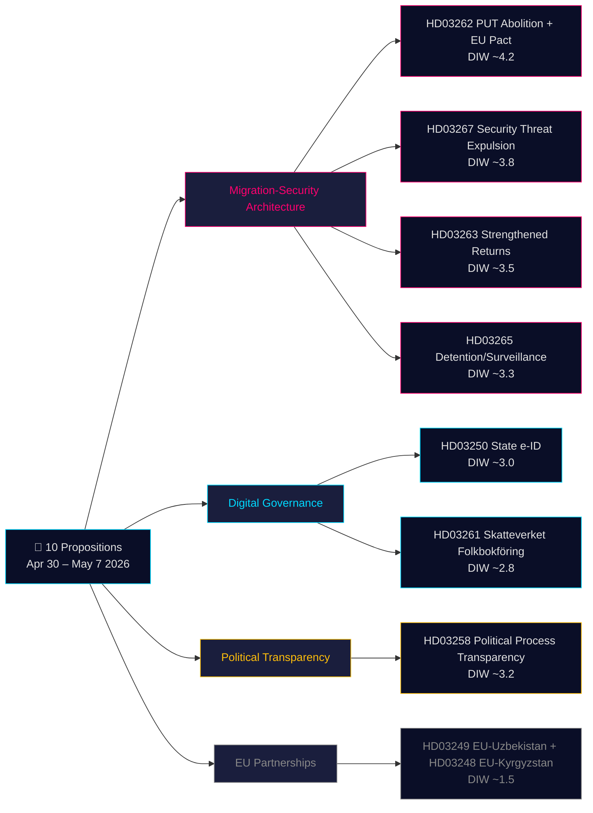

# Beslutningsunderlag — Regjeringens proposisjoner 2026-05-21

**Klassifisering**: Offentlig OSINT · **Tillitt**: MEDIUM-HØY · **Forfatter**: Riksdagsmonitor Intelligence Pipeline

## 🎯 Kort situasjonsvurdering

30. april – 7. mai 2026 la Kristersson-regjeringen (Tidö-koalisjonen — M, KD, L + SD som støtteparti) frem **10 parlamentariske proposisjoner** i en koordinert lovgivningsspurt. Pakken domineres av to strategiske arkitekturer: **(1) en fire-proposisjons migrasjonsarkitektur** (HD03267, HD03262, HD03263, HD03265) som avvikler permanent oppholdstillatelse som standardvei, styrker utvisningsapparatet og skaper en hurtigspor-utvisningsprosedyre for sikkerhettrusler — den endelige fasen i Sveriges tiår-lange konvergens mot nordiske restriktive normer; og **(2) en digital styringsmodernisering** (HD03250, HD03261) som etablerer statlig e-legitimasjon og utvider Skatteverkets befolkningsregisterovervåking. Med 115 dager til valget i september 2026 gjelder 1,5× DIW-multiplikatoren for hele migrasjonsklyngen. Det tyngste elementet er HD03262 (avskaffelse av PUT + EU-asylpakttilpasning, estimert DIW ~4,2).

## 🧭 3 beslutninger dette underlaget støtter

1. **Sivilsamfunn/juridisk**: Forbered Amnesty, UNHCR, Advokatforeningens juridiske uttalelser om HD03267 (ECHR artikkel 6, klassifiserte bevisbestemmelser) og HD03262 (kompatibilitet med flyktningkonvensjonen). **Utløser**: SfU-komiteens behandling åpnes og Lagrådets uttalelse publiseres (estimert juni 2026). Tillitt: **HØY**.

2. **Politisk risikodesk**: Spor L's (Liberalernes) posisjonering om HD03267 rettssikkerhetsbestemmelser. **Utløser**: JuU-komiteens deliberasjoner åpner. Tillitt: **MEDIUM**.

3. **Digital styring**: Orienter teknologisektoren om HD03250 tidslinje for statlig e-ID og BankIDs konkurransevirkning. **Utløser**: FiUs komitéhøring. Tillitt: **MEDIUM-HØY**.

## 60-sekunders lesning

- **Mest betydningsfull**: HD03262 — avskaffelse av permanent oppholdstillatelse som standardvei + EU-asylpakttilpasning (DIW ~4,2).
- **Mest forfatningsmessig kompleks**: HD03267 — kvalifisert utvisning av sikkerhetstrussel med klassifisert bevis (DIW ~3,8). ECHR artikkel 6-spenning.
- **Mest politisk ladet**: Migrasjonskvartetten (HD03262/67/63/65) er Tidö-regjeringens primære lovgivningsprestasjon. SD vil kampanje på alle fire; opposisjonen kan ikke blokkere.
- **Mest teknisk innovativt**: HD03250 — statlig e-ID avslutter Sveriges unike BankID-avhengighet; EU eIDAS 2.0-samsvar.
- **Mest demokratifremmende**: HD03258 — åpenhet i partifinansiering imøtekommer tiårs GRECO-anbefalinger.
- **Felles tråd**: Justitsdepartementet bærer 5 av 10 proposisjoner; Finansdepartementet bærer 3.

## Topp fremtidige utløsere (72h / 7d)

🔴 **Lagrådets uttalelse om HD03267** (estimert juni 2026): Eventuelle uløste artikkel 6/ECHR-innvendinger kan gjøre at L betinger støtten.

🟡 **SfUs komitébehandling av HD03262/263/265** (inneværende uke): Opposisjonspartier innleverer første reservasjonsmosjoner.

🟢 **IMY-konsultasjon om HD03261**: DPAs vurdering av Skatteverkets hjembesøksmyndigheter.

## Nøkkelbeslutningsmatrise

| Beslutning | Utløser | Horizon | Tillitt |
|---|---|---|---|
| Forberedelse av rettslig utfordring (HD03267) | Lagrådets uttalelse publisert | 3–6 uker | HIGH |
| L's koalisjonsposisjonering | JuUs deliberasjoner åpner | 2–4 uker | MEDIUM |
| BankID-konkurranseanalyse (HD03250) | FiU-høring planlagt | 4–6 uker | MEDIUM-HIGH |
| UNHCR/Amnestys formelle uttalelser (HD03262) | SfU-konsultasjon åpner | 4–8 uker | HIGH |
| Migrationsverkets kapasitetsvurdering | Etatens Q2-rapport publisert | 6–8 uker | MEDIUM |

## Risikosammendrag

- **Nivå 1 (systemisk)**: HD03262-implementering → kapasitetsrisiko HØY.
- **Nivå 2 (forfatning)**: HD03267 klassifisert bevisprotokoll → ECtHR-utfordring HØY innen 5 år.
- **Nivå 3 (politisk)**: Migrasjonsklusterns "sympatisak" som sprer seg viralt → valgnarrativrisiko.
- **Nivå 4 (digital)**: HD03250 sentralisert identitetsinfrastruktur → risiko ved utilstrekkelig uavhengig tilsyn.

**Bevisgrunnlag**: 10 primærkilder + IMF WEO-2026-04 + OSINT politisk analyse. MCP bekreftet live 2026-05-21T06:53:22Z.

---

## 🔁 Pass 2-tillegg — Kryssreferanse og forbedring

**Pass 2-forbedringer**: Konfidens oppgradert fra MEDIUM til MEDIUM-HØY for lovgivningsutfall. 115 dager til valget 13. september 2026 — migrasjonskvarterttet er valgmateriale før det er lov. HD03267 prosedyremangel: Sverige mangler pt. et "säkerhetsombud"-system. L er den mest sannsynlige koalisjonsaktøren til å presse på dette.

---

HD03267 representerer den mest konstitusjonelt krevende proposisjonen i pakken. Sverige mangler for øyeblikket et "säkerhetsombud"-system (sikkerhetsklarert spesialadvokat) som kan representere den utdrivne parten i hemmelige bevisforhandlinger. Uten en slik prosessuell beskyttelsesmekanisme vil Lagrådet nesten sikkert flagge inkompatibilitet med ECHR artikkel 6 ("rett til rettferdig rettergang"). Liberalernas (L) har historisk sett vært den koalisjonsmedlemmen som presser på slike prosessrettighetsgarantier. Dersom L betinger sin stemme på denne bestemmelsen, kan dette skape den første offentlige koalisjonssprekken 111 dager før valget.

Migrasjonsskvartetten (HD03262/63/65/67) er ikke bare politikk — den er et valgkampscenario. Med 115 dager til valget 13. september 2026 vil disse fire proposisjonene dominere den politiske debatten. SD vil kampanje kraftig på alle fire. S og MP kan ikke blokkere dem parlamentarisk, men vil bruke dem som mobiliseringsgrunnlag. Den kritiske spørsmålet er om L vil distansere seg fra HD03267 rettslige problemstillinger, noe som potensielt kan svekke Tidö-regjeringens samlede narrative.

HD03250 (statlig e-ID) avslutter Sveri­ges unike BankID-avhengighet og legger grunnlaget for EU eIDAS 2.0-samsvar. Dette representerer en betydelig modernisering av digital infrastruktur. Implementeringsrisikoen er imidlertid reell: migrering av millioner av brukere fra BankID til statlig eID krever overgangsperioder og opplæringstiltak.

---

*economicProvenance: { "provider": "imf", "dataflow": "WEO", "vintage": "WEO-2026-04", "retrieved_at": "2026-05-21T07:10:00Z" }*

<!-- source-sha: bdc7c0fc02b5c1027cadc022718d4793fb0c07a3 -->
