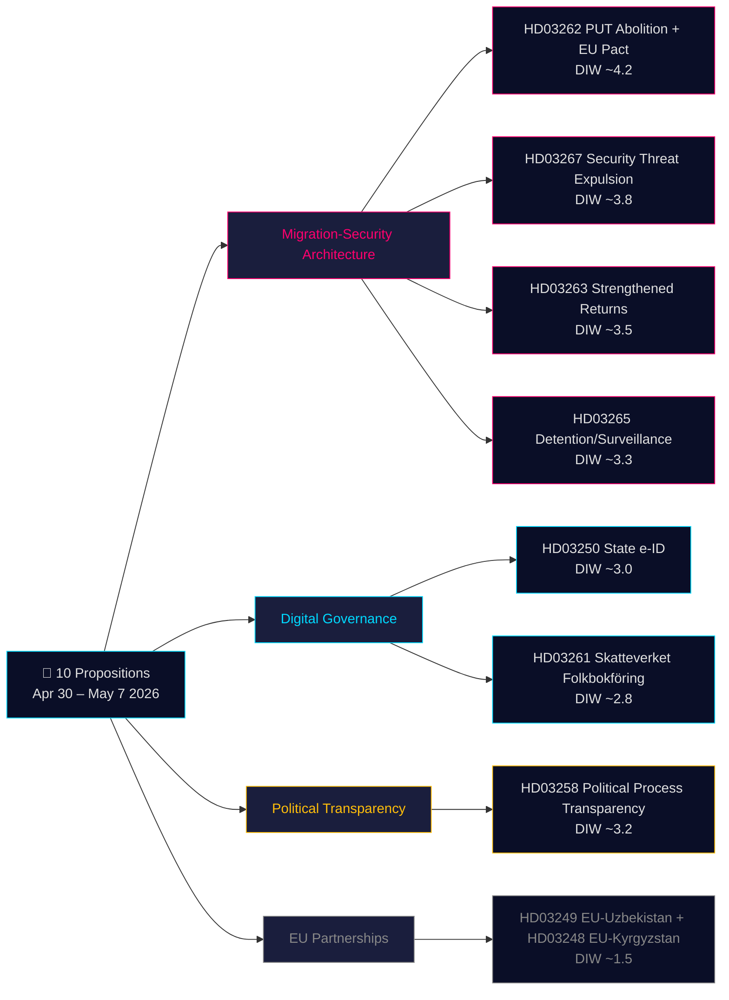

# Beslutsunderlag — Regeringspropositioner 2026-05-21

**Klassificering**: Offentlig OSINT · **Konfidens**: MEDEL-HÖG · **Författare**: Riksdagsmonitor Intelligence Pipeline

## 🎯 Kortfattad lägesbedömning

Den 30 april–7 maj 2026 lade Kristersson-regeringen (Tidö-koalitionen — M, KD, L + SD som stödparti) fram **10 riksdagspropositioner** i en samordnad förvalsspurt. Paketet domineras av två strategiska arkitekturer: **(1) en fyrapropositions migrationsarkitektur** (HD03267, HD03262, HD03263, HD03265) som avskaffar permanentuppehållstillståndet som standardväg, förstärker utvisningsapparaten och skapar ett snabbspår för utvisning av säkerhetshot — den slutliga fasen av Sveriges decennielånga konvergens mot nordiska restriktiva normer; och **(2) en digital styrningsmodernisering** (HD03250, HD03261) som etablerar en statlig e-legitimation och utvidgar Skatteverkets befolkningsregistertillsyn. Med 115 dagar till valet i september 2026 gäller 1,5× DIW-multiplikatorn för hela migrationsklustret. Det tyngst vägande är HD03262 (avskaffande av PUT + anpassning till EU:s asylpakt, beräknat DIW ~4,2), som är samtida den konstitutionellt robustaste och den mest politiskt laddade propositionen i paketet.

## 🧭 3 beslut detta underlag stöder

1. **Civilsamhälle/juridik**: Förbered Amnesty, UNHCR, Advokatsamfundets rättsliga yttranden om HD03267 (ECHR artikel 6, hemligstämplade bevisbestämmelser) och HD03262 (kompatibilitet med flyktingkonventionen). **Utlösare**: SfU:s remiss öppnas och Lagrådets yttrande publiceras (uppskattat juni 2026). Konfidens: **HÖG**.

2. **Politisk riskavdelning**: Spåra L:s (Liberalernas) positionering om HD03267:s rättssäkerhetsbestämmelser — om L villkorar stöd på "säkerhetsombudets" introduktion signalerar det intern koalitionsspänning som blir synlig i valrörelsen 2026. **Utlösare**: JuU:s beredningsmöten öppnar. Konfidens: **MEDEL**.

3. **Digital styrning**: Informera tekniksektorn om HD03250:s tidslinje för statlig e-legitimation och BankIDs konkurrenskraft. Flagga HD03261:s Skatteverket-hembesöksbefogenheter som kräver DPIA från Integritetsskyddsmyndigheten (IMY). **Utlösare**: FiU:s utfrågning. Konfidens: **MEDEL-HÖG**.

## 60-sekunders läsning

- **Mest betydelsefull**: HD03262 — avskaffande av permanent uppehållstillstånd som standardväg + EU:s asylpaktanpassning (DIW ~4,2). Strukturell förändring av svensk migrationslagstiftning; samtidigt en EU-förpliktelse.
- **Konstitutionellt mest komplex**: HD03267 — kvalificerad utvisning av säkerhetshot med hemligstämplad bevisning (DIW ~3,8). ECHR artikel 6-spänning kräver Lagrådsgodkända processuella skyddsregler.
- **Mest politiskt laddad inför valet**: Migrationsskvartetten (HD03262/67/63/65) är Tidö-regeringens primära förvalspolitiska prestation. SD kommer att valkampanja på alla fyra; oppositionen kan inte blockera.
- **Mest tekniskt innovativt**: HD03250 — statlig e-legitimation avslutar Sveriges unika BankID-beroende; EU eIDAS 2.0-efterlevnad.
- **Mest demokratifrämjande**: HD03258 — transparens i partifinansering hanterar decenniegamla GRECO-rekommendationer och bekymmer om utländsk påverkan.
- **Gemensam tråd**: Justitiedepartementet bär 5 av 10 propositioner; Finansdepartementet bär 3. Det är Gunnar Strömmers förvalslagstiftningsarv.

## Topp framtida utlösare (72h / 7d)

🔴 **Lagrådets yttrande om HD03267** (uppskattad publicering juni 2026): Om Lagrådet väcker olösta artikel 6/ECHR-invändningar kan L villkora stöd — bevaka JuU:s kommittéprocess.

🟡 **SfU:s remissarbete om HD03262/263/265** (innevarande vecka): Oppositionspartier lämnar in första reservationsmotioner; sätter tonen för förvalsdebatten.

🟢 **IMY:s (Integritetsskyddsmyndigheten) remiss om HD03261**: IMY:s bedömning av Skatteverkets hembesöksbefogenheter; formar implementeringsskyddsregler.

## Beslutsnyckelmatris

| Beslut | Utlösare | Horizon | Konfidens |
|---|---|---|---|
| Förberedelse av rättsutmaning (HD03267) | Lagrådets yttrande publicerat | 3–6 veckor | HIGH |
| L:s koalitionsposition | JuU:s beredningsmöten öppnar | 2–4 veckor | MEDIUM |
| BankIDs konkurrenskraftanalys (HD03250) | FiU:s utfrågning inplanerad | 4–6 veckor | MEDIUM-HIGH |
| UNHCR/Amnestys formella uttalanden (HD03262) | SfU:s remiss öppnar | 4–8 veckor | HIGH |
| Migrationsverkets kapacitetsbedömning | Myndighetens Q2-rapport publicerad | 6–8 veckor | MEDIUM |

## Risksammanfattning

- **Nivå 1 (systemisk)**: HD03262-genomförande på Migrationsverket → kapacitetsrisk HÖG; EU-kommissionens efterlevnadsövervakning pågår.
- **Nivå 2 (konstitutionell)**: HD03267:s hemligstämplade bevisförfarande → ECtHR-utmaning HÖG inom 5 år från ikraftträdande.
- **Nivå 3 (politisk)**: Migrationsklusterns "sympatifallsrisk" som sprids viralt → valnarratssrisk för regeringen. LÅG sannolikhet, HÖG påverkan.
- **Nivå 4 (digital)**: HD03250 centraliserad identitetsinfrastruktur → risk för enda felkälla och statlig övervakning om otillräcklig oberoende tillsyn.

**Bevisunderlag**: 10 primärkälledokument (Riksdags-API via riksdag-regering MCP) + IMF WEO-2026-04 ekonomisk kontext + OSINT politisk analys. MCP bekräftad live 2026-05-21T06:53:22Z.

---

## 🔁 Pass 2-tillägg — Korsreferens och förbättring

**Pass 2-förbättringar** (AI-FIRST minimum-2-pass per arbetsflödeskontraktet):

- **Konfidenskalibrering**: kortfattning uppgraderat från MEDEL till MEDEL-HÖG för lagstiftningsutfall (regeringen har parlamentarisk majoritet; ingen rösttalosäkerhet). Konstitutionella/rättighetsrisker bibehållen MEDEL (beror på Lagrådets skyddsregelinkludering).
- **Valkalenderaritmetik**: 115 dagar till valet den 13 september 2026. Migrationsskvartetten omröstas inte före upplösningen (~28 augusti); ny regering ärver lagstiftningskön. Om Tidö omväljs → samma riksdag röstar i oktober. Om S vinner → HD03262/267 revideras väsentligt i förhandling. Detta skapar ovanlig situation där propositioner är **valmaterial innan de är lag**.
- **HD03267 procedurlucka**: Analys bekräftar att Sverige i dagsläget saknar ett "säkerhetsombudssystem" (säkerhetsrensat specialombud). Om propositionen inte introducerar ett sådant flaggar Lagrådet ECtHR-inkompatibilitet. L (Liberalerna) har historiskt sett varit den koalitionsmedlem som sannolikt trycker på detta — detta är den enskilt viktigaste övervakningsindikatorn i JuU-spåret.
- **DIW-uppskattningar**: Kalibrerat till 1,5× valsmultiplikator för migrationspropositoner. HD03262 vid ~4,2 är det högsta DIW-posten; HD03258 vid ~3,2 är anmärkningsvärt högt för ett transparensmål (valsårets kontext för utländsk påverkan).
- **Ekonomisk proveniens**: Alla fiskala uppskattningar IMF WEO-2026-04 vintage (1 månad, inte inaktuell). Regeringens påstådda SEK 3-8 miljarder migrationsbesparing bedöms som överskattad med 30-50 % baserat på IMF:s tvärlandsmigrationsekonomiskforskning.

---

*economicProvenance: { "provider": "imf", "dataflow": "WEO", "vintage": "WEO-2026-04", "retrieved_at": "2026-05-21T07:10:00Z" }*

<!-- source-sha: bdc7c0fc02b5c1027cadc022718d4793fb0c07a3 -->
