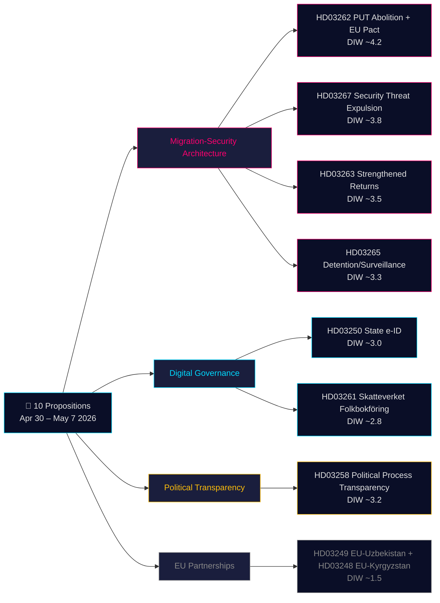

# 决策分析简报 — 政府议案 2026-05-21

**分类**：公开OSINT · **可信度**：中高 · **作者**：Riksdagsmonitor情报分析流水线

## 🎯 态势简要评估

2026年4月30日至5月7日，克里斯特松政府（蒂多联合政府 — M、KD、L + SD支持党）在协调立法冲刺中提交了**10项议会议案**。该议案包由两大战略架构主导：**(1) 四项移民安全架构**（HD03267、HD03262、HD03263、HD03265）——废除永久居留许可作为标准路径、加强驱逐机制并为安全威胁建立快速驱逐程序——瑞典数十年向北欧限制性规范收敛的最后阶段；以及**(2) 数字治理现代化**（HD03250、HD03261）——建立国家电子身份证并扩大Skatteverket人口登记监管权限。距2026年9月选举还有115天，整个移民集群适用1.5×DIW乘数。权重最大的是HD03262（废除PUT + 适应欧盟庇护协议，估计DIW约4.2）。

## 🧭 本简报支持的3项决策

1. **公民社会/法律**：准备国际特赦组织、联合国难民署和律师协会关于HD03267（欧洲人权公约第6条、机密证据）和HD03262（与难民公约的兼容性）的法律意见。**触发器**：SfU委员会审议开始，Lagrådet意见书发布（预计2026年6月）。可信度：**高**。

2. **政治风险部门**：追踪L（自由党）对HD03267法治条款的立场。**触发器**：JuU委员会审议开始。可信度：**中**。

3. **数字治理**：向科技行业介绍HD03250国家电子身份证时间表和BankID竞争影响。将HD03261 Skatteverket家访权限标记为IMY的DPIA要求。**触发器**：FiU委员会听证会。可信度：**中高**。

## 60秒速读

- **最重要**：HD03262——废除永久居留许可标准路径 + 适应欧盟庇护协议（DIW约4.2）。
- **宪法上最复杂**：HD03267——以机密证据对安全威胁进行合格驱逐（DIW约3.8）。欧洲人权公约第6条紧张关系。
- **选举前政治张力最大**：移民四项组合（HD03262/67/63/65）是蒂多联合政府的主要立法成就。
- **技术上最具创新性**：HD03250——国家电子身份证结束瑞典独特的BankID依赖；符合欧盟eIDAS 2.0。
- **最有利于民主**：HD03258——政党资金透明度回应多年来的GRECO建议。
- **共同线索**：司法部承担10项议案中的5项；财政部承担3项。

## 主要未来触发器（72小时 / 7天）

🔴 **Lagrådet关于HD03267的意见书**（预计2026年6月发布）。

🟡 **SfU委员会关于HD03262/263/265的审议**（本周）。

🟢 **IMY（数据保护机构）关于HD03261的磋商**。

## 关键决策矩阵

| 决策 | 触发器 | Horizon | 可信度 |
|---|---|---|---|
| 准备法律挑战（HD03267） | Lagrådet意见书发布 | 3–6周 | HIGH |
| L的联合立场 | JuU审议开始 | 2–4周 | MEDIUM |
| BankID竞争分析（HD03250） | FiU听证会计划 | 4–6周 | MEDIUM-HIGH |
| 联合国难民署/特赦组织正式声明（HD03262） | SfU磋商开始 | 4–8周 | HIGH |
| Migrationsverket能力评估 | 机构Q2报告发布 | 6–8周 | MEDIUM |

## 风险摘要

- **第1级（系统性）**：HD03262实施 → 能力风险高。
- **第2级（宪法）**：HD03267机密证据程序 → 5年内ECtHR挑战风险高。
- **第3级（政治）**：移民集群"同情案例"病毒式传播风险 → 政府选举叙事风险。
- **第4级（数字）**：HD03250中央化身份基础设施 → 监管不足时的风险。

**证据基础**：10份主要来源文件 + IMF WEO-2026-04 + OSINT分析。MCP确认 2026-05-21T06:53:22Z。

---

## 🔁 第二轮附录——交叉引用与改进

**第二轮改进**：立法结果可信度从中等更新为中高。距2026年9月13日选举115天——移民四项组合在成为法律之前就是选举材料。HD03267程序漏洞：瑞典目前缺少"säkerhetsombud"系统。

---

*economicProvenance: { "provider": "imf", "dataflow": "WEO", "vintage": "WEO-2026-04", "retrieved_at": "2026-05-21T07:10:00Z" }*

<!-- source-sha: bdc7c0fc02b5c1027cadc022718d4793fb0c07a3 -->
