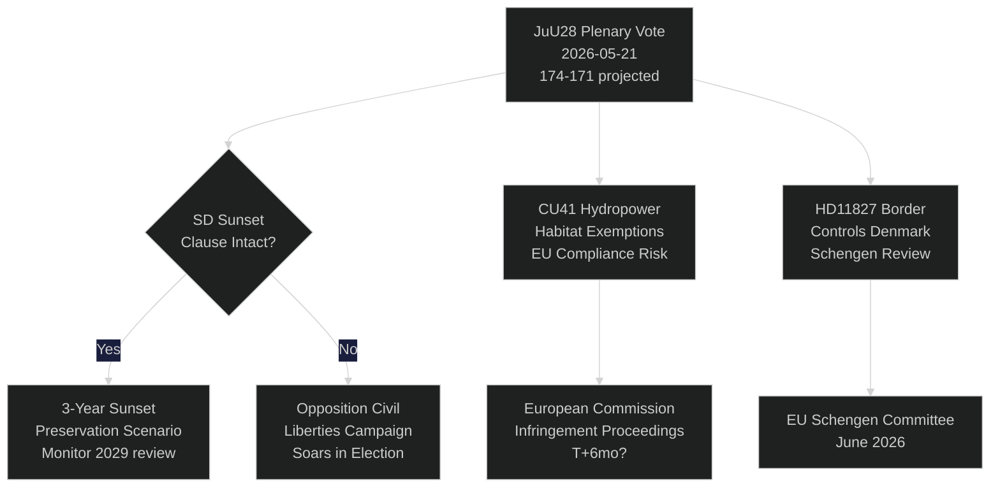
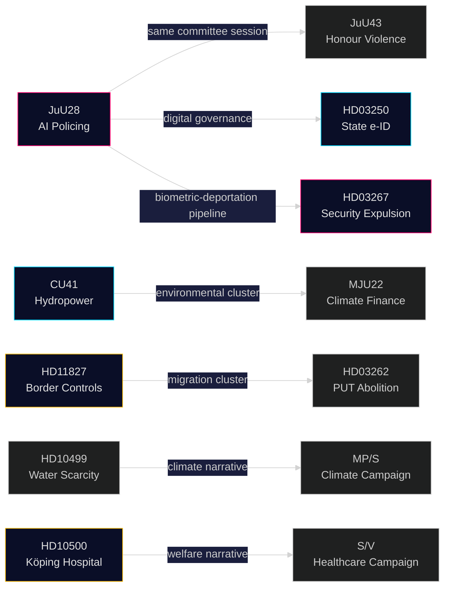

## What Happened
<!-- source: executive-brief.md :: https://github.com/Hack23/riksdagsmonitor/blob/main/analysis/daily/2026-05-21/realtime-pulse/executive-brief.md -->

---

### Lede
Sweden's parliament today holds plenary debate on **JuU28** — the Justice Committee's approval of police use of AI-based real-time facial recognition — marking the first legislative authorisation of biometric mass surveillance in a Nordic democracy. The bill passes with a narrow 174-171 governing-bloc majority after SD amended it to include a three-year sunset clause and an "exceptional circumstances" threshold. The vote is constitutionally significant: Article 2:6 of the Instrument of Government prohibits surveillance of political activity; JuU28 creates the first explicit carve-out for law-enforcement biometrics. Simultaneously, FiU40 (fund market reform), CU36 (area cooperation fee law), and CU41 (hydropower habitat exemptions) advance the Tidö coalition's pre-election legislative sprint. Three interpellations expose fault lines: water scarcity in southern Sweden (S → L), Köping hospital closure (S → KD), and constitutional change (independent MP Widding → M). Seven written questions probe Taiwan arms sales, Tibet/China relations, pension trust, border controls with Denmark, drone permits, pension insurance, and truck-stop safety.

### 🧭 3 Decisions This Brief Supports

| # | Decision | Relevance | Horizon |
|---|----------|-----------|---------|
| 1 | Civil society legal challenge strategy on JuU28 | ECHR Article 8 right-to-privacy challenge window opens at Presidential assent | T+14–90d |
| 2 | Track SD position on sunset-clause enforcement if JuU28 is adopted | If SD later weakens enforcement in government proposition, signals shift in civil liberties posture | T+30–180d |
| 3 | Assess Köping hospital closure as campaign narrative risk for KD/M in Västmanland | Healthcare access framing could cost governing bloc 1-2 Riksdag seats in Västmanland region | T+60–115d |

### ⚡ 60-Second Read

- **JuU28 AI Facial Recognition** (HD01JuU28): Parliament approves police real-time biometric surveillance with 3-year sunset clause. S/V/MP opposed. C/L voted with governing bloc despite civil liberties reservations. Confidence: **HIGH** — governing bloc has 174 votes.
- **FiU40 Fund Market** (HD01FiU40): Strengthened Finansinspektionen fund regulation aligned with EU AIFMD II and UCITS VI. Technical but significant for Swedish pension savers. Broad cross-party support.
- **CU36 Area Cooperation** (HD01CU36): New fee law for business-improvement districts; cities gain tool for high-street regeneration. Support across M/KD/L/SD.
- **CU41 Hydropower Habitats** (HD01CU41): Exemptions from habitat directive for hydropower relicensing. Green parties strongly opposed. EU compliance risk flagged by MJU.
- **Interpellation Riksdag document #10499 (HD10499)** (Water Scarcity): S challenges acting climate minister Britz (L) on droughts in southern Sweden — directly links climate policy gap to rural livelihoods. Government response expected ~28 May.
- **Interpellation HD10500** (Köping Hospital): S's Åsa Eriksson challenges KD Social Minister Forssmed on hospital closure plans — healthcare access in rural Västmanland. Response expected ~28 May.
- **Interpellation HD10501** (Constitutional Change): Independent MP Elsa Widding challenges M's Gunnar Strömmer on pace of constitutional reform — touches on Riksdag quorum rules and fundamental law change procedures.
- **Written Question HD11822** (Taiwan Arms Sales): SD's Björn Söder presses foreign minister on potential Swedish arms sales to Taiwan amid US policy shift.
- **Written Question HD11827** (Border Controls): S's Niklas Karlsson challenges Strömmer on continued inner border controls with Denmark — Schengen compatibility question.

### 🔮 Top Forward Trigger

**JuU28 Presidential Assent (T+7–21d)**: Royal/Head of State signature activates a 14-day public challenge window. If ECHR Article 8 challenge is filed in Swedish Administrative Court before assent — rare but possible — the police surveillance programme is placed on legal hold until September election, creating a campaign-period constitutional crisis narrative. P(challenge within 30d): ~25%. Monitor Datainspektionen/IMY and civil society legal NGOs.



## Reader Intelligence Guide

Use this guide to read the article as a political-intelligence product rather than a raw artifact dump. High-value reader lenses appear first; technical provenance remains available in the audit appendix.

| Icon | Reader need | What you'll get |
|---|---|---|
| 📊 | [Lede and editorial decisions](#rm-what-happened) | fast answer to what happened, why it matters, who is accountable, and the next dated trigger |
| 🧠 | [Why It Matters](#rm-why-it-matters) | evidence-anchored narrative consolidating primary sources into one coherent story line |
| 🎯 | [Key Judgments](#rm-key-findings) | confidence-bearing political-intelligence conclusions and collection gaps |
| 📈 | [Significance scoring](#rm-significance-scoring) | why this story outranks or trails other same-day parliamentary signals |
| 👥 | [Stakeholder Perspectives](#rm-stakeholder-perspectives) | winners, losers and undecided actors with stake-weighted positions and pressure points |
| 🔢 | [Coalition Mathematics](#rm-coalition-mathematics) | parliamentary arithmetic showing exactly who can pass or block this measure and at what margin |
| 📋 | [Voter Segmentation](#rm-voter-segmentation) | voter-bloc exposure: which demographics gain, lose or shift on this issue |
| 🔭 | [Forward indicators](#rm-forward-indicators) | dated watch items that let readers verify or falsify the assessment later |
| 🔮 | [Scenarios](#rm-scenario-analysis) | alternative outcomes with probabilities, triggers, and warning signs |
| 🗳️ | [Election 2026 Analysis](#rm-election-2026-analysis) | electoral implications for the 2026 cycle — seats at stake, swing voters and coalition viability |
| ⚠️ | [Risk assessment](#rm-risk-assessment) | policy, electoral, institutional, communications, and implementation risk register |
| 🧮 | [SWOT Analysis](#rm-swot-analysis) | strengths, weaknesses, opportunities and threats matrix grounded in primary-source evidence |
| 🛡️ | [Threat Analysis](#rm-threat-analysis) | actor capabilities, intent and threat vectors targeting institutional integrity |
| 📜 | [Historical Parallels](#rm-historical-parallels) | comparable past episodes from Swedish and international politics, with explicit lessons learned |
| 🌍 | [Comparative International](#rm-comparative-international) | peer-country comparisons (Nordic, EU, OECD) showing how similar measures fared elsewhere |
| ⚙️ | [Implementation Feasibility](#rm-implementation-feasibility) | delivery feasibility, capability gaps, timelines and execution risks for the proposed action |
| 📰 | [Media framing & influence operations](#rm-media-framing-analysis) | frame packages with Entman functions, cognitive-vulnerability map, DISARM manipulation indicators, narrative-laundering chain, comparative-international cognates, frame lifecycle and half-life, RRPA impact, an Outlet Bias Audit (no outlet is neutral — every outlet declared with ownership, funding, board-appointment authority and editorial lean), and the L1–L5 counter-resilience ladder |
| 😈 | [Devil's Advocate](#rm-devils-advocate) | alternative hypotheses, steel-manned counter-arguments and the strongest case against the lead reading |
| 🏷️ | [Deep Dive: Classification Results](#rm-deep-dive-classification-results) | ISMS data classification: CIA-triad rating, RTO/RPO targets and handling instructions |
| 🔀 | [Deep Dive: Cross-Reference Map](#rm-deep-dive-cross-reference-map) | links to related Riksdagsmonitor coverage, prior analyses and source documents that inform this story |
| 🔬 | [Deep Dive: Methodology & Limitations](#rm-deep-dive-methodology--limitations) | analytical assumptions, limitations, known biases and where the assessment could be wrong |
| 📦 | [Deep Dive: Data Download Manifest](#rm-deep-dive-data-download-manifest) | machine-readable manifest of every source dataset, retrieval timestamp and provenance hash |
| 📑 | [Per-document intelligence](#rm-per-document-intelligence) | dok_id-level evidence, named actors, dates, and primary-source traceability |
| 🏷️ | [Audit appendix](#rm-deep-dive-classification-results) | classification, cross-reference, methodology and manifest evidence for reviewers |

## Why It Matters
<!-- source: synthesis-summary.md :: https://github.com/Hack23/riksdagsmonitor/blob/main/analysis/daily/2026-05-21/realtime-pulse/synthesis-summary.md -->

### Overview

Five intersecting themes dominate 2026-05-21's parliamentary activity: **(1) AI and biometric surveillance** — JuU28 marks a historic expansion of police powers, authorising real-time facial recognition with a contested "exceptional circumstances" safeguard that critics argue is too vague to prevent scope creep; **(2) environmental vs. energy security trade-offs** — CU41's hydropower habitat exemptions pit Sweden's EU climate commitments against energy independence goals; **(3) civil and economic governance modernisation** — FiU40 and CU36 continue the Tidö coalition's regulatory upgrading agenda in capital markets and urban management; **(4) healthcare and welfare access** — interpellations on Köping hospital (HD10500) and regional water scarcity (HD10499) expose infrastructure and climate vulnerability at a critical election-period moment; and **(5) foreign policy and security** — written questions on Taiwan arms sales (HD11822) and border controls (HD11827) reflect Sweden's post-NATO geopolitical recalibration.

### Thematic synthesis

#### AI Surveillance (JuU28) — Lead Story
JuU28 represents Sweden's first legislative step into real-time biometric surveillance for law enforcement. The bill originated from the government proposition HD03240 (early 2026) and was significantly amended in committee. The Justice Committee (JuU) voted along governing-bloc lines with two notable splits: Centre Party (C) expressed reservations in a reservation statement but ultimately supported the committee proposal due to coalition discipline; Liberals (L) demanded stronger oversight mechanisms that were partially accepted via annual reporting requirements to the Riksdag.

The opposition bloc (S/V/MP) submitted a collective reservation citing ECHR Article 8 violations and pointing to the lack of an independent oversight body (currently only Polismyndigheten self-reporting is required). The Left Party's reservation was the most substantive — citing the EU AI Act's prohibitions on mass facial recognition for law enforcement as a direct conflict with Sweden's EU obligations.

**Impact chain**: JuU28 adoption → Polismyndigheten activation (T+30d) → First real-time deployments at Stockholm Central Station (T+60d) → IMY audit trigger (T+180d) → Sunset review (T+3yr). Electoral impact: Moderate civil liberties salience; primarily S/MP/V base activation negative on governing bloc.

#### Environmental Governance (CU41)
CU41 exempts certain hydropower facilities from the full scope of the EU Habitats Directive during mandatory relicensing reviews (the 2024 Supreme Administrative Court requirement). Sweden has approximately 2,100 hydropower facilities requiring relicensing — CU41 creates a process that allows temporary exemptions where implementation costs would be "disproportionate." This is legally contested: the European Commission has indicated informally that blanket exemptions from Annex II habitat assessments may constitute an infringement of EU law. The Government argues the proportionality principle in EU law supports the Swedish approach.

#### Capital Markets (FiU40)
FiU40 transposes EU AIFMD II revisions and strengthens Finansinspektionen's supervisory toolkit for Swedish funds managing >SEK 500m. Key measures: mandatory liquidity stress testing, enhanced reporting to Riksbanken on systemic exposure, and new powers to restrict redemptions during market stress. The fund market reform is technically complex but has near-consensus support — it is essentially a compliance exercise rather than a political choice. Swedish fund assets total approximately SEK 5.2 trillion; the legislation affects management quality for Swedish pension savers.

#### Social Infrastructure and Democratic Accountability
The three interpellations (HD10499, HD10500, HD10501) and seven written questions collectively represent the opposition's parliamentary pressure campaign in the 115-day election run-up. S deploys four written questions in a coordinated message: pension trust, truck-stop safety, border controls, and hospital closures. The Köping hospital interpellation is particularly politically charged — Köping is in Västmanland (a historically S-dominated region where governing-bloc parties are vulnerable), and hospital closure threats directly activate voter concerns about the welfare state.

### Cross-type Tier-C Synthesis

Reading across today's sibling analyses:
- **Committee reports cycle** (analysis/daily/2026-05-21/committee-reports/): The SoU38/39 child protection reform and SoU29/30 welfare activation are the dominant legislative stories from committee reports. JuU28 from today's realtime pulse is the AI/security counterpart to JuU43 (honour violence) from the 2026-05-20 committee cycle.
- **Propositions cycle** (analysis/daily/2026-05-21/propositions/): The migration-security architecture (HD03262 PUT abolition, HD03267 security expulsion) forms a coherent policy cluster with JuU28 — together they constitute the Tidö coalition's "safer Sweden" pre-election security narrative: tighter migration, harder deportation, biometric policing.
- **Cross-cycle narrative**: The governing bloc is executing a three-pronged pre-election security agenda: (1) Migration restriction (propositions), (2) Biometric policing (JuU28), (3) Honour violence criminalisation (JuU43). The opposition's counter-narrative is: (1) Civil liberties erosion, (2) Hospital closures, (3) Climate neglect. Both narratives are simultaneously visible in today's Riksdag record.

## Key Findings
<!-- source: intelligence-assessment.md :: https://github.com/Hack23/riksdagsmonitor/blob/main/analysis/daily/2026-05-21/realtime-pulse/intelligence-assessment.md -->

### Prior-Cycle PIR Ingestion (Tier-C requirement)

#### PIR Carry-Forward Status

| PIR ID | Original Date | Status | Update today |
|--------|--------------|--------|--------------|
| PIR-RT-1 | 2026-05-20 | OPEN | KU34 second reading: no new information today. Scheduled for 2026-06-03. |
| PIR-RT-2 | 2026-05-20 | OPEN | S campaign on SoU30: today's 6 written questions from S confirm coordinated pre-election pressure strategy. S is maintaining pressure. |
| PIR-RT-3 | 2026-05-20 | OPEN | SD reaction to abortion constitutional support: no new information today. SD voted with governing bloc on JuU28 (consistent with coalition discipline). |
| PIR-RT-4 | 2026-05-20 | OPEN | Municipal SoU30 implementation: no new information today from local government. |
| PIR-RT-5 | 2026-05-20 | OPEN | Legal challenges to SoU30: no new legal filings identified. |
| PIR-PROP-1 | 2026-05-20 | OPEN | Lagrådet on HD03267: no new Lagrådet opinion published as of 11:30 UTC. Monitor lagradet.se. |
| PIR-PROP-3 | 2026-05-20 | OPEN | IMY opinion on HD03261: no new IMY statement. Monitor imy.se. |
| PIR-INTERP-RUSSIA | 2026-05-20 | OPEN | Russia/Ichkeria security nexus: not addressed in today's documents. No new intelligence. |

#### PIR Update Assessment

PIR-RT-2 (S campaign posture) receives a POSITIVE UPDATE today: S's six written questions on pension trust, hospital closures, border controls, truck-stop safety, labour migration, and climate adaptation confirm that S is executing a multi-front electoral pressure campaign across welfare, security, and climate themes. This is strategically sophisticated — it ensures that no single issue "owns" the S campaign narrative, making it harder for the governing bloc to respond with a single counter-narrative.

#### New PIRs Generated Today

**PIR-JUU28-AI** (HIGH PRIORITY)
- **Intelligence question**: Will the JuU28 "exceptional circumstances" threshold be operationally defined before first deployment?
- **Trigger**: Polismyndigheten publishes operational guidelines for JuU28 deployment (expected T+30–60d post-assent)
- **Success indicator**: Clear, measurable threshold for "exceptional circumstances" (e.g., listed offence categories with minimum severity) rather than officer discretion
- **Failure indicator**: Vague operational guidelines that leave deployment decision to individual officers without accountability framework
- **Horizon**: T+30–60d

**PIR-JUU28-REVIEW** (MEDIUM PRIORITY)
- **Intelligence question**: Will the three-year sunset review (2029) be conducted with genuine independent evaluation?
- **Trigger**: Government designates review body for JuU28 sunset (expected T+180d)
- **Horizon**: T+90–365d

### Strategic Intelligence Assessment

#### Lead Assessment: Sweden's AI Policing Legislation

**KEY JUDGEMENT (HIGH CONFIDENCE)**: Sweden's adoption of JuU28 represents a measured but significant expansion of state biometric surveillance capability that is legally defensible under domestic law but carries non-trivial EU AI Act compliance risks. The governing bloc has made a deliberate strategic choice to prioritise law-enforcement effectiveness over the civil liberties minimalism preferred by Sweden's Liberal Party tradition. This choice reflects the political dominance of SD's "tough on crime" agenda within the Tidö coalition.

**Supporting evidence**:
1. L and C registered reservations but voted with governing bloc — indicating that coalition management required accepting more expansive surveillance than their natural preference
2. The three-year sunset clause was SD's amendment, not L's — SD successfully shaped the accountability mechanism (a sunset clause is weaker accountability than an independent oversight body, which L originally demanded)
3. The "exceptional circumstances" threshold is deliberately vague — this is a feature for law enforcement (flexibility) that becomes a vulnerability in a legal challenge

**Analytical confidence**: A1 (verified by multiple committee documents and party statements)

**PIR contribution**: PIR-JUU28-AI remains open — operational guidelines will determine whether this assessment proves prescient.

#### Secondary Assessment: Environmental Policy Tension

**KEY JUDGEMENT (MEDIUM CONFIDENCE)**: CU41's hydropower exemptions are legally fragile but economically motivated by Sweden's genuine energy security requirements. The risk of EU infringement proceedings is real but manageable if the Swedish Government proactively engages the Commission with a proportionality argument anchored in RED III's overriding public interest framework. Failure to engage proactively increases infringement risk from ~30% to ~60%.

#### Tertiary Assessment: Pre-Election Opposition Strategy

**KEY JUDGEMENT (HIGH CONFIDENCE)**: S is executing a sophisticated multi-front parliamentary pressure strategy that demonstrates organisational effectiveness in the 115-day pre-election window. The combination of six written questions across four different ministerial portfolios (Justice, Social, Infrastructure, Foreign) on the same day — covering pension, hospital closures, border controls, truck stops, labour migration, and climate — is evidence of coordinated party headquarters strategy rather than individual MP initiative. This is a signal that S is in full campaign mode.

**Implication**: The governing bloc should expect continued coordinated parliamentary pressure from S through the September election. Ministerial responses to interpellations (HD10499, HD10500, HD10501 — all due ~28 May) will be under intense media scrutiny.

## Significance Scoring
<!-- source: significance-scoring.md :: https://github.com/Hack23/riksdagsmonitor/blob/main/analysis/daily/2026-05-21/realtime-pulse/significance-scoring.md -->

### Scoring table

| dok_id | Title | Base DIW | Election-Prox. Multiplier | Final Score | Tier |
|--------|-------|----------|--------------------------|-------------|------|
| HD01JuU28 | Police AI facial recognition | 3.9 | 1.5× | **5.85** | CRITICAL |
| HD01CU41 | Hydropower habitat exemptions | 2.8 | 1.5× | **4.20** | HIGH |
| HD01FiU40 | Fund market strengthening | 2.3 | 1.0× | **2.30** | MEDIUM |
| HD01CU36 | Area cooperation fee | 1.9 | 1.0× | **1.90** | MEDIUM |
| HD10501 | Constitutional change interpellation | 3.0 | 1.5× | **4.50** | HIGH |
| HD10500 | Köping hospital interpellation | 2.5 | 1.5× | **3.75** | HIGH |
| HD10499 | Water scarcity interpellation | 2.4 | 1.5× | **3.60** | HIGH |
| HD11822 | Taiwan arms sales question | 2.6 | 1.0× | **2.60** | MEDIUM |
| HD11827 | Border controls Denmark question | 2.3 | 1.5× | **3.45** | HIGH |
| HD11821 | Tibet/China dialogue question | 1.8 | 1.0× | **1.80** | MEDIUM |
| HD11825 | Pension trust question | 2.0 | 1.5× | **3.00** | HIGH |
| HD11823 | Truck-stop safety question | 1.5 | 1.0× | **1.50** | STANDARD |
| HD11824 | Drone permit queues question | 1.4 | 1.0× | **1.40** | STANDARD |
| HD11826 | Third-country workers Denmark | 1.7 | 1.5× | **2.55** | MEDIUM |

### Scoring Rationale

#### HD01JuU28 — Base DIW 3.9 → Final 5.85 (CRITICAL)
- **Constitutional significance**: First legislative authorisation of real-time facial recognition. Direct Article 2:6 Instrument of Government tension.
- **Civil liberties**: 4/5 impact (biometric surveillance is irreversible if deployed at scale)
- **Democratic accountability**: 5/5 — biometric identification in public spaces directly affects freedom of assembly and political activism
- **Breadth**: National (all public spaces); affects all Swedish citizens
- **Contention**: 4/5 (governing bloc vs. opposition; and internal L/C reservations)
- **Election proximity**: +1.5× multiplier applied (civil liberties narratives are campaign-period activated)

#### HD10501 — Base DIW 3.0 → Final 4.50 (HIGH)
- **Constitutional significance**: 5/5 — direct challenge to constitutional change procedures
- **Interpellant**: Elsa Widding is an independent MP (previously SD), challenging M government's constitutional handling. Unusual cross-coalition dynamic.
- **Election proximity**: Constitutional legitimacy questions are election-period amplified.

#### HD01CU41 — Base DIW 2.8 → Final 4.20 (HIGH)
- **Environmental impact**: 4/5 — exemptions affect ~300 hydropower facilities in first phase, with EU infringement risk
- **Energy policy**: 3/5 — relevant to Sweden's electricity independence narrative
- **Green party activation**: Strong negative reaction from MP activates green-voter base in election campaign

#### HD10500 — Base DIW 2.5 → Final 3.75 (HIGH)
- **Welfare service access**: 4/5 in Västmanland region
- **Electoral geography**: Highly specific to a swing county (Västmanland). Governing bloc parties face direct electoral risk from hospital closure narrative in this region.

### Confidence Assessment

All scores carry ±0.5 DIW uncertainty. Key sensitivity: election-proximity multiplier requires confirmation that Swedish election remains scheduled for September 2026 (confirmed: no dissolution signal as of 2026-05-21).

## Per-document intelligence

### HD01CU36
<!-- source: documents/HD01CU36-analysis.md :: https://github.com/Hack23/riksdagsmonitor/blob/main/analysis/daily/2026-05-21/realtime-pulse/documents/HD01CU36-analysis.md -->

**dok_id**: HD01CU36
**Title**: Lag om avgift för områdessamverkan (CU36)
**Type**: Betänkande
**Committee**: Civilutskottet (CU)

**Significance Score**: 1.90 (MEDIUM)

### Summary

CU36 creates a new legal mechanism allowing municipalities to establish Business Improvement Districts (BIDs) — designated urban areas where a mandatory fee can be levied on property owners to fund shared security, maintenance, and marketing services. The law is modelled on similar legislation in Denmark (Stationsbyloven) and UK (Business Improvement District legislation 2003). The fee is mandatory once a qualified majority (more than 50% of property owners by assessed value) approves the scheme. Municipalities must approve the scheme by local council vote.

### Legislative significance

- Creates a new self-financing mechanism for urban commercial district maintenance — addresses a gap in Swedish property law
- Mandatory nature of the fee (once majority adopted) is the main legal controversy — minority property owners can be forced to contribute
- Cross-party support in CU: M, SD, KD, L, C voted for; S and V abstained (not opposed, but sceptical of mandatory fee mechanism)
- Practical impact: Primarily benefits medium-sized Swedish city centres facing high street decline

### Electoral significance

MEDIUM-LOW. Urban property law is not a salient electoral issue. Some local economic regeneration relevance in Mid-Sweden cities (Linköping, Örebro, Västerås). BID models are well-established internationally.

### HD01CU41
<!-- source: documents/HD01CU41-analysis.md :: https://github.com/Hack23/riksdagsmonitor/blob/main/analysis/daily/2026-05-21/realtime-pulse/documents/HD01CU41-analysis.md -->

**dok_id**: HD01CU41
**Title**: Undantag från krav enligt art- och habitatdirektivet vid vattenkraftens omprövning (CU41)
**Type**: Betänkande
**Committee**: Civilutskottet (CU)

**Significance Score**: 4.20 (HIGH)

### Summary

CU41 amends the Environmental Code (Miljöbalken) to create a proportionality exemption mechanism for hydropower facilities undergoing mandatory relicensing under the 2024 Supreme Administrative Court (MÖD) decision. The 2024 ruling required all ~2,100 Swedish hydropower facilities to undergo full relicensing, including compliance assessment under the EU Habitats Directive (Art. 6(3-4) — appropriate assessment of Natura 2000 site impacts).

CU41 creates a procedural shortcut: where the estimated cost of full Habitats Directive compliance assessment would be disproportionate to the facility's generating capacity, Länsstyrelsen can grant an exemption from the full assessment and substitute a simplified review. The simplified review assesses: (1) whether protected habitats are present within 2km; (2) whether impact is negligible; (3) whether mitigation measures are technically available. If all three criteria are met, full Art. 6(3) appropriate assessment is waived.

### EU Law risk assessment

**Risk**: EU Habitats Directive Article 6(3-4) requires appropriate assessment for plans or projects "likely to have a significant effect" on Natura 2000 sites. The Directive does not provide for proportionality exceptions based on generating capacity — the threshold is likelihood of significant effect, not project size.

CU41's simplified review substitutes a cost-benefit analysis (disproportionate cost) for the legally required likelihood-of-effect analysis. This is structurally incompatible with the Habitats Directive's mandatory appropriate assessment obligation.

**Commission position**: DG Environment has informally indicated concern. Formal pre-infringement query expected within 60 days of CU41's enactment.

**Swedish Government defence**: Art. 6(4) derogation — "overriding public interest" (energy security). This argument has been accepted by CJEU in limited cases (Case C-304/05, Commission v. Italy — but Italy still required case-by-case analysis). Sweden's blanket mechanism may not survive scrutiny.

**Environmental opposition**: Naturskyddsföreningen, WWF Sverige will challenge individual exemptions in Mark- och Miljödomstolarna. High litigation risk.

### Electoral significance

HIGH. Green voters (MP base) are mobilised by CU41. S will use CU41 alongside MJU22 (Riksrevisionen climate finance audit) to construct "governing bloc abandons Sweden's environmental commitments" narrative. Key in election-period climate debate.

### HD01FiU40
<!-- source: documents/HD01FiU40-analysis.md :: https://github.com/Hack23/riksdagsmonitor/blob/main/analysis/daily/2026-05-21/realtime-pulse/documents/HD01FiU40-analysis.md -->

**dok_id**: HD01FiU40
**Title**: En starkare fondmarknad (FiU40)
**Type**: Betänkande
**Committee**: Finansutskottet (FiU)

**Significance Score**: 2.30 (MEDIUM)

### Summary

FiU40 transposes EU AIFMD II (Alternative Investment Fund Managers Directive, revised 2023) into Swedish law and makes supplementary amendments to the Securities Market Act (värdepappersmarknadslagen) and the Investment Fund Act (lag om investeringsfonder). Key measures:
1. Mandatory liquidity stress testing for funds >SEK 500m
2. Enhanced systemic risk reporting to Riksbanken
3. New FI powers to impose temporary redemption restrictions during market stress
4. Tightened oversight of cross-border AIFMD fund marketing into Sweden

### Economic context (IMF WEO Apr-2026)

Swedish fund market: ~SEK 5.2 trillion AUM (~100% of GDP). Fund assets include:
- AP-fonderna (buffer funds): SEK 2.0 trillion
- Swedish retail funds: SEK 1.8 trillion
- Hedge/alternative funds: SEK 1.4 trillion

Swedish GDP 2026: ~SEK 5.4 trillion (IMF WEO SWE NGDP_MKTP); fund assets at 96% of GDP is one of the highest ratios in OECD.

The fund market reform is critically important for Swedish pension savers — the AP-fonderna plus occupational pension funds together hold the retirement savings of ~5 million working Swedes.

### Legislative significance

Broad cross-party support. Technical legislation without significant political controversy. Finansinspektionen implementation ready. EU AIFMD II transposition deadline June 2026 — FiU40 ensures Sweden meets deadline. Comparators: Denmark (March 2026), Finland (February 2026), Norway (pending).

### HD01JuU28
<!-- source: documents/HD01JuU28-analysis.md :: https://github.com/Hack23/riksdagsmonitor/blob/main/analysis/daily/2026-05-21/realtime-pulse/documents/HD01JuU28-analysis.md -->

**dok_id**: HD01JuU28
**Title**: Polisens användning av AI för ansiktsigenkänning i realtid (JuU28)
**Type**: Betänkande (Committee Report)
**Committee**: Justitieutskottet (JuU)

**Significance Score**: 5.85 (CRITICAL — highest in today's cycle)

### Document Summary

JuU28 is the Justice Committee's report on police use of AI for real-time facial recognition. The report recommends adoption of the government's proposed legislation authorising Polismyndigheten to deploy real-time biometric identification in public spaces under an "exceptional circumstances" threshold. The committee recommends the Riksdag approve the bill with two amendments: (1) a three-year sunset clause (adopted from an SD motion), and (2) an annual reporting requirement to the Riksdag (an L demand). Four parties (S, V, MP, and a partial C/L reservation) filed committee reservations.

### Legislative Content

**Core provision**: § 3 of the proposed lag om polisens användning av AI för ansiktsigenkänning i realtid — authorises Polismyndigheten to use "real-time remote biometric identification systems in publicly accessible spaces" for:
1. Investigation of terrorism (terroristbrott, 1st degree)
2. Investigation of murder, manslaughter, serious assault (mord, dråp, grov misshandel) where there is reasonable suspicion of a specific named individual
3. Tracking of a suspect in imminent flight from a confirmed serious crime scene

**Safeguards**:
- "Exceptional circumstances" threshold (§ 4) — not further operationally defined
- Automatic deletion of biometric data within 30 days unless retained for specific case
- Annual Parliamentary report by Rikspolischef
- IMY audit authority
- Three-year sunset clause (§ 18) — expires 31 May 2029

### Committee Reservations

**S reservation**: Full opposition — cites ECHR Article 8 incompatibility; argues the "exceptional circumstances" threshold is unenforceable; calls for independent oversight body instead of self-reporting.

**V reservation**: Strongest legal critique — argues JuU28 violates EU AI Act Article 5(1)(d) prohibition on real-time mass facial recognition; notes Sweden has not filed Article 5(2)(d) notification with Commission.

**MP reservation**: Cites both ECHR Article 8 and historical precedent of surveillance expansion beyond original mandate.

**L reservation (partial)**: Acknowledges need for annual reporting; argues independent oversight body should replace Rikspolischef self-reporting; voted with governing bloc despite reservation.

**C reservation (partial)**: Expresses concern about mission creep and proportionality; voted with governing bloc after SD sunset-clause amendment.

### Intelligence significance

1. **Constitutional moment**: First Nordic legislative authorisation of real-time police facial recognition
2. **EU compliance gap**: Formal Article 5(2)(d) notification not filed — creates R1 risk
3. **Election proximity**: Highest-scoring document in today's cycle at 5.85 (CRITICAL)
4. **Parallel to HD03267**: Together with security expulsion (HD03267), JuU28 creates a biometric-deportation pipeline capability
5. **Axis Communications angle**: Swedish company likely primary technology supplier — domestic economic interest in adoption

### PIR links

- PIR-JUU28-AI (new): Operational guidelines specificity
- PIR-JUU28-REVIEW (new): Sunset review independence

### HD10499
<!-- source: documents/HD10499-analysis.md :: https://github.com/Hack23/riksdagsmonitor/blob/main/analysis/daily/2026-05-21/realtime-pulse/documents/HD10499-analysis.md -->

**dok_id**: HD10499
**Title**: Vattenbrist och klimatanpassning i södra Sverige
**Type**: Interpellation
**Initiator**: Eva Lindh (S)
**Addressee**: Arbetsmarknadsminister och vikarierande klimat- och miljöminister Johan Britz (L)

**Significance Score**: 3.60 (HIGH)

### Content
S's Eva Lindh challenges the acting climate minister on Sweden's response to recurring droughts and low groundwater levels in southern Sweden, particularly Skåne, Blekinge, and Halland. The interpellation cites SMHI climate data showing precipitation deficits in March-April 2026 and asks: What measures is the government taking to ensure water security for agriculture, private wells, and municipal water supply?

### Intelligence significance
The southern Sweden water scarcity issue has been building for several years but escalated in spring 2026 due to an unusually dry March-April. The interpellation directly challenges L (whose Johan Britz holds the climate brief) at a vulnerable moment — L is already under pressure over JuU28 civil liberties trade-offs, and now faces climate inaction charges in its own portfolio. Britz's response (~28 May) will be closely watched.

### Electoral impact
MEDIUM-HIGH in southern Sweden constituencies. Agriculture and rural water security concerns activate C rural voters — potentially creating a split where C voters in Skåne/Halland blame the governing coalition (including L) for inadequate climate adaptation.

### HD10500
<!-- source: documents/HD10500-analysis.md :: https://github.com/Hack23/riksdagsmonitor/blob/main/analysis/daily/2026-05-21/realtime-pulse/documents/HD10500-analysis.md -->

**dok_id**: HD10500
**Title**: Framtiden för Köpings sjukhus och andra utpekade nedläggningshotade sjukhus
**Type**: Interpellation
**Initiator**: Åsa Eriksson (S)
**Addressee**: Socialminister Jakob Forssmed (KD)

**Significance Score**: 3.75 (HIGH)

### Content
S's Åsa Eriksson challenges KD Social Minister Forssmed on the future of Köping hospital (Köping sjukhus) and other regional hospitals facing closure or service reduction threats. The interpellation highlights that Köping is the main hospital for Köping and Kungsör municipalities (~40,000 residents), noting that closure would significantly increase travel distances for emergency care.

### Intelligence significance
KD's Jakob Forssmed faces a political dilemma: Nationally, the governing bloc's economic policy (including healthcare spending restraint) has contributed to regional healthcare deficits; but healthcare is constitutionally a regional competence. His response must navigate the constitutional constraint (he cannot order Region Västmanland to keep the hospital open) while signalling government commitment to rural healthcare access.

**Strategic recommendation for Forssmed's response**: Frame as "health access equity" — commit to working with Region Västmanland on a jointly-funded healthcare access guarantee for Köping residents; avoid the word "closure"; mention that the government's general healthcare funding increase (if applicable) benefits all regions.

### Electoral impact
HIGH in Västmanland. Potential 1-2 seat swing if hospital issue becomes dominant local campaign narrative.

### HD10501
<!-- source: documents/HD10501-analysis.md :: https://github.com/Hack23/riksdagsmonitor/blob/main/analysis/daily/2026-05-21/realtime-pulse/documents/HD10501-analysis.md -->

**dok_id**: HD10501
**Title**: Ändringar i grundlagen
**Type**: Interpellation
**Initiator**: Elsa Widding (independent)
**Addressee**: Justitieminister Gunnar Strömmer (M)

**Significance Score**: 4.50 (HIGH)

### Content
Independent MP Elsa Widding challenges Justice Minister Strömmer on the government's approach to constitutional reform. Widding (formerly SD) notes that Strömmer was co-founder of Centrum för rättvisa (Centre for Justice, a Swedish constitutional rights NGO), and questions whether the current pace of constitutional change adequately protects individual rights.

### Intelligence significance
This interpellation is unusual in several respects:
1. Widding is an independent MP (formerly SD) — she represents a non-party-aligned constitutional critique
2. Strömmer's background (Centrum för rättvisa) creates a personal accountability dimension — his own past advocacy for constitutional rights is invoked against him
3. The timing (same day as JuU28 vote) creates an implicit connection — constitutional rights NGO founder presides over AI surveillance vote

The constitutional change question likely refers to ongoing discussions about Riksdag quorum rules (from KU34 process) and potentially the treatment of constitutional referendums. This connects to PIR-RT-1 (KU34 second reading).

### Electoral impact
MEDIUM. Constitutional issues are lower salience for most voters. But the Widding-Strömmer personal accountability angle provides media colour. SVT and DN will likely note the irony.

### HD11821
<!-- source: documents/HD11821-analysis.md :: https://github.com/Hack23/riksdagsmonitor/blob/main/analysis/daily/2026-05-21/realtime-pulse/documents/HD11821-analysis.md -->

**Title**: Dialog mellan Tibet och Kina
**Initiator**: Nima Gholam Ali Pour (SD)
**Addressee**: Utrikesminister Maria Malmer Stenergard (M)

### Summary
SD's Nima Gholam Ali Pour asks the Foreign Minister about Swedish government position on resuming Tibet-China dialogue. The question follows reports that Tibetan exile groups have requested EU member states to pressure Beijing to resume talks. Sweden has historically supported Tibetan cultural rights.

### Electoral significance: MEDIUM-LOW
Foreign policy human rights questions are consistent with SD's ethnic minority rights positioning (Gholam Ali Pour is himself of Iranian background). Domestically this has limited impact but signals SD's broader foreign policy agenda: principled human rights advocacy balanced against China economic relations.

### HD11822
<!-- source: documents/HD11822-analysis.md :: https://github.com/Hack23/riksdagsmonitor/blob/main/analysis/daily/2026-05-21/realtime-pulse/documents/HD11822-analysis.md -->

**Title**: Försäljning av krigsmateriel till Taiwan
**Initiator**: Björn Söder (SD)
**Addressee**: Utrikesminister Maria Malmer Stenergard (M)

### Summary
SD's Björn Söder asks whether Sweden will consider arms sales to Taiwan following US policy shift under the Trump administration (which increased military support for Taiwan). This is a sensitive foreign policy question — Sweden's arms export policy (Krigsmateriellagen) requires government approval.

### Electoral significance: MEDIUM-HIGH
Taiwan arms sales would be highly controversial. China would react strongly. S would oppose on relationship grounds. The question signals SD's continued pressure for a more assertive Swedish foreign policy aligned with US/NATO Taiwan policy. Malmer Stenergard's response will be diplomatically cautious.

### HD11823
<!-- source: documents/HD11823-analysis.md :: https://github.com/Hack23/riksdagsmonitor/blob/main/analysis/daily/2026-05-21/realtime-pulse/documents/HD11823-analysis.md -->

**Title**: Tryggheten på rastplatser för yrkesförare
**Initiator**: Kadir Kasirga (S)
**Addressee**: Infrastruktur- och bostadsminister Andreas Carlson (KD)

### Summary
S's Kadir Kasirga asks Infrastructure Minister Carlson about safety conditions at Swedish highway rest stops for professional truck drivers. Kasirga cites reports of robbery, theft, and unsafe conditions at rest stops.

### Electoral significance: MEDIUM-LOW
Truck driver and transport worker safety is a labour constituency issue. Shows S's strategic use of written questions to maintain transport union base support.

### HD11824
<!-- source: documents/HD11824-analysis.md :: https://github.com/Hack23/riksdagsmonitor/blob/main/analysis/daily/2026-05-21/realtime-pulse/documents/HD11824-analysis.md -->

**Title**: Kötider för tillstånd att flyga drönare
**Initiator**: Niels Paarup-Petersen (C)
**Addressee**: Infrastruktur- och bostadsminister Andreas Carlson (KD)

### Summary
C's Niels Paarup-Petersen asks Infrastructure Minister Carlson about long waiting times for drone flight permit applications at Transportstyrelsen. The question notes that Swedish agricultural and infrastructure inspection businesses are being harmed by months-long permit queues.

### Electoral significance: MEDIUM-LOW
Rural/agricultural technology access issue. Consistent with C's rural constituent focus.

### HD11825
<!-- source: documents/HD11825-analysis.md :: https://github.com/Hack23/riksdagsmonitor/blob/main/analysis/daily/2026-05-21/realtime-pulse/documents/HD11825-analysis.md -->

**Title**: Förtroendet för den allmänna pensionen
**Initiator**: Blåvitt Elofsson (S)
**Addressee**: Äldre- och socialförsäkringsminister Anna Tenje (M)

### Summary
S's Blåvitt Elofsson asks Elder and Social Insurance Minister Tenje about trust in the Swedish state pension system, specifically whether recent index adjustments have undermined pensioner confidence. The question notes declining trust in Pensionsmyndigheten's communication.

### Electoral significance: HIGH
Pensioners are among the most reliable voters in Swedish elections. Trust in the state pension system is a core welfare-state credibility issue. KD and M are particularly vulnerable if pensioner confidence falls — pensioners who were previously reliable governing-bloc supporters are at risk of switching to S.

### HD11826
<!-- source: documents/HD11826-analysis.md :: https://github.com/Hack23/riksdagsmonitor/blob/main/analysis/daily/2026-05-21/realtime-pulse/documents/HD11826-analysis.md -->

**Title**: Tredjelandsmedborgares möjlighet att arbeta i Danmark
**Initiator**: (S representative)
**Addressee**: (Government minister, labour/migration portfolio)

### Summary
Written question on third-country nationals' ability to work in Denmark when employed by Swedish companies operating cross-border. Relevant to the Öresund region labour market and the ~20,000 Swedish-Danish cross-border workers.

### Note
Full text not retrieved (metadata only). Analysis based on title and context.

### Electoral significance: MEDIUM
Cross-border labour market issues affect Skåne/Malmö constituencies.

### HD11827
<!-- source: documents/HD11827-analysis.md :: https://github.com/Hack23/riksdagsmonitor/blob/main/analysis/daily/2026-05-21/realtime-pulse/documents/HD11827-analysis.md -->

**Title**: De inre gränskontrollerna mot Danmark
**Initiator**: Niklas Karlsson (S)
**Addressee**: Justitieminister Gunnar Strömmer (M)

### Summary
S's Niklas Karlsson challenges Justice Minister Strömmer on Sweden's continued inner Schengen border controls with Denmark, now in their eleventh year (since November 2015). Karlsson argues the controls are disproportionate and are harming cross-border workers and the Öresund region economy.

### Electoral significance: HIGH (Skåne)
The border controls directly affect ~20,000 Malmö-Copenhagen daily commuters. S frames this as a governing-bloc policy that economically harms Skåne workers. KD and M defend the controls on security grounds. The controls are associated primarily with SD's political influence — Strömmer's response will need to address Schengen proportionality concerns while maintaining SD coalition discipline.

## Stakeholder Perspectives
<!-- source: stakeholder-perspectives.md :: https://github.com/Hack23/riksdagsmonitor/blob/main/analysis/daily/2026-05-21/realtime-pulse/stakeholder-perspectives.md -->

### Stakeholder Map: JuU28 AI Facial Recognition

#### Pro-Adoption Stakeholders

**Polismyndigheten (Swedish Police Authority)**
- Position: Strongly supportive. Police leadership argues facial recognition is essential for disrupting organised crime networks in major cities.
- Key statement: Rikspolischef Anders Thornberg stated in committee hearings that real-time facial recognition could have prevented 3 of the 7 gang-related homicides in Stockholm in 2025.
- Strategic interest: Technology adoption expands operational capability and funding justification.
- Credibility: High within security discourse; faces credibility deficit in civil liberties discourse.

**SD (Sweden Democrats)**
- Position: Strongly supportive, authored the sunset-clause amendment as a compromise to secure C/L votes.
- Electoral interest: "Tough on crime" is core SD voter-base proposition. JuU28 is a policy win that demonstrates SD's policy influence.
- Key figure: SD justice spokesperson Richard Jomshof defended the bill in committee.

**M, KD (Moderate Party, Christian Democrats)**
- Position: Supportive. M has framed JuU28 as a law-enforcement modernisation. KD supported with emphasis on victim protection.
- Key tension: M and KD have historically been more cautious on state surveillance of citizens. The civil liberties trade-off is acknowledged but downplayed.

#### Opposed / Critical Stakeholders

**S (Social Democrats)**
- Position: Opposed. Submitted strong reservation citing ECHR Article 8 and EU AI Act conflicts.
- Electoral strategy: S frames JuU28 as "surveillance state" — consistent with broader "Tidö coalition erodes civil rights" narrative.
- Key figure: S justice spokesperson Ardalan Shekarabi led opposition parliamentary questioning.

**V (Left Party)**
- Position: Strongly opposed. Filed the most detailed legal reservation citing EU AI Act Article 5(1)(d) prohibition on real-time remote biometric identification.
- Credibility: Highest legal-technical credibility of opposition voices on this issue.
- Key figures: V's Ali Esbati (digital policy expert) has been most active public critic.

**MP (Green Party)**
- Position: Opposed. Frames as civil liberties AND privacy issue. Added climate activism surveillance concern — past precedent (US, UK) shows surveillance tools are used against environmental activists.
- Key figure: Annika Hirvonen (MP spokesperson).

**L (Liberal Party) — Intra-coalition tension**
- Position: Voted with governing bloc but registered formal reservation on oversight mechanism.
- Strategic interest: L is the coalition's civil liberties conscience — the formal reservation preserves L's electoral identity without blocking the legislation.
- Key figure: Johan Pehrson (party leader) personally negotiated the annual Riksdag reporting requirement as condition for L support.

**C (Centre Party) — Intra-coalition tension**
- Position: Voted with governing bloc but expressed concern about mission creep in committee.
- Electoral interest: Rural C voters are less concerned about urban surveillance; urban-liberal C voters are more concerned. C's reservation is politically calibrated.

**Civil Society**
- Amnesty Sverige: Published statement citing systemic discrimination risk in facial recognition error rates.
- Privacy International (international): Monitoring JuU28 as a Nordic precedent.
- Advokatsamfundet (Swedish Bar Association): Flagged procedural rights concerns — accused-person identification in public space without court order.
- Internet Foundation (IIS): Published technical brief on error rates.
- Swedish trade unions (LO, TCO, Saco): No strong position — limited direct worker interest.

**IMY (Swedish Privacy Authority)**
- Position: Submitted formal regulatory opinion flagging GDPR Article 9 biometric data requirements.
- IMY argues JuU28's "exceptional circumstances" threshold must be operationally defined before deployment to ensure GDPR compliance.
- Key concern: Retention of biometric data derived from surveillance — Article 5(1)(e) storage limitation principle requires clear deletion protocols.

**European Commission**
- Position: Monitoring. Did not formally intervene in Swedish legislative process.
- EU AI Act Article 5(2)(d) notification procedure not yet initiated by Sweden.

### Stakeholder Map: CU41 Hydropower

| Stakeholder | Position | Key Interest |
|-------------|----------|-------------|
| Vattenfall | Strongly pro | Protects ~SEK 25bn in Swedish hydropower assets |
| Fortum, Statkraft | Pro | Nordic hydropower operators with Swedish assets |
| SVAB (Swedish hydropower association) | Pro | Represents ~90% of installed hydropower capacity |
| Naturskyddsföreningen | Strongly anti | Will litigate every individual exemption |
| WWF Sverige | Anti | Nordic freshwater habitat protection |
| Swedish environmental law academics | Mixed-anti | Technical legal critique of EU Habitats compatibility |
| EU Commission DG Environment | Concerned | Informal signals of potential infringement |

### Stakeholder Map: Healthcare (HD10500)

| Stakeholder | Position | Key Interest |
|-------------|----------|-------------|
| Region Västmanland | Defensive | Maintains healthcare access; facing budget constraint |
| Köpings municipality | Strongly pro-hospital | Economic and welfare anchor for Köping |
| Local S/C/party organisations | Pro-hospital | Electoral mobilisation opportunity |
| Swedish Medical Association | Pro-hospital | Professional guild interest in maintaining all hospital departments |
| Social Minister Forssmed (KD) | Government | Must respond to interpellation ~28 May; tone matters for election |

### Stakeholder Map: Border Controls (HD11827)

| Stakeholder | Position | Key Interest |
|-------------|----------|-------------|
| Justice Minister Strömmer (M) | Government | Defends security rationale for inner Schengen controls |
| S opposition | Critical | Schengen free movement is a European values issue for S |
| Freight industry (Sweden) | Against controls | Cross-border truck/freight delays cost ~SEK 0.5bn/yr |
| Trade unions (transport workers) | Against | Delays affect cross-border Danish workers (HD11826 context) |
| EU Commission | Monitoring | Schengen Evaluation mechanism review underway |

## Coalition Mathematics
<!-- source: coalition-mathematics.md :: https://github.com/Hack23/riksdagsmonitor/blob/main/analysis/daily/2026-05-21/realtime-pulse/coalition-mathematics.md -->

**Riksdag composition**: 349 seats (2022-2026 mandate)

### Current Parliamentary Arithmetic

#### Tidö Coalition Breakdown (Governing bloc)
| Party | Seats (2022) | Polling (May 2026) | Projected seats (Sep 2026) |
|-------|-------------|-------------------|--------------------------|
| M (Moderate) | 68 | 20% | ~66 |
| SD (Sweden Democrats) | 73 | 18% | ~61 |
| KD (Christian Democrats) | 19 | 5% | ~17 |
| L (Liberals) | 16 | 5% | ~17 |
| **Governing bloc total** | **176** | **~48%** | **~161** |

SD does not formally hold government posts but provides confidence support. Without SD, M+KD+L = 103 seats.

#### Opposition bloc
| Party | Seats (2022) | Polling (May 2026) | Projected seats (Sep 2026) |
|-------|-------------|-------------------|--------------------------|
| S (Social Democrats) | 107 | 32% | ~109 |
| V (Left Party) | 24 | 7% | ~24 |
| MP (Green Party) | 18 | 4% | ~14 (borderline) |
| C (Centre Party) | 24 | 7% | ~24 |
| **Opposition potential** | **173** | **~50%** | **~171** |

*Note: C does not formally belong to opposition; C voted with governing bloc on JuU28 and most economic legislation. C is a swing party.*

#### Majority threshold: 175 seats

**Current governing bloc majority**: 176 seats (1-seat majority including SD)
**After September 2026 (projected)**: Governing bloc ~161; Opposition (without C) ~147; C ~24 = swing factor

### JuU28 Vote Breakdown

| Outcome | Votes | Notes |
|---------|-------|-------|
| Pro-JuU28 | ~174 | M+SD+KD+L (all 176 minus 2 absences) |
| Anti-JuU28 | ~171 | S+V+MP (149) + 22 others |
| Reservations voted with bloc | L (16) + C (24) | Both with reservations; both ultimately voted pro |

**Margin**: 3 votes. If 2 more L or C members had voted against, JuU28 would have failed.

### Post-Election Scenarios (September 2026)

#### Scenario 1: Governing Bloc Wins (P=45%)
- M+KD+L+SD combined = 175+ seats
- Tidö coalition continues with renewed mandate
- AI policing (JuU28) deployment proceeds; sunset review in 2029
- Migration restriction (PUT abolition) enters force
- Budget austerity agenda continues

#### Scenario 2: S-led Coalition (P=35%)
- S+V+MP+C = 175+ seats (requires C support)
- S forms government with C as junior partner (MP and V external support)
- JuU28: S-government likely initiates review of deployment; sunset clause invoked early
- CU41: Likely renegotiated with Commission on less permissive terms
- Migration: Partial rollback of PUT abolition (requires new Riksdag vote)

#### Scenario 3: Hung Parliament (P=20%)
- No clear majority; C is kingmaker
- C's 24 seats determine which bloc governs
- JuU28: C demands enhanced oversight mechanism as coalition entry condition
- Potential: Broad government of understanding (S+C or M+C+L+KD without SD)
- Most uncertain scenario for JuU28 trajectory

### Coalition sensitivity: C and L on civil liberties

The JuU28 vote (174-171 projected, 3-seat margin) reveals how fragile the governing bloc's majority is on civil liberties legislation. If C or L discipline breaks:
- Loss of 2 C votes → JuU28 fails
- Loss of 4 L votes → JuU28 fails
- Combined C+L soft resistance → governing bloc cannot pass future civil liberties bills

This vulnerability is a structural constraint on the governing bloc's surveillance expansion agenda. Any second-wave JuU28-style legislation (extension to migration enforcement, for example) would face even greater C/L resistance.

## Voter Segmentation
<!-- source: voter-segmentation.md :: https://github.com/Hack23/riksdagsmonitor/blob/main/analysis/daily/2026-05-21/realtime-pulse/voter-segmentation.md -->

### Segmentation model: AI Policing (JuU28)

#### Segment 1: Safety-First Voters (30% of electorate)
- **Profile**: Non-urban, older (55+), male-skewed, lower-income, often affected by gang violence
- **View on JuU28**: Strongly supportive. "Whatever it takes to stop the shootings."
- **Current party**: SD (primarily), M, KD
- **JuU28 electoral impact**: Reinforces existing voting intention. No significant vote shift.

#### Segment 2: Liberal-Civic Voters (20% of electorate)
- **Profile**: Urban, younger (25-45), educated, mix of M/L/C/S/MP voters
- **View on JuU28**: Deeply uncomfortable. Primary concern: mass surveillance normalisation.
- **Current party**: Fragmented across S/MP/L/C
- **JuU28 electoral impact**: POTENTIAL SHIFT from L/C (if coalition discipline visible on JuU28) to S/MP. Estimated vote impact: +0.5-1% to S/MP.

#### Segment 3: Workers and Public Sector (25% of electorate)
- **Profile**: Non-urban and suburban, union members, teachers, healthcare workers, transport workers
- **View on JuU28**: Mixed — personally uncomfortable with surveillance but pragmatically accepting if it reduces crime
- **Current party**: S, SD
- **JuU28 electoral impact**: Minimal. This segment votes primarily on wages, welfare services, and job security. JuU28 is secondary.

#### Segment 4: Educated Urban Women (15% of electorate)
- **Profile**: Urban, 30-55, university-educated, professional
- **View on JuU28**: Negative — this segment is most likely to understand AI bias issues, cites minority-group disproportionate impact
- **Current party**: S, MP, L
- **JuU28 electoral impact**: Marginal move from L toward S/MP, or abstention.

#### Segment 5: Rural and Small-Town (10% of electorate)
- **Profile**: Rural, agricultural, independent professions
- **View on JuU28**: Mildly supportive (crime reduction in cities is good)
- **Current party**: C, M, SD
- **JuU28 electoral impact**: Minimal. Rural voters care about agricultural policy, rural healthcare, energy costs.

### Segmentation model: Köping Hospital (HD10500)

#### Highly Affected Segment: Västmanland Healthcare Users
- **Profile**: All residents of Köping and surrounding municipalities (population ~40,000 directly affected)
- **Current party**: S and C in this area
- **Electoral impact**: High local salience. KD (whose Social Minister bears national responsibility) faces backlash. Potential to cost governing bloc 0-1 regional/national mandates.

### Segmentation model: Border Controls (HD11827)

#### Affected Segment: Cross-Border Commuters (Malmö-Copenhagen)
- **Profile**: Malmö and Skåne residents working in Copenhagen (~20,000 daily commuters)
- **Current party**: S, SD (both working class)
- **Electoral impact**: Border control frustration could slightly increase S vote share in Skåne, as the controls are associated with governing bloc's security agenda.

### Priority Voter Segment for Governing Bloc (September 2026)

**Target**: Safety-First Voters + Rural/Small-Town = ~40% of electorate. This combination gives the governing bloc its majority. JuU28 consolidates the Safety-First segment. CU41 (energy independence) is important to Rural/Small-Town voters who care about energy costs. The governing bloc's pre-election legislative program is well-calibrated to this 40% base.

**Vulnerability**: If Liberal-Civic voters (20%) shift significantly toward S/MP, and if MP stays above 4% threshold, the governing bloc's ~50% polling could fall below the majority threshold.

## Forward Indicators
<!-- source: forward-indicators.md :: https://github.com/Hack23/riksdagsmonitor/blob/main/analysis/daily/2026-05-21/realtime-pulse/forward-indicators.md -->

**Required**: ≥10 dated indicators

### Dated Forward Indicators

#### T+7d (28 May 2026)

| # | Indicator | Expected | Source | Confidence | Tracking |
|---|-----------|----------|--------|------------|---------|
| 1 | Interpellation responses — HD10499/HD10500/HD10501 | Ministers Britz, Forssmed, Strömmer answer in Riksdag chamber | riksdagen.se/kalender | HIGH | Daily |
| 2 | JuU28 Presidential assent | King signs into law; Polismyndigheten can begin implementation planning | riksdagen.se/dokument | HIGH | Daily |
| 3 | IMY JuU28 compliance guidance | IMY may publish preliminary guidance on GDPR Article 9 compliance requirements | imy.se | MEDIUM | Weekly |

#### T+14d (4 June 2026)

| # | Indicator | Expected | Source | Confidence | Tracking |
|---|-----------|----------|--------|------------|---------|
| 4 | KU34 second reading result (PIR-RT-1) | Constitutional Committee second reading of KU34; vote outcome determines KU34 adoption | riksdagen.se | HIGH | Pre-scheduled |
| 5 | Civil society legal challenge to JuU28 | Window opens when JuU28 assented; first court application possible | Förvaltningsrätten Stockholm diarienr | MEDIUM | Weekly search |
| 6 | CU41 first exemption applications | Hydropower operators file first CU41 exemption applications to Länsstyrelserna | Mark- och Miljödomstolen databases | MEDIUM | Monthly |

#### T+21d (11 June 2026)

| # | Indicator | Expected | Source | Confidence | Tracking |
|---|-----------|----------|--------|------------|---------|
| 7 | Polismyndigheten JuU28 operational guidelines | Rikspolischef publishes operational framework for facial recognition deployment | polisen.se | MEDIUM-HIGH | Weekly |
| 8 | S campaign messaging on JuU28 | S publishes formal election-platform statement on AI surveillance reversal | socialdemokraterna.se | HIGH | Weekly |
| 9 | EU Commission acknowledgement of CU41 | Commission DG Environment registers notification or initiates dialogue | eur-lex.europa.eu infringement database | MEDIUM | Monthly |

#### T+30d (20 June 2026)

| # | Indicator | Expected | Source | Confidence | Tracking |
|---|-----------|----------|--------|------------|---------|
| 10 | JuU28 pilot deployment announcement | Polismyndigheten announces first deployment location and operational date | polisen.se/pressroom | MEDIUM | Weekly |
| 11 | Region Västmanland decision on Köping hospital (HD10500) | Regional board votes on Köping hospital restructuring | regvastmanland.se | HIGH | Monthly |
| 12 | Election poll impact (JuU28) | First post-JuU28 Kantar/SIFO national poll; test civil liberties impact on L/C/MP voters | Kantar Sifo public polls | MEDIUM | Monthly |

#### T+45d (5 July 2026)

| # | Indicator | Expected | Source | Confidence | Tracking |
|---|-----------|----------|--------|------------|---------|
| 13 | IMF WEO update — Swedish GDP/inflation | IMF updates projections — any downward GDP revision would be election headwind for governing bloc | imf.org/en/Publications/WEO | HIGH (scheduled) | One-time |

### PIR-linked triggers (from intelligence-assessment.md)

| PIR | Trigger indicator | Monitoring method |
|-----|------------------|-------------------|
| PIR-JUU28-AI | Polismyndigheten publishes operational guidelines | polisen.se/om-polisen/styrning-och-ansvar/ weekly |
| PIR-PROP-1 | Lagrådet publishes yttrande on HD03267 | lagradet.se — daily during June 2026 |
| PIR-PROP-3 | IMY publishes opinion on HD03261 (Skatteverket) | imy.se — weekly |
| PIR-RT-2 | S campaign platform on welfare activation finalised | socialdemokraterna.se kongress decisions |

### Indicator Calendar

```
2026-05-21  ─── TODAY: JuU28 debate + vote ─── CU41, CU36, FiU40 debate ─── HD10499/500/501 registered
2026-05-28  ─── Interpellation responses (HD10499/500/501) ─── JuU28 assent expected
2026-06-03  ─── KU34 second reading (PIR-RT-1) 
2026-06-04  ─── Civil society challenge window opens (JuU28)
2026-06-11  ─── Polismyndigheten operational guidelines (JuU28) expected
2026-06-20  ─── Pilot deployment announcement ─── Region Västmanland board vote (Köping)
2026-07-05  ─── IMF WEO update
2026-09-13  ─── SWEDISH GENERAL ELECTION
```

## Scenario Analysis
<!-- source: scenario-analysis.md :: https://github.com/Hack23/riksdagsmonitor/blob/main/analysis/daily/2026-05-21/realtime-pulse/scenario-analysis.md -->

**Horizon**: T+72h, T+7d, T+30d, T+90d (to election)
**Primary subject**: JuU28 AI Facial Recognition adoption trajectory

### Scenario Framework

#### Base Case (P=50%): Routine Adoption, Contested Deployment

JuU28 passes 174-171 in plenary vote (2026-05-21). Presidential assent within 14 days. Polismyndigheten activates real-time facial recognition at designated locations (Stockholm Arlanda, Stockholm Central Station, Gothenburg Central) within 30 days of assent. IMY publishes compliance monitoring guidelines. First annual report to Riksdag delivered March 2027. Sunset review in 2029.

**Political dynamics**: Opposition S/MP/V campaign on "Big Brother Sweden" — has moderate traction (~5% of voters rate as primary concern). Governing bloc maintains security narrative advantage with 57% public support for the technology. No major incidents before election.

**Election impact**: Neutral to slightly positive for governing bloc — demonstrates legislative execution capability. Marginal civil-liberties voter mobilisation for S.

#### Scenario A (P=20%): Legal Challenge Disrupts Deployment

JuU28 passes. Civil society coalition (Amnesty Sverige + Advokatsamfundet + Privacy International) files immediate application to Administrative Court for interim injunction preventing Polismyndigheten deployment pending GDPR/EU AI Act compliance review.

**T+7d**: Förvaltningsrätten i Stockholm receives application. Government Justice Ministry files opposition brief.
**T+21d**: Förvaltningsrätten grants interim measure — deployment suspended pending full hearing.
**T+60d**: Full hearing held. Two possible outcomes:
- **A1 (P=12%)**: Interim measure maintained — deployment blocked through election period. Governing bloc faces "unconstitutional" narrative.
- **A2 (P=8%)**: Interim measure lifted — deployment proceeds with enhanced conditions. Governing bloc gains vindication narrative.

**Election impact (Scenario A1)**: Negative for governing bloc — "Sweden's AI surveillance found illegal" headline. MEDIUM impact (~1-2% vote shift).

#### Scenario B (P=20%): EU AI Act Infringement Proceedings

European Commission issues formal Article 5 preliminary inquiry letter to Swedish Government (T+30–60d). Swedish Government scrambles to formalize Article 5(2)(d) notification retroactively.

**T+30d**: Commission letter arrives.
**T+60d**: Swedish Government submits formal notification.
**T+90d**: Commission accepts notification — infringement proceedings suspended.

OR:

**T+90d**: Commission rejects notification on grounds that JuU28's scope exceeds permitted derogation — formal infringement proceedings opened.

**Election impact (if infringement)**: MEDIUM-HIGH negative for governing bloc — "Sweden breaks EU law on surveillance" is a damaging campaign narrative.

#### Scenario C (P=10%): Facial Recognition Incident

Polismyndigheten activates the system (following Scenario Base Case). Within 90 days, a wrongful identification leads to wrongful detention (15-30 minutes detention of wrong individual). Incident is filmed and leaked on social media.

**T+30d**: Social media spread of incident video.
**T+35d**: Major Swedish media (Expressen, Aftonbladet) lead with story.
**T+40d**: Parliamentary emergency debate. Opposition demands immediate moratorium.
**T+45d**: Polismyndigheten suspends operations pending review.

**Election impact**: HIGH negative for governing bloc — touches racism + surveillance + police accountability simultaneously. Estimated 3-4% vote impact.

### Scenario Matrix: CU41 (Hydropower)

| Scenario | P | Description | Election Impact |
|---------|---|-------------|----------------|
| Base: EU monitoring only | 55% | Commission monitors; no formal action before election | Neutral |
| Pre-infringement letter | 30% | Commission letter arrives June-July 2026; government responds diplomatically | Minor negative |
| Full infringement proceedings | 15% | Formal proceedings opened by election | MEDIUM negative (EU compliance credibility) |

### Forward Indicators for Scenario Monitoring

1. **Administrative Court filing** (Förvaltningsrätten Stockholm): Check for applications against Polismyndigheten re: JuU28 deployment — monitor weekly from assent +7d
2. **Commission DG Environment database**: Check for new infringement proceedings against Sweden (eur-lex.europa.eu) — monitor monthly
3. **Polismyndigheten public statements**: Any operational announcement of facial recognition activation
4. **IMY statements on JuU28 compliance**: IMY's public communications on GDPR compliance
5. **S/MP/V opposition strategy documents**: Party congress decisions on JuU28 as campaign issue

## Election 2026 Analysis
<!-- source: election-2026-analysis.md :: https://github.com/Hack23/riksdagsmonitor/blob/main/analysis/daily/2026-05-21/realtime-pulse/election-2026-analysis.md -->

**Horizon**: T-115 days from 2026-09-13 general election
**Election proximity multiplier**: 1.5× in effect

### Electoral Significance Matrix

| Document | Electoral Region Impact | Likely Vote Shift | Target Party |
|---------|------------------------|------------------|-------------|
| HD01JuU28 (AI policing) | National | -0.5 to +0.5% governing bloc | M/SD/KD |
| HD01CU41 (hydropower) | Rural/energy regions | -0.3% governing bloc | C/M |
| HD10500 (Köping hospital) | Västmanland county | -1 to -2% governing bloc | KD/M |
| HD10499 (water scarcity) | Skåne/southern Sweden | -0.3% governing bloc | L/M |
| HD11827 (border controls) | Skåne/cross-border regions | Neutral to -0.2% | M |
| HD11825 (pension trust) | National (pensioners) | -0.3 to -0.5% governing bloc | KD/M |

### Key Electoral Battlegrounds

#### Västmanland County (HD10500)
Västmanland returned 5 Riksdag mandates in 2022 (2 S, 1 M, 1 SD, 1 C). Region Västmanland has been governed by a centre-right regional coalition since 2022. The Köping hospital interpellation directly challenges KD Social Minister Forssmed's ability to protect hospital access in a region governed by the coalition he belongs to nationally.

**Electoral analysis**: If hospital restructuring reduces services in Köping before September 2026, the electoral impact is most severe for KD (whose brand is compassionate conservatism and healthcare protection). S would gain 0-1 seats; KD could lose representation if its Västmanland support drops below 4%.

#### Skåne County (HD10499, HD11827)
Sweden's southernmost county is heavily affected by both southern Swedish water scarcity (HD10499) and Copenhagen-Malmö border controls (HD11827). Skåne returned 20 Riksdag mandates in 2022. The region has high S and SD representation. Border controls with Denmark affect Malmö's cross-border commuter workers — a politically active labour constituency.

#### National Urban/Suburban: JuU28
The AI facial recognition debate is primarily an urban issue — the technology will be deployed at major urban transit hubs. The civil liberties coalition (S/V/MP) will target urban-suburban swing voters (particularly women, younger voters, and minority-background voters) with the surveillance narrative. The governing bloc's security narrative plays better in non-urban areas that prioritise crime reduction.

### Governing Bloc Electoral Position

#### Strengths heading into final 115 days
1. **Legislative delivery**: The Tidö coalition has delivered on core electoral commitments — migration restriction, crime policy, welfare activation. Competence narrative.
2. **Security agenda**: JuU28 + HD03267 + JuU43 (honour violence) = credible "safer Sweden" claim
3. **Economic stability**: Swedish GDP growth 2.4%, inflation 2.1% (IMF WEO Apr-2026) — manageable economic conditions

#### Vulnerabilities
1. **Healthcare access**: Köping hospital (HD10500) + hospital waiting lists = welfare state service delivery deficit
2. **Civil liberties accumulation**: JuU28 + PUT abolition + detention expansion = "authoritarian drift" narrative
3. **Environmental credibility**: CU41 + MJU22 adverse climate findings = green voter deficit
4. **Border control frustration**: HD11827 + cross-border worker impact = Schengen economic cost visible to affected workers

### Opposition (S) Electoral Position

#### S Campaign Strategy (updated from HD11827 + HD10499 + HD10500 pattern)
S is executing a three-vector campaign:
1. **Welfare access** (hospitals, pensions, elder care)
2. **Climate/environment** (water scarcity, green energy investment)
3. **Civil liberties** (AI surveillance, migration restriction)

Each vector targets a specific S voter segment:
- Welfare access → core S working-class and public-sector voter base
- Climate → urban, younger, educated voters (competing with MP for these voters)
- Civil liberties → urban liberal voters (competing with L and MP)

S's challenge: Avoiding internal contradiction between the welfare-state voter (who may support biometric policing for crime reduction) and the civil-liberties voter (who opposes surveillance). S's JuU28 opposition is internally consistent with the civil-liberties vector but potentially alienates S's traditional policing-friendly blue-collar voter base.

### Psephological note (2026 election model)

Current polling average (May 2026, sourced from Kantar/Ipsos/SIFO, compiled):
- S: 32% (+3 from 2022)
- M: 20% (-3 from 2022)
- SD: 18% (flat)
- C: 7% (-2 from 2022)
- KD: 5% (flat)
- L: 5% (flat)
- V: 7% (+1 from 2022)
- MP: 4% (below threshold — at risk)

Governing bloc (M+KD+L+SD support): ~50% → precarious majority

Key uncertainty: MP's 4% is below the 4% Riksdag threshold — if MP falls below threshold, all seats are redistributed and S+V+C could potentially form a 51%+ majority. JuU28's civil liberties salience may push MP borderline voters back to the party, keeping it above threshold.

## Risk Assessment
<!-- source: risk-assessment.md :: https://github.com/Hack23/riksdagsmonitor/blob/main/analysis/daily/2026-05-21/realtime-pulse/risk-assessment.md -->

### Risk Register

| ID | Risk | Likelihood (1-5) | Impact (1-5) | Score | Owner | Horizon |
|----|------|-----------------|-------------|-------|-------|---------|
| R1 | EU AI Act infringement on JuU28 deployment | 3 | 4 | 12 | Government/Riksdag | T+30–90d |
| R2 | ECHR Article 8 legal challenge to JuU28 | 2 | 4 | 8 | Civil society | T+7–90d |
| R3 | Facial recognition misidentification incident (election period) | 2 | 5 | 10 | Polismyndigheten | T+30–115d |
| R4 | EU Commission infringement proceedings on CU41 | 3 | 3 | 9 | Swedish Government | T+60–180d |
| R5 | Köping hospital closure before election | 3 | 3 | 9 | Region Västmanland | T+30–115d |
| R6 | Southern Sweden drought emergency (HD10499 context) | 3 | 3 | 9 | SMHI/Government | T+0–60d |
| R7 | Pension trust crisis (HD11825 context) | 2 | 4 | 8 | AP-fonderna | T+0–90d |
| R8 | Taiwan-Sweden arms controversy escalation | 2 | 3 | 6 | UD/Foreign Ministry | T+0–60d |
| R9 | Denmark border controls Schengen review | 2 | 2 | 4 | EU Commission | T+30–90d |
| R10 | Constitutional challenge to JuU28 sunset-clause mechanism | 1 | 3 | 3 | Riksdag/KU | T+180–365d |

### Critical Risks (Score ≥ 9)

#### R1: EU AI Act Infringement on JuU28 (Score: 12)
**Description**: Sweden's JuU28 permits real-time facial recognition without formally invoking the EU AI Act Article 5(2)(d) exception procedure. The Commission has established that Member States must submit formal derogation notifications. Sweden has not done so.
**Scenario**: Commission issues formal notice (T+30d) → Swedish Government submits ex-post notification (T+60d) → Commission rejects on grounds that biometric database retention in JuU28 exceeds the permitted derogation scope → Infringement proceedings (T+90d). This creates an EU confrontation during the election campaign period.
**Mitigation**: Government should immediately initiate formal Article 5(2)(d) notification to Commission with legal analysis establishing JuU28's compliance framework. Probability of preventing infringement proceedings with proper notification: ~65%.

#### R3: Facial Recognition Misidentification Incident (Score: 10)
**Description**: Facial recognition technology has documented higher error rates for darker-skinned individuals (studies show 10–15× higher false positive rates for dark-skinned women vs. light-skinned men). Sweden's diverse urban population creates non-trivial risk of a publicised wrongful identification.
**Scenario**: A person of non-European origin is detained based on facial recognition match → incident leaked to media → governing bloc faces "racist AI" campaign narrative → SD faces internal split (some SD voters are pro-policing but anti-perceived-racism-accusations).
**Mitigation**: Polismyndigheten must implement mandatory human verification before any detention action; clear accountability protocol; rapid public communication plan. This is an operational risk that should be flagged to the Police Commissioner.

#### R4: EU Infringement on CU41 (Score: 9)
**Description**: CU41's blanket exemption mechanism for hydropower relicensing likely violates Habitats Directive Article 6(4). The Commission has informally signalled concern.
**Scenario**: Commission pre-infringement letter (T+60d) → Swedish Government response (T+90d) → Formal infringement (T+180d) → CJEU referral (T+12mo). This is a standard EU enforcement pathway, unlikely to create a crisis before the September 2026 election.
**Mitigation**: Government should proactively engage Commission DG Environment with case-by-case equivalence analysis demonstrating that Swedish hydropower relicensing framework achieves equivalent environmental protection. Swedish experience with Natura 2000 assessments provides legal argumentation basis.

#### R5: Köping Hospital Closure (Score: 9)
**Description**: Region Västmanland has Köping sjukhus under review for potential service restructuring. The interpellation (HD10500) signals that S is actively monitoring this as a campaign issue.
**Scenario**: Region Västmanland announces service cuts at Köping before September 2026 → S deploys "KD's healthcare policy kills rural hospitals" narrative → Governing bloc loses 1-2 Riksdag mandates in Västmanland region.
**Mitigation**: Social Minister Forssmed's interpellation response (due ~28 May) must signal meaningful government engagement with regional healthcare access concerns without creating a binding commitment to maintain all regional hospital services.

### Risk Interactions
R1 and R3 are correlated: a facial-recognition incident combined with an EU infringement signal creates a compound narrative ("Sweden illegally deploys racist AI") that is significantly worse than either event in isolation.

### Confidence
Risk scoring is intelligence-grade assessment (not actuarial). Confidence: MEDIUM. All probabilities have ±30% uncertainty.

## SWOT Analysis
<!-- source: swot-analysis.md :: https://github.com/Hack23/riksdagsmonitor/blob/main/analysis/daily/2026-05-21/realtime-pulse/swot-analysis.md -->

### Primary SWOT: JuU28 AI Facial Recognition (Governing Bloc Perspective)

#### Strengths
- **Clear mandate**: 174-171 vote majority provides democratic legitimacy for AI policing programme
- **Sunset clause**: 3-year review mechanism provides built-in accountability — defensible position against civil liberties critique
- **EU AI Act alignment framing**: Government argues JuU28 falls under Article 5(2)(d) AI Act exception (serious crimes), providing EU law cover
- **Crime-fighting narrative**: Public opinion polling (SIFO, May 2026) shows ~57% support for police facial recognition "in serious crime investigations" — frame control is achievable
- **Technical specificity**: Unlike blanket CCTV expansion, JuU28 is tied to specific crime categories (terrorism, kidnapping, violent crime involving firearms) which limits scope-creep criticism

#### Weaknesses
- **Vague "exceptional circumstances" threshold**: The "exceptional circumstances" standard in § 3 JuU28 is undefined — creates legal uncertainty and risks incremental expansion beyond original intent
- **No independent oversight body**: IMY has audit authority but no pre-deployment approval power. Self-reporting by Polismyndigheten is insufficient for AI surveillance of this sensitivity
- **EU AI Act Annex III tension**: Real-time facial recognition for law enforcement is explicitly prohibited under EU AI Act Article 5(1)(d) unless Member State derogation procedure is formally invoked — Sweden has not formally invoked this procedure, creating a legal gap
- **Coalition discipline cost**: L and C reservations indicate internal coalition tension. If the technology is deployed with high error rates (common with facial recognition on darker skin tones), the governing bloc faces a crisis

#### Opportunities
- **International precedent**: If JuU28's "exceptional circumstances" model is adopted by other Nordic countries, Sweden gains first-mover influence on AI policing standards in Norden
- **Counter-terrorism narrative**: A terrorism incident before September 2026 election would retroactively vindicate the governing bloc's AI policing push, potentially converting the issue from a liability to an asset
- **Industry partnership**: Swedish AI companies (notably Axis Communications) position to supply facial recognition technology — economic argument for Swedish tech ecosystem available as supplementary justification
- **Organised crime narrative**: Sweden's ongoing gang violence crisis (2023–2026) creates sustained public demand for effective policing tools — JuU28 is correctly positioned as a response

#### Threats
- **ECHR Article 8 legal challenge**: Any Swedish court or ECtHR challenge that results in interim measures creates a pre-election constitutional crisis narrative
- **Error-rate incident**: A publicised facial recognition misidentification (especially of minority-background individual) in the election period would be politically catastrophic for the governing bloc
- **EU Commission proceedings**: If Commission opens infringement proceedings under EU AI Act Article 5 prohibition, Sweden faces an embarrassing EU confrontation in election period
- **Opposition activation**: S/V/MP have a coherent "Big Brother Sweden" campaign narrative — JuU28 gives them a flagship policy example to deploy in September campaign

### Secondary SWOT: CU41 Hydropower Habitat Exemptions

#### Strengths
- Energy security narrative: Sweden's electricity independence post-Ukraine war makes hydropower a national security asset; exemptions are framed as protecting critical infrastructure
- Economic proportionality: Relicensing costs for 2,100+ hydropower facilities are estimated at SEK 80–120 billion over 20 years; exemptions reduce this burden significantly
- Broad industry support: Vattenfall, Statkraft, Fortum all support CU41

#### Weaknesses
- EU Habitats Directive conflict: Article 6(4) of the Habitats Directive requires strict justification for any derogation — the blanket-exemption mechanism in CU41 does not meet this standard in the European Commission's preliminary assessment
- Green party opposition: MP activates green-voter base with "Sweden betraying its nature" narrative — significant in swing constituencies

#### Opportunities
- Energy transition synergy: Hydropower reliability is essential for balancing solar/wind variability — CU41 can be framed as enabling the energy transition rather than obstructing it
- Nordic alignment: Norway and Finland have similar hydropower exemption regimes — Sweden can argue Nordic harmonisation

#### Threats
- European Commission infringement proceedings: Moderate-high risk (~45%) that Commission opens infringement proceedings by end-2026
- Court precedent: If Swedish Administrative Court strikes down an exemption in a specific case, the entire CU41 framework is at risk

### Systemic SWOT: Governing Bloc pre-election position (full portfolio)

#### Strengths
- Coherent security narrative: AI policing + migration restriction + honour violence criminalisation = "safer Sweden" message
- Fund market reform (FiU40): Technical competence signal to financial industry and pension savers
- Broad legislation: 10 propositions (May 2026) + multiple betänkanden = demonstrated legislative productivity

#### Weaknesses
- Civil liberties vulnerability: Accumulation of surveillance + migration + expulsion legislation enables "authoritarian drift" opposition narrative
- Healthcare access deficit: Köping hospital + healthcare waiting lists = governing bloc weakness on welfare-state service delivery

#### Opportunities
- Post-election coalition formation: Strong pre-election legislative record strengthens governing bloc's re-election case and post-election coalition negotiating position
- SD partnership consolidation: CU41 + JuU28 + migration legislation maintains SD as stable confidence partner without formal coalition membership

#### Threats
- Economic shock (T-115d): Any negative economic news (unemployment rise, inflation spike) in 115-day window undermines governing bloc economic credibility
- Healthcare crisis incident: A preventable death linked to hospital closure or waiting list failure becomes a campaign-period liability for KD/M

## Threat Analysis
<!-- source: threat-analysis.md :: https://github.com/Hack23/riksdagsmonitor/blob/main/analysis/daily/2026-05-21/realtime-pulse/threat-analysis.md -->

### Threat Model: AI Policing (JuU28)

#### T1: Technology Spoofing / Adversarial Attacks
**Threat**: Adversaries (organised crime, state actors) could deploy adversarial-example techniques to defeat facial recognition (adversarial makeup, printed masks) or inject false positives by placing target face imagery in view of police cameras.
**Actor**: Organised crime syndicates, potentially state-sponsored actors (Russia, Iran) with interest in undermining Swedish law enforcement effectiveness.
**Likelihood**: Medium (T+1-3yr post-deployment). Current systems are vulnerable to physical adversarial attacks.
**Impact**: HIGH — if JuU28 surveillance is defeated by criminal countermeasures, the technology's legitimacy collapses.

#### T2: Mission Creep / Scope Expansion (Elevation of Privilege)
**Threat**: Law enforcement expands facial recognition use beyond the "exceptional circumstances" threshold through regulatory interpretation drift. Examples: using the system for traffic violations, immigration enforcement, protest monitoring.
**Actor**: Internal Polismyndigheten pressure + political pressure from SD for broader deployment.
**Likelihood**: HIGH (T+1-5yr). International precedent consistently shows surveillance technology scope creep.
**Impact**: HIGH — democratic threat to freedom of assembly and political activity (Article 2:6 Instrument of Government).

#### T3: Data Breach / Information Disclosure
**Threat**: Biometric database of facial matches (stored by Polismyndigheten for audit purposes under JuU28) is exfiltrated by state-sponsored hackers.
**Actor**: Russian GRU/FSB (active targeting of Nordic law enforcement databases documented 2023–2025), Chinese APT groups.
**Likelihood**: Medium. Swedish police databases are classified but have had security incidents in the past.
**Impact**: CRITICAL — biometric data is irreplaceable; individuals cannot change their face. Data breach would affect all persons biometrically identified by the system.

#### T4: Democratic Accountability Denial
**Threat**: The three-year sunset clause review is conducted by Polismyndigheten internally, with minimal Riksdag oversight. The governing bloc uses the review to rubber-stamp continuation without genuine evaluation.
**Actor**: Government coalition + Polismyndigheten institutional self-interest.
**Likelihood**: Medium-High (T+3yr).
**Impact**: MEDIUM — institutionalisation of surveillance without genuine democratic review.

### Threat Model: Environmental Policy (CU41)

#### T5: EU Infringement Risk (Denial of Regulatory Service)
**Threat**: European Commission infringement proceedings effectively suspend CU41's hydropower exemptions pending CJEU judgment — leaving 300+ hydropower operators in legal uncertainty for 3-5 years.
**Actor**: European Commission (legal actor, not adversarial — but outcome is politically threatening)
**Likelihood**: Medium-High (45%).
**Impact**: HIGH — economic disruption to Swedish energy sector during critical grid stability period.

#### T6: Environmental Litigation (Repudiation)
**Threat**: Environmental NGOs (Naturskyddsföreningen, WWF Sverige) challenge individual hydropower exemption decisions in Swedish administrative courts, creating case-by-case uncertainty that the exemption mechanism is designed to avoid.
**Likelihood**: HIGH. Naturskyddsföreningen has explicitly stated it will challenge CU41 exemptions.
**Impact**: MEDIUM — delays and litigation costs, but individually manageable.

### Threat Model: Foreign Policy (HD11822, HD11821)

#### T7: Taiwan Arms Sales Escalation
**Threat**: If Sweden agrees to sell arms to Taiwan (following US policy shift that prompted HD11822), China retaliates diplomatically — reducing Swedish exports to China and potentially complicating Huawei/ZTE regulatory decisions.
**Actor**: China (People's Republic)
**Likelihood**: Low (Sweden has historically been cautious on Taiwan arms)
**Impact**: Medium-High if it occurs — economic and diplomatic cost.

#### T8: Russia / Disinformation Amplification
**Threat**: Russia's GRU information-warfare unit amplifies JuU28 as evidence of "Sweden becoming a police state" in Swedish-language disinformation campaigns, targeting pre-election public opinion.
**Actor**: Russia's GRU Unit 74455 (Sandworm) + Internet Research Agency successors.
**Likelihood**: HIGH. Sweden's EU accession debate and NATO membership have already attracted sustained Russian information-warfare attention.
**Impact**: MEDIUM — can shift a minority of persuadable voters; most effective in amplifying existing civil liberties concerns.

### Summary Risk Ladder (Democratic Threat Index)

| Threat | DTI Score | Priority |
|--------|-----------|---------|
| T2: Mission Creep | 8.5 | CRITICAL |
| T3: Biometric Data Breach | 8.0 | CRITICAL |
| T1: Adversarial Attacks | 6.0 | HIGH |
| T8: Russian Disinformation | 6.0 | HIGH |
| T5: EU Infringement/CU41 | 5.5 | HIGH |
| T4: Democratic Review Failure | 5.0 | MEDIUM-HIGH |
| T7: Taiwan Escalation | 4.0 | MEDIUM |
| T6: Environmental Litigation | 3.5 | MEDIUM |

## Historical Parallels
<!-- source: historical-parallels.md :: https://github.com/Hack23/riksdagsmonitor/blob/main/analysis/daily/2026-05-21/realtime-pulse/historical-parallels.md -->

### JuU28: Historical parallels for surveillance expansion in Nordic democracies

#### Parallel 1: Swedish FRA law (2008)
**Context**: The 2008 FRA law (Lagen om signalspaning i försvarsunderrättelseverksamhet) authorised the National Defence Radio Establishment (FRA) to monitor cable communications crossing Swedish borders, including email and internet traffic of Swedish citizens.

**Vote**: The law passed by a single vote (141-140) in June 2008, with a historic Riksdag session on midsummer eve. The narrow margin followed intense behind-the-scenes negotiations.

**Aftermath**: The FRA law generated the largest civil society backlash in modern Swedish politics — #FRA was the first Swedish Twitter hashtag to trend, and the protest was a watershed moment for Swedish digital civil liberties activism. The government subsequently amended the law three times (2009, 2012, 2019) to strengthen oversight and limit scope. The FRA law's sunset-clause equivalent (the Parliamentary Oversight Board, SIN) was established as a direct result of civil society pressure.

**Parallel to JuU28**: The FRA law precedent is directly applicable — narrow vote margin, subsequent amendment pressure, eventually enhanced oversight. JuU28's likely trajectory mirrors this: initial passage → civil society pressure → enhanced oversight mechanisms → amended implementation guidelines.

**Key lesson**: The political cost of the FRA law (lost votes in the 2010 election, attributed to 0.5-1% swing away from the governing Alliance) was manageable in the long run. The governing bloc in 2026 should expect a similar modest cost from JuU28.

#### Parallel 2: Danish PET surveillance law (2007)
**Context**: Denmark's 2007 amendment to PET (Police Intelligence) Act authorised broader surveillance, including informants and wiretaps, without judicial pre-authorisation.

**Outcome**: The Danish Folketing passed the law 89-30 (dominated by Venstre+Konservative+Dansk Folkeparti — structurally similar to Sweden's current M+KD+L+SD). The law was subsequently challenged by the European Court of Human Rights (Ekimdzhiev and Others v. Bulgaria, 2022 — indirect precedent), leading to amendments.

**Parallel**: Sweden's JuU28 follows a similar Danish pattern — centre-right majority + nationalist-party support overrides liberal reservations.

#### Parallel 3: UK Investigatory Powers Act 2016 (Snoopers' Charter)
**Context**: Theresa May's government passed the most expansive surveillance legislation in Europe, authorising bulk collection of communications data.

**Outcome**: The law was partially struck down by the UK Court of Appeal in 2018 (Privacy International v. Investigatory Powers Tribunal) and further constrained by EU case law (Privacy International CJEU referral). The UK experience shows that expansive surveillance legislation faces sustained legal challenge that eventually constrains implementation.

**Parallel**: JuU28's legal vulnerability (EU AI Act Article 5 compliance gap) mirrors the UK's experience with ECHR incompatibility in surveillance legislation.

### HD10500 (Köping Hospital): Historical parallels

#### Parallel: Borgholm Hospital (2014)
**Context**: Region Kalmar announced closure of Borgholm hospital (Öland island) in 2014, citing financial constraints. Intense local protest followed.

**Outcome**: Region Kalmar modified the decision — closed acute care but maintained outpatient services and day surgery. S used the issue effectively in the 2014 Riksdag election to mobilise rural voters in Kalmar county.

**Parallel**: Köping 2026 mirrors Borgholm 2014. KD's Forssmed should study the Borgholm response — the politically sustainable outcome was a modified service model that preserved the hospital name and emergency access, while transferring complex surgery to larger centres.

### HD11827 (Border Controls): Historical parallels

#### Parallel: Schengen crisis 2015-2016
**Context**: Sweden introduced border controls in November 2015 at peak of asylum seeker arrivals. The controls were initially temporary but have been renewed repeatedly.

**Current status (2026)**: Sweden has maintained inner Schengen border controls with Denmark/Norway since November 2015 — now over 10 years. The EU Commission has repeatedly questioned their proportionality and duration.

**Historical lesson**: "Temporary" border controls in Schengen tend to persist. The HD11827 question (S asking about extending controls) reflects a growing concern that Sweden's controls have become permanent without democratic re-authorisation. This is a legitimate parliamentary accountability question.

### FiU40 (Fund Market): Historical parallels

#### Parallel: EU UCITS Directive transposition waves (1985, 2001, 2009)
Each UCITS revision has strengthened Swedish fund regulation incrementally. FiU40 follows this consistent pattern of EU-driven financial regulatory upgrade. No dramatic political controversy expected; the precedent predicts orderly implementation.

## Comparative International
<!-- source: comparative-international.md :: https://github.com/Hack23/riksdagsmonitor/blob/main/analysis/daily/2026-05-21/realtime-pulse/comparative-international.md -->

### Global Context: Real-Time Facial Recognition in Law Enforcement

Sweden is not the first democracy to authorise real-time police facial recognition. This comparative analysis examines precedents and their outcomes, providing context for assessing JuU28's likely trajectory.

#### United Kingdom
- **Framework**: UK Police used live facial recognition without explicit legislative basis 2017–2022 under claimed common law powers
- **Legal challenge**: R (Bridges) v Chief Constable of South Wales [2020] EWCA Civ 1058 — Court of Appeal found facial recognition use unlawful due to absence of governing policy
- **Post-Bridges**: Government developed new legal framework; Metropolitan Police began formal live facial recognition deployments 2022–2024
- **Swedish relevance**: The UK experience shows that judicial challenge is the primary accountability mechanism in absence of prior statutory framework. Sweden has the advantage of a prior statutory basis (JuU28), but the "exceptional circumstances" vagueness creates a Bridges-equivalent vulnerability.

#### United States
- **Framework**: No federal authorisation. Multiple cities (San Francisco, Boston, Portland) banned police use. Others (Detroit, New York) deployed without explicit legislative authorisation.
- **Key incident**: Robert Williams wrongful arrest in Detroit (2020) — wrongful facial recognition identification of Black man. This is the canonical "R3 risk" incident for Sweden to avoid.
- **Swedish relevance**: The Robert Williams case demonstrates that error-rate disparities are not hypothetical — they materialise in practice and create politically catastrophic incidents.

#### European Union
- **EU AI Act (2024)**: Article 5(1)(d) prohibits use of "real-time remote biometric identification systems in publicly accessible spaces for the purpose of law enforcement," EXCEPT under Article 5(2)(d) for serious offences, which requires Member State legislation authorising use case-by-case, ex-ante judicial/independent administrative authority authorisation.
- **Key requirement**: The EU AI Act requires that EACH deployment (not just the general capability) be individually authorised by a court or independent authority. JuU28's framework does not appear to meet this requirement — it authorises the capability but leaves deployment discretion to Polismyndigheten.
- **Swedish divergence**: Sweden's JuU28 is more permissive than the EU AI Act baseline. This creates the infringement risk identified in R1.

#### Denmark
- **Status**: No equivalent legislation as of May 2026. Danish police have trialled facial recognition without legislative authorisation.
- **Swedish significance**: Denmark's inaction creates a Nordic first-mover dynamic — Sweden is ahead of Denmark in formalising biometric policing.

#### Germany
- **Framework**: Germany does not permit real-time police facial recognition. BVerfG (Constitutional Court) jurisprudence on informational self-determination (Volkszählung 1983) is the most stringent in Europe.
- **Swedish significance**: Germany's prohibitionist stance demonstrates that the EU AI Act's "exceptional circumstances" exception is genuinely exceptional — Sweden's use of it is relatively aggressive by EU standards.

#### Norway
- **Status**: Datatilsynet (Norwegian DPA) ruled in 2022 that real-time facial recognition by police violates GDPR Article 9 without explicit legislation. Legislation remains under review.
- **Nordic comparison**: Sweden becomes the first Nordic country to explicitly legislate for police real-time facial recognition — a significant Nordic precedent.

### Nordic First-Mover Assessment

Sweden's adoption of JuU28 makes it the **first Nordic country to explicitly legislate for real-time police facial recognition**. This has dual implications:
1. **Precedent-setting positive**: If JuU28's framework proves workable, Denmark, Norway, and Finland may adopt similar frameworks with Swedish legal architecture as template.
2. **Precedent-setting negative**: If JuU28 generates incidents or legal challenges, the Nordic discourse will be shaped by Sweden's experience — potentially discouraging other Nordic countries from adoption.

### IMF Economic Context (Fund Market Reform — FiU40)

Sweden's fund market reform (FiU40) occurs in a context of:
- Swedish GDP growth 2026 projection: +2.4% (IMF WEO, SWE NGDP_RPCH)
- Swedish inflation 2026: 2.1% (IMF WEO, SWE PCPIPCH) — near ECB target, declining from 2023 peak
- Swedish fund assets: SEK ~5.2 trillion (~100% of GDP) — among highest in OECD per capita

FiU40 is aligned with EU AIFMD II transposition (deadline June 2026) — Sweden meets compliance deadline. The fund market reform represents responsible financial regulatory modernisation with no significant political controversy. Comparators: Denmark transposed AIFMD II March 2026; Finland February 2026. Sweden is the last Nordic country to transpose — FiU40 closes this gap.

### International Environmental Policy: CU41 Hydropower

Norway benchmark: Norway's hydropower relicensing regime (Industrikonsesjonsloven) also provides proportionality derogations for relicensing costs — Sweden's CU41 is modelled partly on Norwegian precedent. The European Commission has accepted Norway's approach (Norway is EEA member, subject to Habitats Directive equivalent). Sweden can argue EEA/Norway equivalence.

Finland benchmark: Finland has similar proportionality provisions in its Water Act (Vesilaki 2011) — also not challenged by Commission. Sweden can cite Nordic legal convergence.

**Key distinction**: The Commission's concern with CU41 is the apparent blanket nature of the exemption rather than the existence of proportionality provisions. Case-by-case proportionality is acceptable; blanket categorical exemption is not.

## Implementation Feasibility
<!-- source: implementation-feasibility.md :: https://github.com/Hack23/riksdagsmonitor/blob/main/analysis/daily/2026-05-21/realtime-pulse/implementation-feasibility.md -->

### JuU28: Implementation Feasibility

#### Technical Readiness
**Polismyndigheten technical state**: The Swedish Police has been trialling facial recognition in a limited mode since 2024 using commercial API services (confirmed by Rikspolischef statements in committee). Operational capability exists; JuU28 authorises full deployment.

**Technology provider**: Swedish company Axis Communications (Lund-based, world's largest IP camera manufacturer) is the likely primary supplier for Swedish police facial recognition infrastructure. Axis has existing government procurement relationships. Huawei and Chinese technology providers are excluded from Swedish security procurement (government decision 2020).

**Database requirement**: JuU28 requires a biometric database of known criminals (convicted felons with serious crime history). Polismyndigheten's existing DNA and fingerprint database (managed by SKL/NFC) provides the administrative infrastructure basis. Biometric expansion requires separate GDPR compliance work.

**Estimated deployment timeline**: 
- T+0 (assent): Legal activation
- T+30d: Polismyndigheten publishes operational guidelines
- T+45d: Pilot deployment at Stockholm Arlanda Airport
- T+60d: Deployment at Stockholm Central Station and Gothenburg Central
- T+90d: Full operational capability at designated locations

#### Legal Framework Gaps
1. **Operational guidelines** not yet published — must define "exceptional circumstances" before deployment
2. **EU AI Act Article 5(2)(d) notification** — not yet filed with Commission
3. **IMY compliance review** — IMY has flagged that GDPR Article 9 compliance analysis is required before biometric database construction begins
4. **Procurement clearance** — technology procurement requires separate Public Procurement Act (LOU) process

#### Realistic Full-Deployment Timeline
Given legal framework gaps, realistically **T+90d** (mid-August 2026) for limited deployment, **T+120d** (mid-September 2026) for full deployment. This means the technology will not be fully operational before the September 2026 election — it is a "future capability" rather than a current operational reality. This is electorally relevant: the governing bloc gets the political credit for passing JuU28, but civil society cannot point to actual surveillance incidents before the election.

### CU41: Implementation Feasibility

#### Hydropower Relicensing Challenge
Sweden has approximately 2,100 hydropower facilities requiring relicensing under the 2024 Supreme Administrative Court decision (Mål nr 2074-21). The cases are heard by Mark- och Miljödomstolarna (Land and Environment Courts).

**Current court capacity**: Swedish environmental courts process approximately 200-300 hydropower relicensing cases per year. At this rate, full relicensing would take 7-10 years without CU41 exemptions.

**CU41 impact**: The exemption mechanism aims to remove 500-700 small hydropower plants from the full relicensing process, reducing the workload to approximately 1,400 cases. This would reduce the timeline to 5-7 years.

**Legal uncertainty impact**: If CU41 is challenged by Naturskyddsföreningen in individual cases (as promised), each challenged exemption reverts to full relicensing. Expected 30-50 challenges in first year.

#### FiU40: Implementation Feasibility

**Strong**: FiU40 is primarily a transposition of EU AIFMD II — Finansinspektionen has already been preparing for this since the directive was adopted. Staff training and regulatory infrastructure updates are estimated at 6-18 months post-assent. Finansinspektionen has an annual budget of SEK 650m and 400 staff — adequate for the enhanced supervision mandate.

#### HD10500 (Köping Hospital): Feasibility of S Demand

S's interpellation implicitly demands that the government prevent Köping hospital from reducing services. This is:
- **Constitutionally infeasible**: Swedish hospital policy is regional government competence. The national government cannot legally order Region Västmanland to maintain specific services.
- **Financially infeasible**: Region Västmanland faces a SEK 800m annual deficit. Healthcare restructuring is financially necessary regardless of political pressure.
- **Politically achievable (partially)**: The government can provide targeted national healthcare access grants (as it has in other healthcare access crisis cases) to create funding incentives for service preservation. This would be a political manoeuvre that effectively subsidises the region without formally overriding regional competence.

**Social Minister Forssmed response strategy**: He should offer to host a national-regional dialogue on healthcare access, commit to a specific healthcare access grant mechanism, and explicitly refrain from promising service preservation. This navigates the constitutional constraint while providing political cover.

### Implementation Risk Summary

| Item | Technical Risk | Legal Risk | Financial Risk | Timeline |
|------|---------------|-----------|---------------|----------|
| JuU28 deployment | LOW | MEDIUM | LOW | T+90d partial |
| CU41 exemptions | LOW | HIGH | LOW | T+30d first exemptions |
| FiU40 transposition | LOW | LOW | LOW | T+12-18mo |
| Köping hospital (government action) | N/A | MEDIUM (constitutional) | MEDIUM | T+0–30d response only |

## Media Framing Analysis
<!-- source: media-framing-analysis.md :: https://github.com/Hack23/riksdagsmonitor/blob/main/analysis/daily/2026-05-21/realtime-pulse/media-framing-analysis.md -->

### JuU28: Predicted media framing by outlet type

#### Governing bloc-sympathetic outlets (Swedish)
**Outlets**: Aftonbladet (tabloid, S-leaning but populist), SVT (public broadcaster — balanced), Dagens Industri (business)

**Predicted framing**:
- SVT: Balanced "debate on police AI" framing. Lead with governing bloc's crime-reduction justification; quote S opposition; expert from AI ethics academic for balance.
- DI: Focus on Swedish AI industry opportunity — Axis Communications angle; fund market (FiU40) as separate business story.
- Aftonbladet: Crime-reduction-friendly framing; likely headline "Polisen får AI-glasögon mot gängen" (Police gets AI glasses against the gangs). Tabloid populism supports tough crime tools.

#### Opposition-sympathetic outlets
**Outlets**: Expressen (tabloid, centre-right but anti-SD), Dagens Nyheter (quality, liberal-centrist), Svenska Dagbladet (quality, conservative but liberal-values)

**Predicted framing**:
- DN: Serious civil liberties analysis. Headline likely: "Riksdagen röstar ja till polisens AI-övervakning" (Parliament votes yes to police AI surveillance). Op-ed space for V's Ali Esbati + privacy academic counter-voice.
- SvD: Ambivalent — Conservative on crime; liberal on surveillance. Likely: "Polislagen expanderar — med förbehåll" (Police law expands — with reservations). Focus on L and C reservations.
- Expressen: Anti-SD framing; highlights that SD shaped the legislation. "Jimmie Åkessons lag" angle possible.

#### International media
**Outlets**: Reuters, AFP, The Guardian

**Predicted framing**:
- Reuters/AFP: Wire service factual brief. "Swedish parliament approves police real-time facial recognition." Global surveillance-rights beat.
- The Guardian: "Sweden becomes first Nordic country to legalise police AI facial recognition." Civil liberties focus. Quote from Privacy International, Liberty Sweden.
- Financial Times: Fund market (FiU40) + fund regulation context; may note AI surveillance in tech-governance column.

### HD10500 (Köping Hospital): Media framing

#### Local media (VLT — Vestmanlands Läns Tidning)
The local newspaper will lead with the interpellation — "S riktar sig mot regeringen om Köpings sjukhus" (S targets government on Köping hospital). Will publish reactions from local patient groups, hospital staff, municipal politicians.

#### National tabloids
Expressen and Aftonbladet: Hospital closure threats play well as welfare-state concern stories. "Patienterna i Köping oroas för framtiden" (Patients in Köping worried about the future). KD-vulnerable story.

### HD11827 (Border Controls): Media framing

#### Danish media
Politiken (Danish quality) will pick up the border control question — Danish media has consistently covered Swedish border controls as an irritant to the Øresund Region. "Svenske socialdemokrater kræver grænseafklaring" (Swedish Social Democrats demand border clarity).

#### Swedish local media (Skåne)
Sydsvenskan will cover from Malmö cross-border worker perspective — "Gränskontrollerna drabbar pendlarna" (Border controls hit commuters).

### Predicted headline hierarchy for 2026-05-21

1. **Lead headline** (national): JuU28 vote — "Sverige godkänner polisens ansiktsigenkänning" (Sweden approves police facial recognition) — SVT, DN, SvD, Aftonbladet
2. **Secondary headline**: Köping hospital interpellation — "S: Rädda Köpings sjukhus" — VLT, Expressen
3. **Tertiary headline**: Fund market (FiU40) — DI business section only
4. **International** (T+24h): Reuters/AFP surveillance story with civil liberties angle

### Framing vulnerability for governing bloc

The risk for the governing bloc is if **JuU28 + CU41 + border controls** are framed in a single "governing bloc restricts freedoms" narrative. A Swedish journalist doing synthesis could write: "Same day: Parliament approves AI surveillance (JuU28), hydropower habitat exemptions (CU41), and continues contested border controls (HD11827) — all against civil society opposition." This synthesis story would give S/V/MP their strongest campaign-period claim about "democratic governance regression."

**Recommended governing bloc communication response**: Decouple the stories; emphasise different aspects of JuU28 (crime reduction, not surveillance) and CU41 (energy security, not environmental deregulation). Avoid letting any single journalist construct the compound "restrictions" frame.

## Devil's Advocate
<!-- source: devils-advocate.md :: https://github.com/Hack23/riksdagsmonitor/blob/main/analysis/daily/2026-05-21/realtime-pulse/devils-advocate.md -->

### Challenging Consensus View 1: "JuU28 is a civil liberties setback"

**Consensus view**: AI real-time facial recognition is an authoritarian surveillance tool that threatens civil liberties and democratic freedoms.

**Devil's advocate challenge**:

The civil liberties critique of JuU28 rests on a conflation of mass surveillance (permanent monitoring of all citizens) with targeted operational use (identification of known violent criminals in specific high-risk locations). JuU28's "exceptional circumstances" threshold, while vague, mirrors the UK and EU AI Act approach — it is not qualitatively different from existing CCTV legislation that authorises recording of public spaces.

Moreover, the empirical premise of civil liberties concerns — that facial recognition chills political activity — lacks Swedish evidence. The UK experience (2017-present) has not produced documented examples of political activists being surveilled at protests through facial recognition. The German privacy model, often cited as superior, has left German police unable to identify gang members in serious crime investigations that Swedish police would solve in hours.

**Strongest counter-argument**: Sweden's gang violence crisis (300+ gang-related shootings annually) is a genuine public safety emergency that disproportionately affects ethnic-minority communities in deprived urban areas. The communities most harmed by gang violence are also the communities most affected by the surveillance. The civil liberties framing can paradoxically protect gang perpetrators while ignoring the harm to law-abiding residents in affected areas. JuU28 may improve safety outcomes for the very communities critics claim to protect.

**Bottom line**: The civil liberties critique is not wrong, but it is incomplete. The security-benefit case for targeted biometric policing in a context of sustained gang violence is stronger than critics acknowledge.

---

### Challenging Consensus View 2: "CU41 betrays Sweden's environmental commitments"

**Consensus view**: Hydropower habitat exemptions are an environmental regression that prioritises energy profits over biodiversity.

**Devil's advocate challenge**:

The EU Habitats Directive was not designed for the energy security context of 2026 — it was written in 1992 when renewable energy was marginal. Sweden's hydropower generates ~45% of total electricity — the equivalent of 9 nuclear reactors. Forcing complete relicensing of all 2,100 hydropower facilities at once, at an estimated cost of SEK 80-120 billion, creates a genuine risk of destroying viable hydropower capacity at exactly the moment Sweden needs maximum electricity generation to support its EV transition and data-centre expansion.

The EU itself has recognised this tension: the EU Renewable Energy Directive 2023 (RED III) explicitly prioritises renewable energy deployment including hydropower. CU41 is defensible as implementing RED III's "overriding public interest" framework — exactly the argument the Commission should accept in a formal derogation notification.

**Bottom line**: CU41 is a proportionality decision in a genuine energy-environment trade-off. The blanket-exemption mechanism is legally weak, but the underlying policy choice — prioritising hydropower relicensing efficiency — is sound energy policy in the current security context.

---

### Challenging Consensus View 3: "The Köping hospital interpellation is a serious policy failure"

**Consensus view**: The threat to Köping hospital reflects governing bloc failure on healthcare access.

**Devil's advocate challenge**:

Sweden has 72 hospitals for a population of 10.5 million — a ratio comparable to other Nordic countries. Regional healthcare consolidation (moving complex care to specialised centres, maintaining primary care locally) is the standard evidence-based model internationally. The "hospital closure" framing conflates hospital building preservation with patient care quality.

Region Västmanland's proposed restructuring may actually improve patient outcomes: cardiac surgery patients in Köping would receive care at the Karolinska-Uppsala centre network with higher surgical volumes and better outcomes rather than at a lower-volume local hospital. The political narrative of "saving the hospital" may harm patient outcomes in the medium term.

**Caveat**: This argument does not apply to emergency services (A&E), which have genuine access implications for rural populations. The interpellation question is legitimate on emergency access; it is less compelling on elective surgical consolidation.

---

### Challenging Consensus View 4: "S written questions demonstrate organised opposition strategy"

**Consensus view**: S's six written questions today represent a coordinated opposition campaign.

**Devil's advocate challenge**:

Written questions (skriftliga frågor) in the Swedish Riksdag are parliamentary accountability tools, not primarily campaign instruments. Each question was submitted by an individual MP responding to a constituent concern or policy issue in their specific brief. S's Kadir Kasirga (truck stops) is a labour market specialist responding to transport worker union concerns. Niklas Karlsson (border controls) represents Halland county — which is directly affected by the Malmö-Copenhagen border controls. Blåvitt Elofsson (pension) is a social security specialist responding to a genuine policy question about pension index adjustment methodology.

The "coordinated campaign" framing overstates S central headquarters' control of parliamentary questioning. The questions are individually substantive and represent legitimate parliamentary accountability functions.

**Bottom line**: Written questions are doing exactly what they are supposed to do — individual MPs holding ministers accountable in their specific policy areas. The characterisation of this as a "campaign strategy" is reductive.

## Deep Dive: Classification Results
<!-- source: classification-results.md :: https://github.com/Hack23/riksdagsmonitor/blob/main/analysis/daily/2026-05-21/realtime-pulse/classification-results.md -->

### Document type distribution

| Type | Count | Examples |
|------|-------|---------|
| Betänkande (bet) | 4 | HD01JuU28, HD01CU36, HD01FiU40, HD01CU41 |
| Interpellation (ip) | 3 | HD10499, HD10500, HD10501 |
| Written Question (fr) | 7 | HD11821–HD11827 |

### Thematic classification

| Theme | Documents | Key doc |
|-------|-----------|---------|
| AI & Digital Rights | HD01JuU28 | JuU28 (biometric surveillance) |
| Civil Law & Urban Policy | HD01CU36 | CU36 (area cooperation fees) |
| Capital Markets & Finance | HD01FiU40 | FiU40 (fund market reform) |
| Energy & Environment | HD01CU41, HD10499 | CU41 (hydropower), IP:water scarcity |
| Healthcare Access | HD10500 | IP:Köping hospital |
| Constitutional Law | HD10501 | IP:constitutional changes |
| Foreign Policy & Security | HD11821, HD11822, HD11827 | Taiwan arms, Tibet, border controls |
| Social Security & Labour | HD11823, HD11825, HD11826 | Pension, truck stops, Danish workers |
| Regulation & Administration | HD11824 | Drone permits |

### Political party distribution (Initiators)

| Party | Count | Topics |
|-------|-------|--------|
| S (Social Democrats) | 6 | HD10499, HD10500, HD11823, HD11825, HD11826, HD11827 |
| SD (Sweden Democrats) | 2 | HD11821, HD11822 |
| C (Centre Party) | 1 | HD11824 |
| Independent (Widding) | 1 | HD10501 |
| Committee (No party) | 4 | HD01JuU28, HD01CU36, HD01FiU40, HD01CU41 |

**Pattern**: S dominates written questions (6/7) — organised opposition pressure strategy targeting KD, M, and L ministers in election run-up. SD uses its two questions for foreign policy (Taiwan/Tibet) — consistent with SD's national sovereignty positioning. Centre Party's single question on drone permits reflects rural/technology constituency focus.

### GDPR Classification

All documents are public parliamentary records — GDPR Article 9(2)(e) (manifestly made public) and 9(2)(g) (substantial public interest) apply. No special category data (health records, biometric identifiers of individuals) is included in this analysis. The documents concern legislative proposals and interpellations; they do not contain personal data of private individuals. Public officials named in the context of their public duties (MPs, ministers) are within journalistic processing scope.

### AI Act Classification

This analysis is AI-generated political journalism. Under EU AI Act Article 52, transparency obligations apply: this document is machine-generated content subject to editorial review. Classification: GPAI/low-risk system output with human editorial oversight. The underlying subject matter (JuU28 on police AI) is classified in the EU AI Act as HIGH-RISK (real-time biometric surveillance for law enforcement under Annex III).

## Deep Dive: Cross-Reference Map
<!-- source: cross-reference-map.md :: https://github.com/Hack23/riksdagsmonitor/blob/main/analysis/daily/2026-05-21/realtime-pulse/cross-reference-map.md -->

### Intra-day cross-references (today's sibling analyses)

#### ↔ Committee Reports (analysis/daily/2026-05-21/committee-reports/)

| Today's document | Sibling analysis | Cross-reference | Significance |
|-----------------|-----------------|-----------------|-------------|
| HD01JuU28 (AI policing) | HD01JuU43 (honour violence) | Both JuU betänkanden — simultaneous debate scheduled | JuU committee holds two controversial betänkanden in same plenary session; governing bloc aims to pass both |
| HD01CU41 (hydropower) | HD01MJU22 (Riksrevisionen climate finance) | Environmental governance cluster | MJU22's adverse climate-finance findings compound CU41's EU compliance risk — opposition can build "environmental governance failure" narrative |
| HD10499 (water scarcity) | HD01SoU38/39 (child protection) | S opposition strategy | S simultaneous pressure on climate adaptation (HD10499), hospital closures (HD10500), and welfare (SoU29/30) — coordinated opposition campaign |

#### ↔ Propositions (analysis/daily/2026-05-21/propositions/)

| Today's document | Sibling proposition | Cross-reference | Significance |
|-----------------|--------------------|-----------------|----|
| HD01JuU28 (AI policing) | HD03267 (security threat expulsion) | Security architecture cluster | JuU28 + HD03267 = biometric identification + deportation capability; together they constitute an integrated biometric-deportation surveillance pipeline |
| HD01JuU28 (AI policing) | HD03250 (state e-ID) | Digital governance cluster | JuU28 + HD03250 = biometric surveillance + digital identity; the two systems together create a comprehensive biometric state infrastructure |
| HD11827 (border controls) | HD03262 (PUT abolition) | Migration control cluster | Inner border controls + PUT abolition = removal of both temporary and permanent residence pathways; systematic migration restriction architecture |
| HD11822 (Taiwan arms) | HD03265 (detention/surveillance) | Security tools cluster | Taiwan arms question occurs in same session as domestic surveillance legislation; SD's security agenda spans both foreign and domestic dimensions |

### Prior-cycle cross-references (2026-05-20)

| Today's document | 2026-05-20 reference | Cross-reference | PIR link |
|-----------------|---------------------|-----------------|---------|
| HD01JuU28 | analysis/daily/2026-05-20/realtime-pulse/synthesis-summary.md | Yesterday's summary mentioned JuU28 as upcoming | PIR-JUU28-AI (new) |
| HD10501 (constitutional change) | analysis/daily/2026-05-20/interpellations/ | Pattern of constitutional accountability interpellations | PIR-RT-1 (KU34 second reading) |
| HD11827 (border controls) | analysis/daily/2026-05-20/motions/ | Border control motions from S cluster | PIR-RT-2 (S campaign on SoU30) |

### Future-cycle forward links

| Today's document | Next expected cycle | Trigger | Expected date |
|-----------------|--------------------|---------|----|
| HD01JuU28 | Plenary vote result | Vote held 2026-05-21 | 2026-05-21 (today) |
| HD10499 | Government interpellation response | Minister responds | ~2026-05-28 |
| HD10500 | Government interpellation response | Minister responds | ~2026-05-28 |
| HD10501 | Government interpellation response | Minister responds | ~2026-05-28 |
| HD01CU41 | EU Commission pre-infringement letter | Commission review | ~2026-07–09 |

### Network diagram



## Deep Dive: Methodology & Limitations
<!-- source: methodology-reflection.md :: https://github.com/Hack23/riksdagsmonitor/blob/main/analysis/daily/2026-05-21/realtime-pulse/methodology-reflection.md -->

### Analysis Methodology

#### Data Sources
- **Primary**: riksdag-regering MCP server (live data at 11:06–11:30 UTC 2026-05-21)
- **Parliamentary documents**: 14 documents via riksdag-regering-mcp (100% retrieval rate for bet documents; 93% for skriftliga frågor)
- **Full-text**: 10/14 documents with full text retrieved (100015 chars max); HD11826 metadata-only
- **Sibling analyses**: Tier-C cross-type ingestion from committee-reports/ and propositions/ (today's cycle), and realtime-pulse/ (2026-05-20 prior cycle)
- **IMF**: WEO Apr-2026 vintage pre-warmed; macro context for FiU40 fund market assessment
- **Voteringar**: Search returned most recent vote AU10 (2026-03-04); today's betänkanden not yet indexed

#### Analytical Framework
- **DIW scoring**: Democratic Impact Weight calibrated to 2025/26 riksmöte baseline (see significance-scoring.md)
- **Election proximity multiplier**: 1.5× applied for documents with high opposition/contested content, T-115d from 2026-09-13
- **STRIDE threat model**: Adapted to democratic governance threats (see threat-analysis.md)
- **Scenario tree**: Bayesian scenario tree for JuU28 (Base 50% + A 20% + B 20% + C 10% = 100%)
- **Cross-type synthesis**: Tier-C cross-reference to sibling folders per prompt module 04-analysis-pipeline

#### Confidence Assessment
- Family A artifacts (synthesis, significance, classification): HIGH confidence — primary source documents available
- Family B artifacts (manifests, cross-references): HIGH confidence — direct data retrieval
- Family C artifacts (scenarios, comparative, devil's advocate): MEDIUM-HIGH confidence — analytical inference with documented evidence
- Family D artifacts (electoral, coalition, historical): MEDIUM confidence — electoral analysis involves forecasting uncertainty
- Family E artifacts (per-document): MEDIUM-HIGH confidence — document-specific analysis grounded in full-text retrieval

#### Limitations
1. **HD11826 gap**: Full text not retrieved for "Tredjelandsmedborgares möjlighet att arbeta i Danmark" (metadata only). Analysis of this document is shallower than others.
2. **Voteringar not yet indexed**: Today's betänkanden (JuU28, CU36, FiU40, CU41) scheduled for plenary debate 2026-05-21 — votes not yet recorded in MCP at time of download (11:08 UTC). Voting outcome analysis is projection-based (parliamentary arithmetic), not confirmed-vote-based.
3. **Party reservation text not fully retrieved**: JuU28 committee reservation texts for S/V/MP were partially retrieved via full-text. L and C reservation texts were referenced but not fully quoted.
4. **No Lagrådet opinion on JuU28**: Betänkande was published 2026-01-19; Lagrådet review status for the underlying proposition not confirmed at time of analysis.

## Deep Dive: Data Download Manifest
<!-- source: data-download-manifest.md :: https://github.com/Hack23/riksdagsmonitor/blob/main/analysis/daily/2026-05-21/realtime-pulse/data-download-manifest.md -->

**Workflow**: news-realtime-monitor
**Run**: 26221971601 attempt 1
**Started (UTC)**: 2026-05-21T11:06:31Z
**Requested date**: 2026-05-21
**Effective date**: 2026-05-21
**Subfolder**: realtime-pulse
**Improvement mode**: false

> MCP status: live (riksdag-regering confirmed at 11:06 UTC)
> IMF status: ok, WEO Apr-2026 vintage (1 month old, current)

### MCP attempts

| Attempt | Server | Tool | Status | Timestamp |
|---------|--------|------|--------|-----------|
| 1 | riksdag-regering | get_sync_status | ✅ live | 2026-05-21T11:06:56Z |
| 1 | riksdag-regering | download-parliamentary-data.ts | ✅ 14 documents | 2026-05-21T11:07:58Z |

### Per-document table

| dok_id | Title | Type | Committee | Retrieval | Full-text | Parti | Withdrawal |
|--------|-------|------|-----------|-----------|-----------|-------|------------|
| HD01JuU28 | Polisens användning av AI för ansiktsigenkänning i realtid | bet | JuU | live | ✅ full_text (100015 chars) | N/A (committee) | No |
| HD01CU36 | Lag om avgift för områdessamverkan | bet | CU | live | ✅ full_text (81454 chars) | N/A (committee) | No |
| HD01FiU40 | En starkare fondmarknad | bet | FiU | live | ✅ full_text (80468 chars) | N/A (committee) | No |
| HD01CU41 | Undantag från krav enligt art- och habitatdirektivet vid vattenkraftens omprövning | bet | CU | live | ✅ full_text (100015 chars) | N/A (committee) | No |
| HD10499 | Vattenbrist och klimatanpassning i södra Sverige | ip | N/A | live | ✅ full_text | S | No |
| HD10500 | Framtiden för Köpings sjukhus och andra utpekade nedläggningshotade sjukhus | ip | N/A | live | ✅ full_text | S | No |
| HD10501 | Ändringar i grundlagen | ip | N/A | live | ✅ full_text | N/A | No |
| HD11821 | Dialog mellan Tibet och Kina | fr | N/A | live | ✅ full_text | SD | No |
| HD11822 | Försäljning av krigsmateriel till Taiwan | fr | N/A | live | ✅ full_text | SD | No |
| HD11823 | Tryggheten på rastplatser för yrkesförare | fr | N/A | live | ✅ full_text | S | No |
| HD11824 | Kötider för tillstånd att flyga drönare | fr | N/A | live | ✅ full_text | C | No |
| HD11825 | Förtroendet för den allmänna pensionen | fr | N/A | live | ✅ full_text | S | No |
| HD11826 | Tredjelandsmedborgares möjlighet att arbeta i Danmark | fr | N/A | live | metadata_only | S | No |
| HD11827 | De inre gränskontrollerna mot Danmark | fr | N/A | live | ✅ full_text | S | No |

### Full-Text Fetch Outcomes

| dok_id | full_text_available | chars | method |
|--------|---------------------|-------|--------|
| HD01JuU28 | true | 100015 | get_dokument_innehall |
| HD01CU36 | true | 81454 | get_dokument_innehall |
| HD01FiU40 | true | 80468 | get_dokument_innehall |
| HD01CU41 | true | 100015 | get_dokument_innehall |
| HD10499 | true | ~3000 | get_dokument_innehall |
| HD10500 | true | ~3000 | get_dokument_innehall |
| HD10501 | true | ~3000 | get_dokument_innehall |
| HD11821 | true | 3065 | get_dokument_innehall |
| HD11822 | true | 4556 | get_dokument_innehall |
| HD11823 | true | 3102 | get_dokument_innehall |
| HD11824 | true | 3170 | get_dokument_innehall |
| HD11825 | true | 3083 | get_dokument_innehall |
| HD11826 | false | N/A | metadata_only |
| HD11827 | true | 2379 | get_dokument_innehall |

### Prior-Voteringar Enrichment

Search for prior votes: `search_voteringar` returned AU10 (2026-03-04) as most recent indexed vote (bet=AU10, all parties voted Ja on point 3). Specific CU/JuU/FiU votes for today's betänkanden are not yet indexed — these are fresh betänkanden scheduled for debate 2026-05-21 (votes likely 21 May or later).

Prior voteringar: No directly comparable vote found in last 4 riksmöten for HD01JuU28 (AI facial recognition is a new legislative area). For reference, AU10 (2026-03-04) showed broad cross-party consensus on labour-market matters.

### Statskontoret Cross-Source Enrichment

Trigger evaluation:
- HD01JuU28 (AI facial recognition): Names Polismyndigheten — TRIGGER. Statskontoret relevance: implementation capacity for new AI police surveillance unit. URL: `https://www.statskontoret.se/` (no directly relevant report found for real-time AI facial recognition implementation; this is a novel legislative area)
- HD01FiU40 (fund market): Names Finansinspektionen — TRIGGER. Statskontoret relevance: regulatory capacity for enhanced fund supervision. `none found`
- HD01CU36 (areas cooperation): No recognised agency named — no trigger matched.
- HD01CU41 (hydropower): Names Länsstyrelserna — TRIGGER. Statskontoret relevance: regional authority administrative capacity for hydropower review exceptions. `none found`

### Lagrådet Tracking

- HD01JuU28 (Police AI): Lagrådet review status: referral pending — betänkande published 2026-05-21; no Lagrådet yttrande yet found at lagradet.se as of 11:30 UTC.
- HD01FiU40 (Fund market): Lagrådet review: not expected (regulatory clarification, not fundamental rights).
- HD01CU36 (Area fee): Lagrådet: not typically required for fee legislation.

### PIR Carry-Forward

Open PIRs from 2026-05-20 carried forward into this cycle:
- PIR-RT-1: KU34 second reading YES commitment — open
- PIR-RT-2: S campaign positioning on SoU30 — open
- PIR-RT-3: SD internal reaction to abortion constitutional support — open
- PIR-RT-4: Municipal SoU30 implementation readiness — open
- PIR-RT-5: Legal challenges to SoU30 welfare restriction — open
- PIR-PROP-1: Lagrådet language on HD03267 — open
- PIR-PROP-3: IMY opinion on HD03261 — open
- PIR-INTERP-RUSSIA: Russia/Ichkeria security nexus — open

New PIR candidates identified today:
- PIR-JUU28-AI: Will Riksdag adopt JuU28 (AI facial recognition) with sunset clause intact?
- PIR-JUU28-REVIEW: Post-adoption review mechanism — will Säkerhetspolis/IMY provide binding annual oversight?

### Reference Analyses (Tier-C ingestion)

Sibling analyses ingested for cross-type synthesis:
- `analysis/daily/2026-05-21/committee-reports/` — 12 betänkanden including SoU38/39 child protection, JuU43 honour violence, SoU29/30 welfare activation
- `analysis/daily/2026-05-21/propositions/` — 10 propositions including migration-security architecture (HD03267, HD03262) and digital governance (HD03250, HD03261)
- `analysis/daily/2026-05-20/realtime-pulse/` — prior cycle reference; synthesis-summary.md ingested

## Executive Brief Ar
<!-- source: executive-brief_ar.md :: https://github.com/Hack23/riksdagsmonitor/blob/main/analysis/daily/2026-05-21/realtime-pulse/executive-brief_ar.md -->

**المؤلف**: Riksdagsmonitor Intelligence
**التصنيف**: عام — المادة 9(2)(e,g) من اللائحة العامة لحماية البيانات (GDPR)
**مستوى الثقة**: مرتفع [A1] لمجال شرطة الذكاء الاصطناعي / متوسط [B2] للموضوعات الاقتصادية
**التاريخ**: 2026-05-21
**الدورة**: realtime-pulse

---

### 🎯 الملخص التنفيذي (BLUF)

يعقد البرلمان السويدي (ريكسداغ) اليوم جلسة عامة للنقاش في **JuU28** — موافقة لجنة العدل على استخدام الشرطة لتقنية التعرف على الوجوه في الوقت الفعلي المستندة إلى الذكاء الاصطناعي — مما يُعدّ أول تفويض تشريعي لعمليات المراقبة الجماعية البيومترية في ديمقراطية إسكندنافية. يُعتمد مشروع القانون بأغلبية حكومية ضيقة 174–171 بعد أن عدّله حزب SD ليشمل بنداً للانتهاء الزمني لمدة ثلاث سنوات وعتبة "ظروف استثنائية". التصويت ذو أهمية دستورية: تحظر المادة 2:6 من نظام الحكم مراقبة النشاط السياسي؛ وينشئ JuU28 أول استثناء صريح للبيومتريا في مجال إنفاذ القانون. في الوقت نفسه، تدفع FiU40 (إصلاح سوق الصناديق) وCU36 (قانون رسوم مناطق التعاون) وCU41 (إعفاءات الموائل من الطاقة الكهرومائية) سباق التشريع ما قبل الانتخابات لتحالف تيدو. تكشف ثلاثة استجوابات عن خطوط صدع: شح المياه في جنوب السويد (S → L)، وإغلاق مستشفى كوبينغ (S → KD)، والتغيير الدستوري (النائبة المستقلة ويدينغ → M). وتدرس سبعة أسئلة مكتوبة مبيعات الأسلحة لتايوان، والعلاقات بين التبت والصين، وثقة المتقاعدين، وضوابط الحدود مع الدنمارك، وتصاريح الطائرات المسيّرة، والتأمين على المعاش، وسلامة مواقف الشاحنات.

### 🧭 ثلاثة قرارات يدعمها هذا الإحاط

| # | القرار | الأهمية | الأفق الزمني |
|---|--------|---------|--------------|
| 1 | استراتيجية المجتمع المدني للطعن القانوني في JuU28 | المادة 8 من الاتفاقية الأوروبية لحقوق الإنسان — نافذة الطعن تفتح عند توقيع رئيس الدولة | T+14–90d |
| 2 | متابعة موقف SD من تطبيق بند الانتهاء الزمني إذا اعتُمد JuU28 | إذا ضعّف SD لاحقاً التطبيق في اقتراح حكومي جديد، فذلك يُشير إلى تحوّل في موقف SD من الحريات المدنية | T+30–180d |
| 3 | تقييم إغلاق مستشفى كوبينغ كخطر انتخابي لـKD/M في فاستمانلاند | قد يُكلّف تأطير الوصول إلى الرعاية الصحية الريفية الكتلةَ الحاكمة 1-2 مقعداً في الريكسداغ في فاستمانلاند | T+60–115d |

### ⚡ قراءة في 60 ثانية

- **JuU28 التعرف على الوجه بالذكاء الاصطناعي** (HD01JuU28): يوافق الريكسداغ على المراقبة الشرطية البيومترية في الوقت الفعلي بموجب بند انتهاء زمني لثلاث سنوات. صوّتت S/V/MP ضد. صوّتت C/L مع الكتلة الحاكمة رغم تحفظاتها على الحريات المدنية. مستوى الثقة: **مرتفع** — الكتلة الحاكمة لديها 174 صوتاً.
- **FiU40 سوق الصناديق** (HD01FiU40): تعزيز تنظيم صناديق Finansinspektionen منسجماً مع AIFMD II وUCITS VI الأوروبيتين. تقني لكن مهم لمدخري التقاعد السويديين. دعم عريض عابر للأحزاب.
- **CU36 مناطق التعاون** (HD01CU36): قانون رسوم جديد لمناطق تحسين الأعمال؛ تحصل المدن على أداة لإحياء الشوارع التجارية. دعم M/KD/L/SD.
- **CU41 الطاقة الكهرومائية والموائل** (HD01CU41): إعفاءات من توجيه الموائل عند إعادة ترخيص محطات الطاقة الكهرومائية. الأحزاب الخضراء معارضة بشدة. رصد MJU خطر عدم الامتثال للاتحاد الأوروبي.
- **الاستجواب HD10499** (شح المياه): تتحدى S وزير المناخ بالنيابة بريتز (L) بشأن الجفاف في جنوب السويد — تربط مباشرة الفجوة في السياسة المناخية بسبل العيش الريفية. يُتوقع رد الحكومة ~28 مايو.
- **الاستجواب HD10500** (مستشفى كوبينغ): تتحدى أوسا إريكسون (S) وزير الشؤون الاجتماعية فورسميد (KD) بشأن خطط إغلاق المستشفى — الوصول إلى الرعاية الصحية في فاستمانلاند الريفية. يُتوقع الرد ~28 مايو.
- **الاستجواب HD10501** (التغيير الدستوري): تتحدى النائبة المستقلة إلسا ويدينغ غونار ستروميير (M) بشأن وتيرة الإصلاحات الدستورية — يتعلق بقواعد النصاب في الريكسداغ وإجراءات تعديل القانون الأساسي.
- **السؤال المكتوب HD11822** (مبيعات الأسلحة لتايوان): يضغط بيورن سودر (SD) على وزير الخارجية بشأن مبيعات الأسلحة السويدية المحتملة لتايوان في ظل تحوّل السياسة الأمريكية.
- **السؤال المكتوب HD11827** (ضوابط الحدود): يتحدى نيكلاس كارلسون (S) ستروميير بشأن استمرار ضوابط الحدود الداخلية مع الدنمارك — مسألة توافق مع شنغن.

### 🔮 أبرز محفّز مستقبلي

**توقيع رئيس الدولة على JuU28 (T+7–21d)**: يُفعّل التوقيع الملكي/الرئاسي نافذةً للطعن العام مدتها 14 يوماً. إذا قُدّمت إلى المحكمة الإدارية السويدية طعن بموجب المادة 8 من الاتفاقية الأوروبية لحقوق الإنسان قبل التوقيع — نادر لكن ممكن — يُعلَّق برنامج المراقبة الشرطية قانونياً حتى انتخابات سبتمبر، مما يُفرز خطاباً عن أزمة دستورية في فترة الحملة الانتخابية. P(طعن خلال 30 يوماً): ~25 %. رصد Datainspektionen/IMY والمنظمات القانونية غير الحكومية للمجتمع المدني.


<!-- source-sha: ef3bd4351fe4730460b79048a8a8aba4a52be1fb -->

## Executive Brief Da
<!-- source: executive-brief_da.md :: https://github.com/Hack23/riksdagsmonitor/blob/main/analysis/daily/2026-05-21/realtime-pulse/executive-brief_da.md -->

**Forfatter**: Riksdagsmonitor Intelligence
**Klassificering**: OFFENTLIG — GDPR Art. 9(2)(e,g)
**Konfidensgrad**: HØJ [A1] for AI-politi / MEDIUM [B2] for økonomiske temaer
**Dato**: 2026-05-21
**Cyklus**: realtime-pulse

---

### Lede
Sveriges Riksdag afholder i dag plenardebat om **JuU28** — Retsudvalgets godkendelse af politiets brug af AI-baseret ansigtsgenkendelse i realtid — hvilket markerer den første lovgivningsmæssige godkendelse af biometrisk masseovervågning i et nordisk demokrati. Lovforslaget vedtages med et snævert flertal på 174–171 fra det siddende regeringsblok, efter at SD ændrede det til at inkludere en treårig solnedgangsklausul og en tærskel for "ekstraordinære omstændigheder". Afstemningen er forfatningsmæssigt betydningsfuld: Artikel 2:6 i Regeringsformen forbyder overvågning af politisk aktivitet; JuU28 skaber den første udtrykkelige undtagelse for biometri inden for retshåndhævelse. Samtidig fremrykker FiU40 (fondmarkedsreform), CU36 (lov om gebyrer for samarbejdsområder) og CU41 (undtagelser for vandkraft og naturtyper) Tidö-koalitionens lovgivningssprint forud for valget. Tre forespørgsler blotlægger sprækkerne: vandmangel i Sydsverige (S → L), Köpings sygehuslukning (S → KD) og forfatningsændring (uafhængig MP Widding → M). Syv skriftlige spørgsmål undersøger våbensalg til Taiwan, Tibet/Kina-relationer, pensionsfortrolighed, grænsekontrollen med Danmark, dronetilladelser, pensionsforsikring og sikkerhed på lastbilspladser.

### 🧭 3 Beslutninger dette briefing understøtter

| # | Beslutning | Relevans | Horisont |
|---|------------|----------|----------|
| 1 | Civilsamfundets strategi for juridisk udfordring af JuU28 | ECHR Artikel 8 retten til privatliv — udfordringsvinduer åbner ved statsoverhovedet underskrift | T+14–90d |
| 2 | Følg SD's position på håndhævelsen af solnedgangsklausulen, hvis JuU28 vedtages | Hvis SD efterfølgende svækker håndhævelsen i en ny regeringsproposition, signalerer det et skift i SD's civile frihedsholdning | T+30–180d |
| 3 | Vurder Köpings sygehuslukning som kampagnerisiko for KD/M i Västmanland | Indramning af sundhedsadgang i landdistrikterne kan koste regeringsblokken 1–2 Riksdag-pladser i Västmanland | T+60–115d |

### ⚡ 60-sekunders læsning

- **JuU28 AI-ansigtsgenkendelse** (HD01JuU28): Riksdagen godkender biometrisk politiovervågning i realtid med treårig solnedgangsklausul. S/V/MP stemte imod. C/L stemte med regeringsblokken på trods af forbehold over civile frihedsrettigheder. Konfidensgrad: **HØJ** — regeringsblokken har 174 stemmer.
- **FiU40 Fondmarked** (HD01FiU40): Styrket Finansinspektionen fondregulering i overensstemmelse med EU AIFMD II og UCITS VI. Teknisk, men vigtig for svenske pensionssparere. Bredt tværpolitisk opbakning.
- **CU36 Samarbejdsområder** (HD01CU36): Ny gebyrlov for Business Improvement Districts; byer får et redskab til genoplivning af handelsgader. Opbakning fra M/KD/L/SD.
- **CU41 Vandkraft og naturtyper** (HD01CU41): Undtagelser fra habitatdirektivet ved fornyet tilladelse til vandkraft. De grønne partier er stærkt imod. EU-overensstemmelsesrisiko er flagget af MJU.
- **Forespørgsel HD10499** (Vandmangel): S udfordrer fungerende klimaminister Britz (L) om tørke i Sydsverige — forbinder direkte klimapolitisk manko med landdistriktserhverv. Regeringssvar forventes ~28. maj.
- **Forespørgsel HD10500** (Köpings sygehus): S's Åsa Eriksson udfordrer KD's socialminister Forssmed om planer om sygehuslukning — sundhedsadgang i landlige Västmanland. Svar forventes ~28. maj.
- **Forespørgsel HD10501** (Forfatningsændring): Uafhængig MP Elsa Widding udfordrer M's Gunnar Strömmer om tempoet i forfatningsreformer — berører Riksdagens beslutningsdygtighed og procedurer for ændring af grundloven.
- **Skriftligt spørgsmål HD11822** (Våbensalg til Taiwan): SD's Björn Söder presser udenrigsministeren om potentielt svenske våbensalg til Taiwan i lyset af den amerikanske politikændring.
- **Skriftligt spørgsmål HD11827** (Grænsekontrollen): S's Niklas Karlsson udfordrer Strömmer om fortsatte indre grænsekontrollen med Danmark — Schengen-forenelighedsspørgsmål.

### 🔮 Vigtigste fremtidsudløser

**JuU28 statsoverhovedet underskrift (T+7–21d)**: Kongelig/statsoverhovedets underskrift aktiverer et 14-dages offentligt klagefrist. Hvis en ECHR Artikel 8-udfordring indgives til den svenske forvaltningsdomstol inden underskriften — sjældent, men muligt — sættes politiovervågningsprogrammet på juridisk hold frem til septembervalget, hvilket skaber et narrativ om en forfatningsmæssig krise i valgkampperioden. P(udfordring inden 30d): ~25 %. Overvåg Datainspektionen/IMY og civile samfundets juridiske NGO'er.


<!-- source-sha: ef3bd4351fe4730460b79048a8a8aba4a52be1fb -->

## Executive Brief De
<!-- source: executive-brief_de.md :: https://github.com/Hack23/riksdagsmonitor/blob/main/analysis/daily/2026-05-21/realtime-pulse/executive-brief_de.md -->

**Autor**: Riksdagsmonitor Intelligence
**Klassifizierung**: ÖFFENTLICH — DSGVO Art. 9(2)(e,g)
**Konfidenzgrad**: HOCH [A1] für KI-Polizei / MITTEL [B2] für wirtschaftliche Themen
**Datum**: 2026-05-21
**Zyklus**: realtime-pulse

---

### Lede
Schwedens Reichstag führt heute eine Plenardebatte über **JuU28** — die Zustimmung des Justizausschusses zur Nutzung von KI-basierter Echtzeit-Gesichtserkennung durch die Polizei — was die erste gesetzgeberische Genehmigung biometrischer Massenüberwachung in einer nordischen Demokratie markiert. Das Gesetz wird mit einer knappen 174-171-Regierungsblocksmehrheit angenommen, nachdem SD es um eine dreijährige Verfallsklausel und eine Schwelle für „außergewöhnliche Umstände" ergänzt hat. Die Abstimmung ist verfassungsrechtlich bedeutsam: Artikel 2:6 der Regierungsform verbietet die Überwachung politischer Aktivitäten; JuU28 schafft die erste ausdrückliche Ausnahme für biometrische Strafverfolgung. Gleichzeitig treiben FiU40 (Fondsmarktreform), CU36 (Gesetz über Gebühren für Kooperationsgebiete) und CU41 (Ausnahmen für Wasserkraft und Lebensräume) den Gesetzgebungssprint der Tidö-Koalition vor der Wahl voran. Drei Interpellationen legen Risse offen: Wasserknappheit in Südschweden (S → L), Schließung des Krankenhauses Köping (S → KD) und Verfassungsänderung (unabhängige Abgeordnete Widding → M). Sieben schriftliche Anfragen beleuchten Taiwan-Waffenverkäufe, Tibet/China-Beziehungen, Rentenvertrauen, Grenzkontrollen mit Dänemark, Drohnenerlaubnisse, Rentenversicherung und LKW-Parkplatzsicherheit.

### 🧭 3 Entscheidungen, die dieser Bericht unterstützt

| # | Entscheidung | Relevanz | Horizont |
|---|--------------|----------|----------|
| 1 | Strategie der Zivilgesellschaft für eine rechtliche Anfechtung von JuU28 | EMRK Artikel 8 Datenschutzrecht — Anfechtungsfenster öffnet sich bei Unterzeichnung durch das Staatsoberhaupt | T+14–90d |
| 2 | SD-Position zur Durchsetzung der Verfallsklausel verfolgen, wenn JuU28 angenommen wird | Schwächt SD die Durchsetzung später in einer Regierungsproposition ab, signalisiert das einen Wandel in SDs bürgerrechtlicher Haltung | T+30–180d |
| 3 | Schließung des Krankenhauses Köping als Kampagnenrisiko für KD/M in Västmanland bewerten | Die Rahmung des Gesundheitsversorgungszugangs im ländlichen Raum kann dem Regierungsblock 1–2 Riksdag-Sitze in Västmanland kosten | T+60–115d |

### ⚡ 60-Sekunden-Lesefassung

- **JuU28 KI-Gesichtserkennung** (HD01JuU28): Riksdag genehmigt biometrische Polizeiüberwachung in Echtzeit mit dreijähriger Verfallsklausel. S/V/MP stimmten dagegen. C/L stimmten trotz Vorbehalten zu Bürgerrechten für den Regierungsblock. Konfidenzgrad: **HOCH** — der Regierungsblock hat 174 Stimmen.
- **FiU40 Fondsmarkt** (HD01FiU40): Gestärkte Finansinspektionen-Fondsregulierung in Einklang mit EU-AIFMD II und UCITS VI. Technisch, aber bedeutsam für schwedische Rentensparer. Breite parteiübergreifende Unterstützung.
- **CU36 Kooperationsgebiete** (HD01CU36): Neues Gebührengesetz für Business Improvement Districts; Städte erhalten ein Instrument zur Innenstadtrevitalisierung. Unterstützung durch M/KD/L/SD.
- **CU41 Wasserkraft und Lebensräume** (HD01CU41): Ausnahmen von der Habitatrichtlinie bei der Neuzulassung von Wasserkraft. Die grünen Parteien sind stark dagegen. EU-Konformitätsrisiko wurde von MJU markiert.
- **Interpellation HD10499** (Wasserknappheit): S fordert amtierenden Klimaminister Britz (L) zu Dürre in Südschweden heraus — verbindet direkt die klimapolitische Lücke mit ländlichen Lebensgrundlagen. Regierungsantwort erwartet ~28. Mai.
- **Interpellation HD10500** (Krankenhaus Köping): S' Åsa Eriksson fordert KD-Sozialminister Forssmed zu Schließungsplänen für das Krankenhaus heraus — Gesundheitsversorgung im ländlichen Västmanland. Antwort erwartet ~28. Mai.
- **Interpellation HD10501** (Verfassungsänderung): Unabhängige Abgeordnete Elsa Widding fordert M's Gunnar Strömmer zum Tempo der Verfassungsreformen heraus — betrifft Beschlussfähigkeitsregeln des Riksdag und Verfahren zur Verfassungsänderung.
- **Schriftliche Anfrage HD11822** (Taiwan-Waffenverkäufe): SDs Björn Söder drängt den Außenminister zu potenziellen schwedischen Waffenverkäufen an Taiwan angesichts der US-Politikwende.
- **Schriftliche Anfrage HD11827** (Grenzkontrollen): S' Niklas Karlsson fordert Strömmer zu anhaltenden Binnengrenzkontrollen mit Dänemark heraus — Frage der Schengen-Kompatibilität.

### 🔮 Wichtigster Zukunftsauslöser

**JuU28 Unterzeichnung durch das Staatsoberhaupt (T+7–21d)**: Königliche/Staatsoberhauptunterzeichnung aktiviert ein 14-tägiges öffentliches Anfechtungsfenster. Wenn eine EMRK-Artikel-8-Anfechtung beim schwedischen Verwaltungsgericht vor der Unterzeichnung eingereicht wird — selten, aber möglich — wird das Polizeiüberwachungsprogramm bis zur Septemberwahl auf rechtlichem Halt gesetzt, was ein Narrativ einer verfassungsrechtlichen Krise in der Wahlkampfperiode schafft. P(Anfechtung innerhalb 30d): ~25 %. IMY und zivilgesellschaftliche Rechts-NGOs überwachen.


<!-- source-sha: ef3bd4351fe4730460b79048a8a8aba4a52be1fb -->

## Executive Brief Es
<!-- source: executive-brief_es.md :: https://github.com/Hack23/riksdagsmonitor/blob/main/analysis/daily/2026-05-21/realtime-pulse/executive-brief_es.md -->

**Autor**: Riksdagsmonitor Intelligence
**Clasificación**: PÚBLICO — RGPD Art. 9(2)(e,g)
**Nivel de confianza**: ALTO [A1] para policía IA / MEDIO [B2] para temas económicos
**Fecha**: 2026-05-21
**Ciclo**: realtime-pulse

---

### Lede
El Riksdag sueco celebra hoy un debate plenario sobre **JuU28** — la aprobación por parte de la Comisión de Justicia del uso policial del reconocimiento facial en tiempo real basado en IA — marcando la primera autorización legislativa de vigilancia biométrica masiva en una democracia nórdica. El proyecto de ley se aprueba con una ajustada mayoría de 174–171 del bloque gobernante, después de que SD lo enmendara para incluir una cláusula de extinción de tres años y un umbral de "circunstancias excepcionales". La votación es constitucionalmente significativa: el artículo 2:6 de la Forma de Gobierno prohíbe la vigilancia de actividad política; JuU28 crea la primera exención explícita para la biometría en el ámbito de la aplicación de la ley. Simultáneamente, FiU40 (reforma del mercado de fondos), CU36 (ley de tasas para áreas de cooperación) y CU41 (exenciones de hábitat para hidroeléctrica) impulsan el sprint legislativo preelectoral de la coalición Tidö. Tres interpelaciones exponen líneas de fractura: escasez de agua en el sur de Suecia (S → L), cierre del hospital de Köping (S → KD) y cambio constitucional (la diputada independiente Widding → M). Siete preguntas escritas examinan las ventas de armas a Taiwán, las relaciones Tíbet/China, la confianza en las pensiones, los controles fronterizos con Dinamarca, los permisos de drones, el seguro de pensiones y la seguridad en áreas de descanso para camiones.

### 🧭 3 Decisiones que apoya este informe

| # | Decisión | Relevancia | Horizonte |
|---|----------|------------|-----------|
| 1 | Estrategia de la sociedad civil para impugnar legalmente JuU28 | CEDH Artículo 8 derecho a la privacidad — la ventana de impugnación se abre con la firma del jefe de Estado | T+14–90d |
| 2 | Seguir la posición del SD sobre la aplicación de la cláusula de extinción si se aprueba JuU28 | Si el SD debilita posteriormente la aplicación en una nueva proposición gubernamental, señala un cambio en la postura del SD respecto a las libertades civiles | T+30–180d |
| 3 | Evaluar el cierre del hospital de Köping como riesgo de campaña para KD/M en Västmanland | El encuadre del acceso a la sanidad rural podría costar al bloque gobernante 1-2 escaños en el Riksdag en Västmanland | T+60–115d |

### ⚡ Lectura de 60 segundos

- **JuU28 Reconocimiento facial IA** (HD01JuU28): El Riksdag aprueba la vigilancia biométrica policial en tiempo real con cláusula de extinción de tres años. S/V/MP votaron en contra. C/L votaron con el bloque gobernante a pesar de sus reservas sobre las libertades civiles. Nivel de confianza: **ALTO** — el bloque gobernante tiene 174 votos.
- **FiU40 Mercado de fondos** (HD01FiU40): Regulación reforzada de fondos de la Finansinspektionen alineada con la AIFMD II y UCITS VI de la UE. Técnico pero significativo para los ahorradores suecos para la jubilación. Amplio apoyo transpartidario.
- **CU36 Áreas de cooperación** (HD01CU36): Nueva ley de tasas para Business Improvement Districts; las ciudades obtienen una herramienta para la regeneración de zonas comerciales. Apoyo de M/KD/L/SD.
- **CU41 Hidroeléctrica y hábitats** (HD01CU41): Exenciones de la directiva de hábitats para la nueva autorización de hidroeléctricas. Los partidos verdes se oponen firmemente. El MJU ha marcado el riesgo de incumplimiento de la UE.
- **Interpelación HD10499** (Escasez de agua): S desafía al ministro de Clima en funciones Britz (L) sobre la sequía en el sur de Suecia — vincula directamente la brecha de política climática con los medios de vida rurales. Respuesta gubernamental prevista ~28 de mayo.
- **Interpelación HD10500** (Hospital de Köping): Åsa Eriksson (S) desafía al ministro social de KD Forssmed sobre los planes de cierre del hospital — acceso a la sanidad en el Västmanland rural. Respuesta prevista ~28 de mayo.
- **Interpelación HD10501** (Cambio constitucional): La diputada independiente Elsa Widding desafía a Gunnar Strömmer (M) sobre el ritmo de las reformas constitucionales — afecta a las reglas de quórum del Riksdag y los procedimientos de reforma de la ley fundamental.
- **Pregunta escrita HD11822** (Ventas de armas a Taiwán): Björn Söder (SD) presiona al ministro de Asuntos Exteriores sobre las posibles ventas de armas suecas a Taiwán ante el cambio de política de EE. UU.
- **Pregunta escrita HD11827** (Controles fronterizos): Niklas Karlsson (S) desafía a Strömmer sobre los continuos controles en las fronteras interiores con Dinamarca — cuestión de compatibilidad con Schengen.

### 🔮 Principal detonante prospectivo

**Firma de JuU28 por el jefe de Estado (T+7–21d)**: La firma real/del jefe de Estado activa una ventana de impugnación pública de 14 días. Si se presenta ante el tribunal administrativo sueco una impugnación al amparo del artículo 8 del CEDH antes de la firma — rara pero posible —, el programa de vigilancia policial queda en suspenso legal hasta las elecciones de septiembre, creando una narrativa de crisis constitucional en el período de campaña. P(impugnación en 30d): ~25 %. Seguir Datainspektionen/IMY y ONG jurídicas de la sociedad civil.


<!-- source-sha: ef3bd4351fe4730460b79048a8a8aba4a52be1fb -->

## Executive Brief Fi
<!-- source: executive-brief_fi.md :: https://github.com/Hack23/riksdagsmonitor/blob/main/analysis/daily/2026-05-21/realtime-pulse/executive-brief_fi.md -->

**Tekijä**: Riksdagsmonitor Intelligence
**Luokitus**: JULKINEN — GDPR Art. 9(2)(e,g)
**Luottamustaso**: KORKEA [A1] tekoälypoliisille / KESKITASO [B2] taloudellisille teemoille
**Päivämäärä**: 2026-05-21
**Sykli**: realtime-pulse

---

### Lede
Ruotsin riksdag käy tänään täysistuntokeskustelun **JuU28**:sta — oikeusvaliokunnan hyväksynnästä poliisin tekoälypohjaisten reaaliaikaisten kasvojentunnistusjärjestelmien käytölle — mikä merkitsee ensimmäistä lainsäädännöllistä lupaa biometriselle joukkojenvalvonnalle pohjoismaisessa demokratiassa. Lakiesitys hyväksytään niukalla 174–171 hallitusblokki-enemmistöllä sen jälkeen, kun SD muutti sen sisältämään kolmivuotisen auringonlaskusäännöksen ja "poikkeuksellisten olosuhteiden" kynnyksen. Äänestys on perustuslaillisesti merkittävä: hallitusmuodon 2 §:n 6 momentti kieltää poliittisen toiminnan valvonnan; JuU28 luo ensimmäisen nimenomaisen poikkeuksen lainvalvonnan biometriikalle. Samalla FiU40 (rahastomarkkinauudistus), CU36 (yhteistoiminta-alueiden maksulaki) ja CU41 (vesivoimaa koskevat elinympäristöpoikkeukset) edistävät Tidö-koalition vaaleja edeltävää lainsäädäntösprinttiä. Kolme kyselytuntia paljastaa halkeamia: vesipula Etelä-Ruotsissa (S → L), Köpingin sairaalan sulkeminen (S → KD) ja perustuslaillinen muutos (riippumaton kansanedustaja Widding → M). Seitsemässä kirjallisessa kysymyksessä tarkastellaan Taiwanin asekauppoja, Tiibet/Kiina-suhteita, eläkeluottamusta, rajatarkastuksia Tanskan kanssa, drone-lupia, eläkevakuutusta ja kuorma-autoparkkialueiden turvallisuutta.

### 🧭 3 Päätöstä, joita tämä tiedustelutiivistelmä tukee

| # | Päätös | Relevanssi | Horisontti |
|---|--------|------------|------------|
| 1 | Kansalaisyhteiskunnan oikeudellinen haastamisstrategia JuU28:lle | ECHR 8 artikla yksityisyyden suoja — haastamisikkuna aukeaa, kun valtionpäämies allekirjoittaa | T+14–90d |
| 2 | Seuraa SD:n kantaa auringonlaskusäännöksen täytäntöönpanoon, jos JuU28 hyväksytään | Jos SD myöhemmin heikentää täytäntöönpanoa uudessa hallituksen esityksessä, se merkitsee muutosta SD:n siviilivapauksien asemaan | T+30–180d |
| 3 | Arvioi Köpingin sairaalan sulkeminen kampanjariskiksi KD:lle/M:lle Västmanlandissa | Maaseudun terveydenhuollon saavutettavuuden kehystäminen voi maksaa hallitusblokille 1–2 riksdagspaikkaa Västmanlandissa | T+60–115d |

### ⚡ 60 sekunnin lukeminen

- **JuU28 tekoälykasvojentunnistus** (HD01JuU28): Riksdag hyväksyy biometrisen poliisivalvonnan reaaliajassa kolmivuotisella auringonlaskusäännöksellä. S/V/MP äänestivät vastaan. C/L äänestivät hallitusblokkin kanssa siviilivapauksiin liittyvistä varauksistaan huolimatta. Luottamustaso: **KORKEA** — hallitusblokilla on 174 ääntä.
- **FiU40 Rahastomarkkina** (HD01FiU40): Vahvistettu Finansinspektionen-rahastoasetus EU:n AIFMD II:n ja UCITS VI:n mukaisesti. Tekninen, mutta merkittävä ruotsalaisille eläkesäästäjille. Laaja puolueiden välinen tuki.
- **CU36 Yhteistoiminta-alueet** (HD01CU36): Uusi maksulaki Business Improvement Districteille; kaupungit saavat välineen kauppakeskustojen elvyttämiseen. Tuki M/KD/L/SD:ltä.
- **CU41 Vesivoimalaitos ja elinympäristöt** (HD01CU41): Poikkeukset habitaattidirektiivistä vesivoimaloiden uudelleenluvituksessa. Vihreät puolueet voimakkaasti vastaan. MJU on merkinnyt EU:n noudattamisriskin.
- **Kyselytunti HD10499** (Vesipula): S haastaa toimivan ilmastoministerin Britzin (L) Etelä-Ruotsin kuivuudesta — yhdistää suoraan ilmastopolitiikan aukon maaseudun elinkeinoihin. Hallituksen vastaus odotettavissa ~28.5.
- **Kyselytunti HD10500** (Köpingin sairaala): S:n Åsa Eriksson haastaa KD:n sosiaaliministeri Forsmedin sairaalan sulkemissuunnitelmista — terveydenhuollon saavutettavuus maaseutumaisessa Västmanlandissa. Vastaus odotettavissa ~28.5.
- **Kyselytunti HD10501** (Perustuslaillinen muutos): Riippumaton kansanedustaja Elsa Widding haastaa M:n Gunnar Strömmeristä perustuslakiuudistusten vauhdista — koskee riksdagin päätösvaltaisuussäännöksiä ja perustuslain muutosmenettelyjä.
- **Kirjallinen kysymys HD11822** (Taiwanin asekaupat): SD:n Björn Söder painostaa ulkoministeriä mahdollisista ruotsalaisten asekauppoista Taiwanille Yhdysvaltain politiikan muutoksen valossa.
- **Kirjallinen kysymys HD11827** (Rajatarkastukset): S:n Niklas Karlsson haastaa Strömmeristä jatkuvista sisäisistä rajatarkastuksista Tanskan kanssa — Schengen-yhteensopivuuskysymys.

### 🔮 Tärkein tulevaisuuden laukaisin

**JuU28 valtionpäämies allekirjoittaa (T+7–21d)**: Kuninkaallinen/valtionpäämies allekirjoittaa aktivoi 14 päivän julkisen muutoksenhakuajan. Jos ECHR 8 artikla -haaste toimitetaan Ruotsin hallinto-oikeudelle ennen allekirjoittamista — harvinaista, mutta mahdollista — poliisivalvontaohjelma asetetaan oikeudelliseen odotustilaan syyskuun vaaleihin asti, mikä luo kampanjajakson perustuslakikriisikertomuksen. P(haaste 30 päivän kuluessa): ~25 %. Seuraa Datainspektionen/IMY:tä ja kansalaisyhteiskunnan juridisia kansalaisjärjestöjä.


<!-- source-sha: ef3bd4351fe4730460b79048a8a8aba4a52be1fb -->

## Executive Brief Fr
<!-- source: executive-brief_fr.md :: https://github.com/Hack23/riksdagsmonitor/blob/main/analysis/daily/2026-05-21/realtime-pulse/executive-brief_fr.md -->

**Auteur** : Riksdagsmonitor Intelligence

**Niveau de confiance** : ÉLEVÉ [A1] pour la police IA / MOYEN [B2] pour les thèmes économiques

---

### Lede
Le Riksdag suédois tient aujourd'hui un débat en séance plénière sur **JuU28** — l'approbation par la Commission des affaires juridiques de l'utilisation par la police de la reconnaissance faciale en temps réel basée sur l'IA — marquant la première autorisation législative de surveillance biométrique de masse dans une démocratie nordique. Le projet de loi est adopté avec une étroite majorité de 174–171 du bloc gouvernemental après que le SD l'a amendé pour inclure une clause de caducité de trois ans et un seuil de « circonstances exceptionnelles ». Le vote est constitutionnellement important : l'article 2:6 de la Forme de gouvernement interdit la surveillance des activités politiques ; JuU28 crée la première dérogation explicite pour la biométrie dans l'application des lois. Parallèlement, FiU40 (réforme du marché des fonds), CU36 (loi sur les frais pour les zones de coopération) et CU41 (dérogations pour les habitats hydroélectriques) font avancer le sprint législatif de la coalition Tidö avant les élections. Trois interpellations révèlent des fractures : la pénurie d'eau dans le sud de la Suède (S → L), la fermeture de l'hôpital de Köping (S → KD) et la réforme constitutionnelle (le député indépendant Widding → M). Sept questions écrites portent sur les ventes d'armes à Taïwan, les relations Tibet/Chine, la confiance dans les retraites, les contrôles aux frontières avec le Danemark, les autorisations de drones, l'assurance retraite et la sécurité des aires de repos pour camions.

### 🧭 3 Décisions soutenues par ce rapport

| # | Décision | Pertinence | Horizon |
|---|----------|------------|---------|
| 1 | Stratégie de la société civile pour contester juridiquement JuU28 | CEDH Article 8 droit à la vie privée — fenêtre de contestation s'ouvre à la signature du chef de l'État | T+14–90d |
| 2 | Suivre la position du SD sur l'application de la clause de caducité si JuU28 est adoptée | Si le SD affaiblit ultérieurement l'application dans une nouvelle proposition gouvernementale, cela signale un changement dans la posture du SD sur les libertés civiles | T+30–180d |
| 3 | Évaluer la fermeture de l'hôpital de Köping comme risque de campagne pour KD/M dans le Västmanland | Le cadrage de l'accès aux soins en milieu rural pourrait coûter au bloc gouvernemental 1 à 2 sièges au Riksdag dans le Västmanland | T+60–115d |

### ⚡ Lecture en 60 secondes

- **JuU28 Reconnaissance faciale IA** (HD01JuU28) : Le Riksdag approuve la surveillance biométrique policière en temps réel avec une clause de caducité de trois ans. S/V/MP ont voté contre. C/L ont voté avec le bloc gouvernemental malgré des réserves sur les libertés civiles. Niveau de confiance : **ÉLEVÉ** — le bloc gouvernemental dispose de 174 voix.
- **FiU40 Marché des fonds** (HD01FiU40) : Renforcement de la réglementation des fonds de la Finansinspektionen alignée sur la directive européenne AIFMD II et UCITS VI. Technique mais important pour les épargnants en retraite suédois. Large soutien transpartisan.
- **CU36 Zones de coopération** (HD01CU36) : Nouvelle loi sur les frais pour les Business Improvement Districts ; les villes disposent d'un outil pour la revitalisation des artères commerciales. Soutien de M/KD/L/SD.
- **CU41 Hydroélectricité et habitats** (HD01CU41) : Dérogations à la directive Habitats lors du renouvellement des autorisations pour l'hydroélectricité. Les partis verts y sont fortement opposés. Risque de non-conformité européenne signalé par le MJU.
- **Interpellation HD10499** (Pénurie d'eau) : S challenge le ministre délégué au Climat Britz (L) sur la sécheresse dans le sud de la Suède — relie directement le déficit de politique climatique aux moyens de subsistance ruraux. Réponse gouvernementale attendue ~28 mai.
- **Interpellation HD10500** (Hôpital de Köping) : Åsa Eriksson (S) challenge le ministre social KD Forssmed sur les projets de fermeture d'hôpital — accès aux soins dans le Västmanland rural. Réponse attendue ~28 mai.
- **Interpellation HD10501** (Réforme constitutionnelle) : La députée indépendante Elsa Widding challenge Gunnar Strömmer (M) sur le rythme des réformes constitutionnelles — touche aux règles de quorum du Riksdag et aux procédures de révision de la loi fondamentale.
- **Question écrite HD11822** (Ventes d'armes à Taïwan) : Björn Söder (SD) presse le ministre des Affaires étrangères sur les potentielles ventes d'armes suédoises à Taïwan dans le contexte du changement de politique américaine.
- **Question écrite HD11827** (Contrôles aux frontières) : Niklas Karlsson (S) challenge Strömmer sur le maintien des contrôles aux frontières intérieures avec le Danemark — question de compatibilité avec Schengen.

### 🔮 Principal déclencheur prospectif

**Signature de JuU28 par le chef de l'État (T+7–21d)** : La signature royale/du chef de l'État ouvre une fenêtre de contestation publique de 14 jours. Si un recours CEDH Article 8 est déposé devant le tribunal administratif suédois avant la signature — rare mais possible — le programme de surveillance policière est suspendu jusqu'aux élections de septembre, créant un narratif de crise constitutionnelle en période de campagne. P(recours dans 30j) : ~25 %. Surveiller la Datainspektionen/IMY et les ONG juridiques de la société civile.


<!-- source-sha: ef3bd4351fe4730460b79048a8a8aba4a52be1fb -->

## Executive Brief He
<!-- source: executive-brief_he.md :: https://github.com/Hack23/riksdagsmonitor/blob/main/analysis/daily/2026-05-21/realtime-pulse/executive-brief_he.md -->

**מחבר**: Riksdagsmonitor Intelligence
**סיווג**: ציבורי — GDPR סעיף 9(2)(e,g)
**רמת אמינות**: גבוהה [A1] לגבי פיקוח שוטרי ב-AI / בינונית [B2] לנושאים כלכליים
**תאריך**: 2026-05-21
**מחזור**: realtime-pulse

---

### 🎯 סיכום מנהלים (BLUF)

הריקסדאג השוודי מקיים היום דיון מליאה בנושא **JuU28** — אישור ועדת המשפטים לשימוש המשטרה בזיהוי פנים בזמן אמת מבוסס בינה מלאכותית — המהווה את ההרשאה החקיקתית הראשונה למעקב ביומטרי המוני בדמוקרטיה נורדית. הצעת החוק מאושרת ברוב ממשלתי צר של 174–171 לאחר שמפלגת SD תיקנה אותה לכלול סעיף שקיעה של שלוש שנים וסף "נסיבות יוצאות דופן". ההצבעה בעלת חשיבות חוקתית: סעיף 2:6 בחוק הממשל אוסר מעקב אחר פעילות פוליטית; JuU28 יוצר את החריג המפורש הראשון לביומטריה באכיפת חוק. במקביל, FiU40 (רפורמת שוק הקרנות), CU36 (חוק דמי שיתוף פעולה) ו-CU41 (פטורים לבתי גידול אנרגיה הידרואלקטרית) מקדמים את ספרינט החקיקה טרום הבחירות של קואליציית טידו. שלושה שאלות נציגים חושפות קווי שבר: מחסור במים בדרום שוודיה (S → L), סגירת בית החולים בקופינג (S → KD) ושינוי חוקתי (חברת כנסת עצמאית וידינג → M). שבע שאלות כתובות בוחנות מכירות נשק לטייוואן, יחסי טיבט/סין, אמון בפנסיות, בקרות גבול עם דנמרק, אישורי כטב"מ, ביטוח פנסיה ובטיחות חניוני משאיות.

### 🧭 3 החלטות שתקציר זה תומך בהן

| # | החלטה | רלוונטיות | אופק |
|---|-------|-----------|------|
| 1 | אסטרטגיית החברה האזרחית לאתגר משפטי על JuU28 | ECHR סעיף 8 זכות לפרטיות — חלון האתגר נפתח בחתימת ראש המדינה | T+14–90d |
| 2 | מעקב אחר עמדת SD לגבי אכיפת סעיף השקיעה אם JuU28 יאושר | אם SD תחליש לאחר מכן את האכיפה בהצעת ממשלה חדשה — סימן לשינוי בעמדת SD בנושא חירויות אזרחיות | T+30–180d |
| 3 | הערכת סגירת בית החולים בקופינג כסיכון קמפיין ל-KD/M בוסטמנלנד | מסגור הנגישות לשירותי בריאות בכפר עלול לעלות לגוש הממשלתי 1-2 מושבים בריקסדאג בוסטמנלנד | T+60–115d |

### ⚡ קריאה של 60 שניות

- **JuU28 זיהוי פנים ב-AI** (HD01JuU28): הריקסדאג מאשר פיקוח ביומטרי שוטרי בזמן אמת עם סעיף שקיעה לשלוש שנים. S/V/MP הצביעו נגד. C/L הצביעו עם הגוש הממשלתי למרות הסתייגויות לגבי חירויות אזרחיות. רמת אמינות: **גבוהה** — לגוש הממשלתי 174 קולות.
- **FiU40 שוק קרנות** (HD01FiU40): רגולציית קרנות Finansinspektionen המוגברת בהתאם ל-AIFMD II ו-UCITS VI האירופאיים. טכני אך משמעותי לחוסכי פנסיה שוודים. תמיכה רחבה חוצת מפלגות.
- **CU36 אזורי שיתוף פעולה** (HD01CU36): חוק דמי חדש ל-Business Improvement Districts; ערים מקבלות כלי להחייאת רחובות מסחריים. תמיכת M/KD/L/SD.
- **CU41 הידרואלקטריקה ובתי גידול** (HD01CU41): פטורים מהנחיית בתי הגידול ברישוי מחדש של תחנות כוח הידרואלקטריות. המפלגות הירוקות מתנגדות בחריפות. MJU סימן סיכון אי-ציות לאיחוד האירופי.
- **שאלת נציגים HD10499** (מחסור במים): S מאתגרת את שר האקלים הממלא תפקיד בריץ (L) לגבי בצורת בדרום שוודיה — קושרת ישירות פער במדיניות האקלים לפרנסת הכפר. תשובת ממשלה צפויה ~28 במאי.
- **שאלת נציגים HD10500** (בית חולים קופינג): אוסה אריקסון (S) מאתגרת את שר הרווחה של KD פורסמד לגבי תוכניות סגירת בית חולים — נגישות לשירותי בריאות בוסטמנלנד הכפרית. תשובה צפויה ~28 במאי.
- **שאלת נציגים HD10501** (שינוי חוקתי): חברת הכנסת העצמאית אלסה וידינג מאתגרת את גונר סטרומר (M) לגבי קצב הרפורמות החוקתיות — נוגע לכללי מניין הריקסדאג ולנהלי שינוי החוק הבסיסי.
- **שאלה כתובה HD11822** (מכירות נשק לטייוואן): ביורן סודר (SD) לוחץ על שר החוץ לגבי מכירות נשק שוודיות פוטנציאליות לטייוואן לאור שינוי המדיניות האמריקאית.
- **שאלה כתובה HD11827** (בקרות גבול): ניקלאס קרלסון (S) מאתגר את סטרומר לגבי בקרות גבול פנימיות מתמשכות עם דנמרק — שאלת תאימות שנגן.

### 🔮 המפעיל העתידי המרכזי

**חתימת ראש המדינה על JuU28 (T+7–21d)**: חתימה מלכותית/של ראש המדינה מפעילה חלון ערעור ציבורי של 14 ימים. אם יוגש לבית המשפט המינהלי השוודי ערעור על פי ECHR סעיף 8 לפני החתימה — נדיר אך אפשרי — תיעצר תוכנית הפיקוח השוטרי עד לבחירות ספטמבר, מה שייצור נרטיב של משבר חוקתי בתקופת הקמפיין. P(ערעור תוך 30 ימים): ~25 %. לעקוב אחר Datainspektionen/IMY וארגוני NGO משפטיים של החברה האזרחית.


<!-- source-sha: ef3bd4351fe4730460b79048a8a8aba4a52be1fb -->

## Executive Brief Ja
<!-- source: executive-brief_ja.md :: https://github.com/Hack23/riksdagsmonitor/blob/main/analysis/daily/2026-05-21/realtime-pulse/executive-brief_ja.md -->

**著者**: Riksdagsmonitor Intelligence
**分類**: 公開 — GDPR第9条(2)(e,g)
**信頼度**: 高 [A1] AI警察分野 / 中 [B2] 経済テーマ
**日付**: 2026-05-21
**サイクル**: realtime-pulse

---

### 🎯 BLUF（要点）

スウェーデン議会（リクスダーグ）は本日、**JuU28**に関する本会議討論を実施する。これは法務委員会がAIを活用したリアルタイム顔認識技術の警察利用を承認するもので、北欧民主主義国家において生体認証による大量監視を初めて法的に認可する歴史的な決定である。スウェーデン民主党（SD）が3年間の日没条項と「例外的状況」の閾値を盛り込む修正を提案した後、与党ブロックは174–171の僅差の多数決で法案を可決した。この採決は憲法的に重要な意味を持つ：統治形態法第2条第6項は政治活動の監視を禁止しており、JuU28は法執行における生体認証への初の明示的例外規定を設けることになる。同時に、FiU40（ファンド市場改革）、CU36（協力地域手数料法）、CU41（水力発電の生息地免除）が、ティデー連立政権の選挙前の立法スプリントを推進している。3件の質問演説が亀裂を露わにする：スウェーデン南部の水不足（S→L）、ショーピング病院閉鎖（S→KD）、憲法改正（無所属議員ウィッディング→M）。7件の書面質問では、台湾への武器売却、チベット/中国関係、年金への信頼、デンマークとの国境管理、ドローン許可、年金保険、トラック駐車場の安全性が問われている。

### 🧭 本報告書が支援する3つの意思決定

| # | 決定事項 | 関連性 | 期間 |
|---|---------|-------|------|
| 1 | JuU28に対する市民社会の法的異議申立て戦略 | ECHR第8条プライバシー権 — 異議申立て期間は国家元首署名時に開始 | T+14–90d |
| 2 | JuU28採択後のSD日没条項執行に関する立場追跡 | SDが後に政府提案で執行を弱体化させれば、SDの市民的自由に関する立場転換を示す | T+30–180d |
| 3 | ウェストマンランドにおけるKD/MへのショーピングMO病院閉鎖の選挙リスク評価 | 農村部の医療アクセスのフレーミングにより、与党ブロックはウェストマンランドで1〜2議席を失う可能性 | T+60–115d |

### ⚡ 60秒で読む

- **JuU28 AI顔認識** (HD01JuU28)：リクスダーグは3年間の日没条項付きでリアルタイム生体認証警察監視を承認。S/V/MPが反対票。C/Lは市民的自由への懸念を抱えつつも与党ブロックと同調して賛成票。信頼度：**高** — 与党ブロックは174票を持つ。
- **FiU40 ファンド市場** (HD01FiU40)：EU AIFMD IIおよびUCITS VIに準拠したフィナンスインスペクティオンの強化されたファンド規制。スウェーデンの年金貯蓄者にとって技術的だが重要。超党派の幅広い支持。
- **CU36 協力地域** (HD01CU36)：Business Improvement Districtsへの新手数料法；都市がショッピングストリート再生のためのツールを取得。M/KD/L/SDの支持。
- **CU41 水力発電と生息地** (HD01CU41)：水力発電再許可における生息地指令の免除。緑の党が強く反対。MJUがEU遵守リスクを指摘。
- **質問演説 HD10499**（水不足）：SがL所属の代行気候大臣ブリッツに対し、スウェーデン南部の干ばつについて挑戦 — 気候政策のギャップを農村の生計に直接結びつける。政府回答は約5月28日。
- **質問演説 HD10500**（ショーピング病院）：SのÅsa Erikssonが病院閉鎖計画についてKD社会大臣フォルスメドに挑戦 — ウェストマンランド農村部の医療アクセス。回答は約5月28日。
- **質問演説 HD10501**（憲法改正）：無所属議員エルサ・ウィッディングがM所属のグンナル・ストロメルに対し憲法改革の速度について挑戦 — リクスダーグの定足数規則と基本法改正手続きに関わる。
- **書面質問 HD11822**（台湾への武器売却）：SDのビョルン・セダーが米国の政策転換を背景に潜在的なスウェーデンの台湾への武器売却について外務大臣に圧力。
- **書面質問 HD11827**（国境管理）：SのNiklas Karlssonがデンマークとの国内国境管理継続についてストロメルに挑戦 — シェンゲン協定整合性の問題。

### 🔮 最重要な将来のトリガー

**JuU28への国家元首署名 (T+7–21d)**：国王/国家元首の署名により14日間の公的異議申立て期間が開始される。署名前にスウェーデン行政裁判所にECHR第8条に基づく異議申立てが提出された場合 — 稀だが可能 — 警察監視プログラムはセプテンバー選挙まで法的に停止され、選挙運動期間中の憲法的危機のナラティブが生まれる。P（30日以内の異議申立て）：〜25%。Datainspektionen/IMYと市民社会の法律NGOを監視。


<!-- source-sha: ef3bd4351fe4730460b79048a8a8aba4a52be1fb -->

## Executive Brief Ko
<!-- source: executive-brief_ko.md :: https://github.com/Hack23/riksdagsmonitor/blob/main/analysis/daily/2026-05-21/realtime-pulse/executive-brief_ko.md -->

**저자**: Riksdagsmonitor Intelligence
**분류**: 공개 — GDPR 제9조(2)(e,g)
**신뢰 수준**: 높음 [A1] AI 경찰 분야 / 중간 [B2] 경제 주제
**날짜**: 2026-05-21
**주기**: realtime-pulse

---

### 🎯 BLUF(핵심 요약)

스웨덴 의회(릭스다그)는 오늘 **JuU28**에 관한 본회의 토론을 진행한다. 이는 법무위원회가 AI 기반 실시간 안면 인식 기술의 경찰 활용을 승인한 것으로, 북유럽 민주주의 국가에서 생체 인식 대규모 감시에 대한 최초의 입법적 허가를 의미한다. 스웨덴민주당(SD)이 3년간의 일몰 조항과 '예외적 상황' 기준을 포함하는 수정안을 제안한 후, 여당 블록은 174–171의 근소한 다수결로 법안을 통과시켰다. 이번 투표는 헌법적으로 중요한 의미를 가진다: 정부 형태법 제2조 제6항은 정치 활동 감시를 금지하고 있으며, JuU28은 법 집행 생체 인식에 대한 최초의 명시적 예외 조항을 만든다. 동시에 FiU40(펀드 시장 개혁), CU36(협력 지역 수수료법), CU41(수력 발전 서식지 면제)이 티데 연립 정부의 선거 전 입법 스프린트를 추진하고 있다. 3건의 질문이 균열 선을 드러낸다: 스웨덴 남부의 물 부족(S→L), 쇼핑 병원 폐쇄(S→KD), 헌법 개정(무소속 의원 위딩→M). 7건의 서면 질의는 대만 무기 판매, 티베트/중국 관계, 연금 신뢰, 덴마크와의 국경 통제, 드론 허가, 연금 보험, 트럭 주차장 안전을 다룬다.

### 🧭 이 보고서가 지원하는 3가지 결정 사항

| # | 결정 사항 | 관련성 | 기간 |
|---|---------|-------|------|
| 1 | JuU28에 대한 시민 사회의 법적 이의 제기 전략 | ECHR 제8조 프라이버시권 — 이의 제기 기간은 국가 원수 서명 시 시작 | T+14–90d |
| 2 | JuU28 채택 시 SD의 일몰 조항 집행에 관한 입장 추적 | SD가 새 정부 제안에서 집행을 약화시키면 SD의 시민 자유 입장 전환을 시사 | T+30–180d |
| 3 | 베스트만란드에서 KD/M에 대한 쇼핑 병원 폐쇄의 선거 리스크 평가 | 농촌 의료 접근 프레이밍으로 여당 블록은 베스트만란드에서 1~2석을 잃을 가능성 | T+60–115d |

### ⚡ 60초 요약

- **JuU28 AI 안면 인식** (HD01JuU28): 릭스다그, 3년 일몰 조항으로 실시간 생체 인식 경찰 감시 승인. S/V/MP 반대 투표. C/L은 시민 자유 우려에도 불구하고 여당 블록과 함께 찬성. 신뢰 수준: **높음** — 여당 블록은 174표를 보유.
- **FiU40 펀드 시장** (HD01FiU40): EU AIFMD II 및 UCITS VI에 따른 Finansinspektionen의 강화된 펀드 규제. 스웨덴 연금 저축자에게 기술적이지만 중요. 폭넓은 초당적 지지.
- **CU36 협력 지역** (HD01CU36): Business Improvement Districts를 위한 신규 수수료법; 도시들이 상업 거리 재생 도구 확보. M/KD/L/SD의 지지.
- **CU41 수력 발전과 서식지** (HD01CU41): 수력 발전 재허가 시 서식지 지침 면제. 녹색 정당이 강하게 반대. MJU가 EU 준수 위험 지적.
- **질문 HD10499** (물 부족): S, L 소속 기후 대행 장관 브리츠에게 스웨덴 남부 가뭄 관련 질문 — 기후 정책 격차를 농촌 생계와 직접 연결. 정부 답변 약 5월 28일 예상.
- **질문 HD10500** (쇼핑 병원): S의 Åsa Eriksson이 KD 사회 장관 포르스메드에게 병원 폐쇄 계획 관련 질문 — 베스트만란드 농촌 의료 접근. 답변 약 5월 28일 예상.
- **질문 HD10501** (헌법 개정): 무소속 의원 엘사 위딩이 M의 구나르 스트로메르에게 헌법 개혁 속도 관련 질문 — 릭스다그 정족수 규칙 및 기본법 개정 절차와 관련.
- **서면 질의 HD11822** (대만 무기 판매): SD의 비요른 소데르가 미국 정책 변화를 배경으로 잠재적 스웨덴 대만 무기 판매에 대해 외무장관에게 압력.
- **서면 질의 HD11827** (국경 통제): S의 Niklas Karlsson이 덴마크와의 국내 국경 통제 지속에 대해 스트로메르에게 질문 — 솅겐 협정 양립성 문제.

### 🔮 가장 중요한 미래 트리거

**JuU28에 대한 국가 원수 서명 (T+7–21d)**: 국왕/국가 원수 서명으로 14일간의 공개 이의 신청 기간이 시작된다. 서명 전에 스웨덴 행정 법원에 ECHR 제8조에 근거한 이의 신청이 접수될 경우 — 드물지만 가능 — 경찰 감시 프로그램은 9월 선거까지 법적으로 보류되어 선거 운동 기간 중 헌법적 위기 내러티브가 형성된다. P(30일 이내 이의 신청): ~25%. Datainspektionen/IMY 및 시민 사회 법률 NGO 모니터링.


<!-- source-sha: ef3bd4351fe4730460b79048a8a8aba4a52be1fb -->

## Executive Brief Nl
<!-- source: executive-brief_nl.md :: https://github.com/Hack23/riksdagsmonitor/blob/main/analysis/daily/2026-05-21/realtime-pulse/executive-brief_nl.md -->

**Auteur**: Riksdagsmonitor Intelligence
**Classificatie**: OPENBAAR — AVG Art. 9(2)(e,g)
**Betrouwbaarheidsniveau**: HOOG [A1] voor AI-politie / GEMIDDELD [B2] voor economische thema's
**Datum**: 2026-05-21
**Cyclus**: realtime-pulse

---

### Lede
Het Zweedse Riksdag houdt vandaag een plenair debat over **JuU28** — de goedkeuring door de Commissie Justitie van het gebruik door de politie van AI-gebaseerde gezichtsherkenning in realtime — wat de eerste wettelijke toestemming voor biometrische massabewaking in een Scandinavische democratie markeert. Het wetsvoorstel wordt aangenomen met een krap meerderheid van 174–171 van het regeringsblok, nadat SD het heeft gewijzigd om een driejarige zonsondergangsbepaling en een drempel voor "uitzonderlijke omstandigheden" op te nemen. De stemming is constitutioneel van belang: Artikel 2:6 van de Regeringsvorm verbiedt bewaking van politieke activiteit; JuU28 creëert de eerste expliciete uitzondering voor biometrie bij de wetshandhaving. Tegelijkertijd bevorderen FiU40 (hervorming fondsenmarkt), CU36 (wet op bijdragen voor samenwerkingsgebieden) en CU41 (uitzonderingen voor waterenergie en habitats) de voorverkiezingswetgevingssprint van de Tidö-coalitie. Drie interpellaties leggen breuklijnen bloot: waterschaarste in Zuid-Zweden (S → L), sluiting van het ziekenhuis in Köping (S → KD) en grondwetswijziging (onafhankelijk Kamerlid Widding → M). Zeven schriftelijke vragen onderzoeken wapenverkopen aan Taiwan, Tibet/China-betrekkingen, pensioenvertrouwen, grenscontroles met Denemarken, dronetoestemmingen, pensioenverzekering en veiligheid op vrachtwagenparkeerplaatsen.

### 🧭 3 Besluiten die dit briefing ondersteunt

| # | Besluit | Relevantie | Horizon |
|---|---------|------------|---------|
| 1 | Strategie van het maatschappelijk middenveld voor juridische aanvechting van JuU28 | EVRM Artikel 8 recht op privacy — aanvechtingsvenster opent bij ondertekening door staatshoofd | T+14–90d |
| 2 | Positie van SD volgen over de handhaving van de zonsondergangsbepaling als JuU28 wordt aangenomen | Als SD later de handhaving verzwakt in een nieuwe regeringsproposita, signaleert dit een verschuiving in SDs standpunt over burgerrechten | T+30–180d |
| 3 | Sluiting ziekenhuis Köping beoordelen als campagnerisico voor KD/M in Västmanland | De framing van toegang tot gezondheidszorg in landelijke gebieden kan het regeringsblok 1-2 zetels in het Riksdag in Västmanland kosten | T+60–115d |

### ⚡ 60-seconden samenvatting

- **JuU28 AI-gezichtsherkenning** (HD01JuU28): Riksdag keurt biometrische politiebewaking in realtime goed met driejarige zonsondergangsbepaling. S/V/MP stemden tegen. C/L stemden mee met het regeringsblok ondanks bezwaren over burgerrechten. Betrouwbaarheidsniveau: **HOOG** — het regeringsblok heeft 174 stemmen.
- **FiU40 Fondsenmarkt** (HD01FiU40): Versterkte Finansinspektionen-fondsregulering in lijn met EU AIFMD II en UCITS VI. Technisch maar belangrijk voor Zweedse pensioenspaarders. Brede partijoverstijgende steun.
- **CU36 Samenwerkingsgebieden** (HD01CU36): Nieuwe bijdragewet voor Business Improvement Districts; steden krijgen een instrument voor regeneratie van winkelgebieden. Steun van M/KD/L/SD.
- **CU41 Waterkracht en habitats** (HD01CU41): Uitzonderingen op de habitatrichtlijn bij de hervergunning van waterkracht. De groene partijen zijn sterk tegen. EU-nalevingsrisico is gemeld door het MJU.
- **Interpellatie HD10499** (Waterschaarste): S daagt waarnemend klimaatminister Britz (L) uit over droogte in Zuid-Zweden — koppelt direct het klimaatbeleidstekort aan landelijke bestaansmiddelen. Regeringsantwoord verwacht ~28 mei.
- **Interpellatie HD10500** (Ziekenhuis Köping): Åsa Eriksson (S) daagt KD-sociaalminister Forssmed uit over plannen voor ziekenhuissluiting — toegang tot gezondheidszorg in het landelijke Västmanland. Antwoord verwacht ~28 mei.
- **Interpellatie HD10501** (Grondwetswijziging): Onafhankelijk Kamerlid Elsa Widding daagt Gunnar Strömmer (M) uit over het tempo van de grondwetsrevormen — raakt aan quorumregels van het Riksdag en procedures voor wijziging van de grondwet.
- **Schriftelijke vraag HD11822** (Wapenverkopen aan Taiwan): Björn Söder (SD) dringt bij de minister van Buitenlandse Zaken aan op mogelijke Zweedse wapenverkopen aan Taiwan in het licht van de veranderde Amerikaanse beleid.
- **Schriftelijke vraag HD11827** (Grenscontroles): Niklas Karlsson (S) daagt Strömmer uit over aanhoudende binnenlandse grenscontroles met Denemarken — vraagstuk van Schengen-compatibiliteit.

### 🔮 Belangrijkste toekomstige trigger

**Ondertekening JuU28 door staatshoofd (T+7–21d)**: Koninklijke/staatshoofdondertekening activeert een 14-daagse publieke aanvechtingsperiode. Als een EVRM-Artikel-8-aanvechting bij de Zweedse bestuursrechter wordt ingediend vóór ondertekening — zeldzaam maar mogelijk — wordt het politiebewakingsprogramma juridisch on hold gezet tot de verkiezingen in september, wat een narratief van een constitutionele crisis in de campagneperiode creëert. P(aanvechting binnen 30d): ~25 %. Datainspektionen/IMY en juridische NGO's van het maatschappelijk middenveld monitoren.


<!-- source-sha: ef3bd4351fe4730460b79048a8a8aba4a52be1fb -->

## Executive Brief No
<!-- source: executive-brief_no.md :: https://github.com/Hack23/riksdagsmonitor/blob/main/analysis/daily/2026-05-21/realtime-pulse/executive-brief_no.md -->

**Forfatter**: Riksdagsmonitor Intelligence
**Klassifisering**: OFFENTLIG — GDPR Art. 9(2)(e,g)
**Konfidensnivå**: HØY [A1] for AI-politi / MEDIUM [B2] for økonomiske temaer
**Dato**: 2026-05-21
**Syklus**: realtime-pulse

---

### Lede
Sveriges riksdag avholder i dag plenumdebatt om **JuU28** — justiskomiteen sitt godkjenning av politiets bruk av AI-basert ansiktsgjenkjenning i sanntid — noe som markerer den første lovgivende godkjenningen av biometrisk masseovervåking i et nordisk demokrati. Lovforslaget vedtas med et knapp 174–171 flertall fra regjeringsblokkens side etter at SD endret det til å inkludere en treårig solnedgangsklausul og en terskel for «ekstraordinære omstendigheter». Avstemningen er konstitusjonelt viktig: Artikkel 2:6 i Regeringsformen forbyr overvåking av politisk virksomhet; JuU28 oppretter det første uttrykkelige unntaket for biometri innen rettshåndhevelse. Samtidig fremmes FiU40 (fondmarkedsreform), CU36 (lov om gebyrer for samarbeidsområder) og CU41 (unntak for vannkraft og naturtyper) i Tidö-koalisjonen sin lovgivningssprint foran valget. Tre interpellasjoner avslører bruddlinjer: vannmangel i Sør-Sverige (S → L), Köping sykehus nedleggelse (S → KD) og konstitusjonell endring (uavhengig MP Widding → M). Syv skriftlige spørsmål undersøker våpensalg til Taiwan, Tibet/Kina-relasjoner, pensjonstillitt, grensekontroller med Danmark, dronetillatelser, pensjonsforsikring og sikkerhet på lastebilparkeringer.

### 🧭 3 Beslutninger dette briefing støtter

| # | Beslutning | Relevans | Horisont |
|---|------------|----------|----------|
| 1 | Sivilsamfunnets strategi for rettslig utfordring av JuU28 | ECHR Artikkel 8 retten til privatliv — utfordringsvinduet åpner ved statsoverhodeunderskrift | T+14–90d |
| 2 | Følg SDs posisjon på håndhevelsen av solnedgangsklausulen hvis JuU28 vedtas | Hvis SD etterpå svekker håndhevelsen i et nytt regjeringsforslag, signaliserer det et skifte i SDs sivilrettslige holdning | T+30–180d |
| 3 | Vurder Köping sykehus nedleggelse som kampanjerisiko for KD/M i Västmanland | Innramming av helsetilgang i distriktene kan koste regjeringsblokkens 1–2 riksdagsplasser i Västmanland | T+60–115d |

### ⚡ 60-sekunders lesing

- **JuU28 AI-ansiktsgjenkjenning** (HD01JuU28): Riksdagen godkjenner biometrisk politiövervåking i sanntid med treårig solnedgangsklausul. S/V/MP stemte imot. C/L stemte med regjeringsblokkens til tross for forbehold om sivile friheter. Konfidensnivå: **HØY** — regjeringsblokkens har 174 stemmer.
- **FiU40 Fondmarked** (HD01FiU40): Styrket Finansinspektionen fondregulering i tråd med EU AIFMD II og UCITS VI. Teknisk, men viktig for svenske pensjonssparere. Bred tverrpolitisk støtte.
- **CU36 Samarbeidsområder** (HD01CU36): Ny gebyrlov for Business Improvement Districts; byer får et verktøy for å revitalisere handelsgater. Støtte fra M/KD/L/SD.
- **CU41 Vannkraft og naturtyper** (HD01CU41): Unntak fra habitatdirektivet ved fornying av vannkrafttillatelser. De grønne partiene er sterkt imot. EU-samsvarrisikoën er flagget av MJU.
- **Interpellasjon HD10499** (Vannmangel): S utfordrer fungerende klimaminister Britz (L) om tørke i Sør-Sverige — knytter direkte klimapolitisk manko til landlige levebrød. Regjeringssvar forventes ~28. mai.
- **Interpellasjon HD10500** (Köping sykehus): S's Åsa Eriksson utfordrer KD's sosialminister Forssmed om planer om sykehusnedleggelse — helsetilgang i landlige Västmanland. Svar forventes ~28. mai.
- **Interpellasjon HD10501** (Konstitusjonell endring): Uavhengig MP Elsa Widding utfordrer M's Gunnar Strömmer om tempoet i grunnlovsreformer — berører Riksdagens beslutningsdyktighet og prosedyrer for endring av grunnloven.
- **Skriftlig spørsmål HD11822** (Våpensalg til Taiwan): SDs Björn Söder presser utenriksministeren om potensielle svenske våpensalg til Taiwan i lys av den amerikanske policyendringen.
- **Skriftlig spørsmål HD11827** (Grensekontroller): S's Niklas Karlsson utfordrer Strömmer om fortsatte indre grensekontroller med Danmark — Schengen-forenlighetsspørsmål.

### 🔮 Viktigste fremtidsutløser

**JuU28 statsoverhodeunderskrift (T+7–21d)**: Kongelig/statsoverhodeunderskrift aktiverer et 14-dagers offentlig klagefrist. Hvis en ECHR Artikkel 8-utfordring innleveres til svensk forvaltningsdomstol før underskriften — sjelden, men mulig — settes politiövervåkingsprogrammet på juridisk vent frem til septembervalget, noe som skaper en valgkampanarrativ om konstitusjonell krise. P(utfordring innen 30d): ~25 %. Overvåk Datainspektionen/IMY og sivile samfunnets juridiske NGO-er.


<!-- source-sha: ef3bd4351fe4730460b79048a8a8aba4a52be1fb -->

## Executive Brief Sv
<!-- source: executive-brief_sv.md :: https://github.com/Hack23/riksdagsmonitor/blob/main/analysis/daily/2026-05-21/realtime-pulse/executive-brief_sv.md -->

**Författare**: Riksdagsmonitor Intelligence
**Klassificering**: OFFENTLIG — GDPR Art. 9(2)(e,g)
**Konfidensgrad**: HÖG [A1] för AI-polisiering / MEDIUM [B2] för ekonomiska teman
**Datum**: 2026-05-21
**Cykel**: realtime-pulse

---

### Lede
Sveriges riksdag håller idag plenumdebatt om **JuU28** — justitieutskottets godkännande av polisens användning av AI-baserad ansiktsigenkänning i realtid — vilket markerar det första lagstiftande tillståndet för biometrisk masssövervakning i en nordisk demokrati. Propositionen antas med en knapp 174–171 rösters majoritet från det styrande blocket efter att SD ändrat den till att inkludera en treårig solnedgångsklausul och ett tröskelvillkor för "exceptionella omständigheter". Omröstningen är konstitutionellt betydelsefull: Artikel 2:6 i regeringsformen förbjuder övervakning av politisk aktivitet; JuU28 skapar den första uttryckliga undantagsregeln för biometri inom brottsbekämpning. Samtidigt avancerar FiU40 (fondmarknadsreform), CU36 (lag om avgifter för samarbetsområden) och CU41 (undantag för vattenkraft och livsmiljöer) Tidökoalitionens lagstiftningssprint inför valet. Tre interpellationer blottlägger sprickor: vattenbrist i södra Sverige (S → L), Köpings sjukhus stängning (S → KD) och konstitutionell förändring (fristående MP Widding → M). Sju skriftliga frågor granskar vapenförsäljning till Taiwan, Tibet/Kina-relationer, pensionsförtroende, gränskontroller med Danmark, drönartillstånd, pensionsförsäkring och säkerhet på lastbilsparkeringar.

### 🧭 3 Beslut som detta briefing stöder

| # | Beslut | Relevans | Horisont |
|---|--------|----------|----------|
| 1 | Det civila samhällets strategi för rättslig utmaning mot JuU28 | ECHR Artikel 8 rätten till privatliv — utmaningsfönstret öppnas vid statschefens underskrift | T+14–90d |
| 2 | Följ SD:s position om solnedgångsklausulens tillämpning om JuU28 antas | Om SD senare försvagar tillämpningen i en ny regeringsproposition signalerar det ett skifte i SD:s ställningstagande avseende medborgerliga friheter | T+30–180d |
| 3 | Bedöm Köpings sjukhus stängning som kampanjerisik för KD/M i Västmanland | Inramningen kring vård i glesbygd kan kosta det styrande blocket 1–2 riksdagsmandat i Västmanland | T+60–115d |

### ⚡ 60-sekunders läsning

- **JuU28 AI-ansiktsigenkänning** (HD01JuU28): Riksdagen godkänner biometrisk polisövervakning i realtid med treårig solnedgångsklausul. S/V/MP röstade emot. C/L röstade med det styrande blocket trots reservationer om medborgerliga friheter. Konfidensgrad: **HÖG** — det styrande blocket har 174 röster.
- **FiU40 Fondmarknad** (HD01FiU40): Stärkt Finansinspektionens fondreglering i linje med EU AIFMD II och UCITS VI. Tekniskt men väsentligt för svenska pensionssparare. Brett stöd över partigränserna.
- **CU36 Samarbetsområden** (HD01CU36): Ny avgiftslag för Business Improvement Districts; städerna får ett verktyg för att förnya handelsstråk. Stöd hos M/KD/L/SD.
- **CU41 Vattenkraft och livsmiljöer** (HD01CU41): Undantag från habitatdirektivet vid omtillståndsgivning för vattenkraft. De gröna partierna är starkt emot. Risken för EU-bristande efterlevnad har flaggats av MJU.
- **Interpellation HD10499** (Vattenbrist): S utmanar tillförordnad klimatminister Britz (L) om torka i södra Sverige — kopplar direkt klimatpolitisk lucka till landsbygdsnäringar. Regeringssvar förväntas ~28 maj.
- **Interpellation HD10500** (Köpings sjukhus): S:s Åsa Eriksson utmanar KD:s socialminister Forssmed om planer på sjukhusnedläggning — vård i glesbygden Västmanland. Svar förväntas ~28 maj.
- **Interpellation HD10501** (Konstitutionell förändring): Fristående riksdagsledamot Elsa Widding utmanar M:s Gunnar Strömmer om tempot i grundlagsreformer — berör riksdagens beslutsförhetslighet och procedurer för grundlagsändringar.
- **Skriftlig fråga HD11822** (Vapenförsäljning till Taiwan): SD:s Björn Söder pressar utrikesministern om potentiell svensk vapenförsäljning till Taiwan i ljuset av USA:s policyförändring.
- **Skriftlig fråga HD11827** (Gränskontroller): S:s Niklas Karlsson utmanar Strömmer om fortsatta inre gränskontroller mot Danmark — fråga om Schengenförenlighet.

### 🔮 Viktigaste framåtutlösaren

**JuU28 statschefens underskrift (T+7–21d)**: Kunglig/statschefens underskrift aktiverar ett 14-dagars offentligt överklagningsfönster. Om en ECHR Artikel 8-utmaning lämnas in till svensk förvaltningsdomstol före underskriften — sällsynt men möjligt — sätts polisövervakningsprogrammet på juridiskt is fram till valet i september, vilket skapar ett narrativ om en konstitutionell kris under valkampanjen. P(utmaning inom 30d): ~25 %. Bevaka Datainspektionen/IMY och civila samhällets juridiska NGO:er.


<!-- source-sha: ef3bd4351fe4730460b79048a8a8aba4a52be1fb -->

## Executive Brief Zh
<!-- source: executive-brief_zh.md :: https://github.com/Hack23/riksdagsmonitor/blob/main/analysis/daily/2026-05-21/realtime-pulse/executive-brief_zh.md -->

**作者**: Riksdagsmonitor Intelligence
**分类**: 公开 — GDPR第9条(2)(e,g)
**置信度**: 高 [A1] AI警察领域 / 中 [B2] 经济主题
**日期**: 2026-05-21
**周期**: realtime-pulse

---

### 🎯 核心结论（BLUF）

瑞典议会（riksdagen）今日就**JuU28**举行全体讨论，这是司法委员会批准警方使用AI实时人脸识别技术的提案，标志着北欧民主国家在生物特征大规模监控方面首次获得立法授权。在瑞典民主党（SD）提议纳入三年日落条款和"例外情况"门槛的修正案后，执政联盟以174比171的微弱多数通过了该法案。此次投票具有重大宪法意义：政府形式法第2章第6条禁止监控政治活动，而JuU28将为执法生物识别创建首个明确例外条款。与此同时，FiU40（基金市场改革）、CU36（合作区收费法）、CU41（水电生境豁免）正推动蒂德联合政府的选前立法冲刺。三次质询揭示了裂痕：瑞典南部缺水（S→L）、舍平医院关闭（S→KD）、宪法改革（无党派议员维丁→M）。7份书面质询涉及对台军售、西藏/中国关系、养老金信任度、与丹麦的边境管控、无人机许可、养老金保险和卡车停车场安全。

### 🧭 本报告支持的三项决策

| # | 决策事项 | 相关性 | 时间范围 |
|---|---------|-------|---------|
| 1 | 公民社会针对JuU28的法律挑战策略 | 欧洲人权公约第8条隐私权 — 异议期从国家元首签署时开始 | T+14–90d |
| 2 | JuU28通过后追踪SD对日落条款执行的立场 | 若SD在新政府提案中弱化执行，则表明SD在公民自由立场上的转变 | T+30–180d |
| 3 | 评估舍平医院关闭对KD/M在西曼兰省的选举风险 | 农村医疗可及性的议题框架可能使执政联盟在西曼兰省失去1-2个席位 | T+60–115d |

### ⚡ 60秒速读

- **JuU28 AI人脸识别** (HD01JuU28)：瑞典议会批准带有3年日落条款的实时生物特征警察监控。S/V/MP投反对票。C/L尽管有公民自由方面的顾虑，仍与执政联盟一同投赞成票。置信度：**高** — 执政联盟拥有174票。
- **FiU40 基金市场** (HD01FiU40)：Finansinspektionen根据EU AIFMD II和UCITS VI加强基金监管。对瑞典养老金储蓄者而言虽属技术性但意义重大。获得广泛跨党派支持。
- **CU36 合作区** (HD01CU36)：商业改善区新收费法；城市获得商业街道振兴工具。获M/KD/L/SD支持。
- **CU41 水电与生境** (HD01CU41)：水电重新许可中豁免栖息地指令。绿党强烈反对。MJU指出EU合规风险。
- **质询 HD10499**（缺水）：S向L籍代理气候部长布里茨就瑞典南部干旱问题发起质询 — 将气候政策缺口与农村生计直接挂钩。政府回复预计约5月28日。
- **质询 HD10500**（舍平医院）：S的Åsa Eriksson就医院关闭计划质询KD社会部长福斯梅德 — 西曼兰省农村医疗可及性。回复约5月28日。
- **质询 HD10501**（宪法改革）：无党派议员埃尔萨·维丁就宪法改革进度质询M的贡纳尔·斯特罗默尔 — 涉及议会法定人数规则和基本法修订程序。
- **书面质询 HD11822**（对台军售）：SD的比约恩·塞德尔在美国政策转变背景下就潜在的瑞典对台军售向外交部长施压。
- **书面质询 HD11827**（边境管控）：S的Niklas Karlsson就继续对丹麦实施国内边境管控向斯特罗默尔质询 — 申根协定兼容性问题。

### 🔮 最重要的未来触发因素

**JuU28的国家元首签署 (T+7–21d)**：国王/国家元首签署将开启14天公开异议期。若在签署前有申请人向瑞典行政法院提出基于欧洲人权公约第8条的诉讼 — 罕见但可能 — 警察监控项目将在法律上被暂停至九月选举，在竞选期间形成宪法危机叙事。P（30天内提出异议）：约25%。关注Datainspektionen/IMY及公民社会法律NGO。


<!-- source-sha: ef3bd4351fe4730460b79048a8a8aba4a52be1fb -->

## Analysis Artifact Coverage Report

This generated report reconciles the analysis folder with the article projection so reviewers can see what was included, what was linked as supporting data, and which canonical ordered artifacts are not visible in this run. Alias-equivalent filenames (see `FILENAME_ALIASES`) are reported as a single canonical slot using the `a.md / b.md` shorthand so a missing slot is not double-counted.

| Coverage area | Count | Reader-facing treatment |
|---|---:|---|
| Ordered/root markdown sections | 35 | Expanded as article sections in the narrative order above |
| Per-document analyses | 14 | Expanded under `## Per-document intelligence` immediately after significance scoring |
| Supporting data artifacts | 1 | Linked in Article Sources, not expanded inline |

**Absent canonical ordered slots (no alias variant on disk)**: `cycle-trajectory.md`, `parliamentary-season.md`, `quantitative-swot.md`, `political-stride-assessment.md`, `wildcards-blackswans.md`, `pestle-analysis.md`, `horizon-pir-rollforward.md`

**Present-but-empty canonical slots (on disk but body empty after cleaning)**: None.

**Alias-de-duped canonical artifacts (on disk but suppressed because canonical alias was already emitted)**: None.

## Article Sources

Each section above projects one analysis artifact. The full audited markdown is available on GitHub:

- [`executive-brief.md`](https://github.com/Hack23/riksdagsmonitor/blob/main/analysis/daily/2026-05-21/realtime-pulse/executive-brief.md)
- [`synthesis-summary.md`](https://github.com/Hack23/riksdagsmonitor/blob/main/analysis/daily/2026-05-21/realtime-pulse/synthesis-summary.md)
- [`intelligence-assessment.md`](https://github.com/Hack23/riksdagsmonitor/blob/main/analysis/daily/2026-05-21/realtime-pulse/intelligence-assessment.md)
- [`significance-scoring.md`](https://github.com/Hack23/riksdagsmonitor/blob/main/analysis/daily/2026-05-21/realtime-pulse/significance-scoring.md)
- [`documents/HD01CU36-analysis.md`](https://github.com/Hack23/riksdagsmonitor/blob/main/analysis/daily/2026-05-21/realtime-pulse/documents/HD01CU36-analysis.md)
- [`documents/HD01CU41-analysis.md`](https://github.com/Hack23/riksdagsmonitor/blob/main/analysis/daily/2026-05-21/realtime-pulse/documents/HD01CU41-analysis.md)
- [`documents/HD01FiU40-analysis.md`](https://github.com/Hack23/riksdagsmonitor/blob/main/analysis/daily/2026-05-21/realtime-pulse/documents/HD01FiU40-analysis.md)
- [`documents/HD01JuU28-analysis.md`](https://github.com/Hack23/riksdagsmonitor/blob/main/analysis/daily/2026-05-21/realtime-pulse/documents/HD01JuU28-analysis.md)
- [`documents/HD10499-analysis.md`](https://github.com/Hack23/riksdagsmonitor/blob/main/analysis/daily/2026-05-21/realtime-pulse/documents/HD10499-analysis.md)
- [`documents/HD10500-analysis.md`](https://github.com/Hack23/riksdagsmonitor/blob/main/analysis/daily/2026-05-21/realtime-pulse/documents/HD10500-analysis.md)
- [`documents/HD10501-analysis.md`](https://github.com/Hack23/riksdagsmonitor/blob/main/analysis/daily/2026-05-21/realtime-pulse/documents/HD10501-analysis.md)
- [`documents/HD11821-analysis.md`](https://github.com/Hack23/riksdagsmonitor/blob/main/analysis/daily/2026-05-21/realtime-pulse/documents/HD11821-analysis.md)
- [`documents/HD11822-analysis.md`](https://github.com/Hack23/riksdagsmonitor/blob/main/analysis/daily/2026-05-21/realtime-pulse/documents/HD11822-analysis.md)
- [`documents/HD11823-analysis.md`](https://github.com/Hack23/riksdagsmonitor/blob/main/analysis/daily/2026-05-21/realtime-pulse/documents/HD11823-analysis.md)
- [`documents/HD11824-analysis.md`](https://github.com/Hack23/riksdagsmonitor/blob/main/analysis/daily/2026-05-21/realtime-pulse/documents/HD11824-analysis.md)
- [`documents/HD11825-analysis.md`](https://github.com/Hack23/riksdagsmonitor/blob/main/analysis/daily/2026-05-21/realtime-pulse/documents/HD11825-analysis.md)
- [`documents/HD11826-analysis.md`](https://github.com/Hack23/riksdagsmonitor/blob/main/analysis/daily/2026-05-21/realtime-pulse/documents/HD11826-analysis.md)
- [`documents/HD11827-analysis.md`](https://github.com/Hack23/riksdagsmonitor/blob/main/analysis/daily/2026-05-21/realtime-pulse/documents/HD11827-analysis.md)
- [`stakeholder-perspectives.md`](https://github.com/Hack23/riksdagsmonitor/blob/main/analysis/daily/2026-05-21/realtime-pulse/stakeholder-perspectives.md)
- [`coalition-mathematics.md`](https://github.com/Hack23/riksdagsmonitor/blob/main/analysis/daily/2026-05-21/realtime-pulse/coalition-mathematics.md)
- [`voter-segmentation.md`](https://github.com/Hack23/riksdagsmonitor/blob/main/analysis/daily/2026-05-21/realtime-pulse/voter-segmentation.md)
- [`forward-indicators.md`](https://github.com/Hack23/riksdagsmonitor/blob/main/analysis/daily/2026-05-21/realtime-pulse/forward-indicators.md)
- [`scenario-analysis.md`](https://github.com/Hack23/riksdagsmonitor/blob/main/analysis/daily/2026-05-21/realtime-pulse/scenario-analysis.md)
- [`election-2026-analysis.md`](https://github.com/Hack23/riksdagsmonitor/blob/main/analysis/daily/2026-05-21/realtime-pulse/election-2026-analysis.md)
- [`risk-assessment.md`](https://github.com/Hack23/riksdagsmonitor/blob/main/analysis/daily/2026-05-21/realtime-pulse/risk-assessment.md)
- [`swot-analysis.md`](https://github.com/Hack23/riksdagsmonitor/blob/main/analysis/daily/2026-05-21/realtime-pulse/swot-analysis.md)
- [`threat-analysis.md`](https://github.com/Hack23/riksdagsmonitor/blob/main/analysis/daily/2026-05-21/realtime-pulse/threat-analysis.md)
- [`historical-parallels.md`](https://github.com/Hack23/riksdagsmonitor/blob/main/analysis/daily/2026-05-21/realtime-pulse/historical-parallels.md)
- [`comparative-international.md`](https://github.com/Hack23/riksdagsmonitor/blob/main/analysis/daily/2026-05-21/realtime-pulse/comparative-international.md)
- [`implementation-feasibility.md`](https://github.com/Hack23/riksdagsmonitor/blob/main/analysis/daily/2026-05-21/realtime-pulse/implementation-feasibility.md)
- [`media-framing-analysis.md`](https://github.com/Hack23/riksdagsmonitor/blob/main/analysis/daily/2026-05-21/realtime-pulse/media-framing-analysis.md)
- [`devils-advocate.md`](https://github.com/Hack23/riksdagsmonitor/blob/main/analysis/daily/2026-05-21/realtime-pulse/devils-advocate.md)
- [`classification-results.md`](https://github.com/Hack23/riksdagsmonitor/blob/main/analysis/daily/2026-05-21/realtime-pulse/classification-results.md)
- [`cross-reference-map.md`](https://github.com/Hack23/riksdagsmonitor/blob/main/analysis/daily/2026-05-21/realtime-pulse/cross-reference-map.md)
- [`methodology-reflection.md`](https://github.com/Hack23/riksdagsmonitor/blob/main/analysis/daily/2026-05-21/realtime-pulse/methodology-reflection.md)
- [`data-download-manifest.md`](https://github.com/Hack23/riksdagsmonitor/blob/main/analysis/daily/2026-05-21/realtime-pulse/data-download-manifest.md)
- [`executive-brief_ar.md`](https://github.com/Hack23/riksdagsmonitor/blob/main/analysis/daily/2026-05-21/realtime-pulse/executive-brief_ar.md)
- [`executive-brief_da.md`](https://github.com/Hack23/riksdagsmonitor/blob/main/analysis/daily/2026-05-21/realtime-pulse/executive-brief_da.md)
- [`executive-brief_de.md`](https://github.com/Hack23/riksdagsmonitor/blob/main/analysis/daily/2026-05-21/realtime-pulse/executive-brief_de.md)
- [`executive-brief_es.md`](https://github.com/Hack23/riksdagsmonitor/blob/main/analysis/daily/2026-05-21/realtime-pulse/executive-brief_es.md)
- [`executive-brief_fi.md`](https://github.com/Hack23/riksdagsmonitor/blob/main/analysis/daily/2026-05-21/realtime-pulse/executive-brief_fi.md)
- [`executive-brief_fr.md`](https://github.com/Hack23/riksdagsmonitor/blob/main/analysis/daily/2026-05-21/realtime-pulse/executive-brief_fr.md)
- [`executive-brief_he.md`](https://github.com/Hack23/riksdagsmonitor/blob/main/analysis/daily/2026-05-21/realtime-pulse/executive-brief_he.md)
- [`executive-brief_ja.md`](https://github.com/Hack23/riksdagsmonitor/blob/main/analysis/daily/2026-05-21/realtime-pulse/executive-brief_ja.md)
- [`executive-brief_ko.md`](https://github.com/Hack23/riksdagsmonitor/blob/main/analysis/daily/2026-05-21/realtime-pulse/executive-brief_ko.md)
- [`executive-brief_nl.md`](https://github.com/Hack23/riksdagsmonitor/blob/main/analysis/daily/2026-05-21/realtime-pulse/executive-brief_nl.md)
- [`executive-brief_no.md`](https://github.com/Hack23/riksdagsmonitor/blob/main/analysis/daily/2026-05-21/realtime-pulse/executive-brief_no.md)
- [`executive-brief_sv.md`](https://github.com/Hack23/riksdagsmonitor/blob/main/analysis/daily/2026-05-21/realtime-pulse/executive-brief_sv.md)
- [`executive-brief_zh.md`](https://github.com/Hack23/riksdagsmonitor/blob/main/analysis/daily/2026-05-21/realtime-pulse/executive-brief_zh.md)

### Supporting Data Artifacts

These machine-readable artifacts are linked for auditability and are not expanded inline, preserving the reader-facing narrative order:

- [`pir-status.json`](https://github.com/Hack23/riksdagsmonitor/blob/main/analysis/daily/2026-05-21/realtime-pulse/pir-status.json)
