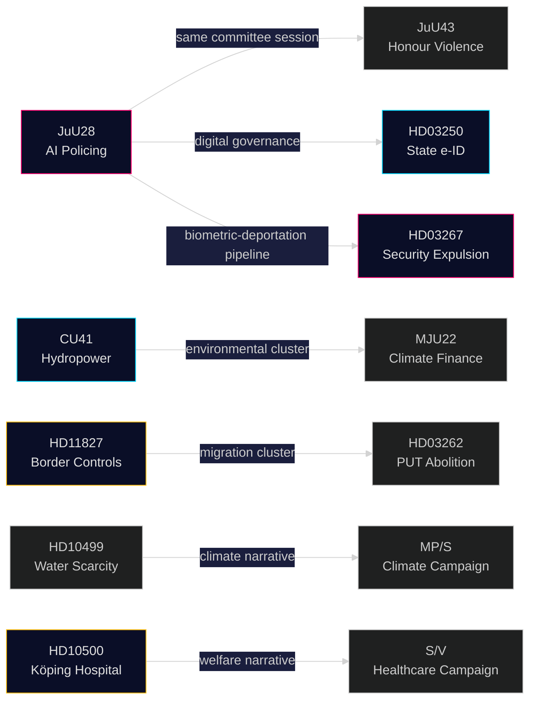

# Cross-Reference Map — Realtime Pulse 2026-05-21

**Author**: Riksdagsmonitor Intelligence
**Type**: Tier-C inter-cycle cross-reference synthesis

## Intra-day cross-references (today's sibling analyses)

### ↔ Committee Reports (analysis/daily/2026-05-21/committee-reports/)

| Today's document | Sibling analysis | Cross-reference | Significance |
|-----------------|-----------------|-----------------|-------------|
| HD01JuU28 (AI policing) | HD01JuU43 (honour violence) | Both JuU betänkanden — simultaneous debate scheduled | JuU committee holds two controversial betänkanden in same plenary session; governing bloc aims to pass both |
| HD01CU41 (hydropower) | HD01MJU22 (Riksrevisionen climate finance) | Environmental governance cluster | MJU22's adverse climate-finance findings compound CU41's EU compliance risk — opposition can build "environmental governance failure" narrative |
| HD10499 (water scarcity) | HD01SoU38/39 (child protection) | S opposition strategy | S simultaneous pressure on climate adaptation (HD10499), hospital closures (HD10500), and welfare (SoU29/30) — coordinated opposition campaign |

### ↔ Propositions (analysis/daily/2026-05-21/propositions/)

| Today's document | Sibling proposition | Cross-reference | Significance |
|-----------------|--------------------|-----------------|----|
| HD01JuU28 (AI policing) | HD03267 (security threat expulsion) | Security architecture cluster | JuU28 + HD03267 = biometric identification + deportation capability; together they constitute an integrated biometric-deportation surveillance pipeline |
| HD01JuU28 (AI policing) | HD03250 (state e-ID) | Digital governance cluster | JuU28 + HD03250 = biometric surveillance + digital identity; the two systems together create a comprehensive biometric state infrastructure |
| HD11827 (border controls) | HD03262 (PUT abolition) | Migration control cluster | Inner border controls + PUT abolition = removal of both temporary and permanent residence pathways; systematic migration restriction architecture |
| HD11822 (Taiwan arms) | HD03265 (detention/surveillance) | Security tools cluster | Taiwan arms question occurs in same session as domestic surveillance legislation; SD's security agenda spans both foreign and domestic dimensions |

## Prior-cycle cross-references (2026-05-20)

| Today's document | 2026-05-20 reference | Cross-reference | PIR link |
|-----------------|---------------------|-----------------|---------|
| HD01JuU28 | analysis/daily/2026-05-20/realtime-pulse/synthesis-summary.md | Yesterday's summary mentioned JuU28 as upcoming | PIR-JUU28-AI (new) |
| HD10501 (constitutional change) | analysis/daily/2026-05-20/interpellations/ | Pattern of constitutional accountability interpellations | PIR-RT-1 (KU34 second reading) |
| HD11827 (border controls) | analysis/daily/2026-05-20/motions/ | Border control motions from S cluster | PIR-RT-2 (S campaign on SoU30) |

## Future-cycle forward links

| Today's document | Next expected cycle | Trigger | Expected date |
|-----------------|--------------------|---------|----|
| HD01JuU28 | Plenary vote result | Vote held 2026-05-21 | 2026-05-21 (today) |
| HD10499 | Government interpellation response | Minister responds | ~2026-05-28 |
| HD10500 | Government interpellation response | Minister responds | ~2026-05-28 |
| HD10501 | Government interpellation response | Minister responds | ~2026-05-28 |
| HD01CU41 | EU Commission pre-infringement letter | Commission review | ~2026-07–09 |

## Network diagram

