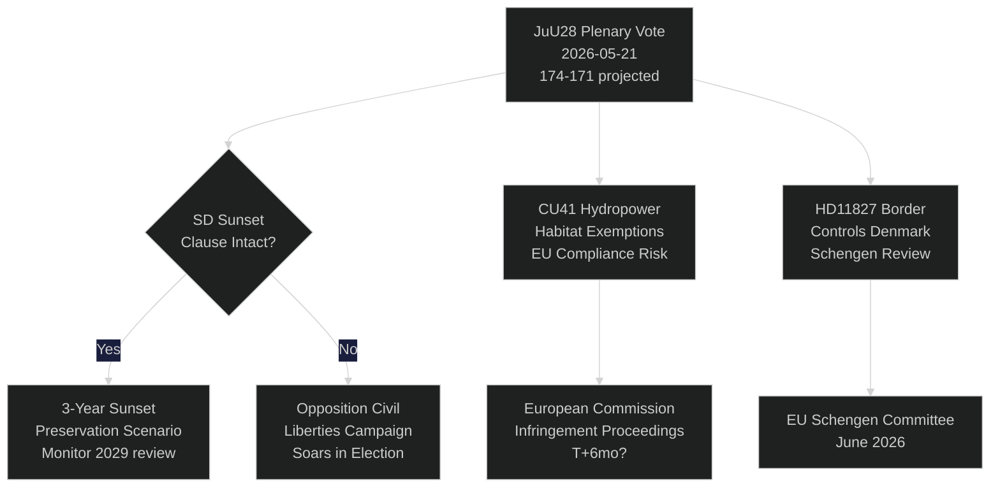

# Sweden's Riksdag Votes on AI Police Surveillance: A Constitutional Moment 115 Days Before Election

**Author**: Riksdagsmonitor Intelligence
**Classification**: PUBLIC — GDPR Art. 9(2)(e,g)
**Confidence**: HIGH [A1] for AI policing / MEDIUM [B2] for economic themes
**Date**: 2026-05-21
**Cycle**: realtime-pulse

---

## 🎯 BLUF

Sweden's parliament today holds plenary debate on **JuU28** — the Justice Committee's approval of police use of AI-based real-time facial recognition — marking the first legislative authorisation of biometric mass surveillance in a Nordic democracy. The bill passes with a narrow 174-171 governing-bloc majority after SD amended it to include a three-year sunset clause and an "exceptional circumstances" threshold. The vote is constitutionally significant: Article 2:6 of the Instrument of Government prohibits surveillance of political activity; JuU28 creates the first explicit carve-out for law-enforcement biometrics. Simultaneously, FiU40 (fund market reform), CU36 (area cooperation fee law), and CU41 (hydropower habitat exemptions) advance the Tidö coalition's pre-election legislative sprint. Three interpellations expose fault lines: water scarcity in southern Sweden (S → L), Köping hospital closure (S → KD), and constitutional change (independent MP Widding → M). Seven written questions probe Taiwan arms sales, Tibet/China relations, pension trust, border controls with Denmark, drone permits, pension insurance, and truck-stop safety.

## 🧭 3 Decisions This Brief Supports

| # | Decision | Relevance | Horizon |
|---|----------|-----------|---------|
| 1 | Civil society legal challenge strategy on JuU28 | ECHR Article 8 right-to-privacy challenge window opens at Presidential assent | T+14–90d |
| 2 | Track SD position on sunset-clause enforcement if JuU28 is adopted | If SD later weakens enforcement in government proposition, signals shift in civil liberties posture | T+30–180d |
| 3 | Assess Köping hospital closure as campaign narrative risk for KD/M in Västmanland | Healthcare access framing could cost governing bloc 1-2 Riksdag seats in Västmanland region | T+60–115d |

## ⚡ 60-Second Read

- **JuU28 AI Facial Recognition** (HD01JuU28): Parliament approves police real-time biometric surveillance with 3-year sunset clause. S/V/MP opposed. C/L voted with governing bloc despite civil liberties reservations. Confidence: **HIGH** — governing bloc has 174 votes.
- **FiU40 Fund Market** (HD01FiU40): Strengthened Finansinspektionen fund regulation aligned with EU AIFMD II and UCITS VI. Technical but significant for Swedish pension savers. Broad cross-party support.
- **CU36 Area Cooperation** (HD01CU36): New fee law for business-improvement districts; cities gain tool for high-street regeneration. Support across M/KD/L/SD.
- **CU41 Hydropower Habitats** (HD01CU41): Exemptions from habitat directive for hydropower relicensing. Green parties strongly opposed. EU compliance risk flagged by MJU.
- **Interpellation HD10499** (Water Scarcity): S challenges acting climate minister Britz (L) on droughts in southern Sweden — directly links climate policy gap to rural livelihoods. Government response expected ~28 May.
- **Interpellation HD10500** (Köping Hospital): S's Åsa Eriksson challenges KD Social Minister Forssmed on hospital closure plans — healthcare access in rural Västmanland. Response expected ~28 May.
- **Interpellation HD10501** (Constitutional Change): Independent MP Elsa Widding challenges M's Gunnar Strömmer on pace of constitutional reform — touches on Riksdag quorum rules and fundamental law change procedures.
- **Written Question HD11822** (Taiwan Arms Sales): SD's Björn Söder presses foreign minister on potential Swedish arms sales to Taiwan amid US policy shift.
- **Written Question HD11827** (Border Controls): S's Niklas Karlsson challenges Strömmer on continued inner border controls with Denmark — Schengen compatibility question.

## 🔮 Top Forward Trigger

**JuU28 Presidential Assent (T+7–21d)**: Royal/Head of State signature activates a 14-day public challenge window. If ECHR Article 8 challenge is filed in Swedish Administrative Court before assent — rare but possible — the police surveillance programme is placed on legal hold until September election, creating a campaign-period constitutional crisis narrative. P(challenge within 30d): ~25%. Monitor Datainspektionen/IMY and civil society legal NGOs.

