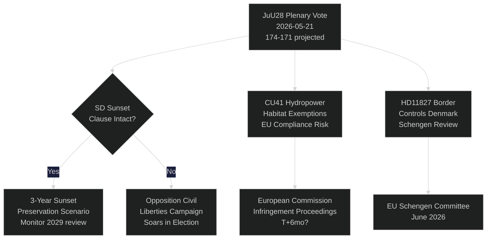

‏# يصوّت البرلمان السويدي (ريكسداغ) على مراقبة الشرطة بالذكاء الاصطناعي: لحظة دستورية قبل 115 يوماً من الانتخابات

**المؤلف**: Riksdagsmonitor Intelligence
**التصنيف**: عام — المادة 9(2)(e,g) من اللائحة العامة لحماية البيانات (GDPR)
**مستوى الثقة**: مرتفع [A1] لمجال شرطة الذكاء الاصطناعي / متوسط [B2] للموضوعات الاقتصادية
**التاريخ**: 2026-05-21
**الدورة**: realtime-pulse

---

## 🎯 الملخص التنفيذي (BLUF)

يعقد البرلمان السويدي (ريكسداغ) اليوم جلسة عامة للنقاش في **JuU28** — موافقة لجنة العدل على استخدام الشرطة لتقنية التعرف على الوجوه في الوقت الفعلي المستندة إلى الذكاء الاصطناعي — مما يُعدّ أول تفويض تشريعي لعمليات المراقبة الجماعية البيومترية في ديمقراطية إسكندنافية. يُعتمد مشروع القانون بأغلبية حكومية ضيقة 174–171 بعد أن عدّله حزب SD ليشمل بنداً للانتهاء الزمني لمدة ثلاث سنوات وعتبة "ظروف استثنائية". التصويت ذو أهمية دستورية: تحظر المادة 2:6 من نظام الحكم مراقبة النشاط السياسي؛ وينشئ JuU28 أول استثناء صريح للبيومتريا في مجال إنفاذ القانون. في الوقت نفسه، تدفع FiU40 (إصلاح سوق الصناديق) وCU36 (قانون رسوم مناطق التعاون) وCU41 (إعفاءات الموائل من الطاقة الكهرومائية) سباق التشريع ما قبل الانتخابات لتحالف تيدو. تكشف ثلاثة استجوابات عن خطوط صدع: شح المياه في جنوب السويد (S → L)، وإغلاق مستشفى كوبينغ (S → KD)، والتغيير الدستوري (النائبة المستقلة ويدينغ → M). وتدرس سبعة أسئلة مكتوبة مبيعات الأسلحة لتايوان، والعلاقات بين التبت والصين، وثقة المتقاعدين، وضوابط الحدود مع الدنمارك، وتصاريح الطائرات المسيّرة، والتأمين على المعاش، وسلامة مواقف الشاحنات.

## 🧭 ثلاثة قرارات يدعمها هذا الإحاط

| # | القرار | الأهمية | الأفق الزمني |
|---|--------|---------|--------------|
| 1 | استراتيجية المجتمع المدني للطعن القانوني في JuU28 | المادة 8 من الاتفاقية الأوروبية لحقوق الإنسان — نافذة الطعن تفتح عند توقيع رئيس الدولة | T+14–90d |
| 2 | متابعة موقف SD من تطبيق بند الانتهاء الزمني إذا اعتُمد JuU28 | إذا ضعّف SD لاحقاً التطبيق في اقتراح حكومي جديد، فذلك يُشير إلى تحوّل في موقف SD من الحريات المدنية | T+30–180d |
| 3 | تقييم إغلاق مستشفى كوبينغ كخطر انتخابي لـKD/M في فاستمانلاند | قد يُكلّف تأطير الوصول إلى الرعاية الصحية الريفية الكتلةَ الحاكمة 1-2 مقعداً في الريكسداغ في فاستمانلاند | T+60–115d |

## ⚡ قراءة في 60 ثانية

- **JuU28 التعرف على الوجه بالذكاء الاصطناعي** (HD01JuU28): يوافق الريكسداغ على المراقبة الشرطية البيومترية في الوقت الفعلي بموجب بند انتهاء زمني لثلاث سنوات. صوّتت S/V/MP ضد. صوّتت C/L مع الكتلة الحاكمة رغم تحفظاتها على الحريات المدنية. مستوى الثقة: **مرتفع** — الكتلة الحاكمة لديها 174 صوتاً.
- **FiU40 سوق الصناديق** (HD01FiU40): تعزيز تنظيم صناديق Finansinspektionen منسجماً مع AIFMD II وUCITS VI الأوروبيتين. تقني لكن مهم لمدخري التقاعد السويديين. دعم عريض عابر للأحزاب.
- **CU36 مناطق التعاون** (HD01CU36): قانون رسوم جديد لمناطق تحسين الأعمال؛ تحصل المدن على أداة لإحياء الشوارع التجارية. دعم M/KD/L/SD.
- **CU41 الطاقة الكهرومائية والموائل** (HD01CU41): إعفاءات من توجيه الموائل عند إعادة ترخيص محطات الطاقة الكهرومائية. الأحزاب الخضراء معارضة بشدة. رصد MJU خطر عدم الامتثال للاتحاد الأوروبي.
- **الاستجواب HD10499** (شح المياه): تتحدى S وزير المناخ بالنيابة بريتز (L) بشأن الجفاف في جنوب السويد — تربط مباشرة الفجوة في السياسة المناخية بسبل العيش الريفية. يُتوقع رد الحكومة ~28 مايو.
- **الاستجواب HD10500** (مستشفى كوبينغ): تتحدى أوسا إريكسون (S) وزير الشؤون الاجتماعية فورسميد (KD) بشأن خطط إغلاق المستشفى — الوصول إلى الرعاية الصحية في فاستمانلاند الريفية. يُتوقع الرد ~28 مايو.
- **الاستجواب HD10501** (التغيير الدستوري): تتحدى النائبة المستقلة إلسا ويدينغ غونار ستروميير (M) بشأن وتيرة الإصلاحات الدستورية — يتعلق بقواعد النصاب في الريكسداغ وإجراءات تعديل القانون الأساسي.
- **السؤال المكتوب HD11822** (مبيعات الأسلحة لتايوان): يضغط بيورن سودر (SD) على وزير الخارجية بشأن مبيعات الأسلحة السويدية المحتملة لتايوان في ظل تحوّل السياسة الأمريكية.
- **السؤال المكتوب HD11827** (ضوابط الحدود): يتحدى نيكلاس كارلسون (S) ستروميير بشأن استمرار ضوابط الحدود الداخلية مع الدنمارك — مسألة توافق مع شنغن.

## 🔮 أبرز محفّز مستقبلي

**توقيع رئيس الدولة على JuU28 (T+7–21d)**: يُفعّل التوقيع الملكي/الرئاسي نافذةً للطعن العام مدتها 14 يوماً. إذا قُدّمت إلى المحكمة الإدارية السويدية طعن بموجب المادة 8 من الاتفاقية الأوروبية لحقوق الإنسان قبل التوقيع — نادر لكن ممكن — يُعلَّق برنامج المراقبة الشرطية قانونياً حتى انتخابات سبتمبر، مما يُفرز خطاباً عن أزمة دستورية في فترة الحملة الانتخابية. P(طعن خلال 30 يوماً): ~25 %. رصد Datainspektionen/IMY والمنظمات القانونية غير الحكومية للمجتمع المدني.

<!-- source-sha: ef3bd4351fe4730460b79048a8a8aba4a52be1fb -->
