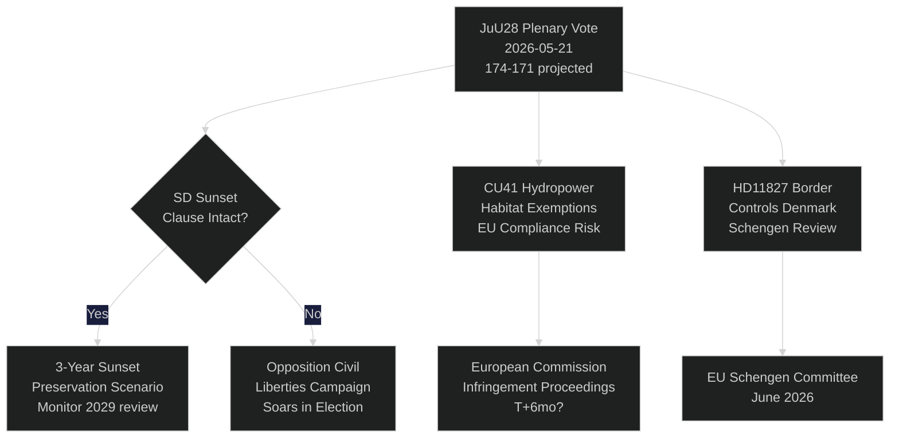

# Danmarks Riksdag stemmer om AI-politiövervågning: Et konstitutionelt øjeblik 115 dage før valget

**Forfatter**: Riksdagsmonitor Intelligence
**Klassificering**: OFFENTLIG — GDPR Art. 9(2)(e,g)
**Konfidensgrad**: HØJ [A1] for AI-politi / MEDIUM [B2] for økonomiske temaer
**Dato**: 2026-05-21
**Cyklus**: realtime-pulse

---

## 🎯 BLUF

Sveriges Riksdag afholder i dag plenardebat om **JuU28** — Retsudvalgets godkendelse af politiets brug af AI-baseret ansigtsgenkendelse i realtid — hvilket markerer den første lovgivningsmæssige godkendelse af biometrisk masseovervågning i et nordisk demokrati. Lovforslaget vedtages med et snævert flertal på 174–171 fra det siddende regeringsblok, efter at SD ændrede det til at inkludere en treårig solnedgangsklausul og en tærskel for "ekstraordinære omstændigheder". Afstemningen er forfatningsmæssigt betydningsfuld: Artikel 2:6 i Regeringsformen forbyder overvågning af politisk aktivitet; JuU28 skaber den første udtrykkelige undtagelse for biometri inden for retshåndhævelse. Samtidig fremrykker FiU40 (fondmarkedsreform), CU36 (lov om gebyrer for samarbejdsområder) og CU41 (undtagelser for vandkraft og naturtyper) Tidö-koalitionens lovgivningssprint forud for valget. Tre forespørgsler blotlægger sprækkerne: vandmangel i Sydsverige (S → L), Köpings sygehuslukning (S → KD) og forfatningsændring (uafhængig MP Widding → M). Syv skriftlige spørgsmål undersøger våbensalg til Taiwan, Tibet/Kina-relationer, pensionsfortrolighed, grænsekontrollen med Danmark, dronetilladelser, pensionsforsikring og sikkerhed på lastbilspladser.

## 🧭 3 Beslutninger dette briefing understøtter

| # | Beslutning | Relevans | Horisont |
|---|------------|----------|----------|
| 1 | Civilsamfundets strategi for juridisk udfordring af JuU28 | ECHR Artikel 8 retten til privatliv — udfordringsvinduer åbner ved statsoverhovedet underskrift | T+14–90d |
| 2 | Følg SD's position på håndhævelsen af solnedgangsklausulen, hvis JuU28 vedtages | Hvis SD efterfølgende svækker håndhævelsen i en ny regeringsproposition, signalerer det et skift i SD's civile frihedsholdning | T+30–180d |
| 3 | Vurder Köpings sygehuslukning som kampagnerisiko for KD/M i Västmanland | Indramning af sundhedsadgang i landdistrikterne kan koste regeringsblokken 1–2 Riksdag-pladser i Västmanland | T+60–115d |

## ⚡ 60-sekunders læsning

- **JuU28 AI-ansigtsgenkendelse** (HD01JuU28): Riksdagen godkender biometrisk politiovervågning i realtid med treårig solnedgangsklausul. S/V/MP stemte imod. C/L stemte med regeringsblokken på trods af forbehold over civile frihedsrettigheder. Konfidensgrad: **HØJ** — regeringsblokken har 174 stemmer.
- **FiU40 Fondmarked** (HD01FiU40): Styrket Finansinspektionen fondregulering i overensstemmelse med EU AIFMD II og UCITS VI. Teknisk, men vigtig for svenske pensionssparere. Bredt tværpolitisk opbakning.
- **CU36 Samarbejdsområder** (HD01CU36): Ny gebyrlov for Business Improvement Districts; byer får et redskab til genoplivning af handelsgader. Opbakning fra M/KD/L/SD.
- **CU41 Vandkraft og naturtyper** (HD01CU41): Undtagelser fra habitatdirektivet ved fornyet tilladelse til vandkraft. De grønne partier er stærkt imod. EU-overensstemmelsesrisiko er flagget af MJU.
- **Forespørgsel HD10499** (Vandmangel): S udfordrer fungerende klimaminister Britz (L) om tørke i Sydsverige — forbinder direkte klimapolitisk manko med landdistriktserhverv. Regeringssvar forventes ~28. maj.
- **Forespørgsel HD10500** (Köpings sygehus): S's Åsa Eriksson udfordrer KD's socialminister Forssmed om planer om sygehuslukning — sundhedsadgang i landlige Västmanland. Svar forventes ~28. maj.
- **Forespørgsel HD10501** (Forfatningsændring): Uafhængig MP Elsa Widding udfordrer M's Gunnar Strömmer om tempoet i forfatningsreformer — berører Riksdagens beslutningsdygtighed og procedurer for ændring af grundloven.
- **Skriftligt spørgsmål HD11822** (Våbensalg til Taiwan): SD's Björn Söder presser udenrigsministeren om potentielt svenske våbensalg til Taiwan i lyset af den amerikanske politikændring.
- **Skriftligt spørgsmål HD11827** (Grænsekontrollen): S's Niklas Karlsson udfordrer Strömmer om fortsatte indre grænsekontrollen med Danmark — Schengen-forenelighedsspørgsmål.

## 🔮 Vigtigste fremtidsudløser

**JuU28 statsoverhovedet underskrift (T+7–21d)**: Kongelig/statsoverhovedets underskrift aktiverer et 14-dages offentligt klagefrist. Hvis en ECHR Artikel 8-udfordring indgives til den svenske forvaltningsdomstol inden underskriften — sjældent, men muligt — sættes politiovervågningsprogrammet på juridisk hold frem til septembervalget, hvilket skaber et narrativ om en forfatningsmæssig krise i valgkampperioden. P(udfordring inden 30d): ~25 %. Overvåg Datainspektionen/IMY og civile samfundets juridiske NGO'er.

<!-- source-sha: ef3bd4351fe4730460b79048a8a8aba4a52be1fb -->
