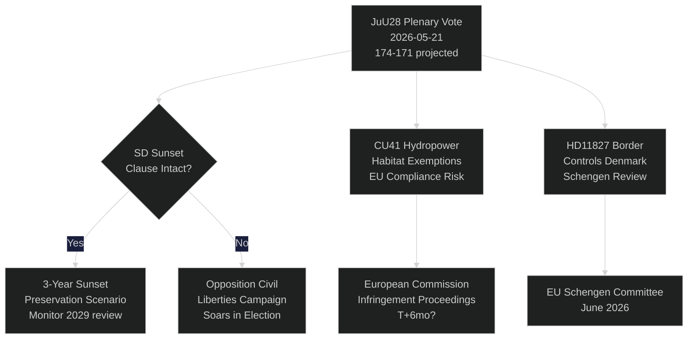

# Schwedens Riksdag stimmt über KI-Polizeiüberwachung ab: Ein verfassungsrechtlicher Moment 115 Tage vor der Wahl

**Autor**: Riksdagsmonitor Intelligence
**Klassifizierung**: ÖFFENTLICH — DSGVO Art. 9(2)(e,g)
**Konfidenzgrad**: HOCH [A1] für KI-Polizei / MITTEL [B2] für wirtschaftliche Themen
**Datum**: 2026-05-21
**Zyklus**: realtime-pulse

---

## 🎯 BLUF

Schwedens Reichstag führt heute eine Plenardebatte über **JuU28** — die Zustimmung des Justizausschusses zur Nutzung von KI-basierter Echtzeit-Gesichtserkennung durch die Polizei — was die erste gesetzgeberische Genehmigung biometrischer Massenüberwachung in einer nordischen Demokratie markiert. Das Gesetz wird mit einer knappen 174-171-Regierungsblocksmehrheit angenommen, nachdem SD es um eine dreijährige Verfallsklausel und eine Schwelle für „außergewöhnliche Umstände" ergänzt hat. Die Abstimmung ist verfassungsrechtlich bedeutsam: Artikel 2:6 der Regierungsform verbietet die Überwachung politischer Aktivitäten; JuU28 schafft die erste ausdrückliche Ausnahme für biometrische Strafverfolgung. Gleichzeitig treiben FiU40 (Fondsmarktreform), CU36 (Gesetz über Gebühren für Kooperationsgebiete) und CU41 (Ausnahmen für Wasserkraft und Lebensräume) den Gesetzgebungssprint der Tidö-Koalition vor der Wahl voran. Drei Interpellationen legen Risse offen: Wasserknappheit in Südschweden (S → L), Schließung des Krankenhauses Köping (S → KD) und Verfassungsänderung (unabhängige Abgeordnete Widding → M). Sieben schriftliche Anfragen beleuchten Taiwan-Waffenverkäufe, Tibet/China-Beziehungen, Rentenvertrauen, Grenzkontrollen mit Dänemark, Drohnenerlaubnisse, Rentenversicherung und LKW-Parkplatzsicherheit.

## 🧭 3 Entscheidungen, die dieser Bericht unterstützt

| # | Entscheidung | Relevanz | Horizont |
|---|--------------|----------|----------|
| 1 | Strategie der Zivilgesellschaft für eine rechtliche Anfechtung von JuU28 | EMRK Artikel 8 Datenschutzrecht — Anfechtungsfenster öffnet sich bei Unterzeichnung durch das Staatsoberhaupt | T+14–90d |
| 2 | SD-Position zur Durchsetzung der Verfallsklausel verfolgen, wenn JuU28 angenommen wird | Schwächt SD die Durchsetzung später in einer Regierungsproposition ab, signalisiert das einen Wandel in SDs bürgerrechtlicher Haltung | T+30–180d |
| 3 | Schließung des Krankenhauses Köping als Kampagnenrisiko für KD/M in Västmanland bewerten | Die Rahmung des Gesundheitsversorgungszugangs im ländlichen Raum kann dem Regierungsblock 1–2 Riksdag-Sitze in Västmanland kosten | T+60–115d |

## ⚡ 60-Sekunden-Lesefassung

- **JuU28 KI-Gesichtserkennung** (HD01JuU28): Riksdag genehmigt biometrische Polizeiüberwachung in Echtzeit mit dreijähriger Verfallsklausel. S/V/MP stimmten dagegen. C/L stimmten trotz Vorbehalten zu Bürgerrechten für den Regierungsblock. Konfidenzgrad: **HOCH** — der Regierungsblock hat 174 Stimmen.
- **FiU40 Fondsmarkt** (HD01FiU40): Gestärkte Finansinspektionen-Fondsregulierung in Einklang mit EU-AIFMD II und UCITS VI. Technisch, aber bedeutsam für schwedische Rentensparer. Breite parteiübergreifende Unterstützung.
- **CU36 Kooperationsgebiete** (HD01CU36): Neues Gebührengesetz für Business Improvement Districts; Städte erhalten ein Instrument zur Innenstadtrevitalisierung. Unterstützung durch M/KD/L/SD.
- **CU41 Wasserkraft und Lebensräume** (HD01CU41): Ausnahmen von der Habitatrichtlinie bei der Neuzulassung von Wasserkraft. Die grünen Parteien sind stark dagegen. EU-Konformitätsrisiko wurde von MJU markiert.
- **Interpellation HD10499** (Wasserknappheit): S fordert amtierenden Klimaminister Britz (L) zu Dürre in Südschweden heraus — verbindet direkt die klimapolitische Lücke mit ländlichen Lebensgrundlagen. Regierungsantwort erwartet ~28. Mai.
- **Interpellation HD10500** (Krankenhaus Köping): S' Åsa Eriksson fordert KD-Sozialminister Forssmed zu Schließungsplänen für das Krankenhaus heraus — Gesundheitsversorgung im ländlichen Västmanland. Antwort erwartet ~28. Mai.
- **Interpellation HD10501** (Verfassungsänderung): Unabhängige Abgeordnete Elsa Widding fordert M's Gunnar Strömmer zum Tempo der Verfassungsreformen heraus — betrifft Beschlussfähigkeitsregeln des Riksdag und Verfahren zur Verfassungsänderung.
- **Schriftliche Anfrage HD11822** (Taiwan-Waffenverkäufe): SDs Björn Söder drängt den Außenminister zu potenziellen schwedischen Waffenverkäufen an Taiwan angesichts der US-Politikwende.
- **Schriftliche Anfrage HD11827** (Grenzkontrollen): S' Niklas Karlsson fordert Strömmer zu anhaltenden Binnengrenzkontrollen mit Dänemark heraus — Frage der Schengen-Kompatibilität.

## 🔮 Wichtigster Zukunftsauslöser

**JuU28 Unterzeichnung durch das Staatsoberhaupt (T+7–21d)**: Königliche/Staatsoberhauptunterzeichnung aktiviert ein 14-tägiges öffentliches Anfechtungsfenster. Wenn eine EMRK-Artikel-8-Anfechtung beim schwedischen Verwaltungsgericht vor der Unterzeichnung eingereicht wird — selten, aber möglich — wird das Polizeiüberwachungsprogramm bis zur Septemberwahl auf rechtlichem Halt gesetzt, was ein Narrativ einer verfassungsrechtlichen Krise in der Wahlkampfperiode schafft. P(Anfechtung innerhalb 30d): ~25 %. IMY und zivilgesellschaftliche Rechts-NGOs überwachen.

<!-- source-sha: ef3bd4351fe4730460b79048a8a8aba4a52be1fb -->
