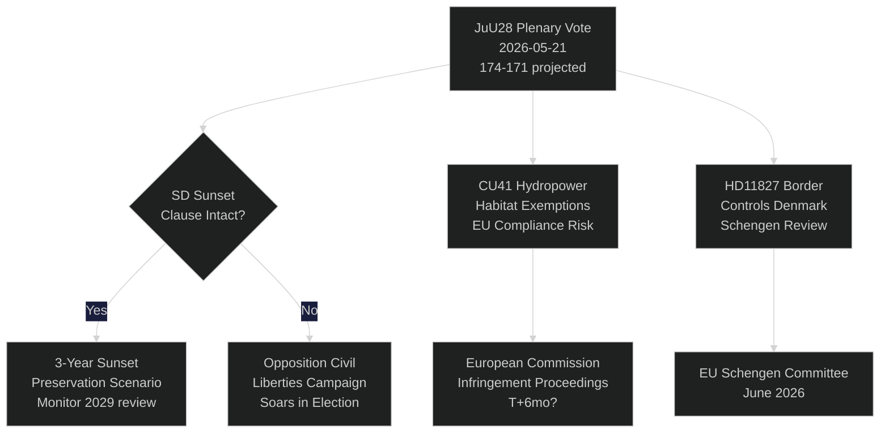

# El Riksdag sueco vota sobre la vigilancia policial con IA: Un momento constitucional a 115 días de las elecciones

**Autor**: Riksdagsmonitor Intelligence
**Clasificación**: PÚBLICO — RGPD Art. 9(2)(e,g)
**Nivel de confianza**: ALTO [A1] para policía IA / MEDIO [B2] para temas económicos
**Fecha**: 2026-05-21
**Ciclo**: realtime-pulse

---

## 🎯 BLUF

El Riksdag sueco celebra hoy un debate plenario sobre **JuU28** — la aprobación por parte de la Comisión de Justicia del uso policial del reconocimiento facial en tiempo real basado en IA — marcando la primera autorización legislativa de vigilancia biométrica masiva en una democracia nórdica. El proyecto de ley se aprueba con una ajustada mayoría de 174–171 del bloque gobernante, después de que SD lo enmendara para incluir una cláusula de extinción de tres años y un umbral de "circunstancias excepcionales". La votación es constitucionalmente significativa: el artículo 2:6 de la Forma de Gobierno prohíbe la vigilancia de actividad política; JuU28 crea la primera exención explícita para la biometría en el ámbito de la aplicación de la ley. Simultáneamente, FiU40 (reforma del mercado de fondos), CU36 (ley de tasas para áreas de cooperación) y CU41 (exenciones de hábitat para hidroeléctrica) impulsan el sprint legislativo preelectoral de la coalición Tidö. Tres interpelaciones exponen líneas de fractura: escasez de agua en el sur de Suecia (S → L), cierre del hospital de Köping (S → KD) y cambio constitucional (la diputada independiente Widding → M). Siete preguntas escritas examinan las ventas de armas a Taiwán, las relaciones Tíbet/China, la confianza en las pensiones, los controles fronterizos con Dinamarca, los permisos de drones, el seguro de pensiones y la seguridad en áreas de descanso para camiones.

## 🧭 3 Decisiones que apoya este informe

| # | Decisión | Relevancia | Horizonte |
|---|----------|------------|-----------|
| 1 | Estrategia de la sociedad civil para impugnar legalmente JuU28 | CEDH Artículo 8 derecho a la privacidad — la ventana de impugnación se abre con la firma del jefe de Estado | T+14–90d |
| 2 | Seguir la posición del SD sobre la aplicación de la cláusula de extinción si se aprueba JuU28 | Si el SD debilita posteriormente la aplicación en una nueva proposición gubernamental, señala un cambio en la postura del SD respecto a las libertades civiles | T+30–180d |
| 3 | Evaluar el cierre del hospital de Köping como riesgo de campaña para KD/M en Västmanland | El encuadre del acceso a la sanidad rural podría costar al bloque gobernante 1-2 escaños en el Riksdag en Västmanland | T+60–115d |

## ⚡ Lectura de 60 segundos

- **JuU28 Reconocimiento facial IA** (HD01JuU28): El Riksdag aprueba la vigilancia biométrica policial en tiempo real con cláusula de extinción de tres años. S/V/MP votaron en contra. C/L votaron con el bloque gobernante a pesar de sus reservas sobre las libertades civiles. Nivel de confianza: **ALTO** — el bloque gobernante tiene 174 votos.
- **FiU40 Mercado de fondos** (HD01FiU40): Regulación reforzada de fondos de la Finansinspektionen alineada con la AIFMD II y UCITS VI de la UE. Técnico pero significativo para los ahorradores suecos para la jubilación. Amplio apoyo transpartidario.
- **CU36 Áreas de cooperación** (HD01CU36): Nueva ley de tasas para Business Improvement Districts; las ciudades obtienen una herramienta para la regeneración de zonas comerciales. Apoyo de M/KD/L/SD.
- **CU41 Hidroeléctrica y hábitats** (HD01CU41): Exenciones de la directiva de hábitats para la nueva autorización de hidroeléctricas. Los partidos verdes se oponen firmemente. El MJU ha marcado el riesgo de incumplimiento de la UE.
- **Interpelación HD10499** (Escasez de agua): S desafía al ministro de Clima en funciones Britz (L) sobre la sequía en el sur de Suecia — vincula directamente la brecha de política climática con los medios de vida rurales. Respuesta gubernamental prevista ~28 de mayo.
- **Interpelación HD10500** (Hospital de Köping): Åsa Eriksson (S) desafía al ministro social de KD Forssmed sobre los planes de cierre del hospital — acceso a la sanidad en el Västmanland rural. Respuesta prevista ~28 de mayo.
- **Interpelación HD10501** (Cambio constitucional): La diputada independiente Elsa Widding desafía a Gunnar Strömmer (M) sobre el ritmo de las reformas constitucionales — afecta a las reglas de quórum del Riksdag y los procedimientos de reforma de la ley fundamental.
- **Pregunta escrita HD11822** (Ventas de armas a Taiwán): Björn Söder (SD) presiona al ministro de Asuntos Exteriores sobre las posibles ventas de armas suecas a Taiwán ante el cambio de política de EE. UU.
- **Pregunta escrita HD11827** (Controles fronterizos): Niklas Karlsson (S) desafía a Strömmer sobre los continuos controles en las fronteras interiores con Dinamarca — cuestión de compatibilidad con Schengen.

## 🔮 Principal detonante prospectivo

**Firma de JuU28 por el jefe de Estado (T+7–21d)**: La firma real/del jefe de Estado activa una ventana de impugnación pública de 14 días. Si se presenta ante el tribunal administrativo sueco una impugnación al amparo del artículo 8 del CEDH antes de la firma — rara pero posible —, el programa de vigilancia policial queda en suspenso legal hasta las elecciones de septiembre, creando una narrativa de crisis constitucional en el período de campaña. P(impugnación en 30d): ~25 %. Seguir Datainspektionen/IMY y ONG jurídicas de la sociedad civil.

<!-- source-sha: ef3bd4351fe4730460b79048a8a8aba4a52be1fb -->
