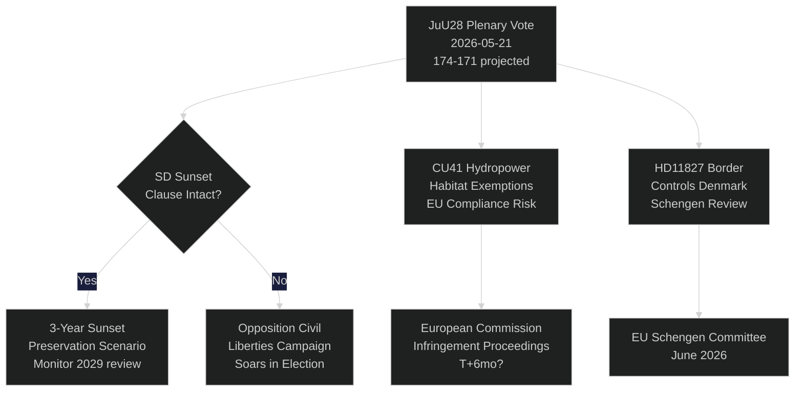

# Ruotsin riksdag äänestää tekoälypoliisivalvonnasta: Perustuslaillinen hetki 115 päivää ennen vaaleja

**Tekijä**: Riksdagsmonitor Intelligence
**Luokitus**: JULKINEN — GDPR Art. 9(2)(e,g)
**Luottamustaso**: KORKEA [A1] tekoälypoliisille / KESKITASO [B2] taloudellisille teemoille
**Päivämäärä**: 2026-05-21
**Sykli**: realtime-pulse

---

## 🎯 BLUF

Ruotsin riksdag käy tänään täysistuntokeskustelun **JuU28**:sta — oikeusvaliokunnan hyväksynnästä poliisin tekoälypohjaisten reaaliaikaisten kasvojentunnistusjärjestelmien käytölle — mikä merkitsee ensimmäistä lainsäädännöllistä lupaa biometriselle joukkojenvalvonnalle pohjoismaisessa demokratiassa. Lakiesitys hyväksytään niukalla 174–171 hallitusblokki-enemmistöllä sen jälkeen, kun SD muutti sen sisältämään kolmivuotisen auringonlaskusäännöksen ja "poikkeuksellisten olosuhteiden" kynnyksen. Äänestys on perustuslaillisesti merkittävä: hallitusmuodon 2 §:n 6 momentti kieltää poliittisen toiminnan valvonnan; JuU28 luo ensimmäisen nimenomaisen poikkeuksen lainvalvonnan biometriikalle. Samalla FiU40 (rahastomarkkinauudistus), CU36 (yhteistoiminta-alueiden maksulaki) ja CU41 (vesivoimaa koskevat elinympäristöpoikkeukset) edistävät Tidö-koalition vaaleja edeltävää lainsäädäntösprinttiä. Kolme kyselytuntia paljastaa halkeamia: vesipula Etelä-Ruotsissa (S → L), Köpingin sairaalan sulkeminen (S → KD) ja perustuslaillinen muutos (riippumaton kansanedustaja Widding → M). Seitsemässä kirjallisessa kysymyksessä tarkastellaan Taiwanin asekauppoja, Tiibet/Kiina-suhteita, eläkeluottamusta, rajatarkastuksia Tanskan kanssa, drone-lupia, eläkevakuutusta ja kuorma-autoparkkialueiden turvallisuutta.

## 🧭 3 Päätöstä, joita tämä tiedustelutiivistelmä tukee

| # | Päätös | Relevanssi | Horisontti |
|---|--------|------------|------------|
| 1 | Kansalaisyhteiskunnan oikeudellinen haastamisstrategia JuU28:lle | ECHR 8 artikla yksityisyyden suoja — haastamisikkuna aukeaa, kun valtionpäämies allekirjoittaa | T+14–90d |
| 2 | Seuraa SD:n kantaa auringonlaskusäännöksen täytäntöönpanoon, jos JuU28 hyväksytään | Jos SD myöhemmin heikentää täytäntöönpanoa uudessa hallituksen esityksessä, se merkitsee muutosta SD:n siviilivapauksien asemaan | T+30–180d |
| 3 | Arvioi Köpingin sairaalan sulkeminen kampanjariskiksi KD:lle/M:lle Västmanlandissa | Maaseudun terveydenhuollon saavutettavuuden kehystäminen voi maksaa hallitusblokille 1–2 riksdagspaikkaa Västmanlandissa | T+60–115d |

## ⚡ 60 sekunnin lukeminen

- **JuU28 tekoälykasvojentunnistus** (HD01JuU28): Riksdag hyväksyy biometrisen poliisivalvonnan reaaliajassa kolmivuotisella auringonlaskusäännöksellä. S/V/MP äänestivät vastaan. C/L äänestivät hallitusblokkin kanssa siviilivapauksiin liittyvistä varauksistaan huolimatta. Luottamustaso: **KORKEA** — hallitusblokilla on 174 ääntä.
- **FiU40 Rahastomarkkina** (HD01FiU40): Vahvistettu Finansinspektionen-rahastoasetus EU:n AIFMD II:n ja UCITS VI:n mukaisesti. Tekninen, mutta merkittävä ruotsalaisille eläkesäästäjille. Laaja puolueiden välinen tuki.
- **CU36 Yhteistoiminta-alueet** (HD01CU36): Uusi maksulaki Business Improvement Districteille; kaupungit saavat välineen kauppakeskustojen elvyttämiseen. Tuki M/KD/L/SD:ltä.
- **CU41 Vesivoimalaitos ja elinympäristöt** (HD01CU41): Poikkeukset habitaattidirektiivistä vesivoimaloiden uudelleenluvituksessa. Vihreät puolueet voimakkaasti vastaan. MJU on merkinnyt EU:n noudattamisriskin.
- **Kyselytunti HD10499** (Vesipula): S haastaa toimivan ilmastoministerin Britzin (L) Etelä-Ruotsin kuivuudesta — yhdistää suoraan ilmastopolitiikan aukon maaseudun elinkeinoihin. Hallituksen vastaus odotettavissa ~28.5.
- **Kyselytunti HD10500** (Köpingin sairaala): S:n Åsa Eriksson haastaa KD:n sosiaaliministeri Forsmedin sairaalan sulkemissuunnitelmista — terveydenhuollon saavutettavuus maaseutumaisessa Västmanlandissa. Vastaus odotettavissa ~28.5.
- **Kyselytunti HD10501** (Perustuslaillinen muutos): Riippumaton kansanedustaja Elsa Widding haastaa M:n Gunnar Strömmeristä perustuslakiuudistusten vauhdista — koskee riksdagin päätösvaltaisuussäännöksiä ja perustuslain muutosmenettelyjä.
- **Kirjallinen kysymys HD11822** (Taiwanin asekaupat): SD:n Björn Söder painostaa ulkoministeriä mahdollisista ruotsalaisten asekauppoista Taiwanille Yhdysvaltain politiikan muutoksen valossa.
- **Kirjallinen kysymys HD11827** (Rajatarkastukset): S:n Niklas Karlsson haastaa Strömmeristä jatkuvista sisäisistä rajatarkastuksista Tanskan kanssa — Schengen-yhteensopivuuskysymys.

## 🔮 Tärkein tulevaisuuden laukaisin

**JuU28 valtionpäämies allekirjoittaa (T+7–21d)**: Kuninkaallinen/valtionpäämies allekirjoittaa aktivoi 14 päivän julkisen muutoksenhakuajan. Jos ECHR 8 artikla -haaste toimitetaan Ruotsin hallinto-oikeudelle ennen allekirjoittamista — harvinaista, mutta mahdollista — poliisivalvontaohjelma asetetaan oikeudelliseen odotustilaan syyskuun vaaleihin asti, mikä luo kampanjajakson perustuslakikriisikertomuksen. P(haaste 30 päivän kuluessa): ~25 %. Seuraa Datainspektionen/IMY:tä ja kansalaisyhteiskunnan juridisia kansalaisjärjestöjä.

<!-- source-sha: ef3bd4351fe4730460b79048a8a8aba4a52be1fb -->
