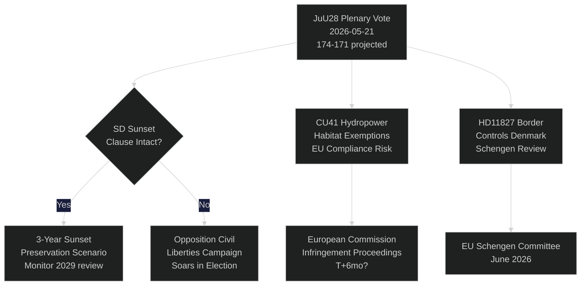

# Le Riksdag suédois vote sur la surveillance policière par IA : Un moment constitutionnel à 115 jours des élections

**Auteur** : Riksdagsmonitor Intelligence
**Classification** : PUBLIC — RGPD Art. 9(2)(e,g)
**Niveau de confiance** : ÉLEVÉ [A1] pour la police IA / MOYEN [B2] pour les thèmes économiques
**Date** : 2026-05-21
**Cycle** : realtime-pulse

---

## 🎯 BLUF

Le Riksdag suédois tient aujourd'hui un débat en séance plénière sur **JuU28** — l'approbation par la Commission des affaires juridiques de l'utilisation par la police de la reconnaissance faciale en temps réel basée sur l'IA — marquant la première autorisation législative de surveillance biométrique de masse dans une démocratie nordique. Le projet de loi est adopté avec une étroite majorité de 174–171 du bloc gouvernemental après que le SD l'a amendé pour inclure une clause de caducité de trois ans et un seuil de « circonstances exceptionnelles ». Le vote est constitutionnellement important : l'article 2:6 de la Forme de gouvernement interdit la surveillance des activités politiques ; JuU28 crée la première dérogation explicite pour la biométrie dans l'application des lois. Parallèlement, FiU40 (réforme du marché des fonds), CU36 (loi sur les frais pour les zones de coopération) et CU41 (dérogations pour les habitats hydroélectriques) font avancer le sprint législatif de la coalition Tidö avant les élections. Trois interpellations révèlent des fractures : la pénurie d'eau dans le sud de la Suède (S → L), la fermeture de l'hôpital de Köping (S → KD) et la réforme constitutionnelle (le député indépendant Widding → M). Sept questions écrites portent sur les ventes d'armes à Taïwan, les relations Tibet/Chine, la confiance dans les retraites, les contrôles aux frontières avec le Danemark, les autorisations de drones, l'assurance retraite et la sécurité des aires de repos pour camions.

## 🧭 3 Décisions soutenues par ce rapport

| # | Décision | Pertinence | Horizon |
|---|----------|------------|---------|
| 1 | Stratégie de la société civile pour contester juridiquement JuU28 | CEDH Article 8 droit à la vie privée — fenêtre de contestation s'ouvre à la signature du chef de l'État | T+14–90d |
| 2 | Suivre la position du SD sur l'application de la clause de caducité si JuU28 est adoptée | Si le SD affaiblit ultérieurement l'application dans une nouvelle proposition gouvernementale, cela signale un changement dans la posture du SD sur les libertés civiles | T+30–180d |
| 3 | Évaluer la fermeture de l'hôpital de Köping comme risque de campagne pour KD/M dans le Västmanland | Le cadrage de l'accès aux soins en milieu rural pourrait coûter au bloc gouvernemental 1 à 2 sièges au Riksdag dans le Västmanland | T+60–115d |

## ⚡ Lecture en 60 secondes

- **JuU28 Reconnaissance faciale IA** (HD01JuU28) : Le Riksdag approuve la surveillance biométrique policière en temps réel avec une clause de caducité de trois ans. S/V/MP ont voté contre. C/L ont voté avec le bloc gouvernemental malgré des réserves sur les libertés civiles. Niveau de confiance : **ÉLEVÉ** — le bloc gouvernemental dispose de 174 voix.
- **FiU40 Marché des fonds** (HD01FiU40) : Renforcement de la réglementation des fonds de la Finansinspektionen alignée sur la directive européenne AIFMD II et UCITS VI. Technique mais important pour les épargnants en retraite suédois. Large soutien transpartisan.
- **CU36 Zones de coopération** (HD01CU36) : Nouvelle loi sur les frais pour les Business Improvement Districts ; les villes disposent d'un outil pour la revitalisation des artères commerciales. Soutien de M/KD/L/SD.
- **CU41 Hydroélectricité et habitats** (HD01CU41) : Dérogations à la directive Habitats lors du renouvellement des autorisations pour l'hydroélectricité. Les partis verts y sont fortement opposés. Risque de non-conformité européenne signalé par le MJU.
- **Interpellation HD10499** (Pénurie d'eau) : S challenge le ministre délégué au Climat Britz (L) sur la sécheresse dans le sud de la Suède — relie directement le déficit de politique climatique aux moyens de subsistance ruraux. Réponse gouvernementale attendue ~28 mai.
- **Interpellation HD10500** (Hôpital de Köping) : Åsa Eriksson (S) challenge le ministre social KD Forssmed sur les projets de fermeture d'hôpital — accès aux soins dans le Västmanland rural. Réponse attendue ~28 mai.
- **Interpellation HD10501** (Réforme constitutionnelle) : La députée indépendante Elsa Widding challenge Gunnar Strömmer (M) sur le rythme des réformes constitutionnelles — touche aux règles de quorum du Riksdag et aux procédures de révision de la loi fondamentale.
- **Question écrite HD11822** (Ventes d'armes à Taïwan) : Björn Söder (SD) presse le ministre des Affaires étrangères sur les potentielles ventes d'armes suédoises à Taïwan dans le contexte du changement de politique américaine.
- **Question écrite HD11827** (Contrôles aux frontières) : Niklas Karlsson (S) challenge Strömmer sur le maintien des contrôles aux frontières intérieures avec le Danemark — question de compatibilité avec Schengen.

## 🔮 Principal déclencheur prospectif

**Signature de JuU28 par le chef de l'État (T+7–21d)** : La signature royale/du chef de l'État ouvre une fenêtre de contestation publique de 14 jours. Si un recours CEDH Article 8 est déposé devant le tribunal administratif suédois avant la signature — rare mais possible — le programme de surveillance policière est suspendu jusqu'aux élections de septembre, créant un narratif de crise constitutionnelle en période de campagne. P(recours dans 30j) : ~25 %. Surveiller la Datainspektionen/IMY et les ONG juridiques de la société civile.

<!-- source-sha: ef3bd4351fe4730460b79048a8a8aba4a52be1fb -->
