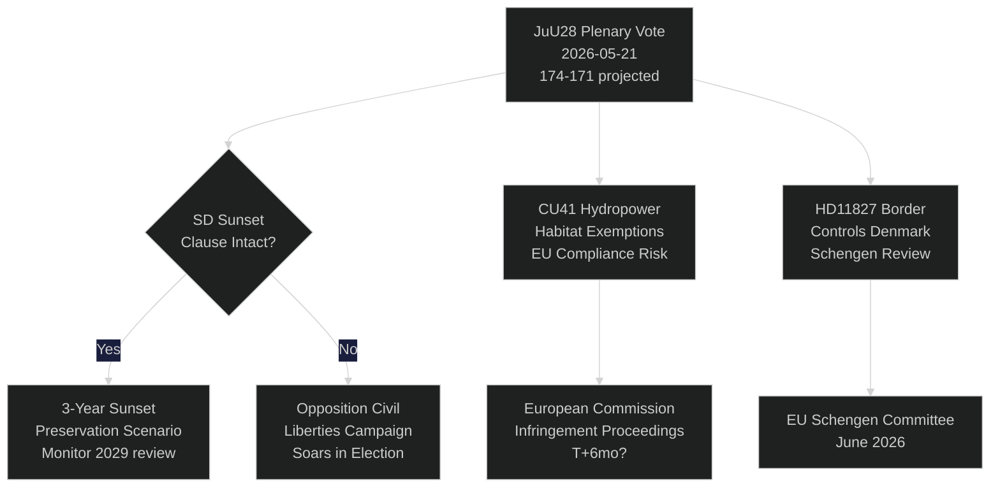

‏# הריקסדאג השוודי מצביע על פיקוח שוטרי מבוסס בינה מלאכותית: רגע חוקתי 115 ימים לפני הבחירות

**מחבר**: Riksdagsmonitor Intelligence
**סיווג**: ציבורי — GDPR סעיף 9(2)(e,g)
**רמת אמינות**: גבוהה [A1] לגבי פיקוח שוטרי ב-AI / בינונית [B2] לנושאים כלכליים
**תאריך**: 2026-05-21
**מחזור**: realtime-pulse

---

## 🎯 סיכום מנהלים (BLUF)

הריקסדאג השוודי מקיים היום דיון מליאה בנושא **JuU28** — אישור ועדת המשפטים לשימוש המשטרה בזיהוי פנים בזמן אמת מבוסס בינה מלאכותית — המהווה את ההרשאה החקיקתית הראשונה למעקב ביומטרי המוני בדמוקרטיה נורדית. הצעת החוק מאושרת ברוב ממשלתי צר של 174–171 לאחר שמפלגת SD תיקנה אותה לכלול סעיף שקיעה של שלוש שנים וסף "נסיבות יוצאות דופן". ההצבעה בעלת חשיבות חוקתית: סעיף 2:6 בחוק הממשל אוסר מעקב אחר פעילות פוליטית; JuU28 יוצר את החריג המפורש הראשון לביומטריה באכיפת חוק. במקביל, FiU40 (רפורמת שוק הקרנות), CU36 (חוק דמי שיתוף פעולה) ו-CU41 (פטורים לבתי גידול אנרגיה הידרואלקטרית) מקדמים את ספרינט החקיקה טרום הבחירות של קואליציית טידו. שלושה שאלות נציגים חושפות קווי שבר: מחסור במים בדרום שוודיה (S → L), סגירת בית החולים בקופינג (S → KD) ושינוי חוקתי (חברת כנסת עצמאית וידינג → M). שבע שאלות כתובות בוחנות מכירות נשק לטייוואן, יחסי טיבט/סין, אמון בפנסיות, בקרות גבול עם דנמרק, אישורי כטב"מ, ביטוח פנסיה ובטיחות חניוני משאיות.

## 🧭 3 החלטות שתקציר זה תומך בהן

| # | החלטה | רלוונטיות | אופק |
|---|-------|-----------|------|
| 1 | אסטרטגיית החברה האזרחית לאתגר משפטי על JuU28 | ECHR סעיף 8 זכות לפרטיות — חלון האתגר נפתח בחתימת ראש המדינה | T+14–90d |
| 2 | מעקב אחר עמדת SD לגבי אכיפת סעיף השקיעה אם JuU28 יאושר | אם SD תחליש לאחר מכן את האכיפה בהצעת ממשלה חדשה — סימן לשינוי בעמדת SD בנושא חירויות אזרחיות | T+30–180d |
| 3 | הערכת סגירת בית החולים בקופינג כסיכון קמפיין ל-KD/M בוסטמנלנד | מסגור הנגישות לשירותי בריאות בכפר עלול לעלות לגוש הממשלתי 1-2 מושבים בריקסדאג בוסטמנלנד | T+60–115d |

## ⚡ קריאה של 60 שניות

- **JuU28 זיהוי פנים ב-AI** (HD01JuU28): הריקסדאג מאשר פיקוח ביומטרי שוטרי בזמן אמת עם סעיף שקיעה לשלוש שנים. S/V/MP הצביעו נגד. C/L הצביעו עם הגוש הממשלתי למרות הסתייגויות לגבי חירויות אזרחיות. רמת אמינות: **גבוהה** — לגוש הממשלתי 174 קולות.
- **FiU40 שוק קרנות** (HD01FiU40): רגולציית קרנות Finansinspektionen המוגברת בהתאם ל-AIFMD II ו-UCITS VI האירופאיים. טכני אך משמעותי לחוסכי פנסיה שוודים. תמיכה רחבה חוצת מפלגות.
- **CU36 אזורי שיתוף פעולה** (HD01CU36): חוק דמי חדש ל-Business Improvement Districts; ערים מקבלות כלי להחייאת רחובות מסחריים. תמיכת M/KD/L/SD.
- **CU41 הידרואלקטריקה ובתי גידול** (HD01CU41): פטורים מהנחיית בתי הגידול ברישוי מחדש של תחנות כוח הידרואלקטריות. המפלגות הירוקות מתנגדות בחריפות. MJU סימן סיכון אי-ציות לאיחוד האירופי.
- **שאלת נציגים HD10499** (מחסור במים): S מאתגרת את שר האקלים הממלא תפקיד בריץ (L) לגבי בצורת בדרום שוודיה — קושרת ישירות פער במדיניות האקלים לפרנסת הכפר. תשובת ממשלה צפויה ~28 במאי.
- **שאלת נציגים HD10500** (בית חולים קופינג): אוסה אריקסון (S) מאתגרת את שר הרווחה של KD פורסמד לגבי תוכניות סגירת בית חולים — נגישות לשירותי בריאות בוסטמנלנד הכפרית. תשובה צפויה ~28 במאי.
- **שאלת נציגים HD10501** (שינוי חוקתי): חברת הכנסת העצמאית אלסה וידינג מאתגרת את גונר סטרומר (M) לגבי קצב הרפורמות החוקתיות — נוגע לכללי מניין הריקסדאג ולנהלי שינוי החוק הבסיסי.
- **שאלה כתובה HD11822** (מכירות נשק לטייוואן): ביורן סודר (SD) לוחץ על שר החוץ לגבי מכירות נשק שוודיות פוטנציאליות לטייוואן לאור שינוי המדיניות האמריקאית.
- **שאלה כתובה HD11827** (בקרות גבול): ניקלאס קרלסון (S) מאתגר את סטרומר לגבי בקרות גבול פנימיות מתמשכות עם דנמרק — שאלת תאימות שנגן.

## 🔮 המפעיל העתידי המרכזי

**חתימת ראש המדינה על JuU28 (T+7–21d)**: חתימה מלכותית/של ראש המדינה מפעילה חלון ערעור ציבורי של 14 ימים. אם יוגש לבית המשפט המינהלי השוודי ערעור על פי ECHR סעיף 8 לפני החתימה — נדיר אך אפשרי — תיעצר תוכנית הפיקוח השוטרי עד לבחירות ספטמבר, מה שייצור נרטיב של משבר חוקתי בתקופת הקמפיין. P(ערעור תוך 30 ימים): ~25 %. לעקוב אחר Datainspektionen/IMY וארגוני NGO משפטיים של החברה האזרחית.

<!-- source-sha: ef3bd4351fe4730460b79048a8a8aba4a52be1fb -->
