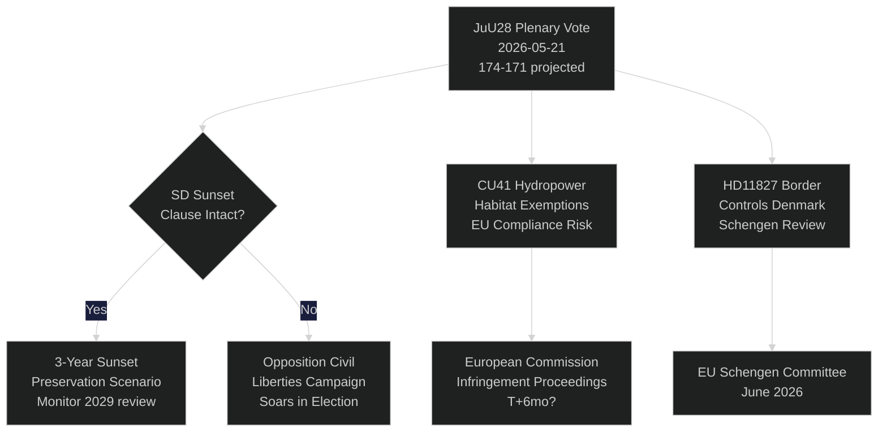

# スウェーデン議会がAI警察監視を採決：選挙115日前の憲法的瞬間

**著者**: Riksdagsmonitor Intelligence
**分類**: 公開 — GDPR第9条(2)(e,g)
**信頼度**: 高 [A1] AI警察分野 / 中 [B2] 経済テーマ
**日付**: 2026-05-21
**サイクル**: realtime-pulse

---

## 🎯 BLUF（要点）

スウェーデン議会（リクスダーグ）は本日、**JuU28**に関する本会議討論を実施する。これは法務委員会がAIを活用したリアルタイム顔認識技術の警察利用を承認するもので、北欧民主主義国家において生体認証による大量監視を初めて法的に認可する歴史的な決定である。スウェーデン民主党（SD）が3年間の日没条項と「例外的状況」の閾値を盛り込む修正を提案した後、与党ブロックは174–171の僅差の多数決で法案を可決した。この採決は憲法的に重要な意味を持つ：統治形態法第2条第6項は政治活動の監視を禁止しており、JuU28は法執行における生体認証への初の明示的例外規定を設けることになる。同時に、FiU40（ファンド市場改革）、CU36（協力地域手数料法）、CU41（水力発電の生息地免除）が、ティデー連立政権の選挙前の立法スプリントを推進している。3件の質問演説が亀裂を露わにする：スウェーデン南部の水不足（S→L）、ショーピング病院閉鎖（S→KD）、憲法改正（無所属議員ウィッディング→M）。7件の書面質問では、台湾への武器売却、チベット/中国関係、年金への信頼、デンマークとの国境管理、ドローン許可、年金保険、トラック駐車場の安全性が問われている。

## 🧭 本報告書が支援する3つの意思決定

| # | 決定事項 | 関連性 | 期間 |
|---|---------|-------|------|
| 1 | JuU28に対する市民社会の法的異議申立て戦略 | ECHR第8条プライバシー権 — 異議申立て期間は国家元首署名時に開始 | T+14–90d |
| 2 | JuU28採択後のSD日没条項執行に関する立場追跡 | SDが後に政府提案で執行を弱体化させれば、SDの市民的自由に関する立場転換を示す | T+30–180d |
| 3 | ウェストマンランドにおけるKD/MへのショーピングMO病院閉鎖の選挙リスク評価 | 農村部の医療アクセスのフレーミングにより、与党ブロックはウェストマンランドで1〜2議席を失う可能性 | T+60–115d |

## ⚡ 60秒で読む

- **JuU28 AI顔認識** (HD01JuU28)：リクスダーグは3年間の日没条項付きでリアルタイム生体認証警察監視を承認。S/V/MPが反対票。C/Lは市民的自由への懸念を抱えつつも与党ブロックと同調して賛成票。信頼度：**高** — 与党ブロックは174票を持つ。
- **FiU40 ファンド市場** (HD01FiU40)：EU AIFMD IIおよびUCITS VIに準拠したフィナンスインスペクティオンの強化されたファンド規制。スウェーデンの年金貯蓄者にとって技術的だが重要。超党派の幅広い支持。
- **CU36 協力地域** (HD01CU36)：Business Improvement Districtsへの新手数料法；都市がショッピングストリート再生のためのツールを取得。M/KD/L/SDの支持。
- **CU41 水力発電と生息地** (HD01CU41)：水力発電再許可における生息地指令の免除。緑の党が強く反対。MJUがEU遵守リスクを指摘。
- **質問演説 HD10499**（水不足）：SがL所属の代行気候大臣ブリッツに対し、スウェーデン南部の干ばつについて挑戦 — 気候政策のギャップを農村の生計に直接結びつける。政府回答は約5月28日。
- **質問演説 HD10500**（ショーピング病院）：SのÅsa Erikssonが病院閉鎖計画についてKD社会大臣フォルスメドに挑戦 — ウェストマンランド農村部の医療アクセス。回答は約5月28日。
- **質問演説 HD10501**（憲法改正）：無所属議員エルサ・ウィッディングがM所属のグンナル・ストロメルに対し憲法改革の速度について挑戦 — リクスダーグの定足数規則と基本法改正手続きに関わる。
- **書面質問 HD11822**（台湾への武器売却）：SDのビョルン・セダーが米国の政策転換を背景に潜在的なスウェーデンの台湾への武器売却について外務大臣に圧力。
- **書面質問 HD11827**（国境管理）：SのNiklas Karlssonがデンマークとの国内国境管理継続についてストロメルに挑戦 — シェンゲン協定整合性の問題。

## 🔮 最重要な将来のトリガー

**JuU28への国家元首署名 (T+7–21d)**：国王/国家元首の署名により14日間の公的異議申立て期間が開始される。署名前にスウェーデン行政裁判所にECHR第8条に基づく異議申立てが提出された場合 — 稀だが可能 — 警察監視プログラムはセプテンバー選挙まで法的に停止され、選挙運動期間中の憲法的危機のナラティブが生まれる。P（30日以内の異議申立て）：〜25%。Datainspektionen/IMYと市民社会の法律NGOを監視。

<!-- source-sha: ef3bd4351fe4730460b79048a8a8aba4a52be1fb -->
