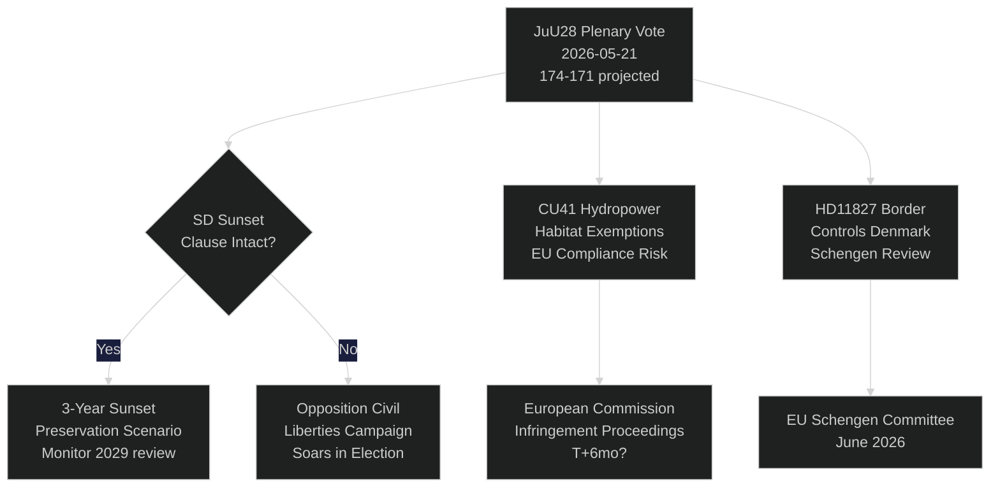

# 스웨덴 릭스다그, AI 경찰 감시 투표: 선거 115일 전 헌법적 순간

**저자**: Riksdagsmonitor Intelligence
**분류**: 공개 — GDPR 제9조(2)(e,g)
**신뢰 수준**: 높음 [A1] AI 경찰 분야 / 중간 [B2] 경제 주제
**날짜**: 2026-05-21
**주기**: realtime-pulse

---

## 🎯 BLUF(핵심 요약)

스웨덴 의회(릭스다그)는 오늘 **JuU28**에 관한 본회의 토론을 진행한다. 이는 법무위원회가 AI 기반 실시간 안면 인식 기술의 경찰 활용을 승인한 것으로, 북유럽 민주주의 국가에서 생체 인식 대규모 감시에 대한 최초의 입법적 허가를 의미한다. 스웨덴민주당(SD)이 3년간의 일몰 조항과 '예외적 상황' 기준을 포함하는 수정안을 제안한 후, 여당 블록은 174–171의 근소한 다수결로 법안을 통과시켰다. 이번 투표는 헌법적으로 중요한 의미를 가진다: 정부 형태법 제2조 제6항은 정치 활동 감시를 금지하고 있으며, JuU28은 법 집행 생체 인식에 대한 최초의 명시적 예외 조항을 만든다. 동시에 FiU40(펀드 시장 개혁), CU36(협력 지역 수수료법), CU41(수력 발전 서식지 면제)이 티데 연립 정부의 선거 전 입법 스프린트를 추진하고 있다. 3건의 질문이 균열 선을 드러낸다: 스웨덴 남부의 물 부족(S→L), 쇼핑 병원 폐쇄(S→KD), 헌법 개정(무소속 의원 위딩→M). 7건의 서면 질의는 대만 무기 판매, 티베트/중국 관계, 연금 신뢰, 덴마크와의 국경 통제, 드론 허가, 연금 보험, 트럭 주차장 안전을 다룬다.

## 🧭 이 보고서가 지원하는 3가지 결정 사항

| # | 결정 사항 | 관련성 | 기간 |
|---|---------|-------|------|
| 1 | JuU28에 대한 시민 사회의 법적 이의 제기 전략 | ECHR 제8조 프라이버시권 — 이의 제기 기간은 국가 원수 서명 시 시작 | T+14–90d |
| 2 | JuU28 채택 시 SD의 일몰 조항 집행에 관한 입장 추적 | SD가 새 정부 제안에서 집행을 약화시키면 SD의 시민 자유 입장 전환을 시사 | T+30–180d |
| 3 | 베스트만란드에서 KD/M에 대한 쇼핑 병원 폐쇄의 선거 리스크 평가 | 농촌 의료 접근 프레이밍으로 여당 블록은 베스트만란드에서 1~2석을 잃을 가능성 | T+60–115d |

## ⚡ 60초 요약

- **JuU28 AI 안면 인식** (HD01JuU28): 릭스다그, 3년 일몰 조항으로 실시간 생체 인식 경찰 감시 승인. S/V/MP 반대 투표. C/L은 시민 자유 우려에도 불구하고 여당 블록과 함께 찬성. 신뢰 수준: **높음** — 여당 블록은 174표를 보유.
- **FiU40 펀드 시장** (HD01FiU40): EU AIFMD II 및 UCITS VI에 따른 Finansinspektionen의 강화된 펀드 규제. 스웨덴 연금 저축자에게 기술적이지만 중요. 폭넓은 초당적 지지.
- **CU36 협력 지역** (HD01CU36): Business Improvement Districts를 위한 신규 수수료법; 도시들이 상업 거리 재생 도구 확보. M/KD/L/SD의 지지.
- **CU41 수력 발전과 서식지** (HD01CU41): 수력 발전 재허가 시 서식지 지침 면제. 녹색 정당이 강하게 반대. MJU가 EU 준수 위험 지적.
- **질문 HD10499** (물 부족): S, L 소속 기후 대행 장관 브리츠에게 스웨덴 남부 가뭄 관련 질문 — 기후 정책 격차를 농촌 생계와 직접 연결. 정부 답변 약 5월 28일 예상.
- **질문 HD10500** (쇼핑 병원): S의 Åsa Eriksson이 KD 사회 장관 포르스메드에게 병원 폐쇄 계획 관련 질문 — 베스트만란드 농촌 의료 접근. 답변 약 5월 28일 예상.
- **질문 HD10501** (헌법 개정): 무소속 의원 엘사 위딩이 M의 구나르 스트로메르에게 헌법 개혁 속도 관련 질문 — 릭스다그 정족수 규칙 및 기본법 개정 절차와 관련.
- **서면 질의 HD11822** (대만 무기 판매): SD의 비요른 소데르가 미국 정책 변화를 배경으로 잠재적 스웨덴 대만 무기 판매에 대해 외무장관에게 압력.
- **서면 질의 HD11827** (국경 통제): S의 Niklas Karlsson이 덴마크와의 국내 국경 통제 지속에 대해 스트로메르에게 질문 — 솅겐 협정 양립성 문제.

## 🔮 가장 중요한 미래 트리거

**JuU28에 대한 국가 원수 서명 (T+7–21d)**: 국왕/국가 원수 서명으로 14일간의 공개 이의 신청 기간이 시작된다. 서명 전에 스웨덴 행정 법원에 ECHR 제8조에 근거한 이의 신청이 접수될 경우 — 드물지만 가능 — 경찰 감시 프로그램은 9월 선거까지 법적으로 보류되어 선거 운동 기간 중 헌법적 위기 내러티브가 형성된다. P(30일 이내 이의 신청): ~25%. Datainspektionen/IMY 및 시민 사회 법률 NGO 모니터링.

<!-- source-sha: ef3bd4351fe4730460b79048a8a8aba4a52be1fb -->
