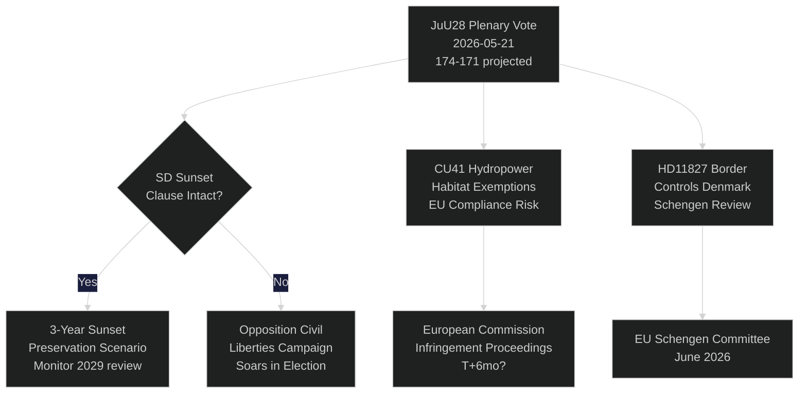

# Zweedse Riksdag stemt over AI-politiebewaking: Een constitutioneel moment 115 dagen voor de verkiezingen

**Auteur**: Riksdagsmonitor Intelligence
**Classificatie**: OPENBAAR — AVG Art. 9(2)(e,g)
**Betrouwbaarheidsniveau**: HOOG [A1] voor AI-politie / GEMIDDELD [B2] voor economische thema's
**Datum**: 2026-05-21
**Cyclus**: realtime-pulse

---

## 🎯 BLUF

Het Zweedse Riksdag houdt vandaag een plenair debat over **JuU28** — de goedkeuring door de Commissie Justitie van het gebruik door de politie van AI-gebaseerde gezichtsherkenning in realtime — wat de eerste wettelijke toestemming voor biometrische massabewaking in een Scandinavische democratie markeert. Het wetsvoorstel wordt aangenomen met een krap meerderheid van 174–171 van het regeringsblok, nadat SD het heeft gewijzigd om een driejarige zonsondergangsbepaling en een drempel voor "uitzonderlijke omstandigheden" op te nemen. De stemming is constitutioneel van belang: Artikel 2:6 van de Regeringsvorm verbiedt bewaking van politieke activiteit; JuU28 creëert de eerste expliciete uitzondering voor biometrie bij de wetshandhaving. Tegelijkertijd bevorderen FiU40 (hervorming fondsenmarkt), CU36 (wet op bijdragen voor samenwerkingsgebieden) en CU41 (uitzonderingen voor waterenergie en habitats) de voorverkiezingswetgevingssprint van de Tidö-coalitie. Drie interpellaties leggen breuklijnen bloot: waterschaarste in Zuid-Zweden (S → L), sluiting van het ziekenhuis in Köping (S → KD) en grondwetswijziging (onafhankelijk Kamerlid Widding → M). Zeven schriftelijke vragen onderzoeken wapenverkopen aan Taiwan, Tibet/China-betrekkingen, pensioenvertrouwen, grenscontroles met Denemarken, dronetoestemmingen, pensioenverzekering en veiligheid op vrachtwagenparkeerplaatsen.

## 🧭 3 Besluiten die dit briefing ondersteunt

| # | Besluit | Relevantie | Horizon |
|---|---------|------------|---------|
| 1 | Strategie van het maatschappelijk middenveld voor juridische aanvechting van JuU28 | EVRM Artikel 8 recht op privacy — aanvechtingsvenster opent bij ondertekening door staatshoofd | T+14–90d |
| 2 | Positie van SD volgen over de handhaving van de zonsondergangsbepaling als JuU28 wordt aangenomen | Als SD later de handhaving verzwakt in een nieuwe regeringsproposita, signaleert dit een verschuiving in SDs standpunt over burgerrechten | T+30–180d |
| 3 | Sluiting ziekenhuis Köping beoordelen als campagnerisico voor KD/M in Västmanland | De framing van toegang tot gezondheidszorg in landelijke gebieden kan het regeringsblok 1-2 zetels in het Riksdag in Västmanland kosten | T+60–115d |

## ⚡ 60-seconden samenvatting

- **JuU28 AI-gezichtsherkenning** (HD01JuU28): Riksdag keurt biometrische politiebewaking in realtime goed met driejarige zonsondergangsbepaling. S/V/MP stemden tegen. C/L stemden mee met het regeringsblok ondanks bezwaren over burgerrechten. Betrouwbaarheidsniveau: **HOOG** — het regeringsblok heeft 174 stemmen.
- **FiU40 Fondsenmarkt** (HD01FiU40): Versterkte Finansinspektionen-fondsregulering in lijn met EU AIFMD II en UCITS VI. Technisch maar belangrijk voor Zweedse pensioenspaarders. Brede partijoverstijgende steun.
- **CU36 Samenwerkingsgebieden** (HD01CU36): Nieuwe bijdragewet voor Business Improvement Districts; steden krijgen een instrument voor regeneratie van winkelgebieden. Steun van M/KD/L/SD.
- **CU41 Waterkracht en habitats** (HD01CU41): Uitzonderingen op de habitatrichtlijn bij de hervergunning van waterkracht. De groene partijen zijn sterk tegen. EU-nalevingsrisico is gemeld door het MJU.
- **Interpellatie HD10499** (Waterschaarste): S daagt waarnemend klimaatminister Britz (L) uit over droogte in Zuid-Zweden — koppelt direct het klimaatbeleidstekort aan landelijke bestaansmiddelen. Regeringsantwoord verwacht ~28 mei.
- **Interpellatie HD10500** (Ziekenhuis Köping): Åsa Eriksson (S) daagt KD-sociaalminister Forssmed uit over plannen voor ziekenhuissluiting — toegang tot gezondheidszorg in het landelijke Västmanland. Antwoord verwacht ~28 mei.
- **Interpellatie HD10501** (Grondwetswijziging): Onafhankelijk Kamerlid Elsa Widding daagt Gunnar Strömmer (M) uit over het tempo van de grondwetsrevormen — raakt aan quorumregels van het Riksdag en procedures voor wijziging van de grondwet.
- **Schriftelijke vraag HD11822** (Wapenverkopen aan Taiwan): Björn Söder (SD) dringt bij de minister van Buitenlandse Zaken aan op mogelijke Zweedse wapenverkopen aan Taiwan in het licht van de veranderde Amerikaanse beleid.
- **Schriftelijke vraag HD11827** (Grenscontroles): Niklas Karlsson (S) daagt Strömmer uit over aanhoudende binnenlandse grenscontroles met Denemarken — vraagstuk van Schengen-compatibiliteit.

## 🔮 Belangrijkste toekomstige trigger

**Ondertekening JuU28 door staatshoofd (T+7–21d)**: Koninklijke/staatshoofdondertekening activeert een 14-daagse publieke aanvechtingsperiode. Als een EVRM-Artikel-8-aanvechting bij de Zweedse bestuursrechter wordt ingediend vóór ondertekening — zeldzaam maar mogelijk — wordt het politiebewakingsprogramma juridisch on hold gezet tot de verkiezingen in september, wat een narratief van een constitutionele crisis in de campagneperiode creëert. P(aanvechting binnen 30d): ~25 %. Datainspektionen/IMY en juridische NGO's van het maatschappelijk middenveld monitoren.

<!-- source-sha: ef3bd4351fe4730460b79048a8a8aba4a52be1fb -->
