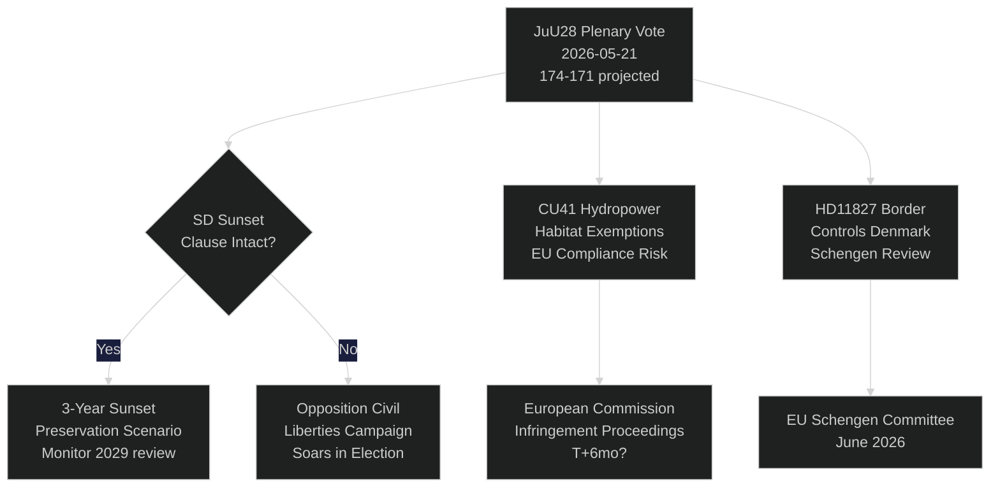

# Sveriges riksdag stemmer om AI-politiövervåking: Et konstitusjonelt øyeblikk 115 dager før valget

**Forfatter**: Riksdagsmonitor Intelligence
**Klassifisering**: OFFENTLIG — GDPR Art. 9(2)(e,g)
**Konfidensnivå**: HØY [A1] for AI-politi / MEDIUM [B2] for økonomiske temaer
**Dato**: 2026-05-21
**Syklus**: realtime-pulse

---

## 🎯 BLUF

Sveriges riksdag avholder i dag plenumdebatt om **JuU28** — justiskomiteen sitt godkjenning av politiets bruk av AI-basert ansiktsgjenkjenning i sanntid — noe som markerer den første lovgivende godkjenningen av biometrisk masseovervåking i et nordisk demokrati. Lovforslaget vedtas med et knapp 174–171 flertall fra regjeringsblokkens side etter at SD endret det til å inkludere en treårig solnedgangsklausul og en terskel for «ekstraordinære omstendigheter». Avstemningen er konstitusjonelt viktig: Artikkel 2:6 i Regeringsformen forbyr overvåking av politisk virksomhet; JuU28 oppretter det første uttrykkelige unntaket for biometri innen rettshåndhevelse. Samtidig fremmes FiU40 (fondmarkedsreform), CU36 (lov om gebyrer for samarbeidsområder) og CU41 (unntak for vannkraft og naturtyper) i Tidö-koalisjonen sin lovgivningssprint foran valget. Tre interpellasjoner avslører bruddlinjer: vannmangel i Sør-Sverige (S → L), Köping sykehus nedleggelse (S → KD) og konstitusjonell endring (uavhengig MP Widding → M). Syv skriftlige spørsmål undersøker våpensalg til Taiwan, Tibet/Kina-relasjoner, pensjonstillitt, grensekontroller med Danmark, dronetillatelser, pensjonsforsikring og sikkerhet på lastebilparkeringer.

## 🧭 3 Beslutninger dette briefing støtter

| # | Beslutning | Relevans | Horisont |
|---|------------|----------|----------|
| 1 | Sivilsamfunnets strategi for rettslig utfordring av JuU28 | ECHR Artikkel 8 retten til privatliv — utfordringsvinduet åpner ved statsoverhodeunderskrift | T+14–90d |
| 2 | Følg SDs posisjon på håndhevelsen av solnedgangsklausulen hvis JuU28 vedtas | Hvis SD etterpå svekker håndhevelsen i et nytt regjeringsforslag, signaliserer det et skifte i SDs sivilrettslige holdning | T+30–180d |
| 3 | Vurder Köping sykehus nedleggelse som kampanjerisiko for KD/M i Västmanland | Innramming av helsetilgang i distriktene kan koste regjeringsblokkens 1–2 riksdagsplasser i Västmanland | T+60–115d |

## ⚡ 60-sekunders lesing

- **JuU28 AI-ansiktsgjenkjenning** (HD01JuU28): Riksdagen godkjenner biometrisk politiövervåking i sanntid med treårig solnedgangsklausul. S/V/MP stemte imot. C/L stemte med regjeringsblokkens til tross for forbehold om sivile friheter. Konfidensnivå: **HØY** — regjeringsblokkens har 174 stemmer.
- **FiU40 Fondmarked** (HD01FiU40): Styrket Finansinspektionen fondregulering i tråd med EU AIFMD II og UCITS VI. Teknisk, men viktig for svenske pensjonssparere. Bred tverrpolitisk støtte.
- **CU36 Samarbeidsområder** (HD01CU36): Ny gebyrlov for Business Improvement Districts; byer får et verktøy for å revitalisere handelsgater. Støtte fra M/KD/L/SD.
- **CU41 Vannkraft og naturtyper** (HD01CU41): Unntak fra habitatdirektivet ved fornying av vannkrafttillatelser. De grønne partiene er sterkt imot. EU-samsvarrisikoën er flagget av MJU.
- **Interpellasjon HD10499** (Vannmangel): S utfordrer fungerende klimaminister Britz (L) om tørke i Sør-Sverige — knytter direkte klimapolitisk manko til landlige levebrød. Regjeringssvar forventes ~28. mai.
- **Interpellasjon HD10500** (Köping sykehus): S's Åsa Eriksson utfordrer KD's sosialminister Forssmed om planer om sykehusnedleggelse — helsetilgang i landlige Västmanland. Svar forventes ~28. mai.
- **Interpellasjon HD10501** (Konstitusjonell endring): Uavhengig MP Elsa Widding utfordrer M's Gunnar Strömmer om tempoet i grunnlovsreformer — berører Riksdagens beslutningsdyktighet og prosedyrer for endring av grunnloven.
- **Skriftlig spørsmål HD11822** (Våpensalg til Taiwan): SDs Björn Söder presser utenriksministeren om potensielle svenske våpensalg til Taiwan i lys av den amerikanske policyendringen.
- **Skriftlig spørsmål HD11827** (Grensekontroller): S's Niklas Karlsson utfordrer Strömmer om fortsatte indre grensekontroller med Danmark — Schengen-forenlighetsspørsmål.

## 🔮 Viktigste fremtidsutløser

**JuU28 statsoverhodeunderskrift (T+7–21d)**: Kongelig/statsoverhodeunderskrift aktiverer et 14-dagers offentlig klagefrist. Hvis en ECHR Artikkel 8-utfordring innleveres til svensk forvaltningsdomstol før underskriften — sjelden, men mulig — settes politiövervåkingsprogrammet på juridisk vent frem til septembervalget, noe som skaper en valgkampanarrativ om konstitusjonell krise. P(utfordring innen 30d): ~25 %. Overvåk Datainspektionen/IMY og sivile samfunnets juridiske NGO-er.

<!-- source-sha: ef3bd4351fe4730460b79048a8a8aba4a52be1fb -->
