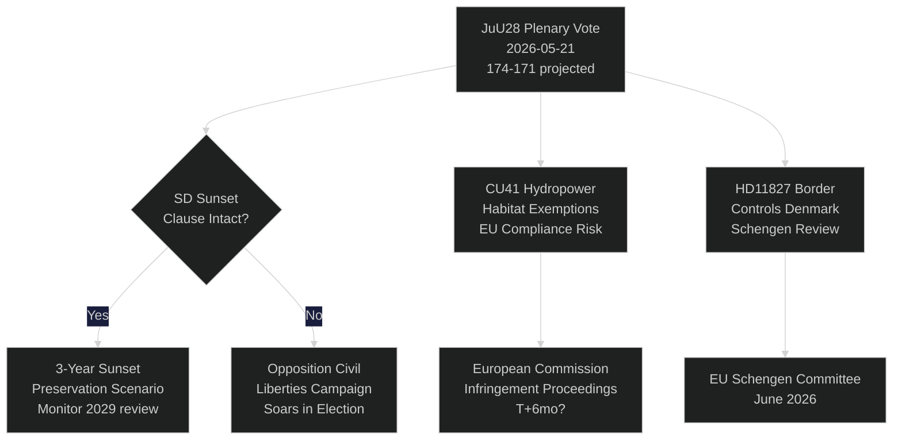

# Sveriges riksdag röstar om AI-polisövervakning: Ett konstitutionellt ögonblick 115 dagar före valet

**Författare**: Riksdagsmonitor Intelligence
**Klassificering**: OFFENTLIG — GDPR Art. 9(2)(e,g)
**Konfidensgrad**: HÖG [A1] för AI-polisiering / MEDIUM [B2] för ekonomiska teman
**Datum**: 2026-05-21
**Cykel**: realtime-pulse

---

## 🎯 BLUF

Sveriges riksdag håller idag plenumdebatt om **JuU28** — justitieutskottets godkännande av polisens användning av AI-baserad ansiktsigenkänning i realtid — vilket markerar det första lagstiftande tillståndet för biometrisk masssövervakning i en nordisk demokrati. Propositionen antas med en knapp 174–171 rösters majoritet från det styrande blocket efter att SD ändrat den till att inkludera en treårig solnedgångsklausul och ett tröskelvillkor för "exceptionella omständigheter". Omröstningen är konstitutionellt betydelsefull: Artikel 2:6 i regeringsformen förbjuder övervakning av politisk aktivitet; JuU28 skapar den första uttryckliga undantagsregeln för biometri inom brottsbekämpning. Samtidigt avancerar FiU40 (fondmarknadsreform), CU36 (lag om avgifter för samarbetsområden) och CU41 (undantag för vattenkraft och livsmiljöer) Tidökoalitionens lagstiftningssprint inför valet. Tre interpellationer blottlägger sprickor: vattenbrist i södra Sverige (S → L), Köpings sjukhus stängning (S → KD) och konstitutionell förändring (fristående MP Widding → M). Sju skriftliga frågor granskar vapenförsäljning till Taiwan, Tibet/Kina-relationer, pensionsförtroende, gränskontroller med Danmark, drönartillstånd, pensionsförsäkring och säkerhet på lastbilsparkeringar.

## 🧭 3 Beslut som detta briefing stöder

| # | Beslut | Relevans | Horisont |
|---|--------|----------|----------|
| 1 | Det civila samhällets strategi för rättslig utmaning mot JuU28 | ECHR Artikel 8 rätten till privatliv — utmaningsfönstret öppnas vid statschefens underskrift | T+14–90d |
| 2 | Följ SD:s position om solnedgångsklausulens tillämpning om JuU28 antas | Om SD senare försvagar tillämpningen i en ny regeringsproposition signalerar det ett skifte i SD:s ställningstagande avseende medborgerliga friheter | T+30–180d |
| 3 | Bedöm Köpings sjukhus stängning som kampanjerisik för KD/M i Västmanland | Inramningen kring vård i glesbygd kan kosta det styrande blocket 1–2 riksdagsmandat i Västmanland | T+60–115d |

## ⚡ 60-sekunders läsning

- **JuU28 AI-ansiktsigenkänning** (HD01JuU28): Riksdagen godkänner biometrisk polisövervakning i realtid med treårig solnedgångsklausul. S/V/MP röstade emot. C/L röstade med det styrande blocket trots reservationer om medborgerliga friheter. Konfidensgrad: **HÖG** — det styrande blocket har 174 röster.
- **FiU40 Fondmarknad** (HD01FiU40): Stärkt Finansinspektionens fondreglering i linje med EU AIFMD II och UCITS VI. Tekniskt men väsentligt för svenska pensionssparare. Brett stöd över partigränserna.
- **CU36 Samarbetsområden** (HD01CU36): Ny avgiftslag för Business Improvement Districts; städerna får ett verktyg för att förnya handelsstråk. Stöd hos M/KD/L/SD.
- **CU41 Vattenkraft och livsmiljöer** (HD01CU41): Undantag från habitatdirektivet vid omtillståndsgivning för vattenkraft. De gröna partierna är starkt emot. Risken för EU-bristande efterlevnad har flaggats av MJU.
- **Interpellation HD10499** (Vattenbrist): S utmanar tillförordnad klimatminister Britz (L) om torka i södra Sverige — kopplar direkt klimatpolitisk lucka till landsbygdsnäringar. Regeringssvar förväntas ~28 maj.
- **Interpellation HD10500** (Köpings sjukhus): S:s Åsa Eriksson utmanar KD:s socialminister Forssmed om planer på sjukhusnedläggning — vård i glesbygden Västmanland. Svar förväntas ~28 maj.
- **Interpellation HD10501** (Konstitutionell förändring): Fristående riksdagsledamot Elsa Widding utmanar M:s Gunnar Strömmer om tempot i grundlagsreformer — berör riksdagens beslutsförhetslighet och procedurer för grundlagsändringar.
- **Skriftlig fråga HD11822** (Vapenförsäljning till Taiwan): SD:s Björn Söder pressar utrikesministern om potentiell svensk vapenförsäljning till Taiwan i ljuset av USA:s policyförändring.
- **Skriftlig fråga HD11827** (Gränskontroller): S:s Niklas Karlsson utmanar Strömmer om fortsatta inre gränskontroller mot Danmark — fråga om Schengenförenlighet.

## 🔮 Viktigaste framåtutlösaren

**JuU28 statschefens underskrift (T+7–21d)**: Kunglig/statschefens underskrift aktiverar ett 14-dagars offentligt överklagningsfönster. Om en ECHR Artikel 8-utmaning lämnas in till svensk förvaltningsdomstol före underskriften — sällsynt men möjligt — sätts polisövervakningsprogrammet på juridiskt is fram till valet i september, vilket skapar ett narrativ om en konstitutionell kris under valkampanjen. P(utmaning inom 30d): ~25 %. Bevaka Datainspektionen/IMY och civila samhällets juridiska NGO:er.

<!-- source-sha: ef3bd4351fe4730460b79048a8a8aba4a52be1fb -->
