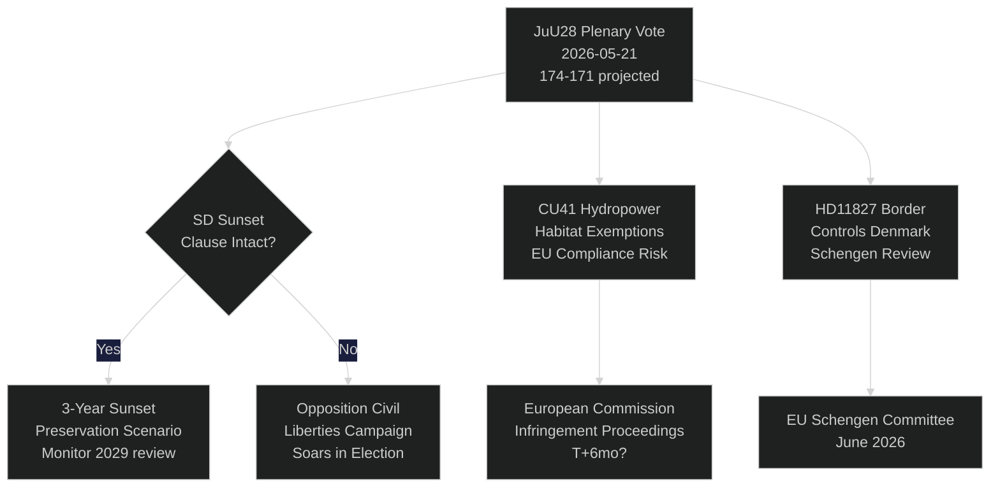

# 瑞典议会对AI警察监控进行投票：距选举115天的宪法时刻

**作者**: Riksdagsmonitor Intelligence
**分类**: 公开 — GDPR第9条(2)(e,g)
**置信度**: 高 [A1] AI警察领域 / 中 [B2] 经济主题
**日期**: 2026-05-21
**周期**: realtime-pulse

---

## 🎯 核心结论（BLUF）

瑞典议会（riksdagen）今日就**JuU28**举行全体讨论，这是司法委员会批准警方使用AI实时人脸识别技术的提案，标志着北欧民主国家在生物特征大规模监控方面首次获得立法授权。在瑞典民主党（SD）提议纳入三年日落条款和"例外情况"门槛的修正案后，执政联盟以174比171的微弱多数通过了该法案。此次投票具有重大宪法意义：政府形式法第2章第6条禁止监控政治活动，而JuU28将为执法生物识别创建首个明确例外条款。与此同时，FiU40（基金市场改革）、CU36（合作区收费法）、CU41（水电生境豁免）正推动蒂德联合政府的选前立法冲刺。三次质询揭示了裂痕：瑞典南部缺水（S→L）、舍平医院关闭（S→KD）、宪法改革（无党派议员维丁→M）。7份书面质询涉及对台军售、西藏/中国关系、养老金信任度、与丹麦的边境管控、无人机许可、养老金保险和卡车停车场安全。

## 🧭 本报告支持的三项决策

| # | 决策事项 | 相关性 | 时间范围 |
|---|---------|-------|---------|
| 1 | 公民社会针对JuU28的法律挑战策略 | 欧洲人权公约第8条隐私权 — 异议期从国家元首签署时开始 | T+14–90d |
| 2 | JuU28通过后追踪SD对日落条款执行的立场 | 若SD在新政府提案中弱化执行，则表明SD在公民自由立场上的转变 | T+30–180d |
| 3 | 评估舍平医院关闭对KD/M在西曼兰省的选举风险 | 农村医疗可及性的议题框架可能使执政联盟在西曼兰省失去1-2个席位 | T+60–115d |

## ⚡ 60秒速读

- **JuU28 AI人脸识别** (HD01JuU28)：瑞典议会批准带有3年日落条款的实时生物特征警察监控。S/V/MP投反对票。C/L尽管有公民自由方面的顾虑，仍与执政联盟一同投赞成票。置信度：**高** — 执政联盟拥有174票。
- **FiU40 基金市场** (HD01FiU40)：Finansinspektionen根据EU AIFMD II和UCITS VI加强基金监管。对瑞典养老金储蓄者而言虽属技术性但意义重大。获得广泛跨党派支持。
- **CU36 合作区** (HD01CU36)：商业改善区新收费法；城市获得商业街道振兴工具。获M/KD/L/SD支持。
- **CU41 水电与生境** (HD01CU41)：水电重新许可中豁免栖息地指令。绿党强烈反对。MJU指出EU合规风险。
- **质询 HD10499**（缺水）：S向L籍代理气候部长布里茨就瑞典南部干旱问题发起质询 — 将气候政策缺口与农村生计直接挂钩。政府回复预计约5月28日。
- **质询 HD10500**（舍平医院）：S的Åsa Eriksson就医院关闭计划质询KD社会部长福斯梅德 — 西曼兰省农村医疗可及性。回复约5月28日。
- **质询 HD10501**（宪法改革）：无党派议员埃尔萨·维丁就宪法改革进度质询M的贡纳尔·斯特罗默尔 — 涉及议会法定人数规则和基本法修订程序。
- **书面质询 HD11822**（对台军售）：SD的比约恩·塞德尔在美国政策转变背景下就潜在的瑞典对台军售向外交部长施压。
- **书面质询 HD11827**（边境管控）：S的Niklas Karlsson就继续对丹麦实施国内边境管控向斯特罗默尔质询 — 申根协定兼容性问题。

## 🔮 最重要的未来触发因素

**JuU28的国家元首签署 (T+7–21d)**：国王/国家元首签署将开启14天公开异议期。若在签署前有申请人向瑞典行政法院提出基于欧洲人权公约第8条的诉讼 — 罕见但可能 — 警察监控项目将在法律上被暂停至九月选举，在竞选期间形成宪法危机叙事。P（30天内提出异议）：约25%。关注Datainspektionen/IMY及公民社会法律NGO。

<!-- source-sha: ef3bd4351fe4730460b79048a8a8aba4a52be1fb -->
