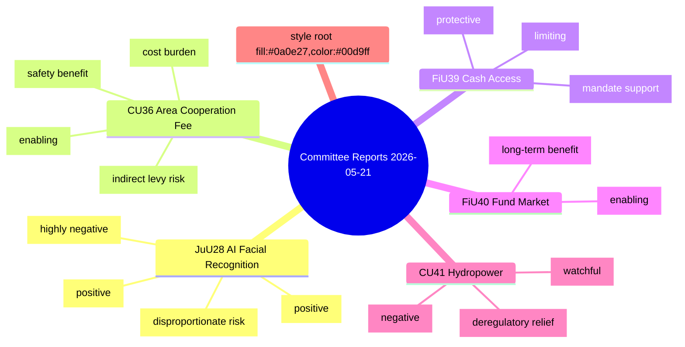

# Classification Results — Committee Reports 2026-05-22

**Framework**: Political Classification Guide — multi-axis taxonomy
**Date**: 2026-05-22 | **Analyst**: James Pether Sörling

---

## Multi-Axis Classification

### Primary Policy Domain

| dok_id | Domain | Sub-domain | Source |
|--------|--------|-----------|--------|
| HD01JuU28 (https://data.riksdagen.se/dokument/HD01JuU28) | Security & Justice | AI-enabled law enforcement / civil liberties | JuU betänkande 2025/26 |
| HD01CU36 (https://data.riksdagen.se/dokument/HD01CU36) | Housing & Urban Development | Urban safety governance / property law | CU betänkande 2025/26 |
| HD01CU41 (https://data.riksdagen.se/dokument/HD01CU41) | Energy & Environment | Hydropower licensing / EU habitats law | CU betänkande 2025/26 |
| HD01FiU39 (https://data.riksdagen.se/dokument/HD01FiU39) | Finance & Banking | Cash access / payment infrastructure | FiU betänkande 2025/26 |
| HD01FiU40 (https://data.riksdagen.se/dokument/HD01FiU40) | Finance & Banking | Investment funds / Capital Markets Union | FiU betänkande 2025/26 |

### Ideological Positioning

| dok_id | Left-Right axis | Authoritarian-Liberal axis | EU-integration axis |
|--------|-----------------|---------------------------|---------------------|
| HD01JuU28 | Right-leaning (state power expansion) | Authoritarian (surveillance tool) | EU-compliant (Article 5 implementation) |
| HD01CU36 | Right-leaning (market mechanism for safety) | Mildly authoritarian (mandatory levy) | Neutral |
| HD01CU41 | Right-leaning (industry over environment) | Neutral | EU-derogation (pushes back on habitats directive) |
| HD01FiU39 | Left-leaning element (financial inclusion) | Neutral | EU-aligned (PSD2 ecosystem) |
| HD01FiU40 | Right-leaning (capital market deepening) | Neutral | EU-aligned (CMU) |

### Legislative Type Classification

| dok_id | Type | Scope | Duration |
|--------|------|-------|----------|
| HD01JuU28 | New framework law | National | Permanent (with review clause) |
| HD01CU36 | New enabling law | Municipal/urban | Permanent |
| HD01CU41 | EU directive derogation | National/EU | Linked to hydropower licensing period |
| HD01FiU39 | Regulatory strengthening | National | Permanent |
| HD01FiU40 | Market regulation | National/EU | Permanent |

### Constituency Impact Matrix

### GDPR Art. 9 Classification

| dok_id | Special category data? | Legal basis | Data minimisation required |
|--------|----------------------|-------------|--------------------------|
| HD01JuU28 | YES — biometric data (Art. 9(1)) | Art. 9(2)(g) substantial public interest; national law (new lag) | Yes — strict proportionality; authorisation mechanism |
| HD01CU36 | No | N/A | N/A |
| HD01FiU39–40 | No | N/A | N/A |
| HD01CU41 | No | N/A | N/A |

**GDPR Note**: HD01JuU28 processes biometric data under Art. 9(2)(g) with the new national law as the legal basis. Law enforcement exemptions under LED (Law Enforcement Directive 2016/680) also apply. Any DPIA (Data Protection Impact Assessment) must confirm: necessity, proportionality, and safeguards including DPO consultation per GDPR Art. 35(10).
