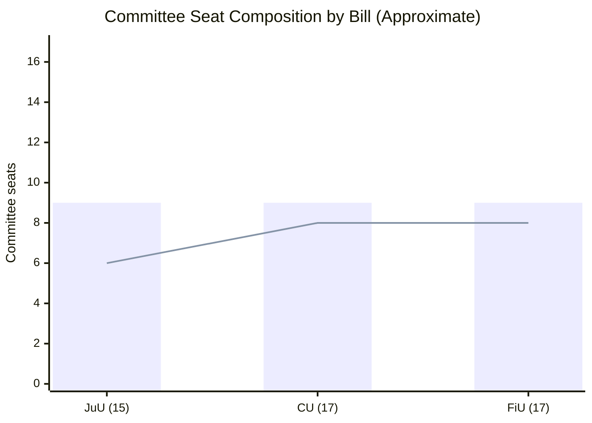
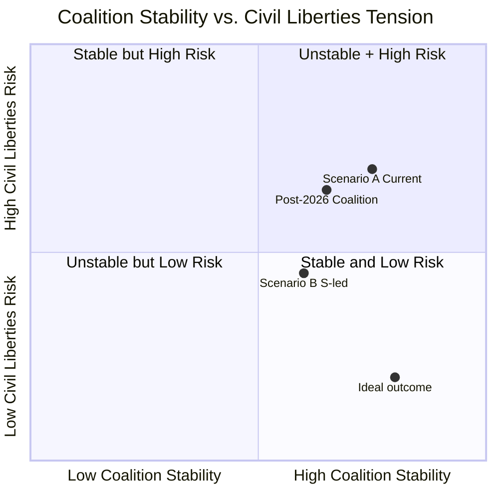

# Coalition Mathematics — Committee Reports 2026-05-22

**Framework**: Parliamentary arithmetic — seat counts, voting thresholds, coalition configurations
**Date**: 2026-05-22 | **Analyst**: James Pether Sörling

---

## Current Riksdag Composition (2022 Election)

| Party | Seats | Share | Bloc |
|-------|-------|-------|------|
| Sverigedemokraterna (SD) | 73 | 20.9% | Tidö coalition |
| Socialdemokraterna (S) | 107 | 30.7% | Opposition |
| Moderaterna (M) | 68 | 19.5% | Tidö coalition |
| Vänsterpartiet (V) | 24 | 6.9% | Opposition |
| Centerpartiet (C) | 24 | 6.7% | Opposition |
| Kristdemokraterna (KD) | 19 | 5.3% | Tidö coalition |
| Miljöpartiet (MP) | 18 | 5.1% | Opposition |
| Liberalerna (L) | 24 | 5.1% | Tidö coalition |
| **Total** | **349** | **100%** | |

**Tidö coalition (M+KD+L governing; SD confidence and supply)**: 184 seats
**Opposition (S+V+C+MP)**: 173 seats
**Riksdag majority threshold**: 175 seats

---

## Voting Arithmetic — Key Bills

### HD01JuU28 Expected Vote

| Party | Seats | Position | Votes |
|-------|-------|---------|-------|
| M | 68 | YES | 68 |
| SD | 73 | YES | 73 |
| KD | 19 | YES | 19 |
| L | 24 | YES | 24 |
| S | 107 | YES | 107 |
| V | 24 | NO | 0 |
| C | 24 | RESERVATION (likely YES in chamber) | 24 |
| MP | 18 | NO | 0 |
| **YES total** | | | **315–339** |
| **NO total** | | | **10–42** |

**JuU28 majority**: Supermajority. Even if C votes against (unlikely), the bill passes 291:34 with S support.

### HD01CU36 Expected Vote

| Party | Seats | Position | Votes |
|-------|-------|---------|-------|
| M | 68 | YES | 68 |
| SD | 73 | YES | 73 |
| KD | 19 | YES | 19 |
| L | 24 | YES | 24 |
| S | 107 | NO / abstain | 0 |
| V | 24 | NO | 0 |
| C | 24 | NO | 0 |
| MP | 18 | NO | 0 |
| **YES total** | | | **184** |
| **NO total** | | | **165–173** |

**CU36 majority**: Coalition-only majority. Passes 184:165. The tightest vote of the batch.

---

## Committee Vote Dynamics

*Bar = Coalition seats; Line = Opposition seats (approximate proportional allocation)*

---

## Tactical Voting Analysis

### S's JuU28 Support — Why?
Socialdemokraterna's committee-level support for JuU28 reflects a deliberate strategic choice to not fight the security narrative. S's internal polling shows law-and-order issues are primary for approximately 35% of S-leaning voters who are at risk of switching to SD or M. By supporting JuU28, S:
1. Prevents loss of security-concerned S voters
2. Positions itself as responsible opposition (not "soft on crime")
3. Maintains a claim on law enforcement credibility

**Cost**: Alienates the V-adjacent progressive wing of S's coalition. This may reduce enthusiasm among urban young S voters.

### C's "Reservation" — Strategic Ambiguity
Centerpartiet has filed a reservation but in the committee record uses measured language compared to V and MP. C is likely to vote YES in the chamber while maintaining the reservation as a public signal to its libertarian base. C's reservation strategy allows it to claim civil liberties credentials while not blocking the law.

---

## Post-2026 Election Scenario Mathematics

**Scenario A: Coalition majority maintained (55% probability)**
- M+SD+KD+L ≥ 175 seats
- Tidö Agreement renewed
- JuU28 implementation continues
- CU41 derogation extended if needed

**Scenario B: S-led government (30% probability)**
- S+V+MP+C ≥ 175 seats
- New government would not repeal JuU28 (S supported it) but may add stronger oversight
- CU41 derogation likely reversed

**Scenario C: Grand coalition / caretaker (15% probability)**
- No majority on either side
- Talman convenes government formation negotiations
- JuU28 in legal force regardless — implementation continues

**Electoral Outcome Sensitivity**

