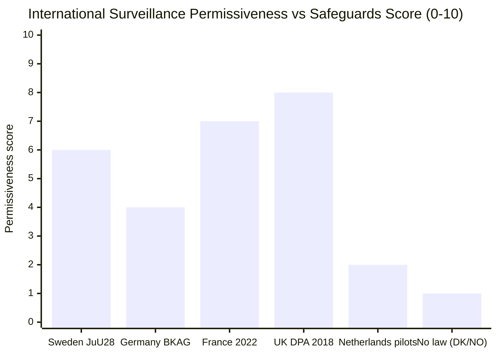

# Comparative International Analysis — Committee Reports 2026-05-22

**Framework**: Multi-jurisdiction comparison — AI surveillance law, urban BID finance, cash policy
**Date**: 2026-05-22 | **Analyst**: James Pether Sörling

---

## Facial Recognition Legislation — International Comparison Matrix

| Jurisdiction | Law/Framework | Real-time use allowed? | Safeguards | Entry into force | Source |
|-------------|--------------|----------------------|------------|-----------------|--------|
| **Sweden (JuU28)** | New national law implementing EU AI Act Art. 5.1(h) | YES — serious crime only; pre-authorisation required | Prosecutor/court pre-auth; 24h emergency window; IMY oversight | 2026-07-01 | HD01JuU28 |
| **Germany** | BKAG §9a (2022) | YES — terrorist threat + pre-judicial auth | Federal court order required; strict proportionality; BfDI audit | 2022 (limited to BKA) | BKAG 2021 amendment |
| **France** | Loi sur la sécurité globale 2022 + AI Act transposition | YES — Olympic Act 2023 extended for events; permanent law pending | Préfecture authorisation; CNIL oversight | 2023 (extended for 2024 Olympics) | Loi 2022-52 |
| **Netherlands** | AI Act direct application; police experimental pilots | Limited pilots only; no permanent enabling law | Parliamentary oversight required | Pending national law | TK 2024 |
| **United Kingdom** | Post-Brexit: Surveillance Camera Code + Data Protection Act 2018 | YES — operational use by Met Police and South Wales Police | ICO guidance; Surveillance Camera Commissioner; judicial review | Operational since 2020 | DPA 2018 |
| **United States** | Patchwork: federal (no law); state bans (CA, MA, IL, TX) | Varies by jurisdiction | State-level bans in major cities; ACLU litigation | No federal framework | Various |

**Assessment**: Sweden's JuU28 is stricter than the UK's framework (requiring pre-authorisation vs. UK operational code of practice) but less restrictive than Germany's BKA-only approach. Sweden leads Nordic neighbours (Norway and Denmark lack equivalent enabling laws) which creates potential Nordic cross-border operational cooperation gap.

---

## Urban Business Improvement Districts — International Comparison

| Jurisdiction | Legal model | Mandatory levy? | Democratic procedure | Year introduced | Source |
|-------------|------------|----------------|---------------------|----------------|--------|
| **Sweden (CU36)** | Area cooperation fee — new law | YES — designated zones | Municipal council designation + 60% property owner support threshold | 2026 (proposed) | HD01CU36 |
| **United Kingdom** | BID (Business Improvement District) Act 2003 | YES — after 50%+ ballot | Local authority ballot | 2003 | BID Regulations 2004 |
| **United States** | Business Improvement District (varies by state) | YES — property tax | City council ordinance + property owner vote | 1970s–present | NYC BID Act 1982 |
| **Germany** | PEBB (2004, Hamburg) / BID model varies by Bundesland | YES in Hamburg etc | State law; property owner ballot | 2004 (Hamburg) | HmbBIDG 2004 |
| **Denmark** | Frivillig Byfornyelsesfond (voluntary) | NO — voluntary | Self-organising | N/A | N/A |
| **Norway** | Sentrumsamarbeid (voluntary partnership model) | NO — voluntary | Self-organising | N/A | N/A |

**Assessment**: Sweden's CU36 model closely follows the UK BID model but adds a 60% property owner threshold higher than the UK's 50% + 1 ballot requirement, making designation harder but more legitimate. Sweden diverges from Nordic neighbours Denmark and Norway which use voluntary models — CU36 represents a deliberate choice of the coercive British model over Nordic voluntarism.

---

## Cash Access Legislation — International Comparison

| Jurisdiction | Approach | Bank obligation? | Retailer obligation? | Year | Source |
|-------------|---------|-----------------|---------------------|------|--------|
| **Sweden (FiU39)** | Mandatory cash functionality law | YES — all major banks | YES — thresholds | 2026 | HD01FiU39 |
| **Norway** | Payment Services Act 2021 — right to use cash | YES | YES (exceptions) | 2021 | Betalingsloven |
| **Denmark** | Cash acceptance obligation relaxed 2022 | Limited | Exemptions broad | 2022 | Betalingslovens §81 |
| **Germany** | No mandatory acceptance law; ECB cash policy | ECB policy only | No legal obligation | N/A | N/A |
| **EU** | Proposal for Euro Legal Tender Regulation (COM/2023/364) | Pending | Pending | Pending | COM(2023) 364 |

**Assessment**: Sweden's FiU39 aligns closely with Norway's 2021 approach and is notably stricter than Denmark's relaxed stance. The EU legal tender regulation, when enacted, may create harmonisation pressure that FiU39 will need to accommodate.

---

## Synthesis Table

| Country | Permissiveness (0–10) | Safeguards (0–10) | Net Civil Liberties risk |
|---------|----------------------|-------------------|-----------------------|
| Sweden (JuU28) | 6 | 7 | Low-medium |
| Germany (BKAG) | 4 | 9 | Low |
| France (2022) | 7 | 6 | Medium |
| UK (DPA 2018) | 8 | 5 | Medium-high |
| Netherlands (pilots) | 2 | 8 | Very low |
| Nordic (no law) | 1 | N/A | Very low |
