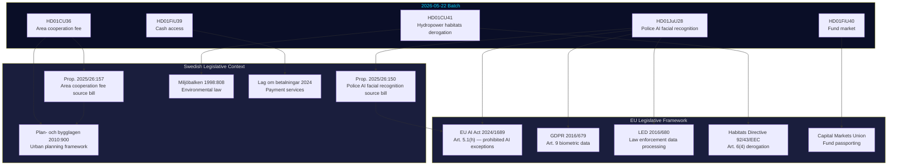
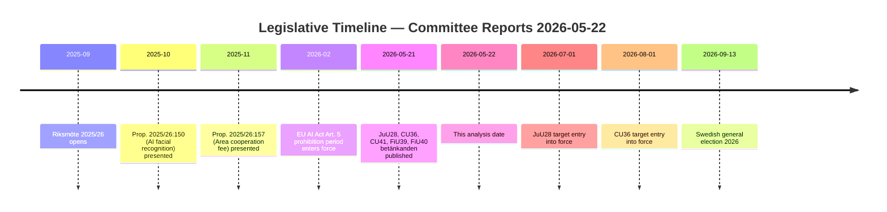

# Cross-Reference Map — Committee Reports 2026-05-22

**Framework**: Intra-batch and external legislative cross-references
**Date**: 2026-05-22 | **Analyst**: James Pether Sörling

---

## Document Cluster Topology

---

## Intra-Batch Cross-References

| Source Doc | References | Nature of Reference |
|-----------|-----------|---------------------|
| HD01JuU28 | HD01FiU39 (indirect) | Both invoke digital infrastructure security argument; complementary in coalition security narrative |
| HD01CU36 | HD01CU41 (thematic) | Both address regulation of private property rights for public benefit — complementary constitutional analysis |
| HD01FiU39 | HD01FiU40 | Both under FiU jurisdiction; thematic link via financial infrastructure resilience |
| HD01JuU28 | HD01CU36 | Shared political dynamic: governing coalition majority, all-opposition reservations (JuU28 nearly, CU36 fully) |

---

## External Legislative Cross-References

### HD01JuU28 → EU AI Act 2024/1689
- **Article 5.1(h)**: General prohibition on real-time facial recognition in publicly accessible spaces, with exceptions for serious crime prosecution
- **Article 10**: Governance of training data; mandatory bias auditing — Sweden's law does not explicitly implement Art. 10 bias audit requirements at the level of specificity the EU AI Act contemplates
- **Article 79**: Penalties for violation of prohibited AI systems — unclear interaction with Swedish administrative law framework

### HD01JuU28 → GDPR Art. 9 / LED
- Processing biometric data under Art. 9(2)(g) requires national law that is proportionate and respects the essence of the right to data protection
- Sweden's new law serves as that national law
- LED Art. 10 equivalent conditions apply for law enforcement processing
- IMY retains full supervisory powers under both GDPR and the national LED implementation (Lag 2018:1177)

### HD01CU41 → Habitats Directive Art. 6(4)
- JuU28 allows exceptions from Article 6(4) only if: (1) there are IROPI (Imperative Reasons of Overriding Public Interest), (2) no less harmful alternative exists, and (3) compensatory measures are provided
- The betänkande (HD01CU41) must be read against these three conditions for every individual hydropower case invoking the exception

### HD01FiU39 → PSD2/PSD3 Framework
- Cash access law complements but does not override PSD2 (EU 2015/2366) open banking provisions
- Potential interaction with incoming PSD3/PSR regime (expected entry into force 2026–27)

---

## Temporal Cross-References (Legislative Timeline)

---

## Related Prior Riksdag Documents

| Prior Document | Relation to Batch | Significance |
|---------------|------------------|--------------|
| JuU18 (2024/25) | Prior JuU security committee work on police AI | Sets committee precedent for JuU28 |
| FiU1 (2025/26) | Budget framework — cash infrastructure funding | Context for FiU39 implementation costs |
| AU10 (2024/25) — see voterings search | Labour market / rule of law | Cross-committee alignment in JuU28 opposition pattern |
| MJN betänkanden 2024/25 | Environmental committee work — waterways | Precursor analysis for CU41 |
