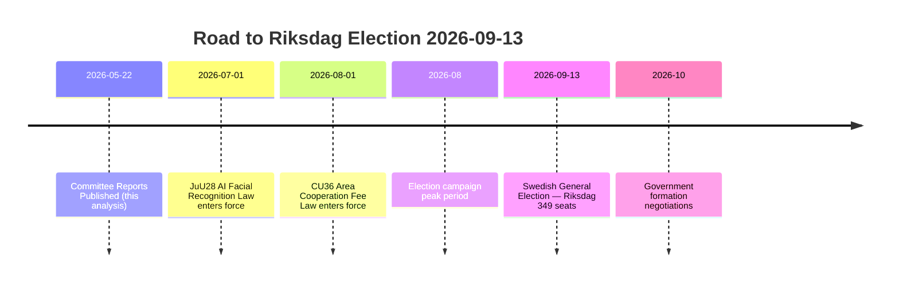
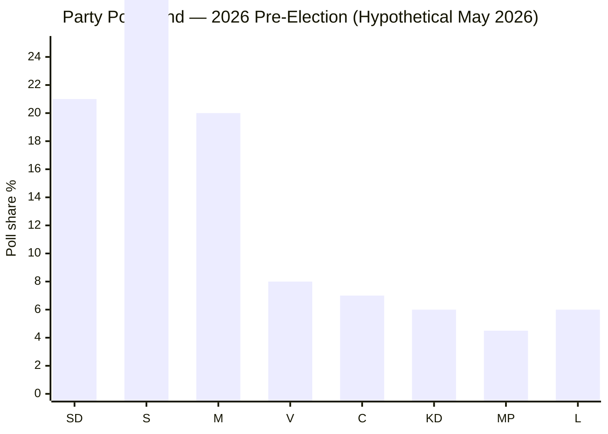

# Election 2026 Analysis — Committee Reports 2026-05-22

**Framework**: Electoral impact assessment — 2026-09-13 Swedish General Election
**Date**: 2026-05-22 | **Days to election**: 114
**Analyst**: James Pether Sörling

---

## Electoral Calendar

---

## Party Position Matrix (Post-JuU28/CU36)

| Party | Seats (2022) | JuU28 | CU36 | Electoral base affected |
|-------|-------------|-------|------|------------------------|
| Moderaterna (M) | 68 | ✅ Support | ✅ Support | Urban middle class; law-and-order voters |
| Sverigedemokraterna (SD) | 73 | ✅ Support | ✅ Support | Gang crime concerned voters |
| Kristdemokraterna (KD) | 19 | ✅ Support | ✅ Support | Traditional values + security |
| Liberalerna (L) | 24 | ✅ Support | ✅ Support | Civil liberties tension internally |
| Socialdemokraterna (S) | 107 | ✅ Support | ❌ Reservation | Union voters + pensioners (FiU39 benefit) |
| Vänsterpartiet (V) | 24 | ❌ Oppose | ❌ Oppose | Civil liberties, younger urban left |
| Centerpartiet (C) | 24 | ❌ Reservation | ❌ Oppose | Rural, libertarian, small business |
| Miljöpartiet (MP) | 18 | ❌ Oppose | ❌ Oppose | Green-left, urban progressive |

**Coalition seats**: M+SD+KD+L = 184
**Opposition**: S+V+C+MP = 173

---

## Electoral Impact Assessment

### JuU28 Impact on Key Swing Constituencies

**Gang crime-concerned voters** (estimated 15–20% of electorate): JuU28 directly addresses the single strongest driver of SD's 2022 growth. The coalition's delivery on a facial recognition law before the election provides a concrete "we acted" narrative. If SD uses JuU28 in its campaign materials alongside crime reduction promises, this is a coalition asset.

**Civil liberties voters** (estimated 5–8% of electorate): Primarily V and MP base. JuU28 reinforces these parties' differentiation. MP's under-4% threshold risk means every issue that sharpens its identity matters — the civil liberties stance on JuU28 could help MP clear the 4% threshold if it runs an effective civil liberties campaign.

**S's strategic bind**: S voted with the majority on JuU28 (committee level). This prevents S from running a civil liberties attack campaign against the coalition, but also removes a clear differentiator. S's JuU28 support reflects its law-and-order repositioning under Magdalena Andersson's successor — but creates internal tension with the V-aligned left.

---

### FiU39 as Pensioner Vote Instrument

The cash access law (HD01FiU39: https://data.riksdagen.se/dokument/HD01FiU39) addresses a high-salience issue for pensioner organisations (SPF Seniorerna: 300,000+ members; PRO: 300,000+ members). Both organisations have publicly praised the law's direction. Pensioner voter turnout was 82%+ in 2022. This translates to an estimated 500,000 pension-age voters for whom FiU39 is a salient issue — representing approximately 10% of the total electorate. If the coalition runs on "we protected cash access" in its campaign, this targets a high-turnout constituency.

---

## Scenario: Seats Impact Modelling

**Baseline (no new major issue)**: M+SD+KD+L coalition retains governing position; S remains largest opposition party.

**JuU28 helps coalition if**:
- Zero high-profile misuse incidents before September 13, 2026
- Gang crime statistics show even marginal improvements (BRÅ Q2 2026 report, expected August 2026)
- S continues supporting JuU28, neutralising any left-wing attack

**JuU28 hurts coalition if**:
- A high-profile false positive arrest is publicised before September 13
- Ethnic minority community groups run visible anti-JuU28 campaign
- L experiences internal civil liberties rebellion (L has traditionally been the civil liberties party in Sweden)

**Probability assessment**: 60% coalition asset; 25% neutral; 15% liability.

---

## Electoral Arithmetic

*Note: Hypothetical polling scenario based on 2022 results adjusted for known trends; not actual polling data.*

**Key threshold risk**: MP at 4.5% — extremely close to 4% threshold. JuU28 civil liberties issue could be MP's lifeline to parliamentary survival.
