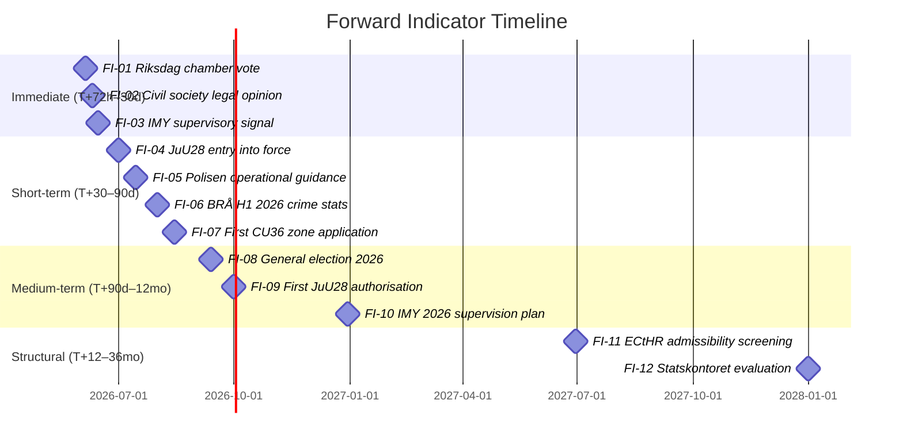

# Forward Indicators — Committee Reports 2026-05-22

**Framework**: Forward-looking indicator set — 4 time horizons × ≥3 indicators each
**Date**: 2026-05-22 | **Analyst**: James Pether Sörling

---

## Indicator Registry (12 Dated Indicators across 4 Horizons)

### Horizon 1: T+72h → T+30 days (Immediate Consequences)

**FI-01** | Target date: **2026-06-05** | Domain: Legislative
> Riksdag chamber vote on HD01JuU28 scheduled. Monitor: Riksdag weekly agenda (riksdagen.se calendar). Trigger: Vote occurs and bill passes — confirm entry into force date July 1. Red flag: Unexpected procedural delay (summer recess motion).

**FI-02** | Target date: **2026-06-10** | Domain: Civil Society
> Civil Rights Defenders / Amnesty Sverige expected to publish formal legal opinion on JuU28 following committee report publication. Monitor: civilrights.se, amnesty.se, SVT/DN coverage. Trigger: Opinion filed with IMY or published as formal position paper. Significance: Indicates speed of legal challenge preparation.

**FI-03** | Target date: **2026-06-15** | Domain: Regulatory
> IMY (Integritetsskyddsmyndigheten) expected to acknowledge JuU28 committee report and signal supervisory preparation. Monitor: imy.se news, official letters. Trigger: IMY publishes preparatory guidance or announces DPIA framework. Significance: Indicates whether IMY will take proactive or reactive stance.

---

### Horizon 2: T+30 → T+90 days (Short-term)

**FI-04** | Target date: **2026-07-01** | Domain: Legislative (milestone)
> JuU28 entry into force. Monitor: Riksdag.se SFS number publication. Trigger: Law published in Svensk Författningssamling (SFS). Significance: Operational deployment can commence.

**FI-05** | Target date: **2026-07-15** | Domain: Operational
> Polismyndigheten press conference / internal circular on JuU28 operational procedures expected within 2 weeks of entry into force. Monitor: Polisen.se operational news. Trigger: Polisen publishes operational guidance for JuU28 deployment. Significance: Reveals actual implementation scope (conservative vs. aggressive deployment).

**FI-06** | Target date: **2026-08-01** | Domain: Electoral
> Final BRÅ crime statistics for H1 2026 published. Monitor: bra.se statistics release. Trigger: Gang violence statistics for Q1-Q2 2026 published. Significance: Key pre-election data point — if gang violence increases despite JuU28 passage, opposition attack surface widens.

**FI-07** | Target date: **2026-08-15** | Domain: Urban Governance
> First CU36 zone designation applications expected from municipalities (entry into force August 1). Monitor: Municipal councils' post-August agendas. Trigger: Any municipality votes to initiate zone designation procedure. Significance: Reveals which municipalities will test CU36 framework.

---

### Horizon 3: T+90 days → T+12 months (Medium-term)

**FI-08** | Target date: **2026-09-13** | Domain: Electoral (milestone)
> Swedish general election. Monitor: Val.se results on election night. Trigger: Election results determine government formation scenario. Significance: Determines whether JuU28 oversight framework is tightened (S-led government) or maintained/expanded (coalition renewal).

**FI-09** | Target date: **2026-10-01** | Domain: Judicial
> First JuU28 pre-authorisation applications expected in Åklagarmyndigheten system. Monitor: Åklagarmyndigheten annual statistics (published with delay) / press reporting. Trigger: Documented case of JuU28 pre-authorisation request filed. Significance: Establishes operational tempo and whether emergency exception is used from day one.

**FI-10** | Target date: **2026-12-31** | Domain: Regulatory
> IMY annual supervision report for 2026 expected (published Q1 2027, but data gathering starts December). Monitor: imy.se annual report schedule. Trigger: IMY annual supervision plan includes JuU28 as priority. Significance: Indicates whether IMY will audit JuU28 in first year of operation.

---

### Horizon 4: T+12 months → T+36 months (Structural)

**FI-11** | Target date: **2027-06-30** | Domain: International/Legal
> ECtHR admissibility screening for any JuU28 application. Civil society must exhaust domestic remedies first (estimated 12–18 months), then file in Strasbourg. Monitor: ECHR case search (hudoc.echr.coe.int). Trigger: Application registered against Sweden citing JuU28 / Art. 8. Significance: Confirms ECHR challenge pathway is active.

**FI-12** | Target date: **2028-01-01** | Domain: Legislative Review
> Statskontoret evaluation expected (18 months post-entry into force = January 2028). Monitor: Statskontoret work programme (statskontoret.se). Trigger: Government commissions or Statskontoret initiates JuU28 evaluation. Significance: First major effectiveness audit of AI facial recognition law.

---

## Indicator Dashboard

---

## PIR Mapping

| Indicator | PIR Reference | Action if triggered |
|-----------|-------------|---------------------|
| FI-01 | PIR-SEC-2026-001 | Confirm law passed; update analysis |
| FI-02 | PIR-CIV-2026-001 | Assess legal challenge timeline |
| FI-06 | PIR-SEC-2026-002 | Update effectiveness assessment |
| FI-08 | PIR-POL-2026-001 | Full post-election analysis |
| FI-11 | PIR-CIV-2026-001 | ECHR case tracking begins |
