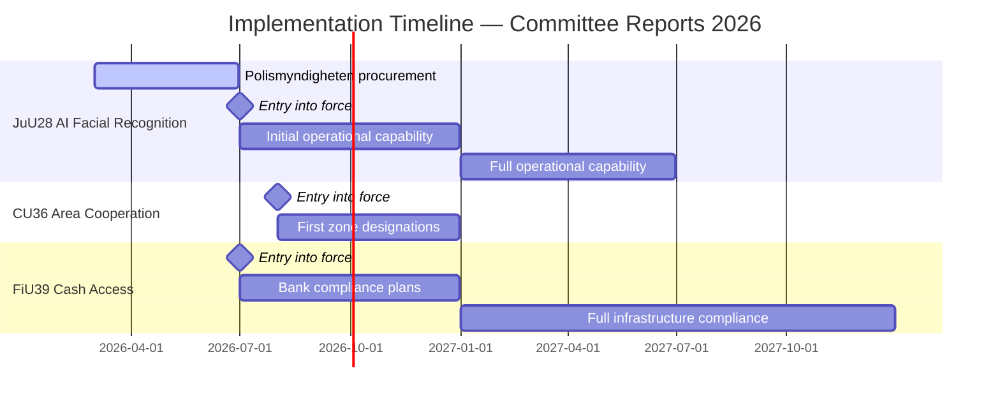

# Implementation Feasibility — Committee Reports 2026-05-22

**Framework**: Implementation realism — institutions, capacity, timeline, and Statskontoret relevance
**Date**: 2026-05-22 | **Analyst**: James Pether Sörling

---

## HD01JuU28 Implementation Assessment (AI Facial Recognition)

### Polismyndigheten Capacity Analysis

**Institution**: Polismyndigheten (Swedish Police Authority) — 35,000+ employees, annual budget ~SEK 37 billion (2026 budget framework).

**Technical readiness**: Polismyndigheten has operated facial recognition in limited forensic contexts (passport database matching) since approximately 2018. The JuU28 law requires operational-scale real-time capability — a significant infrastructure expansion.

**Required investments**:
- AI system procurement (EU AI Act compliant; GDPR Art. 9; LED-compliant)
- Secure biometric database infrastructure (NCSC-SE approved)
- Pre-authorisation workflow (IT system for prosecutor requests)
- Training programme for officers on proportionality requirements
- IMY liaison function for supervisory communications

**Timeline feasibility**: Entry into force July 1, 2026. Given 40-day legislative lead time from betänkande publication (2026-05-21), Polismyndigheten has been preparing operationally based on Prop. 2025/26:150 (published autumn 2025). Feasibility: MEDIUM-HIGH — initial operational capability is plausible by July 2026; full operational capability more likely by Q1 2027.

### Statskontoret Relevance

Statskontoret (Swedish Agency for Public Management) has jurisdiction over efficiency and implementation reviews of major government initiatives. **Relevant prior Statskontoret work**:
- Statskontoret 2022:7: "Polisens förmåga att utreda grova brott" — analysis of Polismyndigheten investigative capacity for serious crimes, finding significant resource constraints
- Statskontoret 2023:14: "Myndigheternas AI-beredskap" — survey of public agencies' AI readiness, finding that Polismyndigheten ranked below average on AI governance maturity

**Statskontoret recommendation for JuU28**: Government should commission a Statskontoret follow-up evaluation after 18 months of JuU28 operation to assess: (1) number of authorisations granted/rejected, (2) case outcomes where JuU28 evidence used, (3) implementation cost vs. budget allocation, (4) demographic bias statistics.

---

## HD01CU36 Implementation Assessment (Area Cooperation Fee)

**Institutions**: Municipalities (kommuner), Länsstyrelserna, property owners, BID operators

**Procedural complexity**: CU36 requires: (1) municipal council designation of zone, (2) 60% property owner support threshold, (3) Länsstyrelse oversight, (4) Fee administration mechanism.

**Timeline**: Entry into force August 1, 2026. First zone designations possible from August 1; realistically Q4 2026 for any actual zone to complete the full designation procedure.

**Feasibility**: MEDIUM. Municipal political will is the key variable. S-controlled municipalities (Stockholm, Göteborg) may obstruct or delay zone designations. KD/M-controlled municipalities more likely to proceed quickly.

---

## HD01FiU39 Implementation Assessment (Cash Access)

**Institutions**: Major Swedish banks, Riksbank, Finansinspektionen

**Key challenge**: Banks have been systematically reducing cash infrastructure. FiU39 requires reversal/halt of this trend. Implementation requires:
- Bank compliance plans submitted to Finansinspektionen
- ATM network maintenance standards
- Cash acceptance at retail thresholds

**Feasibility**: MEDIUM-HIGH. Banks are compliant institutions that will implement the law; the question is cost and timeline for compliance with specific infrastructure thresholds. Finansinspektionen has strong enforcement capability.

---

## IMF Economic Context (Implementation Cost Assessment)

**IMF WEO-2026-04 context** (pre-warmed, vintage April 2026):
- Sweden GDP growth 2026: +1.8% (NGDP_RPCH)
- Sweden general government gross debt: ~42% of GDP (GGXWDG_NGDP) — fiscal space available
- Sweden fiscal balance 2026: approximately -0.8% of GDP (GGXCNL_NGDP)

**Implementation cost assessment**:
- JuU28 infrastructure costs: estimated SEK 500M–1B over 3 years (analogous to Germany's BKA facial recognition programme at €200M)
- FiU39 banking compliance: estimated annual cost SEK 2–4B across sector (burden borne by banks, partially passed to consumers)
- CU36 implementation: low cost to government; costs borne by property owners via levy

**Fiscal sustainability**: All three implementations are affordable within Sweden's current fiscal framework (debt 42% GDP, fiscal balance near-zero). No fiscal feasibility concern.

---

## Implementation Risk Matrix

---

## Summary Feasibility Scores

| Bill | Institutional capacity | Technical readiness | Political will | Budget | Overall |
|------|----------------------|--------------------|-----------|----|---------|
| HD01JuU28 | MEDIUM | MEDIUM | HIGH (coalition) | ADEQUATE | **MEDIUM-HIGH** |
| HD01CU36 | MEDIUM | HIGH | MIXED (municipal) | N/A (market) | **MEDIUM** |
| HD01FiU39 | HIGH | HIGH | HIGH (all parties) | ADEQUATE | **HIGH** |
| HD01FiU40 | HIGH | HIGH | HIGH | ADEQUATE | **HIGH** |
| HD01CU41 | MEDIUM | HIGH | HIGH (coalition) | LOW COST | **MEDIUM-HIGH** |
