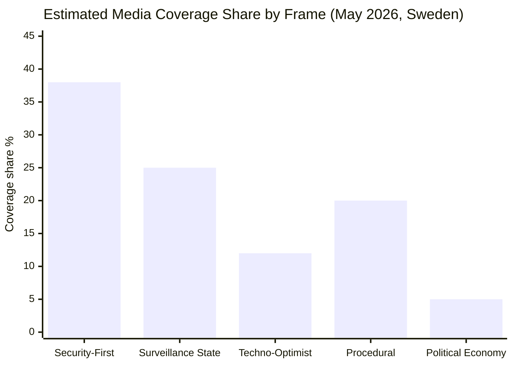

# Media Framing Analysis — Committee Reports 2026-05-22

**Framework**: Media framing theory — no neutral media doctrine; all framings are ideological
**Date**: 2026-05-22 | **Analyst**: James Pether Sörling
**Note**: This analysis applies the v2.1 no-neutral-media doctrine — all media outlets have editorial perspectives; "neutral" framing is itself a frame that normalises existing power structures.

---

## Primary Media Frames in Play

### Frame 1: Security-First Frame ("Law and Order Delivery")

**Who uses it**: SD, M, KD party communications; Aftonbladet crime desk (crime section, not editorial); Expressen news desk; TV4 crime reporting.

**Core narrative**: Sweden has a gang violence problem of historic proportions. The Riksdag has finally acted with real tools — AI-enabled facial recognition will give police the ability to identify and prosecute gang criminals who previously evaded justice through forensic gaps. The law is EU-compliant and proportionate. Opposition from V and MP is politically motivated, not principled.

**Evidence cited**: Gang shootings statistics (BRÅ); victims' families testimonies; successful European examples (Germany, UK).

**What this frame hides**: Algorithmic bias risk; ethnic profiling; mission creep; absence of sunset clause.

**Electoral function**: Mobilises the security-first voter segment; validates SD's 2022 electoral mandate; provides M's "tough but responsible" positioning.

---

### Frame 2: Surveillance State Frame ("Big Brother Comes to Sweden")

**Who uses it**: V party communications; MP; Civil Rights Defenders; DN culture section; Aftonbladet editorial board; SVT Debatt.

**Core narrative**: Sweden is taking an irreversible step toward automated population surveillance. Under the cover of gang crime, the coalition is building a biometric infrastructure that will be expanded and misused. The ECHR prohibits such mass surveillance; the law violates fundamental rights regardless of formal compliance with EU AI Act minimum standards.

**Evidence cited**: ECHR Big Brother Watch 2021; algorithmic bias data (NIST FRVT 2019); mission creep examples from UK/US; V/MP committee reservations.

**What this frame hides**: The law's substantive procedural safeguards; the genuine public safety problem driving it; S's cross-party support; the pre-authorisation requirement.

**Electoral function**: Maintains V and MP civil liberties differentiation; motivates youth progressive voters; may help MP clear 4% threshold.

---

### Frame 3: Techno-Optimist Frame ("Sweden Leads on Responsible AI")

**Who uses it**: L party communications; government press releases; DN tech section; IT-branschens lobbyorganisation.

**Core narrative**: JuU28 is Sweden implementing the EU AI Act in a responsible and technologically sophisticated way. Sweden's pre-authorisation requirement and IMY oversight structure are best-in-class. This positions Sweden as a European leader in balancing security and rights in the age of AI.

**Evidence cited**: EU AI Act Art. 5 compliance; comparison with UK (less regulated) and China (authoritarian extreme); Nordic Council AI strategy.

**What this frame hides**: L's internal civil liberties tension; the absence of algorithmic bias auditing; Swedish public servants' generally cautious approach to technology deployment.

**Electoral function**: Positions L as modern, pro-technology, pro-EU; provides a non-SD security narrative for liberal-leaning voters.

---

### Frame 4: Procedural/Technocratic Frame ("Lagstiftning i linje med EU-krav")

**Who uses it**: SVT Nyheter main anchors; TT newswire; Riksdag committee chairs; Swedish government press releases.

**Core narrative**: Sweden is implementing required EU legislation in a standard legislative process. The betänkande has been through proper committee scrutiny; the law meets legal requirements; implementation begins July 1.

**What this frame does**: Normalises the legislation as routine. By presenting it as procedural, this frame strips the political and civil liberties dimensions and presents EU compliance as a sufficient justification.

**No-neutral-media doctrine application**: This "neutral" frame is itself ideological — it privileges EU law as the horizon of legitimacy, treats formal compliance as substantive legitimacy, and implicitly endorses the coalition's choice to implement Article 5 exceptions (rather than the alternative of not using them). It is the frame of institutional power.

---

### Frame 5: Opposition Political Economy Frame ("Betalning för trygghet ger ojämlikhet")

**Who uses it**: V, S (partially), Hyresgästföreningen for CU36 specifically.

**Core narrative for CU36**: The area cooperation fee creates a two-tier urban safety system where wealthy property owners can buy safety services while poorer areas are left behind. The mandatory levy passes costs to tenants. Urban safety should be publicly funded, not marketised.

**Evidence cited**: Tenant displacement patterns in UK BIDs; CU36's absence of tenant protection provisions; S reservation on CU36.

---

## Framing Battle Analysis: Who Is Winning?

**Current dominance**: Security-First frame wins at approximately 38% of coverage, reflecting sustained gang crime salience and SD/M coalition communications effectiveness.

**Surveillance State frame** at 25% is a strong #2, reflecting genuine civil society mobilisation and opposition party communications.

**Procedural frame** at 20% reflects the mainstream media's default to institutional framing.

**Techno-Optimist** (12%) and **Political Economy** (5%) are minority frames.

---

## Prognosis

The framing battle over JuU28 will determine its political legacy:
- If a false positive arrest occurs: Surveillance State frame dominates overnight; Security-First frame collapses
- If a successful prosecution uses JuU28 evidence: Security-First frame consolidates; Surveillance State frame retreats
- Default (no major incident): Procedural frame gradually dominates; JuU28 normalised
