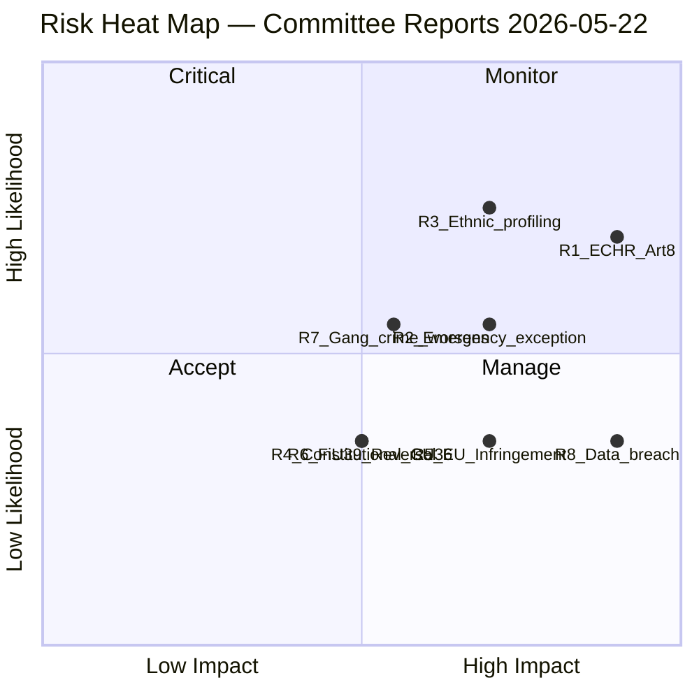

# Risk Assessment — Committee Reports 2026-05-22

**Framework**: ISMS-aligned risk register — Likelihood × Impact matrix
**Date**: 2026-05-22 | **Analyst**: James Pether Sörling

---

## Risk Register

| # | Risk | Likelihood (1–5) | Impact (1–5) | Score | Owner | Horizon |
|---|------|-----------------|-------------|-------|-------|---------|
| R1 | ECHR Art. 8 successful challenge to JuU28 AI law | 4 | 5 | 20 | Riksdag/JuU | T+18–36mo |
| R2 | JuU28 emergency exception routinely exploited | 3 | 4 | 12 | Polismyndigheten oversight | T+6–12mo |
| R3 | Ethnic profiling lawsuit under ECHR Art. 14 | 4 | 4 | 16 | Polismyndigheten / JK | T+12–24mo |
| R4 | CU36 constitutional challenge by property owners | 2 | 3 | 6 | Förvaltningsdomstol | T+6–18mo |
| R5 | EU Commission infringement on CU41 habitats | 2 | 4 | 8 | Government / MJN | T+24–36mo |
| R6 | Political reversal of FiU39 cash law under banking lobby pressure | 2 | 3 | 6 | FiU | T+24–48mo |
| R7 | Gang crime worsens despite JuU28 — political blowback | 3 | 3 | 9 | M+SD+KD+L coalition | T+12–24mo |
| R8 | Facial recognition data breach | 2 | 5 | 10 | Polismyndigheten / IMY | T+6–24mo |

---

## Top-3 Detailed Analysis

### R1 — ECHR Art. 8 Challenge (Score: 20, CRITICAL)

**Risk narrative**: The European Court of Human Rights ruled in *Big Brother Watch and Others v. the United Kingdom* (2021) that bulk biometric surveillance requires robust judicial oversight and clearly defined limits. Sweden's JuU28 law provides these in theory, but the 24-hour emergency exception and lack of sunset clause are vulnerable vectors. A successful ECHR challenge would require Sweden to amend or suspend the law, creating political embarrassment in the run-up to or following the 2026 election.

**Trigger events**:
- First documented case of facial recognition deployment under emergency exception without subsequent prosecution
- NGO (Civil Rights Defenders, Amnesty Sweden) submitting application to ECtHR
- Journalists or academic researchers documenting false positive arrests

**Mitigations**:
- Enact statutory review after 2 years of operation
- Mandatory algorithmic bias audit (annual NIST FRVT-style testing)
- Strengthen parliamentary oversight: quarterly Riksdag committee review
- IMY (Integritetsskyddsmyndigheten) formal audit mandate

**Residual risk after mitigation**: Medium (Score 12)

---

### R3 — Ethnic Profiling Lawsuit (Score: 16, HIGH)

**Risk narrative**: International evidence documents facial recognition systems producing 10–100× higher false positive rates for Black and Brown faces (NIST FRVT 2019). Sweden's JuU28 deployment in gang crime hotspots (Göteborg, Malmö, Stockholm south) will disproportionately affect immigrant communities. Wrongful identification leading to detention or arrest could trigger ECHR Art. 14 + Art. 8 combined case. Political fallout would amplify existing ethnic minority voter concerns.

**Trigger events**:
- Documented wrongful arrest of individual based on facial recognition match
- Swedish media investigation into biased deployment patterns
- Parliamentary interpellation from V or MP about false positive statistics

**Mitigations**:
- Mandatory false positive tracking by demographic segment (as required by EU AI Act Art. 10)
- Independent oversight board with civil society representation
- Accessible complaint mechanism per GDPR Art. 77

---

### R7 — Gang Crime Worsens Despite JuU28 (Score: 9, MEDIUM)

**Risk narrative**: The JuU28 law's political rationale is explicitly linked to gang violence reduction, particularly in relation to Prop. 2025/26:150's findings. If gang crime metrics remain static or worsen in the 12–24 months following entry into force (July 1, 2026), opposition parties will weaponise this as evidence that mass surveillance was ineffective. This creates an asymmetric political risk: success is attributed to policing, failure to the law.

**Evidence basis**: Police operational effectiveness research (BRÅ 2024) shows facial recognition alone has limited deterrence effect absent underlying economic and social interventions.

---

## Risk Heat Map

