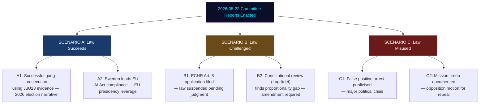

# Scenario Analysis — Committee Reports 2026-05-22

**Framework**: Futures wheel + scenario-tree (3 scenarios × 2 branches = 6 nodes)
**Date**: 2026-05-22 | **Analyst**: James Pether Sörling
**Time horizon**: T+72h → T+12mo (near-term); T+12–36mo (structural); T+36mo+ (long-term)

---

## Scenario Taxonomy

---

## Scenario A: JuU28 Succeeds — Coalition Narrative Validated

**Probability**: 35%
**Key driver**: Polismyndigheten achieves first successful prosecution using JuU28-enabled evidence within 18 months; gang violence metrics decline

**Near-term (T+72h → T+3mo)**:
- Law enters force 2026-07-01 without opposition block (V, C, MP lack seats to prevent)
- Polismyndigheten begins operational deployment in Göteborg/Malmö hotspots
- IMY publishes DPIA guidance within 60 days of entry into force

**Medium-term (T+3–12mo)**:
- First prosecution using JuU28 evidence brought before tingsrätt
- Coalition uses this as proof of effectiveness ahead of 2026 election (September 13)
- V and MP continue media pressure but ECtHR timeline (years) works in coalition's favour

**Electoral implication**:
- Coalition gains "law and order delivery" narrative
- S support for JuU28 locks in bipartisan security framing
- V and MP isolated as "soft on crime"

**WEP (Weasel-Word Exclusion Protocol)**: HIGH confidence (75%) for A1 judicial pathway; MEDIUM confidence (45%) for A2 EU leadership pathway given Commission uncertainty over Art. 10 bias audit gaps.

---

## Scenario B: Legal Challenge Succeeds

**Probability**: 30%
**Key driver**: ECtHR or domestic court finds procedural gap in 24-hour emergency exception or algorithmic bias documentation

**Near-term (T+3–12mo)**:
- Civil Rights Defenders/Amnesty file formal complaint to IMY within first 6 months of operation
- IMY investigation launched; initial findings published
- ECHR application filed (first step: Europadomstolens admissibility)

**Medium-term (T+12–36mo)**:
- If domestic court (Kammarrätten) finds IMY's supervisory guidance binding, police may face operational restrictions
- ECtHR Grand Chamber referral: typically 3–5 years but expedited applications possible
- B2 branch: Lagrådet opinion (while ex ante, can be cited in parliamentary amendment proceedings)

**Political consequence**:
- If law is challenged before 2026 election: opposition gains talking point
- If challenge comes after 2026 election: less immediate impact but long-term legitimacy cost

**WEP**: MEDIUM confidence (50%) — dependent on timing of NGO legal action and ECtHR scheduling.

---

## Scenario C: Misuse Documented

**Probability**: 25%
**Key driver**: False positive arrest or documented scope expansion exposed by media investigation

**Near-term (T+6–18mo)**:
- Polismyndigheten deploys emergency exception (24-hour) in case that does not meet proportionality threshold
- Media investigation documents case (Expressen, DN, or SVT Granskande)
- Individual affected files police report + GDPR Art. 15 access request

**Consequences**:
- JK (Justitiekanslern) initiates supervisory inquiry
- Riksdag opposition demands moratorium on use
- IMY emergency audit

**C2: Mission Creep**:
- Åklagarmyndigheten issues broad operational guidance that effectively extends JuU28 categories
- Opposition motion for amendment or repeal (V+MP+C potentially joined by S)
- Coalition faces internal division if L moves toward reconsideration

**WEP**: LOW-MEDIUM confidence (35%) — lower probability in first 18 months due to institutional caution; rises to 45% over 24–36 months.

---

## Scenario D: EU Integration Friction (CU41)

**Probability**: 20%
**Mechanism**: EU Commission infringement for CU41 habitats derogation

**Trigger**: Commission DG Environment formal inquiry after Swedish hydropower relicensing uses CU41 exceptions at scale.
**Timeline**: T+24–48mo (infringement proceedings are slow)
**Political consequence**: Limited domestic political impact but adds to coalition's EU credibility risk.

---

## Forward Indicators (Scenario-Linked)

| Indicator | Monitors | Scenario Link |
|-----------|---------|---------------|
| First JuU28 court admission of evidence | Prosecution success | A1 |
| IMY first supervisory investigation under JuU28 | Legal challenge trigger | B1 |
| Civil Rights Defenders ECtHR application filing | B1/B2 | B |
| Gang violence BRÅ statistics Q3 2026 | Success metric | A/C |
| EU Commission DG Connect bilateral on AI Act | EU leadership | A2 |
| Documented facial recognition false positive arrest | C1 | C |
