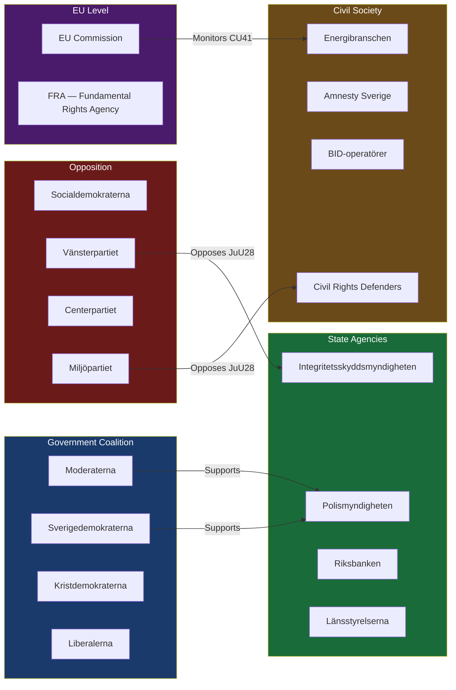
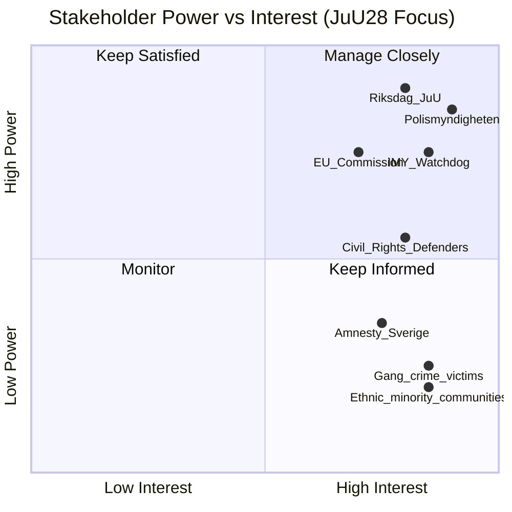

# Stakeholder Perspectives — Committee Reports 2026-05-22

**Framework**: Multi-stakeholder mapping with position, interest, and power dimensions
**Date**: 2026-05-22 | **Analyst**: James Pether Sörling

---

## Stakeholder Map

---

## Key Stakeholder Positions (HD01JuU28 — AI Facial Recognition)

### Polismyndigheten (SUPPORT — HIGH POWER)
**Position**: Strongly supports JuU28. Has publicly argued (Prop. 2025/26:150 remiss) that real-time facial recognition is operationally essential for gang crime prosecution.
**Interests**: Expand investigative toolkit; clear legal authority for existing technical capabilities; reduce evidentiary gaps in serious crime prosecution.
**Key demand met**: Law authorises both real-time surveillance and database matching; emergency 24-hour exception addresses operational tempo needs.
**Concern**: Strict pre-authorisation requirement may slow deployment in time-critical situations.

### Åklagarmyndigheten (CONDITIONAL SUPPORT — MEDIUM POWER)
**Position**: Supports with concerns about workload burden from pre-authorisation applications.
**Interests**: Evidentiary quality; legal certainty for prosecution cases.
**Risk**: If authorisation processes are under-resourced, prosecutorial delays will emerge.

### Integritetsskyddsmyndigheten/IMY (CRITICAL — MEDIUM POWER)
**Position**: Watchdog — neither supporting nor opposing. Will enforce compliance.
**Interests**: Ensure lawful processing under GDPR Chapter 3 rights; data minimisation; DPIAs conducted properly.
**Likely actions post-entry**: Issue guidance on DPIA requirements; conduct supervisory visits; receive complaints under GDPR Art. 77.

### Civil Rights Defenders (OPPOSITION — MEDIUM POWER via litigation)
**Position**: Strong opposition. Will document misuse and pursue legal challenges.
**Interests**: ECHR Art. 8 protection; non-discrimination; democratic accountability.
**Key concern**: 24-hour emergency exception and absence of sunset clause; ethnic profiling risk.
**Likely actions**: ECHR application preparation; FOI campaigns; Riksdag interpellations through V and MP.

### Amnesty Sverige (OPPOSITION — LOW-MEDIUM POWER)
**Position**: Opposes JuU28 as disproportionate.
**Interests**: Civil liberties protection; anti-discrimination.
**Actions**: Media advocacy; international pressure through Amnesty network.

---

## Key Stakeholder Positions (HD01CU36 — Area Cooperation Fee)

### BID-operatörer / Fastighetsägarna (SUPPORT — MEDIUM POWER)
**Position**: Strongly supports. Industry organisations have lobbied for a UK/US-style Business Improvement District model in Sweden since 2017.
**Interests**: Stable funding mechanism for urban safety; reduce free-rider problem among reluctant property owners.
**Key demand met**: Mandatory levy resolves free-rider problem; democratic designation process adds legitimacy.

### Socialdemokraterna (OPPOSITION — HIGH POWER)
**Position**: Filed reservation. Concerned about mandatory levy without individual consent; prefers voluntary funding mechanisms.
**Political calculation**: S opposes CU36 partly to distinguish itself from the governing coalition's market-mechanism approach.

### Hyresgästföreningen (Tenants Union) (OPPOSITION — MEDIUM POWER)
**Position**: Concerned that property owners will pass levy costs to residential tenants.
**Interest**: Rental housing affordability; protection of social housing residents.
**Key concern**: CU36 does not cap cost pass-through to tenants.

---

## Key Stakeholder Positions (HD01FiU39 — Cash Access)

### Riksbanken (STRONG SUPPORT — HIGH POWER)
**Position**: Has formally advocated for cash protection legislation for five years.
**Interests**: Systemic financial resilience; payment system diversity; crisis preparedness (FiU39 directly addresses Riksbank's krisberedskap mandate).
**Satisfied by**: Mandatory cash handling obligations for banks and retailers.

### Swedish Banks (RELUCTANT COMPLIANCE)
**Position**: Banks prefer full digitisation but accept the law given cross-party political consensus.
**Cost impact**: Maintaining cash infrastructure has significant operational cost; law does not provide compensation mechanism.

### Elderly and Rural Populations (STRONG SUPPORT — DIFFUSE POWER)
**Position**: Major beneficiaries. SPF Seniorerna and PRO (pensioner organisations) have actively lobbied for FiU39.
**Political weight**: Pensioner vote turnout 82%+ in 2022 — strategically significant pre-2026.

---

## Power/Interest Matrix

