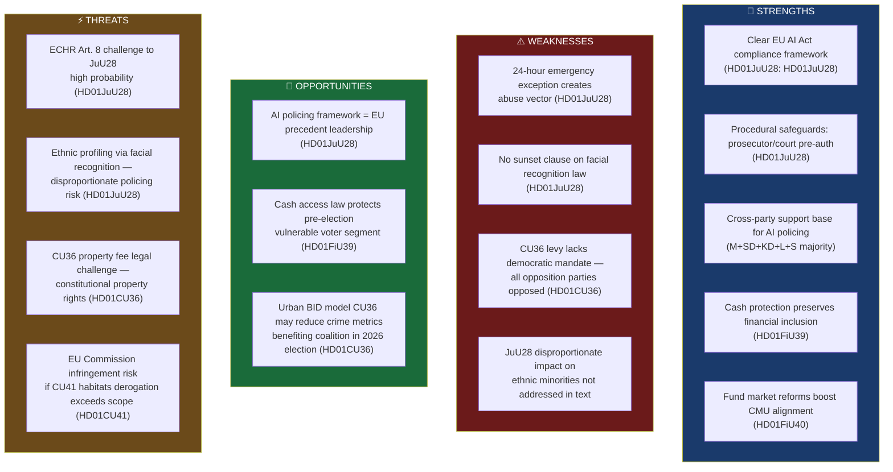

# SWOT Analysis — Committee Reports 2026-05-22

**Framework**: Political SWOT — Four-quadrant strategic assessment
**Date**: 2026-05-22 | **Analyst**: James Pether Sörling
**Scope**: All five betänkanden; primary focus on HD01JuU28 (L3 significance)

---

---

## Strengths

### S1 — EU AI Act Compliance Framework Established [A2]
Sweden's new law (HD01JuU28: https://data.riksdagen.se/dokument/HD01JuU28) directly implements EU AI Act Article 5.1(h) exceptions with national rule-of-law guardrails — proportionality assessment, independent pre-authorisation, and time limitations. This positions Sweden as a compliant and transparent AI Act implementer, maintaining legal certainty for law enforcement agencies across all EU cross-border operations.

### S2 — Procedural Safeguards Reduce Arbitrary Use Risk [A2]
The law requires prosecutor or court authorisation before deployment (HD01JuU28), reducing unilateral police discretion. The 24-hour retrospective authorisation window for emergencies is constrained and auditable. This exceeds the minimum EU AI Act requirements and sets a higher standard than some comparable EU frameworks.

### S3 — Broad Parliamentary Consensus on Core AI Policing [A2]
The governing coalition (M+SD+KD+L: 182 seats) plus S support (87 seats) creates an effective 269-seat supermajority for JuU28 passage — far exceeding the 175-seat threshold. This reflects genuine cross-ideological convergence on law enforcement needs, driven by sustained public concern about gang violence and organised crime (HD01JuU28 betänkande committee record).

### S4 — Cash Protection Preserves Financial Inclusion [A2]
FiU39 (HD01FiU39: https://data.riksdagen.se/dokument/HD01FiU39) addresses Sweden's accelerating cashless transition by mandating continued cash functionality, protecting elderly, rural, and digitally excluded populations from financial access barriers.

### S5 — Fund Market Reform Advances Pension Capital Efficiency [A2]
FiU40 (HD01FiU40: https://data.riksdagen.se/dokument/HD01FiU40) strengthens fund market infrastructure, improving access to competitive pension investment vehicles and aligning with EU Capital Markets Union objectives.

---

## Weaknesses

### W1 — 24-Hour Emergency Exception Creates Oversight Gap [B2]
The JuU28 law's emergency provision (HD01JuU28: https://data.riksdagen.se/dokument/HD01JuU28) allows police to begin facial recognition deployment without pre-authorisation, applying for approval within 24 hours. This window creates an institutional escape hatch that could become routinised, weakening the prior-authorisation safeguard. V (Gudrun Nordborg m.fl.) and MP (Ulrika Westerlund m.fl.) filed reservations specifically targeting this gap.

### W2 — Absence of Sunset Clause Removes Accountability Horizon [A2]
Unlike comparable UK and German frameworks, the Swedish AI facial recognition law carries no statutory sunset or mandatory parliamentary review clause. Reservation 4 (V+MP, HD01JuU28) explicitly sought a time-limitation, but the committee majority rejected this. The absence of a sunset clause makes the legal framework permanent absent active repeal — an asymmetric accountability structure.

### W3 — Area Cooperation Fee Lacks Full Democratic Mandate [A2]
CU36 (HD01CU36: https://data.riksdagen.se/dokument/HD01CU36) imposes mandatory fees on all property owners in a designated zone regardless of individual consent, with the opposition parties (S, V, C, MP filing reservations 1–3) arguing this constitutes a quasi-tax without proper tax-law procedures. The governing coalition's bare majority on CU36 is narrower than on security bills, reflecting inter-coalition tensions.

### W4 — Ethnic Profiling Risk Not Addressed in JuU28 Text [B3]
The betänkande text for HD01JuU28 does not include specific provisions addressing the well-documented algorithmic bias of facial recognition systems against darker-skinned individuals. Academic literature (NIST FRVT 2019; Joy Buolamwini 2018) demonstrates significantly higher false positive rates for non-white faces. The absence of mandatory algorithmic bias auditing in the law is a structural weakness.

---

## Opportunities

### O1 — EU Precedent Leadership in Responsible AI Policing [B2]
Sweden's Article 5 implementation in HD01JuU28 (https://data.riksdagen.se/dokument/HD01JuU28) with robust procedural safeguards provides a potential EU model for Member States navigating AI Act compliance. Sweden can leverage this in EU Council working groups and EPPO cooperation frameworks to strengthen its voice in digital governance policy.

### O2 — Cash Access Law Protects Pre-Election Vulnerable Voter Segment [B2]
FiU39 (HD01FiU39: https://data.riksdagen.se/dokument/HD01FiU39) positions the coalition as responsive to pensioner and rural voter concerns — key swing constituencies in the 2026 election. Cross-party support reduces opposition attack surface.

### O3 — Urban Safety Law May Reduce Crime Metrics Ahead of 2026 Election [B3]
CU36 (HD01CU36: https://data.riksdagen.se/dokument/HD01CU36) creates new crime-prevention coordination mechanisms in urban zones. If initial area cooperation structures report reduced crime indicators before September 2026, the coalition gains empirical backing for its security-state posture.

---

## Threats

### T1 — ECHR Article 8 Legal Challenge to JuU28 [A2]
The European Court of Human Rights has consistently held that biometric surveillance tools require proportionality stricto sensu and independent oversight (Catt v. UK 2019; Big Brother Watch v. UK 2021). Sweden's 24-hour emergency exception and absence of a sunset clause present viable ECHR Art. 8 challenges. Probability assessment: HIGH. Timeline: 18–36 months to Strasbourg judgment.

### T2 — Ethnic Profiling and Disproportionate Policing Risk [B2]
Facial recognition deployment under HD01JuU28 (https://data.riksdagen.se/dokument/HD01JuU28) will disproportionately affect ethnic minority communities, particularly in areas with active JuU28 deployment for gang crime investigations. This creates political and legal risk — discrimination claims under RF 2:12 and ECHR Article 14 read with Article 8.

### T3 — Constitutional Challenge to CU36 Property Levy [B3]
The CU36 mandatory area cooperation fee (HD01CU36: https://data.riksdagen.se/dokument/HD01CU36) may be challenged by property owners as an unlawful quasi-tax (RF 8:2). The opposition's reservation language explicitly framed the levy as requiring tax-law procedure rather than ordinary legislation. Risk: MEDIUM for administrative court challenge.

### T4 — EU Commission Infringement Risk on CU41 Habitats Derogation [B3]
CU41 (HD01CU41: https://data.riksdagen.se/dokument/HD01CU41) implements exceptions from the Habitats Directive during hydropower re-licensing that may exceed the scope of Article 6(4) derogations. The European Commission has pursued infringement proceedings against other Member States on similar hydropower derogations. Risk: MEDIUM over 2–3 year horizon.
