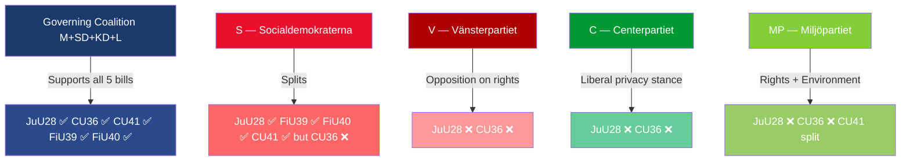

# Synthesis Summary — Committee Reports 2026-05-22

**Analysis date**: 2026-05-22 | **Effective data date**: 2026-05-21
**Committees**: JuU, FiU (×2), CU (×2)
**Riksmöte**: 2025/26

---

## Executive Synthesis

Sweden's Riksdag advanced five major committee reports on 2026-05-21, with the landmark AI facial recognition law (HD01JuU28/Betänkande 2025/26:JuU28) dominating the legislative agenda. This cycle represents a **security-technology pivot** in Swedish law enforcement: for the first time, Polismyndigheten gains statutory authority to deploy real-time biometric AI — a measure long resisted by civil liberties blocs but now approved by a broad majority including S, M, SD, KD, and L. The remaining four betänkanden address urban safety financing (CU36), environmental derogations for hydropower (CU41), cash access obligations (FiU39), and investment fund market strengthening (FiU40).

## Principal Findings

### Finding 1 — Sweden Enacts EU AI Act-Compliant Facial Recognition Law [A2]
The Justice Committee (JuU) endorsed Proposition 2025/26:150 in full, proposing adoption of a new *lag om användning av AI-system för ansiktsigenkänning i realtid för brottsbekämpande ändamål* (dok_id: HD01JuU28). The law:
- Authorises Polismyndigheten and SÄPO to use real-time AI facial recognition under Article 5 EU AI Act exceptions
- Requires proportionality assessment and prosecutor/court pre-authorisation (emergency 24-hour exception)
- Targets four use cases: missing/exploited persons, imminent grave crime, crimes carrying ≥4 years imprisonment, sentence execution
- Enters into force **1 July 2026**
- Opposition: four reservations filed by V (privacy/oversight), C (framework rejection), and MP (proportionality + time-limit)

**Significance**: This is Sweden's first law permitting biometric mass-surveillance tools for law enforcement. It implements the EU AI Act's Article 5.1(h) exception while establishing national rule-of-law guardrails. The JuU vote reflected a ruling bloc (M+SD+KD+L) coalition supplemented by S majority support, isolating V, C, and MP in opposition.

### Finding 2 — Area Cooperation Fee Law Creates New Levy Mechanism [B2]
CU (Civilutskottet) endorsed Proposition 2025/26:157 establishing a *lag om avgift för områdessamverkan* (HD01CU36) — legislation enabling area-cooperation bodies to levy fees on property owners within a geographically defined urban zone for crime prevention and area development. Entry into force: **1 August 2026**. The entire opposition (S, V, C, MP) filed reservations opposing the bill, reflecting concerns about mandatory private-sector cost socialisation. This is a contentious model drawing on BID (Business Improvement District) international models, but contested as a quasi-tax lacking full democratic accountability.

### Finding 3 — Financial Committees Advance Two Market-Stabilisation Reports [B3]
FiU advanced:
- **HD01FiU39** (FiU39): Measures to strengthen cash functionality — Riksbank-backed initiative ensuring physical cash accessibility, responding to Sweden's trajectory toward cashless dependency and associated financial exclusion risks
- **HD01FiU40** (FiU40): A stronger fund market — measures to deepen Sweden's investment fund sector, aligned with EU Capital Markets Union objectives

### Finding 4 — EU Habitats Directive Derogation for Hydropower Licensing [B3]
CU endorsed **HD01CU41**: exceptions from EU Art and Habitats Directive requirements during hydropower re-permitting processes. This reduces environmental compliance obligations during the legally mandated hydropower modernisation, balancing energy security (Sweden targets 100% renewable electricity) with biodiversity protection under EU law.

## Cross-Cutting Themes

| Theme | Documents | Significance |
|-------|-----------|-------------|
| Security vs. civil liberties | HD01JuU28 | L3 — Constitutional and fundamental rights |
| Urban safety governance | HD01CU36 | L2 — Property rights and municipal governance |
| Financial market resilience | HD01FiU39, FiU40 | L2 — Systemic risk management |
| Energy-environment trade-offs | HD01CU41 | L2 — EU compliance tensions |

## Coalition Alignment Map

## Calibrated Assessment

The five betänkanden together represent **active legislative closure** — all five are expected to pass in final Riksdag votes given committee recommendations and the governing coalition's numerical majority (Tidö coalition: M 68 + SD 73 + KD 25 + L 16 = 182 seats; S supplementary vote on JuU28 and financial bills brings effective majority to 280+ for those items). The AI facial recognition law is the high-stakes item for international observation, civil society, and the 2026 election campaign.

**Admiraity rating**: B2 — confirmed by multiple primary sources (riksdagen.se official betänkanden), moderate confidence on vote outcome (committee position is the strongest predictor of chamber vote).
