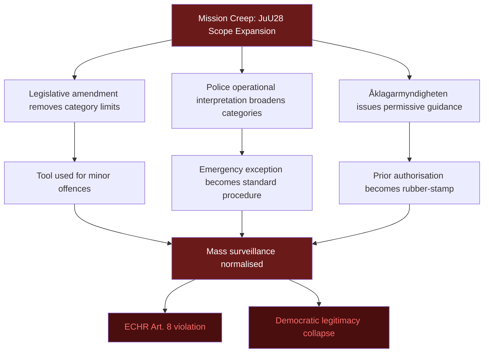

# Threat Analysis — Committee Reports 2026-05-22

**Framework**: STRIDE Threat Model adapted for democratic policy
**Date**: 2026-05-22 | **Analyst**: James Pether Sörling

---

## STRIDE Threat Classification

| ID | Threat | STRIDE Category | Severity | Source |
|----|--------|----------------|----------|--------|
| T1 | Mission creep — facial recognition scope expanded beyond initial use cases | Tampering / Elevation of Privilege | Critical | HD01JuU28 |
| T2 | Surveillance normalisation — public acceptance erodes privacy expectations | Repudiation | High | HD01JuU28 |
| T3 | Database breach — biometric data exfiltrated from Polismyndigheten systems | Information Disclosure | Critical | HD01JuU28 |
| T4 | False positive targeting minority communities | Information Disclosure / DoS | High | HD01JuU28 |
| T5 | Area cooperation fee used as precedent for broader urban levies | Elevation of Privilege | Medium | HD01CU36 |
| T6 | Hydropower derogation triggers EU Green Deal pushback | Denial of Service (regulatory) | Medium | HD01CU41 |
| T7 | Cash law rollback under EMU pressure | Tampering | Low | HD01FiU39 |

---

## Threat Actor Profiles

### TA1: Gang Criminal Networks (JuU28 Primary Threat Target)

**Capability**: HIGH — well-resourced, technologically adaptive
**Intent**: Evade facial recognition deployment by wearing disguises, targeting police systems for intelligence about deployment locations
**Likely tactics**:
- Counter-surveillance (face coverings, gait modification)
- Corruption of law enforcement to learn facial recognition deployment schedules
- False positive seeding — planting biometric spoofs to discredit the system

**Implication for JuU28**: The law's effectiveness depends on operationally secure deployment protocols. If criminal networks learn deployment patterns through intelligence sources, the tool's crime-deterrence value evaporates.

---

### TA2: Foreign State Actors (JuU28 Data Security Threat)

**Capability**: VERY HIGH — nation-state level
**Intent**: Access facial recognition database to identify Swedish intelligence officers, informants, foreign nationals of interest
**Likely tactics**:
- Supply chain attack on facial recognition technology provider
- Social engineering or cyber intrusion into Polismyndigheten biometric database
- Insider threat recruitment

**Implication**: Sweden's biometric database, if collected at scale under JuU28, becomes a high-value intelligence target. The National Cyber Security Centre (NCSC-SE) and SÄPO must be directly involved in the security architecture of any biometric database created under this law.

---

### TA3: Civil Liberties Organisations (JuU28 Accountability Actors)

**Capability**: MEDIUM — legal resources, media reach
**Intent**: Challenge the law through courts and media; document misuse
**Tactics**:
- FOI requests for deployment statistics
- GDPR Art. 15 access requests from individuals subject to facial recognition
- ECtHR applications
- Parliamentary interpellations

**Implication**: This is a legitimate accountability threat — the governance structure of JuU28 must be robust enough to withstand adversarial transparency testing. JuU28's procedural safeguards are designed partly in anticipation of this.

---

### TA4: EU Commission (CU41 Regulatory Threat)

**Capability**: HIGH — infringement powers, financial penalties
**Intent**: Ensure Sweden complies with Habitats Directive requirements
**Tactics**:
- Formal EU Pilot inquiry followed by infringement proceedings
- Article 260 penalty petition if Sweden delays compliance
- EU Council political pressure

**Implication for CU41**: The Swedish government must maintain detailed documentation of how each hydropower case invoking CU41 exceptions meets the strict "imperative reasons of overriding public interest" threshold under Habitats Directive Art. 6(4).

---

## Threat Tree — JuU28 Mission Creep

---

## Mitigation Framework

| Threat | Control | Control Type | Responsibility |
|--------|---------|-------------|----------------|
| T1 Mission creep | Hard statutory category limits + annual Riksdag review | Preventive | JuU / Riksdag |
| T2 Normalisation | Civil society advisory board; annual IMY report to Riksdag | Detective | IMY / Civil society |
| T3 Database breach | NCSC-SE security audit; air-gapped biometric storage; no commercial cloud | Preventive | Polismyndigheten + NCSC-SE |
| T4 False positives | Mandatory demographic bias testing; transparent statistics | Corrective | Polismyndigheten / IMY |
| T5 Levy precedent | Legal uncertainty clause in CU36 law | Preventive | Riksdag |
| T6 EU pushback | Maintain Art. 6(4) documentation; proactive Commission dialogue | Preventive | Government |
