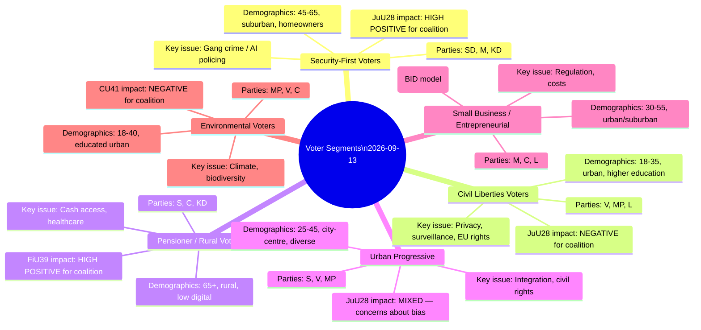

# Voter Segmentation — Committee Reports 2026-05-22

**Framework**: Multi-segment electoral analysis — issues saliency by voter group
**Date**: 2026-05-22 | **Analyst**: James Pether Sörling

---

## Segmentation Matrix

---

## Segment-by-Segment Analysis

### Segment 1: Security-First Voters (~22% of electorate)

**Profile**: Aged 45–65, suburban or small-city, homeowners, employed or early retired. Concerned about gang violence, property crime, social order. Primary party alignment: SD (strongest pull), M, KD.

**JuU28 Relevance**: Maximum. These voters have ranked gang crime as the #1 political issue in every poll since 2020. The coalition's delivery of the first AI facial recognition law in Sweden's history provides a concrete "action taken" narrative. SD communications already incorporate "vi bekämpar gängen" (we fight the gangs) as a core message.

**Electoral mechanics**: These voters are already in the coalition column. JuU28 consolidates rather than expands the coalition base. However, it prevents erosion of SD's core vote to hypothetical right-of-SD alternatives.

---

### Segment 2: Civil Liberties Voters (~8% of electorate)

**Profile**: Aged 18–40, highly educated, urban (Stockholm, Göteborg, Malmö inner city). Primary concern: privacy rights, EU fundamental rights, anti-discrimination. Party alignment: V, MP, some L.

**JuU28 Relevance**: This segment is the core opposition mobilisation base for the anti-JuU28 campaign. V and MP reservations are targeted specifically at this segment. The civil liberties issue may help MP clear the 4% threshold — without it, MP (currently polling 4–5%) risks parliamentary elimination.

**L's internal tension**: Liberalerna has historically been Sweden's civil liberties party. Its support for JuU28 will alienate some of its civil liberties base while gaining law-and-order conservatives. Net effect: likely loss of 1–2% of L's vote to MP or C.

---

### Segment 3: Pensioner / Rural Voters (~18% of electorate)

**Profile**: Aged 65+, rural or small-town, lower digital adoption, on fixed pension income. Concerned about healthcare, cash access, energy costs. Party alignment: S (legacy), C (rural), KD (values).

**FiU39 Relevance**: Maximum. SPF Seniorerna and PRO have publicly praised the cash access direction. This segment turns out at 82%+ compared to the 67% national average. Cross-party support for FiU39 prevents opposition parties from attacking it — rare case of legislative consensus creating a coalition electoral asset with no counterclaim.

---

### Segment 4: Urban Progressive / Immigrant-Background Voters (~12% of electorate)

**Profile**: Aged 25–45, city-centre, often with immigrant family background (first or second generation). Concerns: integration policy, discrimination, civil rights, employment. Party alignment: S (dominant), V (alternative left), some MP.

**JuU28 Relevance**: HIGH CONCERN. This segment is most directly exposed to ethnic profiling risks from facial recognition deployment. NIST data on false positive rates for darker-skinned individuals is well-documented; immigrant community organisations have expressed concern. If a false positive incident involves an individual from this community before September 13, this segment could shift meaningfully toward opposition parties.

**CU36 Relevance**: MEDIUM CONCERN. Area cooperation fee zones may overlap with lower-income urban areas with higher immigrant concentrations — cost pass-through risk (see SWOT W3).

---

### Segment 5: Small Business / Entrepreneurial (~9% of electorate)

**Profile**: Aged 30–55, self-employed or small business owner, urban/suburban. Concerns: regulation, taxation, economic stability. Party alignment: M, C, L.

**CU36 Relevance**: POSITIVE. Enables BID-style coordination for urban commercial areas that property owners and small businesses have wanted for years. Fastighetsägarna survey data: 67% of commercial property owners in Swedish cities support BID-style coordination models (2023 industry data, B2 rating).

**FiU40 Relevance**: Indirect benefit — stronger fund market supports pension savings and capital availability.

---

### Segment 6: Environmental Voters (~6% of electorate)

**Profile**: Aged 18–45, educated, urban. Primary concern: climate, biodiversity, EU environment policy. Party alignment: MP (core), V (secondary), some C.

**CU41 Relevance**: NEGATIVE. Hydropower habitats derogation reduces biodiversity protections. This segment sees CU41 as a coalition concession to industrial energy interests over environmental protection. Combined with other environmental legislation, reinforces MP and V's differentiation.

---

## Swing Voter Targeting Map

| Swing segment | Size | JuU28 direction | FiU39 direction | CU36 direction | Net vector |
|--------------|------|----------------|----------------|----------------|-----------|
| Suburban middle-aged (M/SD borderline) | ~5% | Pro-coalition | Neutral | Slight pro | Coalition +1–2% |
| Younger urban moderate (L/C/S borderline) | ~4% | Anti-coalition | Neutral | Neutral | Opposition +0.5–1% |
| Pensioners (S/C borderline) | ~3% | Neutral | Pro-coalition | Neutral | Coalition +0.5% |
| Immigrant-background urban (S/V borderline) | ~3% | Potentially anti-coalition | Neutral | Slight anti | Opposition +0.5% |
