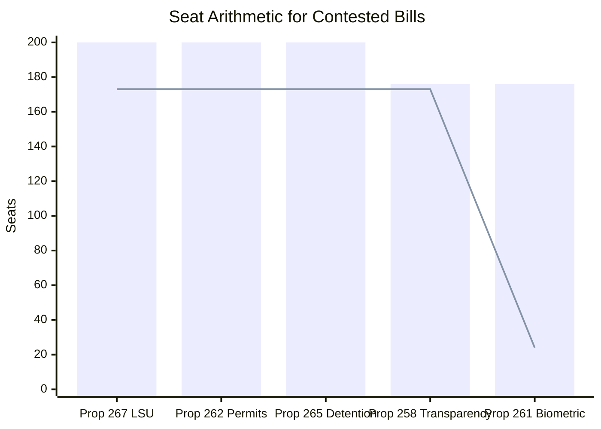

# Coalition Mathematics — Opposition Motions, 2026-05-22

**Date**: 2026-05-22 | **Riksmöte**: 2025/26

---

## Riksdag Composition (2025/26)

| Party | Seats (approx) | Bloc |
|-------|---------------|------|
| S | 107 | Opposition |
| SD | 73 | Government |
| M | 68 | Government |
| V | 24 | Opposition |
| C | 24 | Swing / Opposition-leaning |
| MP | 18 | Opposition |
| KD | 19 | Government |
| L | 16 | Government |
| **Total** | **349** | — |

**Government (Tidö)**: SD + M + KD + L = 176 seats
**Opposition block**: S + V + MP = 149 seats
**C**: 24 seats — pivotal actor

**Majority required**: 175 (simple majority = >174)

---

## Contested Bill Arithmetic

### Prop. 2025/26:267 — LSU Security Expansion (JuU)

| Scenario | For | Against | Outcome |
|----------|-----|---------|---------|
| C votes with government | 176+24=200 | 149 | **Government wins** |
| C votes with opposition | 176 | 149+24=173 | Still government wins (176>175) |
| C + one more defector | depends | 149+24+X | Unlikely; L/KD solid |

**Conclusion**: Government wins this bill regardless of C. V's constitutional challenge is symbolically powerful but arithmetically irrelevant. **Government passes LSU with certainty.**

### Prop. 2025/26:262 — Permanent Permit Abolition (SfU)

| Scenario | For | Against | Outcome |
|----------|-----|---------|---------|
| C votes with government | 176+24=200 | 149 | **Government wins** |
| C votes against (HD024157 signal) | 176 | 149+24=173 | Government still wins (176>173 but 176>175 threshold) |

**Conclusion**: Government also wins this bill regardless of C, because SD+M+KD+L = 176 ≥ 175. C alone cannot block.

**Critical implication**: V, S, C, and MP combined = 173 seats. They are ONE seat short of a majority. The government's single-seat majority in practice means government wins all votes where its bloc is united.

### Prop. 2025/26:265 — Extended Detention (SfU)

Same arithmetic as prop. 262. Government wins even with full opposition bloc including C.

### Prop. 2025/26:258 — Union Transparency (KU)

**This is the exception case.** Here C and S BOTH oppose.

| Scenario | For | Against | Outcome |
|----------|-----|---------|---------|
| C opposes, S opposes | 176 | 149+24=173 | Government wins (176>175) |

**But**: If even one KD, L, or M member votes against or abstains:
- 175 | 173 = tied → Sweden's riksdag: ties go to status quo (no) = **government LOSES**

**Conclusion**: Prop. 258 is genuinely vulnerable. With C + S in opposition = 173. Government needs ALL 176 of its own members to vote in favour. Any single defection from KD/L/M bloc = government defeat. This makes the union transparency bill the only plausible government defeat among the contested bills.

### Prop. 2025/26:261 — Biometric Database (SkU)

Only V opposes (24 seats). All other parties including S, C, MP are not filing counter-motions suggesting acceptance. Government wins comfortably (176 v 24 opposition).

### Prop. 2025/26:255 — Household Debt Data (FiU)

Opposition motion HD024185 (S) and HD024186 (MP) demand more, not less. Government's bill is likely to pass; opposition's amendments to expand will fail. Government wins: 176 vs 149 on the base bill.

---

## Key Mathematical Finding

**Government has a structural 3-seat majority** (176 vs 173 maximum opposition including C). This means:
- No single party defection from government can cause defeat
- Opposition needs to split government bloc, not just unite opposition
- **The union transparency bill (prop. 258) is the only bill where government could realistically lose** — it requires perfect government discipline, and C+S opposition is confirmed

---

## Mermaid: Coalition Arithmetic Visualisation

*Blue bars: government coalition votes. Red line: maximum opposition votes.*

---

## Implications for C as Pivotal Actor

While C cannot mathematically defeat any bill unilaterally, its **public vote signals** have high electoral value:
- A C "no" vote on prop. 262 demonstrates liberal independence even in defeat
- A C "yes" vote = narrative collapse; C voters move to S or MP
- The government likely does NOT need C's votes — this gives C genuine freedom to vote against without damaging the government's legislative programme

**Recommendation for C** (from opposition perspective): Vote against at least one migration bill; accept defeat gracefully; claim electoral credit for principled opposition.
