# Scenario Analysis — Opposition Motions, 2026-05-22

**Date**: 2026-05-22 | **Riksmöte**: 2025/26
**Horizon**: T+72h to T+120d (election horizon: September 2026)

---

## Scenario Framework

Four plausible futures contingent on the pivotal variable: **Centre Party (C) cooperation with government on SfU migration bills and KU transparency bill**.

---

### Scenario A — Government Wins All Contested Bills
**Probability**: 35%
**Preconditions**: C votes with government on props 262, 265, 258; Lagrådet does not issue adverse opinions; no ECHR/IMY intervention before votes
**Outcome**: All five contested propositions pass in plenary. Government secures full migration hardening package, biometric expansion, and union transparency law. V, S, MP motions all defeated.
**Intelligence significance**: Government enters September 2026 election having delivered core SD/M migration and security promises. S is electorally disadvantaged by union transparency law.
**Wildcards**: ECHR challenge to LSU post-implementation (T+1y+); IMY enforcement action on biometric database (T+6m+)

```mermaid
stateDiagram-v2
    [*] --> CCooperation: C votes with government
    CCooperation --> AllBillsPass: No adverse Lagrådet opinion
    AllBillsPass --> GovernmentElectoralBoost: Pre-election delivery narrative
    GovernmentElectoralBoost --> [*]
    style AllBillsPass fill:#1a3d2d,stroke:#00d9ff
```

---

### Scenario B — Government Defeats on Migration (SfU)
**Probability**: 30%
**Preconditions**: C votes with V and S on props 262 and/or 265 in SfU; Centre demands child-safe detention guarantees (HD024160) as minimum condition
**Outcome**: Props 262 or 265 (or both) fail in plenary or are significantly amended. C's defection forces government renegotiation. LSU prop 267 and biometric prop 261 may still pass.
**Intelligence significance**: Government loses its headline migration tightening agenda; SD is publicly embarrassed; M forced to renegotiate. This is the most electorally consequential scenario for the 2026 campaign.
**Wildcards**: Government calls snap confidence vote; SD withdraws support; M reconfigures coalition terms

---

### Scenario C — KU Defeat (Transparency Bill Fails)
**Probability**: 40%
**Preconditions**: C votes with S against prop. 2025/26:258 in KU committee; government lacks majority in plenary
**Outcome**: Union transparency bill withdrawn or defeated. Government suffers political embarrassment; M's "democratic transparency" agenda is discredited.
**Intelligence significance**: Most probable outcome given both C and S oppose. Less consequential than SfU defeat but signals government overreach. May be traded away in negotiations.
**Wildcards**: Government amends bill to symmetric disclosure (employer orgs included); C reversal

---

### Scenario D — Constitutional Crisis (Lagrådet/ECHR Intervention)
**Probability**: 15%
**Preconditions**: Lagrådet issues critical yttrande on prop. 267 (LSU) before JuU vote; JuU postpones vote pending revision; or ECHR interim measures on detained individuals under new LSU
**Outcome**: Security law agenda stalls; government forced to revise or withdraw prop. 267. V's constitutional arguments (HD024188) are publicly vindicated. Broader confidence in government's legislative quality undermined.
**Intelligence significance**: Historically rare (Lagrådet adverse opinions on security legislation have occurred — e.g., 2016 on certain surveillance powers). Would be maximum-impact event for opposition narrative.
**Wildcards**: Lagrådet issues advisory only; government overrides; constitutional court path (Sweden lacks constitutional court, so ECHR is the primary external check)

---

## Cross-Scenario PIR Monitoring

| PIR | Scenario relevance | Resolution trigger |
|-----|-------------------|-------------------|
| PIR-M001 (C defection SfU) | B (high) | C public statement or committee vote |
| PIR-M002 (Lagrådet on 267) | D (high) | Lagrådet website yttrande publication |
| PIR-M003 (KU majority) | C (high) | KU committee chair announcement |
| PIR-M004 (FiU debt data) | Minor | Riksbanken public testimony in FiU |
