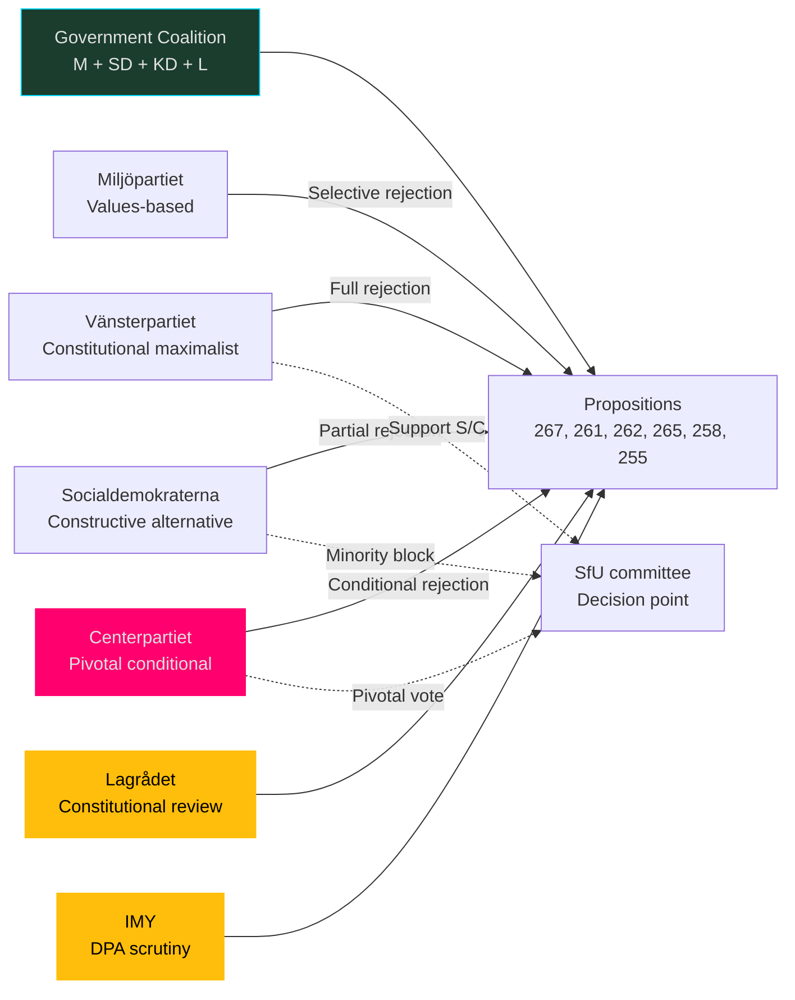

# Stakeholder Perspectives — Opposition Motions, 2026-05-22

**Date**: 2026-05-22 | **Riksmöte**: 2025/26

---

## Party Position Matrix

### Vänsterpartiet (V) — Most Active Opposition Actor

**Role**: Most prolific motion filer (4 motions on 2026-05-21)
**Core position**: Constitutional maximalism — reject all government security and migration expansions on rights grounds
**Key motions**: HD024188 (LSU), HD024187 (biometric Skatteverket), HD024170 (permanent permits), HD024167 (detention), HD024182 (detention alt), HD024183 (permits alt), HD024181 (addiction care)
**Strategy**: Document opposition systematically for electoral record; build ECHR/RF legal architecture for post-election challenges
**Constraints**: Ideologically isolated in JuU; no majority-building potential on security motions
**Electoral signal**: Framing 2026 election as referendum on "surveillance state" and "authoritarian migration policy"

### Socialdemokraterna (S) — Constructive Opposition

**Role**: Largest opposition party; constructive counter-proposals on several bills
**Core position**: Conditional opposition — accepts security framework but demands proportionality; demands more ambitious data policy; rejects targeted union transparency
**Key motions**: HD024185 (comprehensive debt registry), HD024153 (migration alternative model), HD024151 (reject union transparency law), HD024155 (addiction care guarantees)
**Strategy**: Moderate enough to attract C's support on some issues; distinct enough from V to differentiate
**Coalition potential**: S + C on SfU migration bills could defeat government
**Electoral signal**: "Strong but fair" migration policy; macroeconomic competence framing (Riksbanken data)

### Centerpartiet (C) — Pivotal Actor

**Role**: Coalition kingmaker on several bills; governing cooperation partner but independent on rights
**Core position**: Rights-conditionality on migration; symmetric disclosure on transparency; civic liberalism on biometrics
**Key motions**: HD024184 (union transparency — asymmetry argument), HD024160 (detention — child safeguards), HD024157 (migration — reject permanent permit abolition), HD024165 (cadastral systems)
**Strategy**: Maximise leverage as pivotal actor; signal independence from SD-dominated government agenda
**Coalition risk**: If C votes against SfU and KU bills, government faces multiple defeats in same session
**Electoral signal**: "Responsible liberal" counterweight to SD influence on migration

### Miljöpartiet (MP) — Values-Based Opposition

**Role**: Most active on EU foreign policy; supports V/S on migration and data
**Key motions**: HD024189/190 (EU-Central Asia partnerships), HD024186 (household debt + assets), HD024177 (addiction care), HD024184 (no joint motion but aligned with C/S on transparency)
**Strategy**: EU values conditionality as distinctive brand; privacy-as-rights argument on debt statistics
**Electoral signal**: Green/values-liberal positioning distinct from S and V

### Sverigedemokraterna (SD) — Government Partner

**Role**: Key government partner; supports all security/migration hardening
**Position on motions**: Opposes all opposition motions; filed own motion HD023434 on election security (2024/25 cycle)
**Strategy**: Claim credit for migration tightening as core electoral promise delivery
**Vulnerability**: Overreach risk if Lagrådet or ECHR criticises LSU implementation

### Moderaterna (M) — Governing Coalition Lead

**Role**: Primary government party; owns migration and security legislative agenda
**Position**: Supporting all propositions under challenge
**Vulnerability**: Union transparency bill's perceived political motivation (targeting S) may cost M centrist voters

---

## Stakeholder Power Map

## Non-Party Stakeholders

| Stakeholder | Position | Relevance |
|-------------|----------|-----------|
| Riksbanken | Supports comprehensive household debt data (HD024185) | FiU deliberation |
| Konjunkturinstitutet | Supports more data than proposed | FiU deliberation |
| Uppsala University | Supports comprehensive registry | FiU deliberation |
| IMY (Integritetsskyddsmyndigheten) | DPA scrutiny of biometric proposal | SkU deliberation |
| SÄPO | Supports security law expansion | JuU deliberation |
| UNHCR Sweden | Monitors permanent permit abolition | SfU deliberation |
| Civil society (RFSL, Amnesty) | Oppose detention extensions | SfU deliberation |
