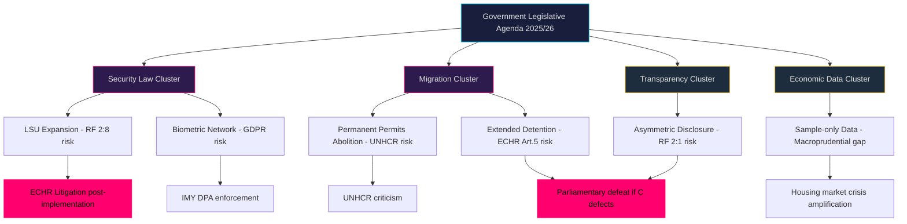

# Threat Analysis — Opposition Motions, 2026-05-22

**Framework**: Political-Threat Framework (Riksdagsmonitor)
**Date**: 2026-05-22 | **Riksmöte**: 2025/26

---

## Threat Vector Matrix

### T-Vector 1: Rule-of-Law Erosion (Constitutional)

**Threat**: Incremental erosion of constitutional protections through successive LSU amendments
**Actor**: Government coalition (SD, M, KD, L) + security bureaucracy (SÄPO, Migrationsverket)
**Attack surface**: RF 2:8 (personal liberty), RF 2:9 (protection from arbitrary detention), ECHR Art. 5
**Mechanism**: Each legislative cycle lowers the evidentiary threshold for detention/expulsion under LSU. V's HD024188 documents the progression: 2022 law already expanded detention, now 2025/26:267 expands further with vague "particularly warranted" test.
**Severity**: HIGH | **Probability**: HIGH | **Proximity**: Immediate (legislation pending)
**Countermeasure**: Lagrådet review; parliamentary rapporteur process; civil society litigation post-implementation

### T-Vector 2: Biometric Surveillance State Construction

**Threat**: Creation of de facto national biometric identification network via incremental database linking
**Actor**: Skatteverket, Migrationsverket, Polismyndigheten, Passmyndigheten
**Attack surface**: GDPR Art. 9 (biometric special category), purpose limitation principle
**Mechanism**: Prop. 2025/26:261 links Skatteverket civil registration biometrics to Migrationsverket and Police systems. Once established, cross-agency biometric matching creates infrastructure for expanded function creep in subsequent legislation.
**Severity**: HIGH | **Probability**: MEDIUM (legislation not yet enacted) | **Proximity**: Medium (entry into force December 2026)
**Countermeasure**: V's HD024187 judicial-proportionality challenge; IMY DPA scrutiny; sunset clause advocacy

### T-Vector 3: Migration Rights Degradation

**Threat**: Systematic removal of durable protection mechanisms for long-term residents
**Actor**: Government (SD agenda, M implementation)
**Attack surface**: UNHCR 1951 Convention obligations; EU asylum pact harmonisation; existing beneficiaries of permanent permits
**Mechanism**: Prop. 2025/26:262 abolishes permanent residence permits entirely, replacing with time-limited permits renewed under increasingly stringent conditions. This structurally disadvantages long-term residents who have organised their lives around settlement rights.
**Severity**: HIGH | **Probability**: HIGH (majority likely unless C defects) | **Proximity**: Immediate
**Countermeasure**: V, C, S opposition motions; SfU committee amendments; European Court of Human Rights challenge post-implementation

### T-Vector 4: Democratic Process Integrity

**Threat**: Targeted transparency legislation designed to financially disadvantage opposition parties
**Actor**: Government (SD, M) — prop. 2025/26:258 specifically targets LO-affiliated union funding to S
**Attack surface**: Party financing law; democratic competition; freedom of association (RF 2:1)
**Mechanism**: Disclosure requirements imposed asymmetrically: trade unions' political contributions to be disclosed without equivalent requirements on employer organisation contributions to centre-right parties. C and S both note the asymmetry (HD024184, HD024151).
**Severity**: MEDIUM | **Probability**: MEDIUM (legislation pending C vote) | **Proximity**: Medium-term
**Countermeasure**: C's HD024184 rejection (creates majority against); Parliamentary inquiry on symmetric disclosure

### T-Vector 5: Macroprudential Blind Spot

**Threat**: Regulatory data gap enabling systemic financial risk accumulation in household sector
**Actor**: Government's privacy-minimalism ideology blocking comprehensive data collection
**Attack surface**: Swedish housing market vulnerability; household over-indebtedness; systemic bank exposure
**Mechanism**: Sample-only household debt data (prop. 2025/26:255) leaves macroprudential regulators (Riksbanken, FI) without micro-data for stress testing. Multiple authorities have documented this gap in public remiss responses.
**Severity**: MEDIUM | **Probability**: LOW-MEDIUM (housing market stress required for acute impact) | **Proximity**: Long-term
**Countermeasure**: S's HD024185 comprehensive registry demand; FiU committee amendment; Riksbanken testimony

---

## Attack Surface Summary

## Procedural-Legitimacy Attack Surface

- **Lagrådet bypass risk**: If props 2025/26:267 or 261 were filed without full Lagrådet consultation, parliamentary opposition has procedural grounds to demand referral before committee vote
- **IMY consultation**: GDPR Art. 36 (prior consultation with supervisory authority) applies to high-risk processing of biometric data — absence of IMY opinion in legislative process is a procedural vulnerability
- **EU law compatibility**: Props implementing EU migration pact (262, 265) must comply with EU Charter of Fundamental Rights Art. 6 (liberty) and Art. 19 (protection against removal to country of serious harm)
