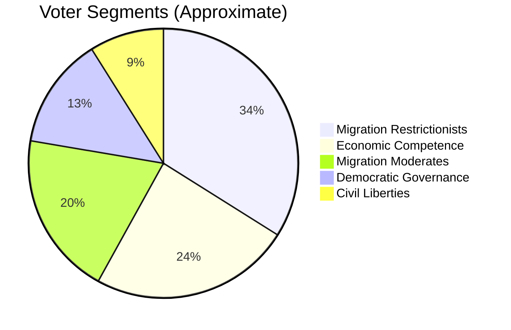

# Voter Segmentation Analysis — Opposition Motions, 2026-05-22

**Date**: 2026-05-22 | **Riksmöte**: 2025/26

---

## Segmentation Framework

Voter segments are defined by their relationship to the four contested legislative domains:
1. Security & surveillance (LSU, biometric)
2. Migration & detention (SfU)
3. Democratic transparency (KU)
4. Economic data (FiU)

---

## Segment Profiles

### Segment 1: Civil Liberties Voters (~8–12% of electorate)

**Profile**: Prioritise constitutional rights, privacy, rule of law; typically V, C-left, MP, or S-progressive
**Relevant motions**: HD024188 (V on LSU), HD024187 (V on biometric), HD024184 (C on asymmetric transparency)
**Response to government agenda**: Strongly negative — security expansion and biometric database are perceived as surveillance state
**Electoral destination**: V (primary); MP (secondary); C (conditional)
**Swing potential**: Low — firmly in opposition camp
**V's appeal to this segment**: V's constitutional maximalism is highly appealing; risk is V positions as "radical" rather than "governing alternative"

### Segment 2: Migration Restrictionists (~35–40% of electorate)

**Profile**: Support migration control, detention, restrict permanent permits; typically SD, M, KD voters; some S-right
**Relevant motions**: All SfU motions are counter-messages to this segment's preferences
**Response to opposition motions**: Dismissive — confirm opposition parties as "migration naive"
**Electoral destination**: SD (primary); M (secondary)
**Swing potential**: Low — government is delivering preferred policy
**Government appeal**: SD and M can claim migration hardening delivery as campaign promise fulfilled

### Segment 3: Migration Moderates (~20–25% of electorate)

**Profile**: Accept some migration control but concerned about rule of law, human rights, children in detention; typically C, S-moderate, MP
**Relevant motions**: HD024160 (C on child-safe detention), HD024157 (C on permanent permits), HD024153 (S alternative model)
**Response**: Responsive to C's conditionality framing — "we accept some control but not this extreme"
**Electoral destination**: C (primary); S-moderate (secondary)
**Swing potential**: HIGH — this is the decisive swing segment
**C's appeal**: C's HD024160 (child safeguards as condition) directly appeals to this segment

### Segment 4: Economic Competence Voters (~25–30% of electorate)

**Profile**: Prioritise macroeconomic stability, housing affordability, financial security; typically S, M, C
**Relevant motions**: HD024185 (S on debt registry — macroprudential framing)
**Response**: Responsive to S's expert-backed argument; concerned about housing debt risks
**Electoral destination**: S (primary on economic competence); M (primary on fiscal conservatism)
**Swing potential**: MEDIUM — S's debt registry argument resonates with economically concerned voters
**S's appeal**: Aligning with Riksbanken, KI, Uppsala University on data policy is a credibility signal

### Segment 5: Democratic Governance Voters (~15–20% of electorate)

**Profile**: Prioritise transparency, anti-corruption, political accountability; distributed across parties
**Relevant motions**: HD024184 (C), HD024151 (S) on union transparency
**Response**: Receptive to symmetry argument — "if unions must disclose, so must employer orgs"
**Electoral destination**: C (on liberal governance), S (on protecting labour movement funding)
**Swing potential**: MEDIUM — asymmetric transparency is politically readable to this segment

---

## Swing Voter Heat Map

*Note: Segments overlap; percentages represent primary priority attribution.*

---

## Key Insight: Migration Moderate Segment Is Decisive

The ~20–25% Migration Moderate segment is the decisive group in the 2026 election. This segment accepts some migration restriction but has specific red lines (children in detention, permanent residents' rights, ECHR compliance). Centre Party's motions speak directly to this segment; if C can maintain its independence narrative credibly (by actually voting against at least one migration bill), C will capture a disproportionate share of this segment's votes.

S's alternative model framing positions S as the "responsible migration management" party for voters who want change without authoritarian excess. But the lack of a fully specified alternative (HD024153) is a vulnerability.
