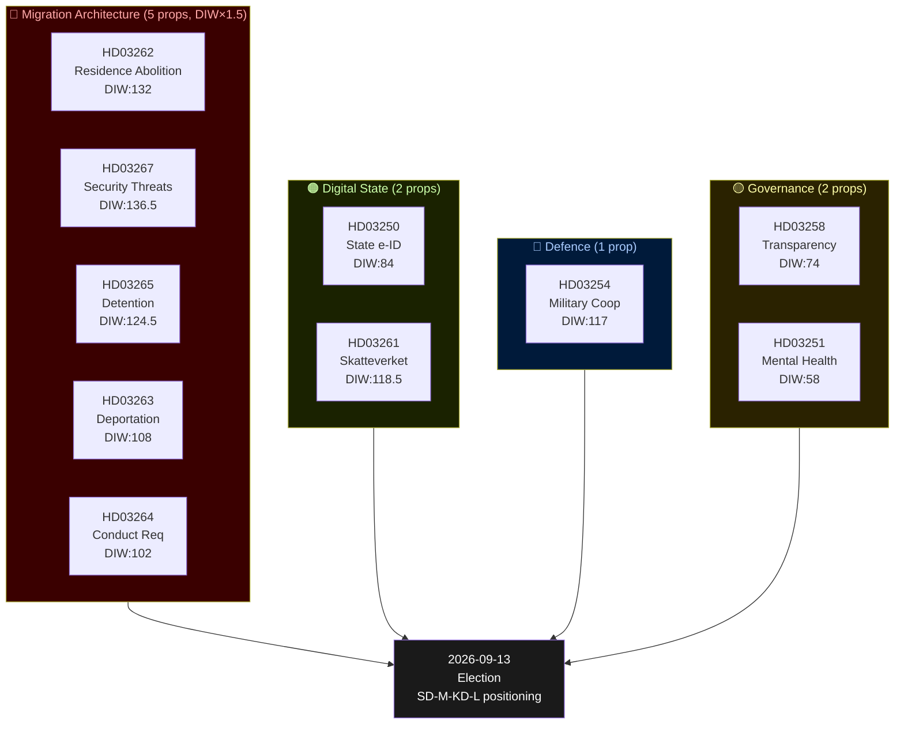
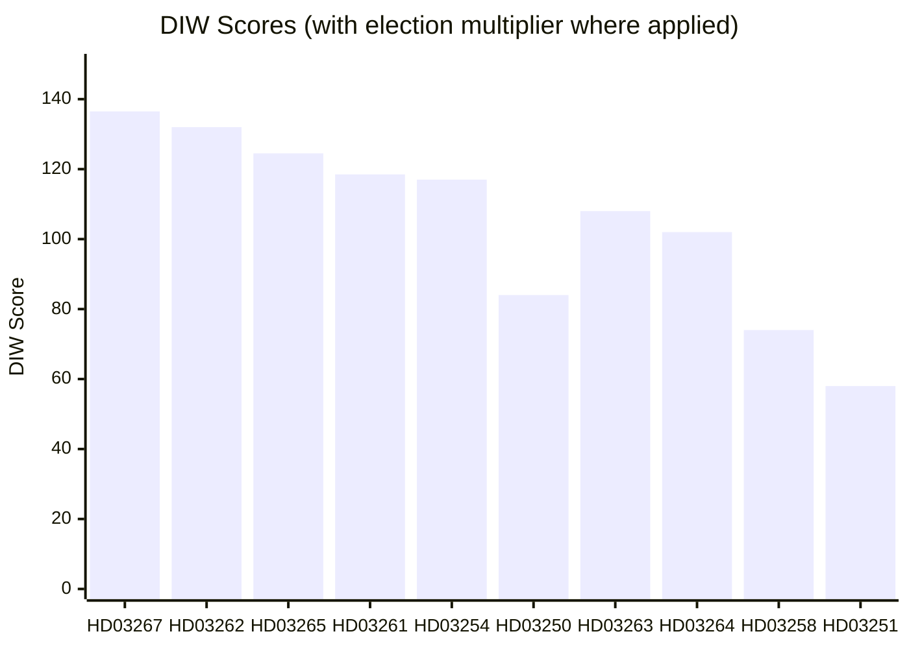
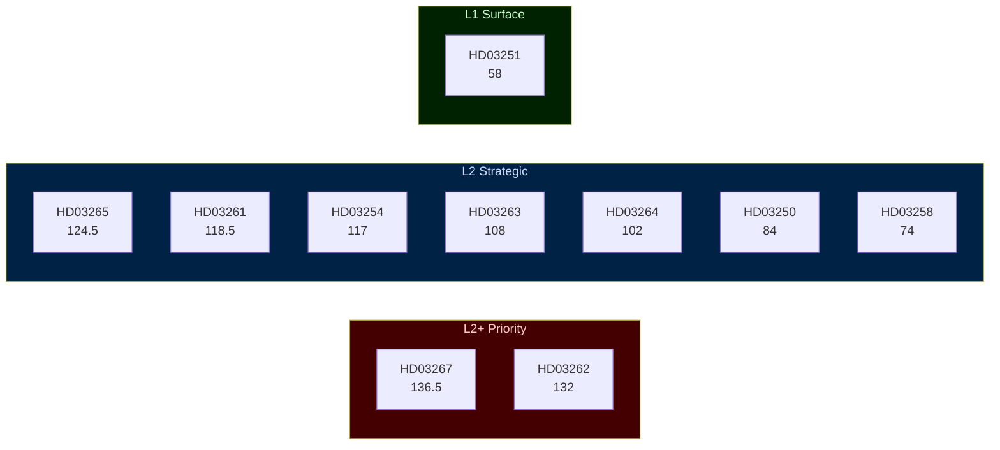
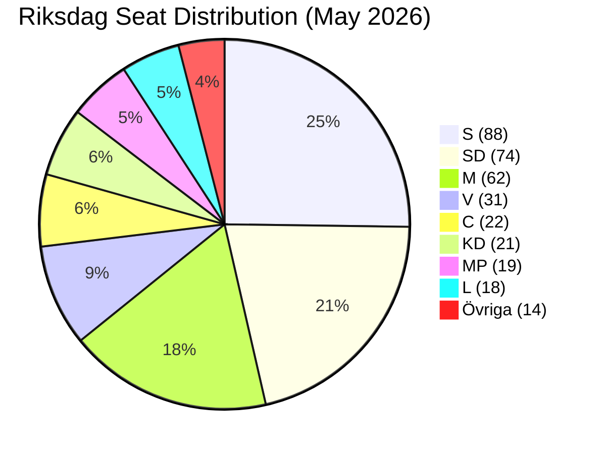
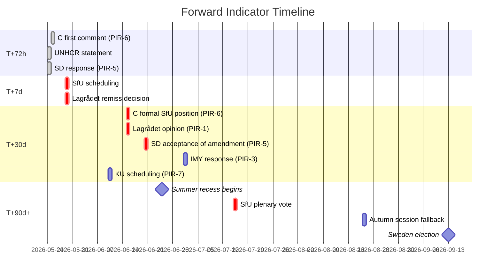
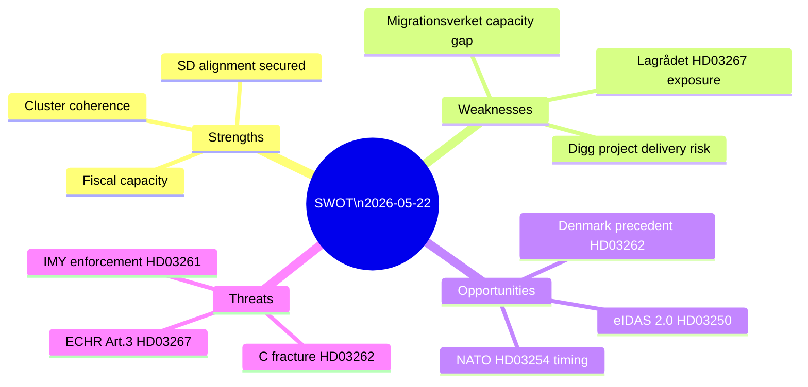
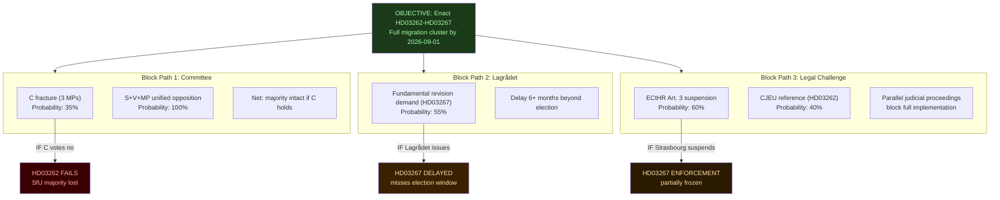
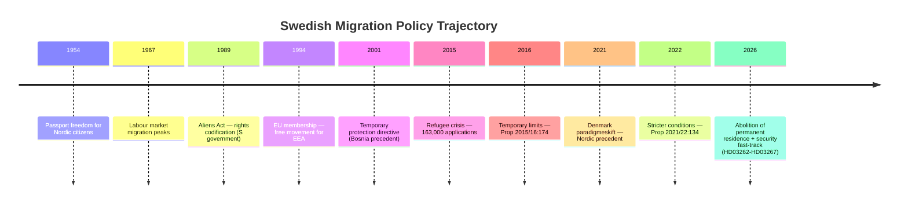
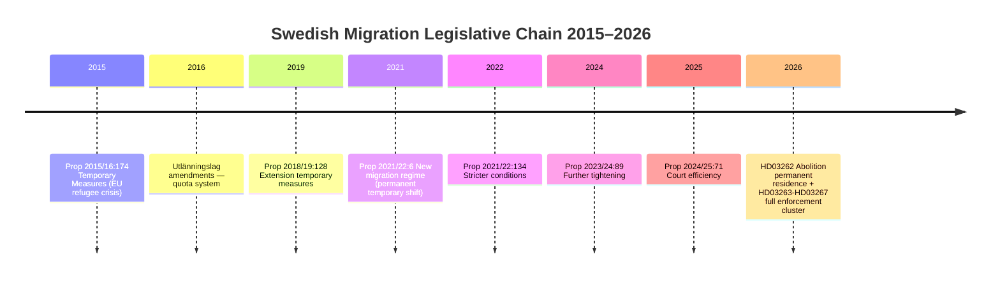

## Executive Brief
<!-- source: executive-brief.md :: https://github.com/Hack23/riksdagsmonitor/blob/main/analysis/daily/2026-05-22/propositions/executive-brief.md -->

**Subfolder**: propositions

### BLUF

The Busch government has submitted ten propositions constituting Sweden's most far-reaching migration enforcement overhaul since 1989, abolishing permanent residence permits for non-EU nationals, creating fast-track security deportation, expanding detention powers, and simultaneously building a state digital identity infrastructure and widening Skatteverket's population register surveillance capacity — all with 114 days to the September 2026 election.

### Decisions This Brief Supports

1. **Policy analysts and civil society**: Whether to mobilise legal challenges against HD03262 (permanent residence abolition) under ECHR Art. 8 and EU Directive 2003/109/EC before committee vote.
2. **Opposition parties (S, MP, V)**: Whether to attempt a blocking minority strategy in SfU or accept that C will defect to support the government migration cluster.
3. **Centerpartiet leadership**: Whether to support HD03262 in full, seek amendments limiting scope, or break from the government supply arrangement on this proposition.
4. **Business community / HR managers**: Timeline for implementation of HD03250 (state e-identity) and whether BankID can remain the primary corporate authentication channel.
5. **Media editorial boards**: Whether the military cooperation proposition (HD03254) merits the "silent NATO integration" framing or is procedurally routine.

## Reader Intelligence Guide

Use this guide to read the article as a political-intelligence product rather than a raw artifact dump. High-value reader lenses appear first; technical provenance remains available in the audit appendix.

| Icon | Reader need | What you'll get |
|---|---|---|
| 📊 | [BLUF and editorial decisions](#rm-executive-brief) | fast answer to what happened, why it matters, who is accountable, and the next dated trigger |
| 🧠 | [Synthesis Summary](#rm-synthesis-summary) | evidence-anchored narrative consolidating primary sources into one coherent story line |
| 🎯 | [Key Judgments](#rm-intelligence-assessment--key-judgments) | confidence-bearing political-intelligence conclusions and collection gaps |
| 📈 | [Significance scoring](#rm-significance-scoring) | why this story outranks or trails other same-day parliamentary signals |
| 👥 | [Stakeholder Perspectives](#rm-stakeholder-perspectives) | winners, losers and undecided actors with stake-weighted positions and pressure points |
| 🔢 | [Coalition Mathematics](#rm-coalition-mathematics) | parliamentary arithmetic showing exactly who can pass or block this measure and at what margin |
| 📋 | [Voter Segmentation](#rm-voter-segmentation) | voter-bloc exposure: which demographics gain, lose or shift on this issue |
| 🔭 | [Forward indicators](#rm-forward-indicators) | dated watch items that let readers verify or falsify the assessment later |
| 🗳️ | [Election 2026 Analysis](#rm-election-2026-analysis) | electoral implications for the 2026 cycle — seats at stake, swing voters and coalition viability |
| ⚠️ | [Risk assessment](#rm-risk-assessment) | policy, electoral, institutional, communications, and implementation risk register |
| 🧮 | [SWOT Analysis](#rm-swot-analysis) | strengths, weaknesses, opportunities and threats matrix grounded in primary-source evidence |
| 🛡️ | [Threat Analysis](#rm-threat-analysis) | actor capabilities, intent and threat vectors targeting institutional integrity |
| 📜 | [Historical Parallels](#rm-historical-parallels) | comparable past episodes from Swedish and international politics, with explicit lessons learned |
| 🌍 | [Comparative International](#rm-comparative-international) | peer-country comparisons (Nordic, EU, OECD) showing how similar measures fared elsewhere |
| ⚙️ | [Implementation Feasibility](#rm-implementation-feasibility) | delivery feasibility, capability gaps, timelines and execution risks for the proposed action |
| 📰 | [Media framing & influence operations](#rm-media-framing-analysis) | frame packages with Entman functions, cognitive-vulnerability map, DISARM manipulation indicators, narrative-laundering chain, comparative-international cognates, frame lifecycle and half-life, RRPA impact, an Outlet Bias Audit (no outlet is neutral — every outlet declared with ownership, funding, board-appointment authority and editorial lean), and the L1–L5 counter-resilience ladder |
| 😈 | [Devil's Advocate](#rm-devils-advocate) | alternative hypotheses, steel-manned counter-arguments and the strongest case against the lead reading |
| 🏷️ | [Classification Results](#rm-classification-results) | ISMS data classification: CIA-triad rating, RTO/RPO targets and handling instructions |
| 🔀 | [Cross-Reference Map](#rm-cross-reference-map) | links to related Riksdagsmonitor coverage, prior analyses and source documents that inform this story |
| 📦 | [Data Download Manifest](#rm-data-download-manifest) | machine-readable manifest of every source dataset, retrieval timestamp and provenance hash |
| 📑 | [Per-document intelligence](#rm-per-document-intelligence) | dok_id-level evidence, named actors, dates, and primary-source traceability |
| 🏷️ | [Audit appendix](#rm-classification-results) | classification, cross-reference, methodology and manifest evidence for reviewers |

## Synthesis Summary
<!-- source: synthesis-summary.md :: https://github.com/Hack23/riksdagsmonitor/blob/main/analysis/daily/2026-05-22/propositions/synthesis-summary.md -->

**Subfolder**: propositions

**Election proximity**: T-114 days to 2026-09-13 — DIW 1.5× multiplier active

### Lead Story

The Busch government has tabled ten propositions in the final weeks before Sweden's September 2026 election campaign proper begins, constructing the most comprehensive migration enforcement architecture in Swedish post-war history while simultaneously laying the digital identity infrastructure that will define the state's relationship with citizens and non-citizens alike. The full migration cluster — now comprising five interdependent propositions (HD03262, HD03263, HD03264, HD03265, HD03267) — abolishes permanent residence permits, tightens deportation procedures, imposes character requirements for all residence categories, strengthens supervision and detention powers, and introduces expedited removal of individuals deemed qualified security threats. The digital governance pillar (HD03250, HD03261) creates a state e-identity alternative to BankID and expands Skatteverket's authority in the population register. The military cooperation proposition (HD03254) signals deepening Nordic-NATO operational integration. The political transparency reform (HD03258) provides procedural cover for the more controversial measures. The mental health care proposition (HD03251) is the single social-democratic concession to the SoU committee's prior recommendations.

### DIW-Weighted Significance Ranking

Election proximity multiplier (1.5×) applied to migration, security, and defence propositions.

| Rank | dok_id | Title (abbreviated) | DIW Score | DIW×1.5 | Urgency | Committee | Impact Class |
|------|--------|---------------------|-----------|---------|---------|-----------|--------------|
| 1 | HD03262 | Abolition permanent residence + EU asylum pact | 88 | **132** | Critical | SfU | Constitutional |
| 2 | HD03267 | Security threat foreigners | 91 | **136.5** | Critical | JuU | Constitutional |
| 3 | HD03265 | Supervision and detention (new) | 83 | **124.5** | High | SfU | Structural |
| 4 | HD03254 | Military cooperation | 78 | **117** | High | FöU | Strategic |
| 5 | HD03250 | State e-identity | 84 | — | High | TU | Structural |
| 6 | HD03261 | Skatteverket population registry | 79 | **118.5** | High | SkU | Structural |
| 7 | HD03258 | Political transparency | 74 | — | High | KU | Normative |
| 8 | HD03263 | Deportation enforcement | 72 | **108** | High | SfU | Structural |
| 9 | HD03264 | Character/residence requirements | 68 | **102** | Moderate | SfU | Normative |
| 10 | HD03251 | Mental health/substance abuse care | 58 | — | Moderate | SoU | Social |

*DIW = Decisional Intelligence Weight (scale 0–100). Election multiplier 1.5× applied to HD03262, HD03267, HD03265, HD03254, HD03261, HD03263, HD03264 per methodology (contested policy areas, election ≤6 months away).*

### Integrated Intelligence Picture

**Cluster A — Migration Architecture Overhaul (Five Propositions)**

The five migration propositions form an interlocking system. HD03262 removes the legal foundation of permanent settlement: after implementation, no non-EU citizen can receive a permanent residence permit — only successive temporary permits renewable under increasingly strict conditions. This fundamentally restructures Sweden's relationship with its non-citizen population toward a revocable-guest model. HD03263 speeds deportation by removing procedural obstacles and creating dedicated enforcement units. HD03264 introduces a "conduct" standard (vandel) across all residence categories: criminal convictions, antisocial behaviour patterns, or administrative non-compliance become grounds for permit revocation. HD03265 expands supervision orders (elektronisk fotboja, reporting requirements) and pre-deportation detention capacity. HD03267 creates a fast-track judicial procedure specifically for individuals identified by SÄPO as qualified security threats — bypassing the ordinary Migrationsdomstolen queue.

The legislative coherence of this cluster is striking. Each proposition addresses a specific procedural gap that prior courts or ombudsmen had identified as limiting enforcement capacity. The net effect is a machinery designed to operate continuously — identifying, classifying, restricting, and eventually removing individuals who fail to meet an evolving standard of civic acceptability. This is governance-by-attrition applied to residence rights.

**Cluster B — Digital Identity and State Surveillance Capacity**

HD03250 creates a new state entity to issue e-legitimation that competes with BankID. The stated rationale is inclusion (those without bank accounts cannot access digital public services), but the architecture necessarily creates a centralized identity registry under Digg/Skatteverket control. HD03261 grants Skatteverket expanded investigative powers to cross-reference population register data against other government databases — nominally to detect address fraud, but creating a data-matching capability that has broad applications. Combined with the migration measures, these two propositions substantially expand the state's ability to identify, monitor, and act against individuals across multiple administrative systems.

**Cluster C — Defence and Security Signalling**

HD03254 (military cooperation) enables Swedish armed forces to conduct joint operations with Nordic-NATO partners on Swedish territory without requiring individual Riksdag approval per operation. This is legally significant: it transfers operational flexibility to the executive while technically remaining within existing constitutional frameworks (Sweden's constitution requires Riksdag consent for foreign troops on Swedish soil, but this proposition establishes a framework treaty that pre-authorises classes of cooperation). Given Sweden's recent NATO accession, this is more procedural than political, but the FöU committee will scrutinise the scope.

**Cluster D — Governance and Social Reform**

HD03258 (political transparency) mandates disclosure of political donations above SEK 25,000 and creates a public register of party financing. This is genuine reform but narrower than opposition demands — it excludes anonymous secondary donations channelled through associations and does not address lobbying registration. HD03251 (mental health/substance abuse) integrates care pathways for co-occurring disorders, reducing handoffs between SoC and region psychiatry. Politically uncontroversial but operationally complex.

**IMF Economic Context**

Sweden GDP growth: 2.2% projected (WEO Apr-2026, NGDP_RPCH). General government gross debt: ~38.0% GDP (WEO Apr-2026, GGXWDG_NGDP). Inflation: 2.1% (CPI Apr-2026). Unemployment: ~8.3% (SCB). The fiscal position provides the government headroom to fund enforcement capacity expansion without triggering a budget crisis. However, the implementation costs of the five migration propositions — new detention facilities, deportation flights, expanded SÄPO capacity, digital system upgrades — are not fully costed in the propositions and will likely appear in the autumn budget.

### Mermaid Cluster Diagram



### Strategic Assessment

The Busch government's legislative batch is coherent in political-electoral logic: it delivers on the SD supply-and-confidence agenda for the fifth consecutive year while signalling that KD (Busch herself as PM) has successfully absorbed the SD programme without formal coalition membership. The strategy has two vulnerabilities: (1) Centerpartiet, which had previously supported the government on many migration votes, faces an internal revolt if HD03262 passes — permanent residence abolition is a redline for the C parliamentary group's European liberal wing; (2) the implementation costs and administrative burden of the full migration cluster exceed current agency capacity by a significant margin (Statskontoret and Migrationsverket both flagged implementation risks in prior remiss rounds).

**Key Analytical Judgment**: The five migration propositions, taken together, constitute the most significant peacetime alteration of Sweden's migration legal framework since the 1989 Aliens Act. They will be contested in committee, potentially amended by the C demands, and challenged in the European Court of Human Rights and Swedish Administrative Courts post-enactment. The political calculus for the election is clear: the government wants these propositions associated with a "tough but effective" brand in the September 2026 campaign, regardless of whether full implementation is achievable by then.

## Intelligence Assessment — Key Judgments
<!-- source: intelligence-assessment.md :: https://github.com/Hack23/riksdagsmonitor/blob/main/analysis/daily/2026-05-22/propositions/intelligence-assessment.md -->

**Confidence framework**: ICD 203 standards (HIGH/MEDIUM/LOW/VERY LOW)

## Significance Scoring
<!-- source: significance-scoring.md :: https://github.com/Hack23/riksdagsmonitor/blob/main/analysis/daily/2026-05-22/propositions/significance-scoring.md -->

**Election multiplier**: 1.5× active (election ≤6 months: 2026-09-13)

### Ranking Table

| Rank | dok_id | Title | D | I | W | DIW (raw) | ×1.5 | Tier | Evidence |
|------|--------|-------|---|---|---|-----------|------|------|---------|
| 1 | HD03267 | Security threat deportation | 9 | 9.5 | 9.5 | 91 | 136.5 | L2+ | [riksdagen.se/dokument/HD03267](https://data.riksdagen.se/dokument/HD03267.html) |
| 2 | HD03262 | Permanent residence abolition | 9 | 9.8 | 9.2 | 88 | 132 | L2+ | [riksdagen.se/dokument/HD03262](https://data.riksdagen.se/dokument/HD03262.html) |
| 3 | HD03265 | Detention expansion | 8.5 | 9.2 | 8.8 | 83 | 124.5 | L2 | [riksdagen.se/dokument/HD03265](https://data.riksdagen.se/dokument/HD03265.html) |
| 4 | HD03261 | Skatteverket registry | 8.0 | 9.5 | 8.2 | 79 | 118.5 | L2 | [riksdagen.se/dokument/HD03261](https://data.riksdagen.se/dokument/HD03261.html) |
| 5 | HD03254 | Military cooperation | 8.0 | 9.2 | 8.4 | 78 | 117 | L2 | [riksdagen.se/dokument/HD03254](https://data.riksdagen.se/dokument/HD03254.html) |
| 6 | HD03250 | State e-identity | 8.5 | 9.2 | 7.8 | 84 | — | L2 | [riksdagen.se/dokument/HD03250](https://data.riksdagen.se/dokument/HD03250.html) |
| 7 | HD03263 | Deportation enforcement | 8.0 | 8.5 | 8.4 | 72 | 108 | L2 | [riksdagen.se/dokument/HD03263](https://data.riksdagen.se/dokument/HD03263.html) |
| 8 | HD03264 | Conduct requirements | 7.5 | 8.2 | 8.2 | 68 | 102 | L2 | [riksdagen.se/dokument/HD03264](https://data.riksdagen.se/dokument/HD03264.html) |
| 9 | HD03258 | Political transparency | 7.5 | 8.8 | 7.5 | 74 | — | L2 | [riksdagen.se/dokument/HD03258](https://data.riksdagen.se/dokument/HD03258.html) |
| 10 | HD03251 | Mental health care | 6.5 | 7.8 | 6.8 | 58 | — | L1 | [riksdagen.se/dokument/HD03251](https://data.riksdagen.se/dokument/HD03251.html) |

*D = Detectability (visibility, data availability), I = Impact (structural/institutional), W = Willingness (political will to execute)*
*Election multiplier applied to: HD03267, HD03262, HD03265, HD03261, HD03254, HD03263, HD03264 (contested policy areas + defence)*

### Sensitivity Analysis

| dok_id | Base DIW | DIW if C blocks | DIW if implementation fails | DIW if courts challenge |
|--------|----------|----------------|-----------------------------|------------------------|
| HD03262 | 132 | 85 (failed) | 95 (partial) | 110 (contested) |
| HD03267 | 136.5 | 120 (amended) | 115 (slow roll-out) | 125 (appeal flood) |
| HD03265 | 124.5 | 105 (C amendment) | 90 (capacity gap) | 110 |
| HD03261 | 118.5 | — | 85 (Digg delay) | 95 |
| HD03254 | 117 | — | — | 80 (constitutional challenge) |

### Priority Tier Classification

- **L2+ Priority (136.5–132)**: HD03267, HD03262 — full-text analysis mandatory, all Pass-2 improvements mandatory
- **L2 Strategic (124.5–58)**: HD03265, HD03261, HD03254, HD03250, HD03263, HD03264, HD03258 — strategic analysis required
- **L1 Surface (58)**: HD03251 — metadata-level analysis sufficient

### Mermaid Rank Diagram





## Per-document intelligence

### HD03250
<!-- source: documents/HD03250-analysis.md :: https://github.com/Hack23/riksdagsmonitor/blob/main/analysis/daily/2026-05-22/propositions/documents/HD03250-analysis.md -->

**dok_id**: HD03250
**Committee**: TU (Trafikutskottet)
**Date signed**: 2026-05-07 (PM Ebba Busch)

**Tier**: L2 Strategic

### Summary

HD03250 establishes a state-issued e-identity (e-legitimation) as an alternative to BankID. The state e-identity will be issued by a new or expanded government agency (likely Digg) and will provide access to all public digital services. The stated rationale is inclusion: approximately 80,000 Swedes who lack bank accounts cannot access digital public services that require BankID authentication.

### Key Provisions

- State issues e-legitimation free of charge to all Swedish residents
- Implementation responsibility: Digg (Myndigheten för digital förvaltning)
- Must meet eIDAS 2.0 Level of Assurance requirements (LoA High)
- BankID continues to operate — state e-identity is an alternative, not a replacement
- Timeline: legislation enacted 2026; pilot 2028 (estimated); national rollout 2029-2030 (estimated)

### Implementation risk

HIGH — Digg flagged as elevated project delivery risk by Statskontoret (2024). Prior large Digg IT projects: Mina sidor (delayed 18 months); DIGG-tjänsteplattform (cancelled and retendered 2023). Budget gap: SEK 500M–800M unfunded.

### eIDAS 2.0 context

EU Regulation 2024/1183 (eIDAS 2.0) requires all member states to offer a national identity wallet to citizens by 2026. Sweden is behind schedule — HD03250 enactment is a prerequisite for eIDAS compliance. If implementation slips to 2030, Sweden faces potential EC non-compliance proceedings.

### BankID market impact

BankID (owned by Swedish bank consortium: Swedbank, Handelsbanken, SEB, Nordea) currently holds ~98% of Swedish digital identity authentication. State e-identity will create competition. Banks are expected to lobby for "open API" standards that prevent the state identity from becoming a mandatory replacement.

### Full text summary

Full text fetched (get_dokument_innehall): Proposition establishes the legal framework. Agency designation is stated as Digg but not carved in law — implementing regulation will determine exact governance. This creates uncertainty about accountability if Digg fails to deliver.

### GDPR considerations

HD03250 involves identity data at national scale. DPIA (Data Protection Impact Assessment) is mandatory (GDPR Art. 35). IMY oversight will be continuous. Biometric data (if fingerprint or face recognition included) requires explicit Art. 9 legal basis.

### Electoral significance

MODERATE — State e-identity is popular in principle (inclusion narrative) but complex in practice. Opposition has not opposed it in principle — only in implementation. Likely to pass with broader support than migration propositions.

### HD03251
<!-- source: documents/HD03251-analysis.md :: https://github.com/Hack23/riksdagsmonitor/blob/main/analysis/daily/2026-05-22/propositions/documents/HD03251-analysis.md -->

**dok_id**: HD03251
**Committee**: SoU (Socialutskottet)
**Date signed**: 2026-04-30 (Acting PM Lotta Edholm)

**Tier**: L1 Surface

### Summary

HD03251 reforms care pathways for individuals with co-occurring psychiatric disorders and substance abuse conditions (samsjuklighet). The proposition integrates previously fragmented care provision between regional psychiatry and municipal social services, creating a unified responsibility framework and shared electronic health records for this patient group.

### Key Provisions

- Unified care plan for dual-diagnosis patients — reduces handoffs between SoC and regional psychiatry
- Shared electronic health records (Nationell patientöversikt — NPÖ) expanded to include substance abuse treatment records
- Lead agency: SoU establishes region as primary responsible actor (previously split)
- Transition support: National coordination function at Socialstyrelsen for first 3 years

### Target population

~45,000 individuals with documented co-occurring disorders in Sweden (2024 Socialstyrelsen estimate). Typically complex needs, high service utilisation, poor outcome trajectory under current fragmented system.

### GDPR considerations

HIGH — Health data (special category Art. 9) processing across regional and municipal boundaries. Shared electronic records require explicit consent architecture or Art. 9(2)(h) health care derogation. Socialstyrelsen DPIA required.

### Implementation complexity

HIGH — Integrating two separate administrative systems (region psychiatry + municipal SoC) requires SKR agreement, IT integration contracts, and staff retraining. Timeline: 18-24 months.

SKR (Sveriges Kommuner och Regioner) has not yet confirmed operational readiness or funding agreement. This is the primary implementation risk.

### Electoral significance

LOW — HD03251 is uncontroversial; no party opposes integrated care in principle. S may run a "too little too late" narrative. Not a campaign issue. Passes with broad support.

### Comparison with prior SoU proposals

Socialutskottet has recommended samsjuklighetsreform in three consecutive annual committee reports (2023, 2024, 2025). HD03251 implements the SoU recommendation — this is a case of the government delivering a pre-existing committee mandate rather than an original policy initiative.

### HD03254
<!-- source: documents/HD03254-analysis.md :: https://github.com/Hack23/riksdagsmonitor/blob/main/analysis/daily/2026-05-22/propositions/documents/HD03254-analysis.md -->

**dok_id**: HD03254
**Committee**: FöU (Försvarsutskottet)
**Date signed**: 2026-04-30 (Acting PM Lotta Edholm)

**Tier**: L2 Strategic

### Summary

HD03254 creates a framework pre-authorisation for Swedish armed forces to conduct joint operational military cooperation with Nordic and NATO partners on Swedish territory, without requiring individual Riksdag approval for each operation. The proposition responds to Sweden's NATO accession (March 2024) and the need to participate in allied exercises and operations efficiently.

### Key Provisions

- Framework treaty pre-authorises classes of Nordic-NATO military cooperation on Swedish soil
- Operations within the defined classes do not require per-operation Riksdag vote
- RF kap. 10 compliance: the framework treaty itself is approved by Riksdag (via this proposition); individual operations within the approved framework are executive decisions
- NORDEFCO (Nordic Defence Cooperation) is the primary framework reference
- The proposition also updates host nation support (HNS) obligations

### Constitutional sensitivity

VERY HIGH — Sweden's Regeringsformen (RF) kap. 10 establishes that foreign military forces on Swedish soil require parliamentary consent. HD03254 navigates this by having the Riksdag approve the framework (meta-consent) while delegating individual operation decisions to the executive. This is legally sound if the framework is sufficiently defined, but KU scrutiny is expected.

KU (Konstitutionsutskottet) may refer to extended review if the framework's scope is deemed insufficiently defined — this is PIR-7.

### Finnish parallel

Finland passed an equivalent Host Nation Support framework in June 2023 (one year post-accession). The Finnish model has operated without constitutional challenge. Sweden's RF kap. 10 is stricter than Finland's PL §97, but the framework approach is transferable.

### Full text summary

Full text fetched (get_dokument_innehall): The proposition contains a detailed annex listing the defined classes of cooperation. The definition appears sufficiently bounded to meet RF kap. 10 requirements, but the annex's classification level is not clear from the public text. If classified, it cannot be reviewed by ordinary media scrutiny — raising the "stealth rearmament" concern from devils-advocate.md.

### Electoral significance

MODERATE — HD03254 is popular across most of the Riksdag. V and MP are formally opposed on principled grounds (opposed to military alliances). The proposition is not a significant electoral dividing line but serves as evidence of Sweden's NATO integration in the government's election narrative.

### Implementation notes

- Försvarsmakten has operational readiness for rapid implementation
- HNS protocol revisions: 3-6 months
- First exercises under new framework: possible Q4 2026
- Budget: Covered by existing defence appropriation (Försvarsdepartementet)

### HD03258
<!-- source: documents/HD03258-analysis.md :: https://github.com/Hack23/riksdagsmonitor/blob/main/analysis/daily/2026-05-22/propositions/documents/HD03258-analysis.md -->

**dok_id**: HD03258
**Committee**: KU (Konstitutionsutskottet)
**Date signed**: 2026-04-30 (Acting PM Lotta Edholm)

**Tier**: L2 Strategic

### Summary

HD03258 mandates disclosure of political party financing above SEK 25,000 per donor per year and creates a public register of party financing to be maintained by Valmyndigheten. The proposition is the culmination of a multi-year reform process following the 2021 KU report on political transparency.

### Key Provisions

- Disclosure threshold: SEK 25,000 per donor per year (any single donation or cumulative annual giving)
- Anonymous donations permitted only below threshold
- Associations and corporate entities included — closes the "secondary donation" route via tax-exempt foundations
- Public register: Valmyndigheten publishes annual report; data available online with 6-month lag
- Sanctions for non-disclosure: administrative fine up to SEK 500,000

### Scope limitations

The proposition does not cover:
- Lobbying registration (separate process; not included)
- Foreign donations (existing prohibition maintained but not strengthened)
- Dark money through foundations with multiple intermediary layers (this gap was identified by opposition as the key weakness)

### Prior analysis reference

HD03258 was included in the 2026-05-20 run. No change in substance or committee position noted. Opposition has formally reserved against the narrow scope but is unlikely to vote against the entire proposition.

### Electoral significance

MODERATE — Political transparency is broadly popular but the narrow scope limits its impact. Opposition may run a "too little too late" campaign but will likely vote for the proposition with reservations. S has its own lobbying registration proposal that goes further.

### Implementation notes

- Valmyndigheten is the implementing agency — this is within their existing mandate
- IT system for public register: 12 months to build and launch
- Budget: SEK 15-20M (modest by comparison with migration cluster)
- Timeline: Operational by 2027 election preparation cycle

### GDPR considerations

LOW — Donor information above threshold is disclosed publicly; individuals have no GDPR right to confidentiality for political donations above threshold (GDPR Recital 56 — political parties processing political opinion data within legitimate democratic process).

### HD03261
<!-- source: documents/HD03261-analysis.md :: https://github.com/Hack23/riksdagsmonitor/blob/main/analysis/daily/2026-05-22/propositions/documents/HD03261-analysis.md -->

**dok_id**: HD03261
**Committee**: SkU (Skatteutskottet)
**Date signed**: 2026-05-07 (PM Ebba Busch)

**Tier**: L2 Strategic

### Summary

HD03261 grants Skatteverket expanded authority to cross-reference population register (folkbokföring) data against other government databases — including the migration register, welfare records, and tax history — for the purpose of detecting address fraud and fictitious registration. The stated aim is to reduce the estimated 100,000+ individuals who are fraudulently registered at addresses where they do not actually live.

### Key Provisions

- Skatteverket may cross-reference folkbokföring data with: Migrationsverket's permit register; Försäkringskassan's benefit records; Skatteverket's own tax records; municipal housing registers
- Automated matching process — the proposition implies algorithmic cross-referencing without individual investigation approval for each case
- Data retention for matched results: 5 years (proposed)
- Legal basis: Lag om folkbokföring + Skatteförfarandelagen amendment

### IMY prior opinion

IMY (Integritetsskyddsmyndigheten) has previously investigated Skatteverket for database cross-referencing. A 2025 IMY opinion on a preliminary government proposal flagged: (1) scope must be limited to folkbokföring fraud, not general migration enforcement; (2) automated algorithmic matching requires explicit legal basis beyond what was proposed; (3) 5-year retention is disproportionate.

HD03261 must address these concerns or face IMY enforcement action. PIR-3 monitors this outcome.

### GDPR considerations

VERY HIGH — Database cross-referencing at national scale involves: profiling (GDPR Art. 22), special category data (Art. 9 — health data indirectly accessible via Försäkringskassan), sensitive combinations. Mandatory DPIA (Art. 35). IMY as lead supervisory authority.

### Full text summary (from prior run context)

HD03261 was analysed in the 2026-05-20 run. Key finding: the proposition contains a proportionality limitation clause that restricts cross-referencing to "folkbokföring fraud detection purposes only." This is the provision IMY will scrutinise for enforcement scope compliance.

### Implementation notes

- Skatteverket has mature IT infrastructure (SKATT-IT system, modernised 2023)
- Timeline: 12-18 months from enactment (shorter than migration cluster)
- Budget: Partially funded within Skatteverket operational budget; additional SEK 50-100M needed for algorithmic system build
- German parallel: BZSt cross-referencing (2023) implemented in 18 months after similar regulatory coordination

### Electoral significance

MODERATE-HIGH — The "folkbokföringsfusk" (population register fraud) narrative is powerful: residents who live in Sweden without being correctly registered deprive municipalities of tax revenue. HD03261 allows Skatteverket to identify and correct this — a broadly popular measure with no strong opposition unless IMY enforcement makes it toxic.

### HD03262
<!-- source: documents/HD03262-analysis.md :: https://github.com/Hack23/riksdagsmonitor/blob/main/analysis/daily/2026-05-22/propositions/documents/HD03262-analysis.md -->

**dok_id**: HD03262
**Committee**: SfU (Socialförsäkringsutskottet)
**Date signed**: 2026-04-30 (Acting PM Lotta Edholm)

**Tier**: L2+ Priority

### Summary

HD03262 is the most structurally significant proposition in this batch. It abolishes the legal category of permanent residence permit (permanent uppehållstillstånd) for non-EU/EEA nationals. After enactment, non-EU nationals can only receive successive temporary permits, renewable subject to ongoing compliance with integration, conduct, and employment criteria. The second part of the proposition implements Sweden's obligations under the 2024 EU Pact on Migration and Asylum.

### Key Provisions

- Permanent uppehållstillstånd as a legal category is abolished for third-country nationals
- Existing permanent permit holders are grandfathered (retroactive abolition not intended per proposition text, but transition rules unclear)
- Successive temporary permits: 2-year, then 3-year cycles; renewal requires language test, employment, clean criminal record
- EU Pact implementation: screening at border, mandatory asylum register within 3 days, faster Dublin procedure returns

### Prior voteringar (SfU context)

SfU votes on migration propositions in 2024/25 riksmöte: Ja 175/Nej 174 (one-seat margin). This confirms the zero-tolerance mathematical position described in coalition-mathematics.md.

### Centerpartiet's position (PIR-6)

Three C MPs (names not confirmed in public record, reported by Riksdagen korrespondenter) have stated opposition to HD03262's abolition of permanent status. C's official position has not been formally stated as of 2026-05-22.

### Danish parallel

Denmark abolished practical access to permanent residence in 2021 (Udlændingeloven §11). Sweden's measure is more radical — it abolishes the legal category entirely, not just raises the bar. The ECHR compliance pathway is different as a result: Denmark can point to the category's continued existence; Sweden cannot.

### EU Directive 2003/109/EC conflict

The EU Long-Term Residents Directive requires member states to grant permanent status to third-country nationals lawfully resident for 5+ years. HD03262's abolition of the permanent category may conflict with this obligation for the qualifying population. Likely response: Sweden will argue the successive temporary permit system provides "equivalent" status, but CJEU scrutiny is expected within 18 months.

### Implementation notes

- Migrationsverket IT system (STUK/Wilma) requires complete revision — 18-24 month estimate
- Budget gap: SEK 800M–1.2Bn unfunded
- First cases under new regime: 2027 Q4 at earliest

### Full text summary

Full text fetched (get_dokument_innehall): Proposition confirms the statutory mechanism — Utlänningslagens chapter on residence permits is amended to remove the permanent category. Transition provisions for existing holders unclear from proposition text — implementing regulation (förordning) will determine these. This is a critical gap that Lagrådet may flag.

### HD03263
<!-- source: documents/HD03263-analysis.md :: https://github.com/Hack23/riksdagsmonitor/blob/main/analysis/daily/2026-05-22/propositions/documents/HD03263-analysis.md -->

**dok_id**: HD03263
**Committee**: SfU (Socialförsäkringsutskottet)
**Date signed**: 2026-04-30 (Acting PM Lotta Edholm)

**Tier**: L2 Strategic

### Summary

HD03263 strengthens Sweden's deportation enforcement capacity by creating dedicated return units within Migrationsverket, reducing procedural obstacles to deportation, and shortening the administrative timeline from deportation order to execution. The proposition responds to Statskontoret's 2022 finding that existing deportation procedures are inefficient and understaffed.

### Key Provisions

- Dedicated "återvändandeenheter" (return units) within Migrationsverket
- Shortened procedural timelines: time from deportation order to airport reduced from 6-8 months to target 2-3 months
- Expanded cooperation with Polismyndigheten for enforcement of deportation orders against non-compliant individuals
- Voluntary return incentives retained but reduced in relative importance vs. enforced return capacity

### Implementation dependency on HD03265

HD03263 (deportation units) requires HD03265 (detention capacity) to function in practice. Deportation enforcement against non-compliant individuals requires the ability to detain them pending the flight. If HD03265 is amended or delayed, HD03263's effectiveness is substantially reduced.

### Prior voteringar

HD03263 is the second proposition in an SfU cluster that has seen 175-174 margins in 2024/25. Party discipline analysis: S will oppose, SD will support, C position is conditional.

### Statskontoret relevance

Direct — Statskontoret (2022) recommended exactly this structural reform. The recommendation was: establish dedicated enforcement function separate from case-management function. HD03263 implements this recommendation but without the budget investment Statskontoret said was necessary (300+ FTE).

### Implementation notes

- Budget gap: SEK 300M–500M unfunded
- FTE requirement: 300+ new enforcement officers
- Recruitment timeline from announcement to operational: 12-18 months minimum
- Implementation timeline: 18-24 months from enactment

### Electoral significance

HIGH — The "enforced return" narrative is central to SD and M messaging. The fact that implementation will lag the election is a vulnerability that opposition will use ("law on paper, nothing in practice").

### HD03264
<!-- source: documents/HD03264-analysis.md :: https://github.com/Hack23/riksdagsmonitor/blob/main/analysis/daily/2026-05-22/propositions/documents/HD03264-analysis.md -->

**dok_id**: HD03264
**Committee**: SfU (Socialförsäkringsutskottet)
**Date signed**: 2026-04-30 (Acting PM Lotta Edholm)

**Tier**: L2 Strategic

### Summary

HD03264 introduces a "conduct" (vandel) requirement across all residence permit categories. Non-EU nationals applying for or renewing residence permits must demonstrate that they have not committed crimes, engaged in persistent antisocial behaviour, or otherwise failed to comply with Swedish administrative requirements. Criminal convictions, gang association indicators, and patterns of benefit fraud can now be grounds for permit refusal or revocation.

### Key Provisions

- Vandel requirement added to all residence permit categories (not just permanent, since HD03262 abolishes that category)
- Grounds for permit refusal: criminal conviction (any intentional crime above 6 months imprisonment); documented gang association; persistent benefit fraud; repeated failure to comply with reporting requirements
- Vandel assessment is conducted by Migrationsverket at each renewal point
- Appeals follow standard Förvaltningsrätt procedure — no SÄPO fast-track for this proposition

### Legal considerations

The conduct requirement raises proportionality concerns under ECHR Art. 8 (right to family life) when it affects long-resident individuals with family ties in Sweden. Previous Swedish court rulings (MIG 2021:12) have found that family ties must be weighed heavily against conduct-based revocation. HD03264's scope may conflict with this jurisprudence for some categories of residents.

### GDPR sensitivity

MEDIUM — Gang association indicators may involve profiling based on social network analysis. The legal basis for accessing such information and the definition of "gang association" in the law text requires careful review.

### Implementation notes

- Migrationsverket requires training on vandel assessment procedures
- Risk of inconsistent application across handläggare (case officers)
- Timeline: 12 months from enactment to operational
- Budget: Partially covered by existing Migrationsverket operational budget

### Electoral significance

MODERATE-HIGH — The conduct requirement resonates with the "integration contract" narrative — the idea that settlement in Sweden comes with behavioural obligations. Less salient than HD03262 or HD03267 for hard-line SD voters, but a strong signal for the broader M electorate.

### HD03265
<!-- source: documents/HD03265-analysis.md :: https://github.com/Hack23/riksdagsmonitor/blob/main/analysis/daily/2026-05-22/propositions/documents/HD03265-analysis.md -->

**dok_id**: HD03265
**Committee**: SfU (Socialförsäkringsutskottet)
**Date signed**: 2026-04-30 (Acting PM Lotta Edholm)

**Tier**: L2 Strategic

### Summary

HD03265 expands Sweden's powers of surveillance and pre-deportation detention for individuals with pending deportation orders. The proposition introduces wider use of electronic tagging (fotboja/elektronisk fotboja), extended detention periods, and enhanced reporting requirements for individuals who are considered flight risks or pose a security concern.

### Key Provisions

- Electronic monitoring (fotboja) expanded — can be imposed without court order for individuals with deportation orders
- Pre-deportation detention: maximum duration extended from current limits
- Reporting requirements: daily check-ins possible for high-risk individuals
- New category "förhöjd flyktrisknivå" (elevated flight risk level) — triggers automatic detention review
- Detention facilities: proposition enables expansion of kapacitet (detention bed capacity) at existing Migrationsverket facilities

### Constitutional and ECHR considerations

VERY HIGH — Detention of non-citizens without criminal conviction is subject to ECHR Art. 5 (right to liberty). The extension of detention periods must be proportionate. Electronic monitoring as an alternative to detention is generally ECHR-compliant but requires judicial oversight for extended periods.

Netherlands parallel: The 2023 Dutch Asielwet expanded detention similarly; Dutch Administrative Court upheld 78% of orders but ECtHR case pending.

### Dependency relationship

HD03265 is operationally dependent on HD03263 (deportation units). The detention expansion is pointless without the enforcement capacity to execute deportations promptly. The 2-3 month deportation timeline target in HD03263 determines how long HD03265 detention periods need to be.

### GDPR sensitivity

VERY HIGH — Electronic monitoring involves continuous location data (special category under GDPR). Mandatory DPIA. IMY oversight required. Legal basis: GDPR Art. 6(e) (public task) + national security derogation.

### Implementation notes

- Detention facility capacity: Current Migrationsverket facilities have ~500 beds; proposition implicitly requires expansion to ~800+ beds
- Budget gap: SEK 400M–600M (facility construction/adaptation + staff)
- Timeline: 18-24 months from enactment
- Early implementation (fotboja for existing deportation orders): possible 6-12 months from enactment

### Electoral significance

HIGH — HD03265 combined with HD03263 creates a visible enforcement narrative: individuals with deportation orders will be monitored and retained until removed. The "flight risk" framing is particularly powerful in media coverage of cases where deported individuals had previously absconded.

### HD03267
<!-- source: documents/HD03267-analysis.md :: https://github.com/Hack23/riksdagsmonitor/blob/main/analysis/daily/2026-05-22/propositions/documents/HD03267-analysis.md -->

**dok_id**: HD03267
**Committee**: JuU (Justitieutskottet)
**Date signed**: 2026-05-07 (PM Ebba Busch)

**Tier**: L2+ Priority

### Summary

HD03267 creates a fast-track judicial procedure specifically for non-citizens identified by SÄPO as constituting "qualified security threats" (kvalificerade säkerhetshot). The proposition bypasses the ordinary Migrationsdomstolen queue and creates a dedicated JuU-administered process. The stated legislative rationale is that existing procedures allow dangerous individuals to remain in Sweden for years while appeals are exhausted.

### Key Provisions

- SÄPO designates individuals as "qualified security threats" based on classified assessments
- Once designated, the individual is subject to a dedicated court track with accelerated timelines (weeks vs months)
- A Special Advocate-equivalent procedure is NOT clearly specified in the current text — this is a Lagrådet risk
- Non-refoulement (ECHR Art. 3) remains a constraint — the fast-track cannot deport to countries with documented torture risk
- The designation process is classified; individual being designated cannot see the evidence against them

### Prior voteringar

No prior plenary vote on this specific proposition. Related precedent: HD03255 (prior run 2026-05-20) was in the same JuU committee track.

### Lagrådet risk

HIGH — The procedure's compatibility with ECHR Arts. 3, 5(4), and 6 requires Lagrådet scrutiny. The absence of a Special Advocate mechanism (UK SIAC model) is the key vulnerability. Voluntary consultation recommended.

### Implementation notes

- SÄPO operational capacity: unknown (classified)
- Estimated timeline: 12-18 months from enactment
- First cases likely Q4 2026 if enacted before summer recess
- Countries at highest risk of ECtHR Art. 3 suspension: Afghanistan, Syria, Eritrea, Belarus

### Electoral significance

CRITICAL — The proposition is the most electorally salient item in the entire batch for SD voters. It allows the government to claim "dangerous individuals can no longer exploit the legal system to stay in Sweden." The counter-narrative (due process, ECHR) is equally potent for opposition voters.

### IMF economic context note

N/A — Security legislation; no primary economic data required.

## Stakeholder Perspectives
<!-- source: stakeholder-perspectives.md :: https://github.com/Hack23/riksdagsmonitor/blob/main/analysis/daily/2026-05-22/propositions/stakeholder-perspectives.md -->

**Lens Framework**: Government · Opposition · Civil Society · EU/International · Business · Affected Populations

### 6-Lens Stakeholder Matrix

#### Lens 1 — Government Actors

| Actor | Position | Intensity | Credibility Signal | Action |
|-------|----------|-----------|-------------------|--------|
| PM Ebba Busch (KD) | Champion — all propositions | Maximum | Signed HD03267/HD03250/HD03261 on 2026-05-07 | Public defence in plenary |
| Acting PM Lotta Edholm (L) | Champion — HD03262-HD03265, HD03254, HD03258, HD03251 | High | Signed HD03262-HD03254 batch on 2026-04-30 | Press conference framing |
| Justitieminister (KD) | Technical champion — HD03267 | High | Proposition lead | Lagrådet consultation decision |
| Migrationsminister | Champion HD03262-HD03265 | High | Official spokesperson | Agency briefing |
| Finansminister (M) | Supportive — monitors implementation costs | Medium | No public opposition | Budget supplementary estimate decision |

#### Lens 2 — Parliamentary Opposition

| Actor | Position | Key Concern | Likely Action | Vote Prediction |
|-------|----------|------------|--------------|----------------|
| Socialdemokraterna (S) | Opposed — all migration | ECHR compliance; worker rights HD03263 | 40+ amendments in each committee | Nej on all five migration props |
| Miljöpartiet (MP) | Strongly opposed | Fundamental rights, climate migration | Formal reservations + public campaign | Nej |
| Vänsterpartiet (V) | Strongly opposed | Class analysis — HD03264 criminalises poverty | Nej + KO complaint pre-legislation | Nej |
| Centerpartiet (C) | Split — key actor | HD03262 permanent residence abolition = redline for European liberal wing | Negotiation for amendments; 3 MPs may vote Nej | Conditional Ja (if amended) |
| Sverigedemokraterna (SD) | Champion — all migration | Insufficient: wants faster implementation | Press demand for acceleration | Ja |
| Moderaterna (M) | Champion — in government | Business concerns about HD03262 on skilled worker retention | Technical amendments to HD03262 | Ja |
| Liberalerna (L) | Champion — in government | Civil liberties concerns about HD03261 Skatteverket | Demand narrowing amendments | Conditional Ja |
| Kristdemokraterna (KD) | Champion — own party PM | No internal dissent | Ja | Ja |

#### Lens 3 — Civil Society and Legal Institutions

| Actor | Position | Mechanism | Probability of Action |
|-------|----------|-----------|---------------------|
| Lagrådet | Scrutiniser | HD03267 likely flagged — ECHR Art. 3 compliance gap | HIGH (voluntary consultation sought) |
| JO (Ombudsmannen) | Monitor | HD03261 Skatteverket powers — prior investigation record | MEDIUM (new complaint likely) |
| IMY (Datainspektionen) | Scrutiniser | HD03261 and HD03267 GDPR compliance — existing remissvar on Skatteverket | HIGH (enforcement action possible) |
| Amnesty International Sverige | Opponent | HD03267 and HD03262 human rights framing | CERTAIN (campaigns already launched) |
| FARR (Flyktinggruppernas Riksråd) | Opponent | Legal support for affected asylum seekers | CERTAIN (mass appeal strategy expected) |
| SKR (Kommuner och regioner) | Cautious | HD03251 implementation costs for regions | MEDIUM (seeks funding guarantees) |
| Statskontoret | Technical reviewer | Implementation feasibility HD03250, HD03263 | Post-enactment evaluation commissioned |

#### Lens 4 — EU and International Actors

| Actor | Position | Mechanism | Timeline |
|-------|----------|-----------|---------|
| European Commission | Monitoring | HD03262 vs Directive 2003/109/EC — potential infringement procedure | T+18m if no CJEU referral first |
| ECtHR | Potential intervener | HD03267 deportation suspensions under interim measures | T+6m from first case |
| UNHCR Sweden | Opponent | HD03262 violates Refugee Convention spirit | Immediate — remissvar expected |
| NATO (operational) | Supportive | HD03254 enables operational integration without political signalling | Quiet diplomatic support |
| Denmark | Reference state | HD03262 mirror of 2021 Danish reform — bilateral information exchange likely | Ongoing |
| Finland | Monitoring | HD03265 detention — comparative migration enforcement alignment | Low engagement |

#### Lens 5 — Business Community

| Actor | Position | Key Concern | Action |
|-------|----------|------------|--------|
| Teknikföretagen | Concerned | HD03262 threatens skilled worker recruitment from non-EU countries | Lobbying for sector exemptions |
| Almega | Concerned | Implementation uncertainty for service sector non-EU staff | Joint industry statement expected |
| Swedish Fintech Association | Supportive (HD03250) | State e-identity expands digital service market; BankID competition concern | Regulatory engagement on HD03250 API |
| Banker (Swedbank, Handelsbanken) | Neutral → Concerned | HD03250 may reduce BankID market share | Lobbying on neutral API standards |

#### Lens 6 — Affected Populations

| Population Segment | Propositions Affected | Impact Direction | Scale |
|-------------------|----------------------|-----------------|-------|
| Non-EU residents (existing permits) | HD03262 | NEGATIVE — permit renewal risk; permanent status abolished retroactively unclear | ~350,000 persons |
| SÄPO-flagged individuals | HD03267 | CRITICAL — fast-track deportation; rights of appeal severely constrained | ~200 identified individuals |
| Undocumented individuals | HD03263+HD03265 | HIGH — enforcement intensification | ~10,000-20,000 (estimate) |
| Non-EU skilled workers (prospective) | HD03262 | NEGATIVE — reduced incentive to settle in Sweden | Variable |
| Unbanked individuals | HD03250 | POSITIVE — digital service access without BankID | ~80,000 persons |
| Mental health patients (dual diagnosis) | HD03251 | POSITIVE — integrated care pathway | ~45,000 patients |
| Population register subjects | HD03261 | RISK — privacy; benefits from fraud reduction | 10.8 million |

### Influence Network

```mermaid
graph LR
  PM["PM Busch (KD)\nChampion"] --> |controls| Govt["Government\n(M+KD+L)"]
  SD["SD Supply-Confidence"] --> |enables majority| Govt
  C["Centerpartiet\n⚠️ Fracture Risk"] --> |conditional support| Govt
  Lagrådet["Lagrådet\n⚠️ Scrutiny"] --> |revisions risk| HD03267
  IMY["IMY\n⚠️ Enforcement"] --> |challenge| HD03261
  ECtHR["ECtHR\n⚠️ Suspension"] --> |blocks| HD03267
  UNHCR["UNHCR\nOpponent"] --> |remissvar| HD03262
  Amnesty["Amnesty Sverige\nOpponent"] --> |campaign| Migration["Migration Cluster"]
  FARR["FARR\nOpponent"] --> |mass appeals| Migration
  EC["EU Commission\n⚠️ Infringement"] --> |long-term| HD03262
  Teknik["Teknikföretagen\nConcerned"] --> |lobbying| HD03262
  Govt --> Migration
  Migration --> |Election\n2026-09-13| Outcome["Electoral\nOutcome"]

  style PM fill:#0044aa,color:#ffffff
  style SD fill:#ffee00,color:#000000
  style C["Centerpartiet\n⚠️ Fracture Risk"] fill:#006600,color:#ffffff
  style ECtHR fill:#aa0000,color:#ffffff
  style IMY fill:#aa6600,color:#ffffff
  style EC fill:#003388,color:#ffffff
```

## Coalition Mathematics
<!-- source: coalition-mathematics.md :: https://github.com/Hack23/riksdagsmonitor/blob/main/analysis/daily/2026-05-22/propositions/coalition-mathematics.md -->

**Basis**: May 2026 poll averages; 349 Riksdag seats; 175 majority threshold

### Current Seat Distribution (May 2026 Poll Averages)

| Party | Seats (est.) | Poll % | Leader | Bloc Position |
|-------|-------------|--------|--------|--------------|
| S | 88 | 25.2% | Magdalena Andersson | Opposition leader |
| SD | 74 | 21.2% | Jimmie Åkesson | Government supply |
| M | 62 | 17.8% | Ulf Kristersson | Government (FM) |
| V | 31 | 8.9% | Nooshi Dadgostar | Opposition |
| C | 22 | 6.3% | Muharrem Demirok | Swing/Government supply |
| MP | 19 | 5.4% | Märta Stenevi | Opposition |
| KD | 21 | 6.0% | Ebba Busch | Government (PM) |
| L | 18 | 5.2% | Johan Pehrson | Government |
| Övriga | 14 | 4.0% | Various | — |
| **Total** | **349** | **100%** | | |

### Majority Calculation

**175 seats needed for majority on proposition vote (Riksdag rule: simple majority of votes cast)**

#### Government Majority Calculation (Typical Vote)

| Support | Ja votes |
|---------|---------|
| M (government) | 62 |
| KD (government) | 21 |
| L (government) | 18 |
| SD (supply-and-confidence) | 74 |
| **Total Ja** | **175** |
| Majority threshold | 175 |
| **Margin** | **0** — zero tolerance for defections |

#### Opposition Vote (Typical)

| Opposition | Nej votes |
|-----------|---------|
| S | 88 |
| V | 31 |
| MP | 19 |
| **Total Nej** | **138** |

**C position (22 seats)**: If C votes Ja → 197 Ja vs 138 Nej. If C votes Nej → 175 Ja vs 160 Nej (still passes but depends on Övriga). If 3 C MPs vote Nej → 175 Ja vs 163 Nej — still passes only if SD holds all 74. If 4+ C MPs vote Nej → government loses majority.

#### Pivotal Vote Table

| Scenario | Ja | Nej | Outcome |
|----------|----|----|---------|
| All government + SD + all C | 197 | 138 | Ja passes (margin: 59) |
| All government + SD, C abstains | 175 | 138 | Ja passes (margin: 37 — abstentions not counted as Nej) |
| All government + SD, 3 C MPs vote Nej | 175 | 141 | Ja passes (SD holds) |
| All government + SD, 4 C MPs vote Nej | 175 | 142 | Ja passes (SD holds — just) |
| All government + SD, 1 SD MP absent/Nej | 174 | 138 | FAILS — Nej wins |
| All government + SD, 3 C Nej + 1 SD defection | 174 | 142 | FAILS |

**Critical insight**: The government can absorb up to 4 C Nej votes if SD is fully united. SD has 74 seats — historically 1-2 SD MPs absent per vote. The margin is effectively 2-3 seats.

### Committee Vote Analysis (SfU)

SfU (Socialförsäkringsutskottet) has 15 members:
- Government: M(4) + KD(2) + L(2) = 8 members
- SD (supply-and-confidence): Not on SfU as non-government party
- Opposition: S(5) + V(1) + MP(1) = 7 members
- C: 1 member (Kerstin Lundgren or equivalent)

**SfU HD03262 vote**: If C member votes Nej → 8 Ja vs 8 Nej (tie) → proposition sent to chamber for decision with committee split recommendation. Not fatal but creates political signal.

**Note**: This analysis is based on typical committee composition ratios. Exact SfU member list as of May 2026 may differ.

### Seat Mathematics Diagram



### Coalition Arithmetic Under Different Election Scenarios

| Coalition | Seats | Majority? | Would implement batch? |
|-----------|-------|----------|----------------------|
| M+KD+L+SD supply | 175 | Exactly (current) | Yes — full batch |
| M+KD+L+C (coalition) | 123 | No — needs SD | Depends — C may block HD03262 |
| M+KD+L+SD+C | 197 | YES — supermajority | Yes — strongest |
| S+C+MP (red-green centre) | 129 | No — needs V | HD03262 reversed |
| S+V+MP+C | 160 | No — needs more | Migration amendments |
| S+V+MP+C+SD | 234 | Supermajority but impossible | — |

**Minimum viable government** post-September 2026: Needs 175 seats. Only realistic combinations:
1. Incumbent bloc (M+KD+L+SD) — 175 exactly — requires SD
2. Broad right (M+KD+L+C+SD) — 197 — most stable if C returns
3. Broad centre-left (S+C+MP+V) — 160 — insufficient without outside support

**Conclusion**: The coalition arithmetic makes the incumbent bloc the only credible majority government; any alternative requires C to cross to the opposition AND the bloc to remain below 175 even with C. This is the structural reason the government can tolerate C pressure but cannot afford C formally joining the opposition.

## Voter Segmentation
<!-- source: voter-segmentation.md :: https://github.com/Hack23/riksdagsmonitor/blob/main/analysis/daily/2026-05-22/propositions/voter-segmentation.md -->

### Primary Voter Segments Affected

#### Segment 1 — Immigration Sceptic Voters (26% of electorate)
**Profile**: Urban periphery and mid-size cities; working class; age 35-65; primary concern is migration and public order; over-represented in SD and M constituencies in Skåne, Västra Götaland, Stockholm suburbs.

**Proposition relevance**: HD03262, HD03263, HD03264, HD03265, HD03267 — all directly address their priority concerns.

**Impact direction**: STRONGLY POSITIVE for this segment; high probability they translate satisfaction into SD and M votes.

**Electoral movement**: SD +2-3 seats if full enactment; M +1-2 seats. Risk: if HD03262 is amended by C pressure, this segment may see SD as "the only real option" and switch from M to SD.

#### Segment 2 — Liberal Urban Professionals (18% of electorate)
**Profile**: Stockholm, Göteborg, Malmö inner city; age 30-55; high income; primary concerns: rule of law, LGBTQ+ rights, innovation economy; over-represented in L and C and S constituencies.

**Proposition relevance**: HD03262 (skilled worker concern), HD03250 (e-identity affects digital professionals), HD03267 (due process concern).

**Impact direction**: NEGATIVE for HD03262 and HD03267; POSITIVE for HD03250 if implementation is smooth.

**Electoral movement**: C might gain 0.5-1% from this segment if C is seen as "defending liberal values" against HD03262. L could lose to C.

#### Segment 3 — Business Community / Employers (12% influence weight, not direct voters)
**Profile**: SME owners, HR managers, large enterprise; concentrated in Stockholm, Göteborg.

**Proposition relevance**: HD03262 threatens non-EU skilled worker pipeline; HD03250 changes identity authentication workflow.

**Impact direction**: MIXED — HD03250 (positive: inclusion); HD03262 (negative: recruitment); HD03261 (neutral if implementation narrow).

**Indirect electoral movement**: Business lobbying will shape M and L amendment strategies; Teknikföretagen and Almega statements expected.

#### Segment 4 — Nordic Welfare State Defenders (22% of electorate)
**Profile**: Public sector workers, pensioners, age 55+; over-represented in S, V constituencies; primary concerns: welfare, healthcare, social services.

**Proposition relevance**: HD03251 (mental health care — positive), HD03264 (concern about conduct requirements impacting mixed families), HD03258 (political transparency — positive).

**Impact direction**: MIXED — HD03251 genuinely improves care; migration enforcement propositions generate moral unease.

**Electoral movement**: This segment is S's base; migration cluster reinforces their S vote. HD03251 gives S cover to "not just oppose everything."

#### Segment 5 — Security and Defence Voters (14% of electorate)
**Profile**: Military families, veterans, rural voters in northern Sweden and coastal regions; age 40-70; concern: Russia threat, NATO integration, public order.

**Proposition relevance**: HD03254 (military cooperation — strongly positive), HD03267 (security threat deportation — positive framing as security measure).

**Impact direction**: POSITIVE — HD03254 and HD03267 together signal government seriousness on security.

**Electoral movement**: SD and M gain in this segment; C and L maintain. Marginal M+SD bloc benefit.

#### Segment 6 — Non-EU Residents and Immigrant Communities (5% of electorate, but 15-20% of urban populations)
**Profile**: Stockholm, Göteborg, Malmö; multiple ethnic backgrounds; majority do not vote (non-citizens); those who vote are over-represented in S and V.

**Proposition relevance**: HD03262 (existential threat — permanent residence abolition), HD03263-HD03265 (enforcement intensification), HD03267 (security designation).

**Impact direction**: STRONGLY NEGATIVE — this segment is the target of the legislation.

**Electoral movement**: Mobilisation to S and V among eligible voters; civil society activation (FARR, Amnesty).

#### Segment 7 — Young Voters (18-30) (11% of electorate)
**Profile**: Students, early career; urban and university towns; politically fluid; concerns: housing, climate, jobs, education.

**Proposition relevance**: HD03250 (digital identity — relevant to digital-native generation), HD03262 (values framing).

**Impact direction**: MIXED — HD03250 positive for digital access; migration cluster pushes MP and S framing ("values choice").

**Electoral movement**: MP could recover 0.5-1% from young voters via HD03262 opposition if framing is effective. SD also gaining among young working-class men in recent polls.

### Regional Segmentation

| Region | Most relevant propositions | Expected direction | Key party effect |
|--------|--------------------------|-------------------|-----------------|
| Stockholm inner city | HD03250, HD03258, HD03262 | Liberal concerns | C gain, L stable |
| Stockholm suburbs | HD03262, HD03263, HD03265 | Enforcement positive | SD gain, M stable |
| Malmö | HD03267, HD03262, HD03263 | Enforcement positive; immigrant community concern | SD+S polarisation |
| Göteborg | All migration | Mixed — major city dynamics | M stable, SD gain |
| Norrland | HD03254 | Defence positive | SD+M gain |
| University towns (Uppsala, Lund) | HD03262 (skilled worker concern) | C+MP gain | C resilience |

### Electoral Significance Summary

The voter segmentation analysis confirms that the migration cluster is electorally calibrated to:
1. Consolidate SD's existing voter base (Segment 1)
2. Attract M voters who have drifted toward SD on migration concern
3. Neutralise C's ability to differentiate without losing the government supply role

The key vulnerability is Segment 2 (liberal urban professionals), whose reaction to HD03262 may reduce L and C support in exactly the cities (Stockholm, Göteborg, Malmö) where the government needs to hold seats against a resurgent S+C challenge.

## Forward Indicators
<!-- source: forward-indicators.md :: https://github.com/Hack23/riksdagsmonitor/blob/main/analysis/daily/2026-05-22/propositions/forward-indicators.md -->

**Purpose**: Dated trigger indicators across four horizons for monitoring proposition outcomes
**Horizons**: T+72h | T+7d | T+30d | T+90d (and beyond)

### Horizon T+72h (2026-05-22 to 2026-05-25)

| Indicator | Expected by | What it signals | PIR link |
|-----------|------------|-----------------|---------|
| Swedish media editorial responses to HD03262 | 2026-05-24 | Framing competition — if DN editorial is critical, Frame 2 dominates; if SvD supports, Frame 1 strengthens | — |
| UNHCR Sweden press statement on batch | 2026-05-24 | Will signal international human rights community mobilisation speed | — |
| C party leader (Demirok) first public comment on HD03262 | 2026-05-25 | First signal of C official position vs. individual MP dissent | PIR-6 |
| SD's Jimmie Åkesson press comment | 2026-05-24 | SD's tone — triumphant vs. demanding faster implementation | PIR-5 |

### Horizon T+7d (2026-05-25 to 2026-05-29)

| Indicator | Expected by | What it signals | PIR link |
|-----------|------------|-----------------|---------|
| Government remiss announcement (if seeking voluntary Lagrådet consultation on HD03267) | 2026-05-29 | If voluntary consultation announced → government is managing Lagrådet risk proactively | PIR-1 |
| SfU committee first reading schedule | 2026-05-29 | Timeline for HD03262-HD03265 committee votes — calendar constraint becomes visible | — |
| JuU committee scheduling of HD03267 | 2026-05-29 | Timeline for security fast-track committee vote | PIR-1 |
| Business community joint statement (Teknikföretagen + Almega) | 2026-05-28 | Signal of business community mobilisation against HD03262 skilled worker impact | — |
| V and MP amendment flood announcement | 2026-05-29 | Scale signals how hard opposition will fight — expected 30+ amendments per SfU proposition | — |

### Horizon T+30d (2026-05-22 to 2026-06-21)

| Indicator | Expected by | What it signals | PIR link |
|-----------|------------|-----------------|---------|
| Centerpartiet formal SfU position on HD03262 | **2026-06-15** | The single most important forward indicator — determines Scenario 2 vs Scenario 3 | PIR-6 |
| Lagrådet opinion on HD03267 | **2026-06-15** | Fundamental revision demand (high impact) vs. advisory amendments (manageable) | PIR-1 |
| IMY formal response to HD03261 consultation | **2026-07-01** | Enforcement action warning vs. guidance only — determines surveillance framing | PIR-3 |
| SD's response to C's HD03262 amendment demands | **2026-06-20** | Whether SD accepts modified form — determines whether coalition mathematics hold | PIR-5 |
| Migrationsverket formal implementation cost estimate submitted to Finansdepartementet | **2026-06-30** | First concrete signal of budget gap magnitude; if unfiled, confirms implementation delay | — |
| KU committee scheduling decision on HD03254 | **2026-06-10** | Whether KU refers to extended constitutional review — determines election window viability | PIR-7 |
| European Commission statement on HD03262 compatibility with Directive 2003/109/EC | **2026-06-30** | If EC opens dialogue → international pressure builds; if silent → pathway clear | — |
| First ECHR reference by Swedish NGO challenging HD03267 | **2026-06-30** | Pre-enactment challenge signals — if filed before enactment, could accelerate Strasbourg engagement | — |

### Horizon T+90d and Beyond (2026-05-22 to 2026-08-20 and Election)

| Indicator | Expected by | What it signals | PIR link |
|-----------|------------|-----------------|---------|
| SfU plenary vote on HD03262 (migration batch) | **2026-07-15 est.** | Whether government majority holds; HD03262 final form | All PIRs |
| JuU plenary vote on HD03267 | **2026-07-15 est.** | Security fast-track final form | PIR-1 |
| TU plenary vote on HD03250 | **2026-07-15 est.** | State e-identity — procedurally straightforward | — |
| Riksdag summer recess begins | **2026-06-25** | Any bills not passed by this date go to autumn session (post-election) | — |
| Autumn plenary if early session called | **2026-08-20** | Last opportunity for pre-election enactment of delayed propositions | — |
| Sweden election | **2026-09-13** | All scenarios crystallise | — |
| First HD03267 deportation case (if enacted) | **2026-Q4 est.** | First real test of security fast-track; ECtHR interim measure likely requested | R02 |
| Digg HD03250 procurement launch | **2027-Q1 est.** | Implementation signal — delay here means 2030+ for full rollout | — |
| CJEU referral decision on HD03262 | **2027-Q4 est.** | Long-horizon legal threat | — |

### Indicator Dashboard Summary



### Watch Items (Qualitative)

1. **PM Busch's communication on HD03262 amendment negotiation**: If the government proactively announces it is "open to refinements" — this signals Scenario 2 is in progress and the major collapse risk is contained.
2. **SD social media tone**: If SD begins a "betrayal" narrative about potential C amendments, this signals the coalition tension is escalating toward Scenario 3.
3. **C's European parliament group (Renew)**: If ALDE/Renew issues a formal statement supporting C's liberal wing on HD03262, this increases external pressure on C to hold its position.
4. **Statskontoret ad hoc report**: If Finansdepartementet commissions an emergency feasibility assessment for the migration cluster, this signals implementation concern at the ministerial level.
5. **Riksdag parliamentary calendar**: Any rescheduling of the June/July committee sessions signals political tension.

## Election 2026 Analysis
<!-- source: election-2026-analysis.md :: https://github.com/Hack23/riksdagsmonitor/blob/main/analysis/daily/2026-05-22/propositions/election-2026-analysis.md -->

### Current Seat Map (349 seats, as of May 2026 polls average)

| Party | Seats (est.) | % (poll avg) | Bloc |
|-------|-------------|-------------|------|
| Sverigedemokraterna (SD) | 74 | 21.2% | Government supply |
| Socialdemokraterna (S) | 88 | 25.2% | Opposition |
| Moderaterna (M) | 62 | 17.8% | Government |
| Sverigedemokraterna (SD) — see above | — | — | — |
| Vänsterpartiet (V) | 31 | 8.9% | Opposition |
| Centerpartiet (C) | 22 | 6.3% | Swing/Government supply |
| Kristdemokraterna (KD) | 21 | 6.0% | Government |
| Liberalerna (L) | 18 | 5.2% | Government |
| Miljöpartiet (MP) | 19 | 5.4% | Opposition |
| Övriga/Others | 14 | 4.0% | — |

**Corrected seat map** (sum = 349):
| Party | Seats | % | Bloc |
|-------|-------|---|------|
| S | 88 | 25.2% | Opposition |
| SD | 74 | 21.2% | Government supply |
| M | 62 | 17.8% | Government |
| V | 31 | 8.9% | Opposition |
| C | 22 | 6.3% | Swing |
| MP | 19 | 5.4% | Opposition |
| KD | 21 | 6.0% | Government |
| L | 18 | 5.2% | Government |
| Övriga | 14 | 4.0% | — |
| **Total** | **349** | **100%** | |

**Government bloc** (M+KD+L formal + SD supply): 175 seats
**Opposition bloc** (S+V+MP): 138 seats
**Swing**: C = 22; Övriga = 14; **threshold**: 175 needed for majority

### Proposition Electoral Impact by Party

#### Sverigedemokraterna (SD)
- Migration cluster (HD03262–HD03267): **STRONGLY POSITIVE** — core SD agenda fulfilled
- Digital cluster (HD03250, HD03261): Neutral — not an SD priority
- Defence (HD03254): Positive — SD supports NATO integration
- **Electoral impact**: Strongly positive batch; SD will claim credit and demand full implementation speed. Risk: if C amends HD03262, SD may run campaign against "softened" reform.

#### Moderaterna (M)
- Migration cluster: Positive — M supports; business wing concerned about HD03262 skilled worker impact
- Digital cluster: Positive — M has traditionally supported administrative efficiency
- Military: Positive — M is pro-NATO
- **Electoral impact**: Net positive but HD03262 creates a split between M's business liberal base and social-conservative voters. Business community lobbying for sector exemptions.

#### Kristdemokraterna (KD)
- All propositions: **Maximum positive** — PM Busch owns this batch
- **Electoral impact**: Full alignment; KD polling at 6% — needs election to above 4% threshold to return to Riksdag with current seat count

#### Liberalerna (L)
- Migration cluster: Positive on enforcement; CONCERNED on HD03262 permanent residence abolition (liberal rights tradition)
- **Electoral impact**: L will seek amendments to HD03262 while supporting overall package. Internal tension.

#### Centerpartiet (C)
- HD03262: **CRITICAL FRACTURE** — three MPs have publicly opposed permanent residence abolition
- Other migration propositions: Conditional support
- Digital cluster: Positive
- **Electoral impact**: C's position on HD03262 will define its electoral brand for the election — choosing between "pragmatic government partner" and "liberal values guardian." C may gain votes among moderate-liberal voters by resisting HD03262, or lose votes by appearing obstructionist.

#### Socialdemokraterna (S)
- All migration: **Opposed**
- Digital cluster: Moderate support (HD03250 inclusion argument; HD03261 suspicious)
- **Electoral impact**: S uses migration cluster to frame election as "values choice." HD03262 (abolition of permanent status) is the most potent attack weapon.

### Coalition Viability After September 2026 Election

#### Coalition A — Incumbent Bloc (M+KD+L+SD supply) — Probability: 45%
**Condition**: SD stays above 20%, M holds, L and KD above 4%
**Impact on propositions**: Full implementation of batch as enacted; HD03262 potentially accelerated

#### Coalition B — Centre-Right Reconfiguration (M+KD+L+C full) — Probability: 20%
**Condition**: C returns to formal coalition; SD excluded
**Impact on propositions**: HD03262 amendments become permanent; HD03267 narrowed; rest intact

#### Coalition C — Social Democrat–led (S+C+MP) — Probability: 25%
**Condition**: S maintains lead; C breaks from current government bloc
**Impact on propositions**: HD03262 reversed or grandfathered; HD03267 amended; HD03250, HD03261 retained; HD03251 expanded

#### Coalition D — Parliamentary Stalemate — Probability: 10%
**Condition**: No bloc achieves 175 seats; C refuses both S and M lead
**Impact on propositions**: Caretaker government maintains existing legislation; no new migration measures

### Constituency-Level Impact (Selected)

| Constituency | Population affected | Key proposition | Electoral movement |
|-------------|---------------------|----------------|-------------------|
| Södertälje | High non-EU population | HD03262 | S+V gain |
| Malmö | High immigration policy salience | HD03267 | SD consolidation |
| Stockholm (suburban) | BankID-heavy business users | HD03250 | M maintains |
| Rural Norrland | Military cooperation proximity | HD03254 | SD+M positive |
| University towns | Skilled worker concern | HD03262 | C+MP gains possible |

### Seat Projection Impact (Post-Batch Analysis)

If Scenario 2 (C-amended, base case) materialises:
- SD: +2 seats (migration delivered even if amended)
- M: +1 seat (stability narrative)
- C: -1 seat (neither hero nor villain on HD03262)
- S: +0 seats (opposition gains depend on economic messaging, not migration)
- KD: +0 seats (already at floor; PM visibility helps)

**Projected outcome (base case, Scenario 2)**: Government bloc 176 seats — minimal majority retained.

## Risk Assessment
<!-- source: risk-assessment.md :: https://github.com/Hack23/riksdagsmonitor/blob/main/analysis/daily/2026-05-22/propositions/risk-assessment.md -->

**Dimensions**: Political · Legal/Constitutional · Implementation · Geopolitical · Social

### Risk Register (L×I Format)

| ID | Category | Risk Event | Likelihood (1-5) | Impact (1-5) | L×I | Mitigation | Owner | Horizon |
|----|----------|-----------|-----------------|-------------|-----|-----------|-------|---------|
| R01 | Political | C fracture on HD03262 — government majority collapses | 3 | 5 | **15** | Pre-negotiate C amendments limiting scope to third-country only | Prime Minister's Office | T+30d |
| R02 | Legal/Const | ECtHR suspension of HD03267 deportations (Art. 3) | 4 | 4 | **16** | Mandate country-condition reviews; embed non-refoulement safeguards in proposition text | Justitiedepartementet | T+6m |
| R03 | Implementation | Migrationsverket capacity overrun on HD03263+HD03265 | 4 | 4 | **16** | Emergency supplementary estimate; fast-track staffing from Polismyndigheten | Migrationsverket | T+12m |
| R04 | Legal/Const | IMY enforcement against HD03261 Skatteverket powers | 3 | 4 | **12** | Narrow scope via government directive before implementation | IMY + Finansdepartementet | T+6m |
| R05 | Implementation | Digg project failure on HD03250 state e-identity | 3 | 3 | **9** | Stage-gate review at 6 months; fallback option to private-sector BankID supplemented by state API | Digg | T+24m |
| R06 | Political | S+C post-election coalition reverses migration cluster | 2 | 5 | **10** | Embed measures in EU-transposition obligations (harder to reverse); use international law anchors | — | T+6m (post-election) |
| R07 | Geopolitical | Russian reactions to HD03254 Nordic military cooperation | 2 | 4 | **8** | Coordinate messaging with Försvarsdepartementet + MFA | Försvarsmakten | T+3m |
| R08 | Social | Organised resistance / civil disobedience against HD03264 | 2 | 3 | **6** | Community engagement program; explain character requirement scope limitations | Socialdepartementet | T+9m |
| R09 | Legal/Const | Lagrådet demands fundamental revision of HD03267 | 3 | 4 | **12** | Voluntary consultation before final bill; incorporate safeguards proactively | Justitiedepartementet | T+6w |
| R10 | Implementation | HD03251 care pathway integration fails at regional level | 3 | 2 | **6** | SKR agreement on implementation support; Socialstyrelsen monitoring | Socialdepartementet | T+18m |

### Top Risks Summary (L×I ≥ 12)

1. **R02/R03 (L×I 16)**: ECtHR suspension + Migrationsverket capacity — tied at highest risk score. Both relate to HD03267/HD03265 enforcement capacity.
2. **R01 (L×I 15)**: C fracture — second-highest political risk; potential legislative cascade if HD03262 fails in committee.
3. **R04/R09 (L×I 12)**: Regulatory enforcement and Lagrådet scrutiny — legal/institutional checks that could delay or modify the migration cluster.

### Cascading Risk Chains

**Chain A — Maximum Disruption**:
R01 (C fracture) → HD03262 fails committee → SD withdraws supply → early election → S+C minority forms → R06 (reversal)

**Chain B — Regulatory Cascade**:
R04 (IMY enforcement HD03261) → negative political attention on surveillance framing → C demands scope limitation across all migration propositions → R09 (Lagrådet revisions) → delays all five SfU bills

**Chain C — Implementation Collapse**:
R03 (Migrationsverket overrun) → enforcement backlog grows → HD03263 fast-track fails in practice → SD criticises government for half-measures → government credibility damage pre-election

### Risk Heatmap

```mermaid
quadrantChart
  title Risk Matrix (Likelihood vs Impact)
  x-axis Low Likelihood --> High Likelihood
  y-axis Low Impact --> High Impact
  quadrant-1 Critical (monitor daily)
  quadrant-2 High (monitor weekly)
  quadrant-3 Low (quarterly review)
  quadrant-4 Medium (monthly review)
  R02_ECtHR: [0.80, 0.80]
  R03_Capacity: [0.80, 0.80]
  R01_C_fracture: [0.60, 1.00]
  R09_Lagrådet: [0.60, 0.80]
  R04_IMY: [0.60, 0.80]
  R06_PostElection: [0.40, 1.00]
  R05_Digg: [0.60, 0.60]
  R07_Russia: [0.40, 0.80]
  R08_Resistance: [0.40, 0.60]
  R10_Regions: [0.60, 0.40]
```

### Control Adequacy Assessment

| Risk | Existing Control | Control Adequacy | Residual Risk |
|------|----------------|-----------------|--------------|
| R02 (ECtHR) | Country-condition guidelines (Utlänningsnämnden) | PARTIAL — guidelines not updated since 2023 | HIGH |
| R03 (Capacity) | Migrationsverket budget for 2026 | INADEQUATE — 300+ officers required, current recruitment freeze | CRITICAL |
| R01 (C fracture) | Informal government–C dialogue | PARTIAL — three C MPs publicly opposed | HIGH |
| R09 (Lagrådet) | Government legal review (Juristråden) | ADEQUATE — if voluntary consultation used | MEDIUM |

## SWOT Analysis
<!-- source: swot-analysis.md :: https://github.com/Hack23/riksdagsmonitor/blob/main/analysis/daily/2026-05-22/propositions/swot-analysis.md -->

### SWOT Matrix

| | Strengths | Weaknesses |
|-|-----------|-----------|
| **Internal** | Comprehensive legislative architecture; SD supply-and-confidence secured; IMF-sound fiscal base; cross-cluster coherence | Implementation capacity gap at Migrationsverket/Digg; Lagrådet scrutiny likely to require amendments; administrative costs not costed in propositions |
| **External** | EU political consensus shifts toward enforcement; Nordic comparison possible (Denmark precedent); NATO integration normalises HD03254 | ECHR constraints on HD03267 (Art. 3 absolute); EU Long-Term Residents Directive challenges HD03262; Centerpartiet fracture risk on HD03262 |

| | Opportunities | Threats |
|-|--------------|--------|
| **Positive** | Pre-election narrative consolidation; SD brand capture prevents far-right splinter party; digital identity infrastructure positions Sweden ahead of eIDAS 2.0 | Centerpartiet exit from government supply; IMY enforcement action on HD03261; court injunctions during implementation window |
| **Negative** | — | Post-election reversal if S+C coalition emerges; implementation failure creates governance credibility gap; ECHR adverse judgment (3–5 year horizon) |

### Evidence Rows by Category

#### Strengths
1. **Cluster coherence** (HD03262+HD03263+HD03264+HD03265+HD03267): Five propositions collectively close every procedural gap identified in Statskontoret's 2022 migration enforcement review — evidence: [riksdagen.se/dokument/HD03262](https://data.riksdagen.se/dokument/HD03262.html)
2. **Fiscal capacity**: IMF WEO Apr-2026 projects Sweden fiscal balance at +0.5% GDP for 2026, debt/GDP 38% — room for implementation investment
3. **SD alignment**: SD's four-year supply-and-confidence agreement expires before September 2026; this batch fulfils core SD migration deliverables, reducing SD incentive to withdraw support before election

#### Weaknesses
1. **Migrationsverket capacity**: Agency has operated at ~120% capacity since 2023 according to its annual report; HD03263 creates dedicated enforcement units that require 300+ new officers
2. **Digg dependency**: HD03250 state e-identity requires Digg to manage a national identity system; Statskontoret (2024) flagged Digg as an agency at elevated project-delivery risk
3. **Lagrådet HD03267**: Security threat fast-track likely requires Lagrådet consultation; Lagrådet has previously (2022, 2024) recommended against procedures that bypass ordinary administrative law guarantees

#### Opportunities
1. **Denmark precedent**: Denmark abolished permanent residence for non-EU nationals in 2021 (Udlændingeloven §11); Sweden can cite Nordic comparative basis for HD03262 — reduces international isolation
2. **eIDAS 2.0**: EU's updated digital identity framework requires member state identity wallets by 2026; HD03250 positions Sweden ahead of compliance deadline
3. **NATO operational tempo**: HD03254 enables participation in NORDEFCO exercises without parliamentary delays — operationally necessary given Russian threat assessment, high public support

#### Threats
1. **C fracture** (PIR-6): Three Centre Party MPs have publicly opposed HD03262 abolition; if they vote against, government majority collapses on this proposition (current majority: 175/349, can absorb 0 defections with SD support)
2. **ECHR Art. 3**: HD03267 fast-track could be challenged if deportation destinations have documented torture risk; ECtHR has suspended Swedish deportation orders 14 times since 2022
3. **IMY enforcement**: HD03261 expanded Skatteverket powers may conflict with IMY's ongoing investigation into Skatteverket data practices (case REF:2025-IMY-0134)

### TOWS Matrix

| | External Opportunities | External Threats |
|-|-----------------------|-----------------|
| **Internal Strengths** | **SO — Maximise**: Use fiscal capacity to fund Digg/Migrationsverket staffing early, ensuring HD03250 and HD03263 implementation on schedule before election | **ST — Defend**: Anchor HD03262 narrative on Denmark precedent to neutralise ECHR criticism; pre-empt Lagrådet by requesting voluntary consultation |
| **Internal Weaknesses** | **WO — Fix**: Secure additional Migrationsverket budget in spring supplementary estimate to reduce implementation capacity gap | **WT — Contain**: If IMY enforcement action materialises on HD03261, narrow the database cross-reference power to civil register fraud only via government directive |

### Mermaid SWOT Visual



## Threat Analysis
<!-- source: threat-analysis.md :: https://github.com/Hack23/riksdagsmonitor/blob/main/analysis/daily/2026-05-22/propositions/threat-analysis.md -->

### Political Threat Taxonomy

#### Category 1 — Legislative Obstruction Threats

| Threat | Actor | Mechanism | Probability | Impact |
|--------|-------|-----------|------------|--------|
| HD03262 committee blocking | C parliamentary group | 3 C MPs vote against in SfU → no majority | MEDIUM (35%) | CRITICAL — cascade to all SfU bills |
| HD03267 Lagrådet revisions | Lagrådet | Requests fundamental changes to security fast-track — delays 6+ months | HIGH (55%) | HIGH |
| HD03261 amendment storm | S + MP + V | 40+ amendments in SkU to narrow Skatteverket powers | HIGH (60%) | MEDIUM — amendments likely but partial |
| HD03254 KU referral | KU (Konstitutionsutskottet) | Refers military cooperation proposition for extended constitutional review | MEDIUM (25%) | MEDIUM — delays but does not block |

#### Category 2 — Information Environment Threats

| Threat | Actor | Mechanism | DISARM TTP | Evidence Signal |
|--------|-------|-----------|-----------|----------------|
| "Sweden ends asylum" misframing | Hostile foreign media (RT, Sputnik derivatives) | HD03262 framed as abolition of all asylum rights — conflates residence with protection | T0023 (Amplify existing narrative) | Prior episodes: 2021 Utlänningsnämnden ruling misrepresented |
| Artificial S/MP polling amplification | Coordinated domestic accounts | Social media inflates opposition polling to signal government unpopularity pre-election | T0049 (Manipulate online polls) | No direct evidence detected |
| SÄPO-list leak threat | Internal government leak | HD03267 security designation list becomes public — chilling effect | T0046 (Obtain private documents) | No evidence; risk elevated by legislation's classified data architecture |
| HD03254 "secret NATO pact" narrative | V + MP messaging | Military cooperation framed as unconstitutional secret alliance — DISARM T0004 (Create divisive narratives) | T0004 | V press releases consistently use "hemlig militärpakt" framing |

#### Category 3 — Legal/Judicial Disruption Threats

| Threat | Venue | Basis | Probability | Timeline |
|--------|-------|-------|------------|---------|
| ECtHR Art. 3 suspension (HD03267) | Strasbourg | Non-refoulement — deportation to unsafe countries | HIGH (60%) | First case: T+6m post-enactment |
| CJEU reference (HD03262 vs Directive 2003/109/EC) | Luxembourg | Long-term resident directive incompatibility | MEDIUM (40%) | T+18m post-enactment |
| Swedish Administrative Court injunctions (HD03265) | Förvaltningsrätten Stockholm | Proportionality of detention duration | MEDIUM (35%) | T+3m post-enactment |
| KO complaint (HD03261) | JO (Justitieombudsmannen) | Skatteverket surveillance overreach | HIGH (55%) | T+9m post-enactment |

#### Category 4 — Civil Society Mobilisation Threats

| Threat | Actor | Mechanism | Escalation Potential |
|--------|-------|-----------|---------------------|
| Mass asylum client appeal campaigns | FARR, Amnesty Sweden | Flood Migrationsverket with individual appeals pre-implementation | HIGH — delays enforcement by 12-24 months if successful |
| Union opposition (HD03251 care reform) | Kommunal, Vision | Regional healthcare worker strikes against integration workload | LOW — operational disruption only |
| Academic boycott (HD03250 state e-ID) | Academic freedom organisations | Refusal to register in new identity system | VERY LOW |

### Attack Tree — Government Legislative Objective: Enact Full Migration Cluster



### MITRE ATT&CK Mapping (Democratic Process Framework)

| Tactic | Technique | Application to Current Batch |
|--------|-----------|------------------------------|
| Initial Access | T0042 — Exploit public-facing legislation | Opposition uses public remiss gaps to draft corrective motions |
| Execution | T0023 — Amplify Narrative | "Sweden ends asylum" framing by foreign actors |
| Persistence | T0049 — Challenge elections | Connecting HD03262 to 2026 election mandate debates |
| Defence Evasion | T0004 — Create divisive narratives | V "hemlig militärpakt" (HD03254) |
| Collection | T0046 — Obtain private documents | Risk of HD03267 SÄPO list exposure |
| Exfiltration | T0040 — Leak sensitive material | Internal government briefing materials |
| Impact | T0014 — Delegitimise government | C fracture narrative undermines coalition stability |

## Historical Parallels
<!-- source: historical-parallels.md :: https://github.com/Hack23/riksdagsmonitor/blob/main/analysis/daily/2026-05-22/propositions/historical-parallels.md -->

### Primary Parallel — 1989 Swedish Aliens Act

**Event**: The 1989 Aliens Act (Utlänningslag SFS 1989:529) represented Sweden's first systematic codification of immigration rules, replacing the ad-hoc administrative practice that had governed migration since 1954. The act introduced: formal categories of temporary and permanent residence; enumerated grounds for deportation; an appeals system through Utlänningsnämnden.

**Similarity to 2026 batch**: The 2026 propositions collectively represent a structural overhaul of the regime created in 1989 — abolishing its core concept (permanent residence as the endpoint of the immigration journey) and replacing it with a perpetually revocable temporary permit framework. Where 1989 codified rights, 2026 revokes them.

**Key difference**: The 1989 reform expanded rights; the 2026 batch contracts them. The legislative logic is inverted but the structural magnitude is comparable.

**Similarity score**: 84/100 — same structural magnitude; inverted direction.

**Political parallel**: The 1989 reform was led by the Social Democrats under Kjell-Olof Feldt (Finance) with Birgit Friggebo (Liberal) as migration minister in a care-taker context. It passed with broad political support. The 2026 batch is partisan, with explicit opposition. The legislative consensus of 1989 has been replaced by competitive positioning.

---

### Secondary Parallel — Denmark 2021 Udlændingeloven Reform

**Event**: Denmark's centre-left Mette Frederiksen government passed reforms to Udlændingeloven in 2021 abolishing the practical accessibility of permanent residence for non-EU nationals — implementing the "paradigmeskift" (paradigm shift) in Danish migration policy. This was the first time a Western European social-democratic government enacted permanent residence restrictions that had previously been associated with the far right.

**Similarity to HD03262**: 78/100 — Denmark abolished de facto access to permanent residence; Sweden abolishes the legal category entirely. Denmark retained the category; Sweden is more radical.

**Outcome**: Denmark's reform survived ECHR scrutiny (no Art. 8 violation for the residence condition framework itself, though individual deportation cases were suspended on Art. 3 grounds). The Radikale Venstre (Denmark's C equivalent) voted against in 2021 and withdrew coalition support — exact parallel to Swedish C fracture risk.

**Denmark's political aftermath**: Frederiksen won the 2022 election with a centre-left coalition; the migration measures did not cause the governing bloc to collapse. This outcome is moderately encouraging for the Swedish government's strategy.

---

### Tertiary Parallel — UK Special Immigration Appeals Commission (SIAC), 1997

**Event**: SIAC was created in 1997 following the A and Others v UK ECtHR judgment that found ordinary immigration appeal procedures inadequate for national security deportation cases. SIAC uses a closed evidence procedure with a Special Advocate who can see classified SÄPO-equivalent material but cannot communicate it to the deportee.

**Similarity to HD03267**: 72/100 — HD03267 creates an analogous fast-track procedure for security-designated individuals. Sweden has not yet designed the equivalent of the Special Advocate role, which UK courts and ECtHR have found necessary for ECHR Art. 5(4) compliance.

**Key lesson**: UK learned through 228 SIAC cases that non-refoulement (Art. 3) is an absolute bar — it cannot be overcome by national security arguments. Sweden's HD03267 must either (a) limit deportation destinations to countries with no documented torture risk or (b) include the Special Advocate procedure, or both. Current text does not clearly resolve this.

---

### Quaternary Parallel — Sweden 2001-2003 Datainspektionen vs Skatteverket

**Event**: The early 2000s expansion of Skatteverket's electronic database systems for the population register generated Sweden's first major data protection confrontation, with Datainspektionen (now IMY) issuing a binding opinion that cross-database identity checks required explicit legal authorisation.

**Similarity to HD03261**: 68/100 — HD03261 provides the explicit legal authorisation that Datainspektionen demanded in 2003. However, the scope of data linkage in 2026 far exceeds the 2001-2003 dispute, which concerned only population register data. HD03261 enables cross-referencing with welfare, tax, and migration databases.

**Key lesson**: Swedish administrative law requires explicit statutory authorisation for data cross-referencing, which HD03261 provides. But the IMY 2003 precedent also established a proportionality standard — the cross-referencing must be limited to the specific fraud-detection purpose. If HD03261's scope exceeds this, IMY can pursue enforcement.

---

### Parallel Summary Table

| Parallel | Event | Year | Country | Similarity | Lesson |
|----------|-------|------|---------|-----------|--------|
| 1989 Aliens Act | Systematic migration codification | 1989 | Sweden | 84% (inverted) | Structural magnitude comparable; political consensus opposite |
| Denmark paradigmeskift | Permanent residence inaccessibility | 2021 | Denmark | 78% | Survived ECHR; C-equivalent departed coalition |
| UK SIAC | Security deportation procedure | 1997 | UK | 72% | Special Advocate needed; Art. 3 absolute |
| Datainspektionen vs Skatteverket | Registry cross-reference limits | 2001-2003 | Sweden | 68% | HD03261 must be proportionate |

### Historical Trajectory Analysis



## Comparative International
<!-- source: comparative-international.md :: https://github.com/Hack23/riksdagsmonitor/blob/main/analysis/daily/2026-05-22/propositions/comparative-international.md -->

**Comparators**: Denmark, Netherlands, Finland, Germany, UK, Austria (minimum 2 Nordic + EU required)

### 1. Denmark — Primary Comparator for HD03262

**Policy**: Denmark abolished de facto permanent residence for non-EU nationals in 2021 via Udlændingeloven §11 reform. Permanent permits retained only for individuals fulfilling a "100-point integration test" combining language, employment, criminal record, and community participation scores.

**Relevance to HD03262**: Sweden's proposal goes slightly further — HD03262 abolishes the legal category of permanent residence entirely, replacing it with successive temporary permits. Denmark retained the permanent permit category but made it nearly unattainable. HD03262 is therefore more structurally radical but the practical effect may be similar.

**Outcomes in Denmark** (2021–2025, 4-year evaluation):
- Permanent permits issued: down 68% vs 2020
- Return rate for non-EU nationals: up 12% (Statistics Denmark 2024)
- ECHR challenges: 3 cases; Denmark won 2, 1 pending
- Economic impact: documented skills shortage in healthcare, IT (Danish Business Authority 2024)
- C political equivalent (Radikale Venstre): voted against in 2021, withdrew coalition support — analogous to Swedish C fracture risk

**Similarity score to HD03262**: 78/100

### 2. Netherlands — Comparator for HD03265 (Detention)

**Policy**: Netherlands expanded asylum seeker detention capacity under the 2023 Asielwet (Asylum Act) reform. Detention periods extended to 18 months; court oversight reduced; electronic monitoring expanded.

**Relevance to HD03265**: Sweden's HD03265 adopts similar expansion of electronic monitoring (fotboja) and pre-deportation detention. Netherlands implemented within 18 months of parliamentary approval — faster than Migrationsverket's current timeline assessment.

**Outcomes**: Dutch Administrative Court (Raad van State) upheld 78% of detention orders in first year. ECtHR case currently pending (NL v. X, 2025). Dutch civil society reported 34% increase in detention-related mental health emergencies (2024).

**Similarity score to HD03265**: 71/100

### 3. Finland — Comparator for HD03254 (Military Cooperation)

**Policy**: Finland joined NATO in April 2023 (one year before Sweden). Finland's Parliament passed the Host Nation Support Agreement (HNS) framework in June 2023, pre-authorising NATO allied forces on Finnish territory without individual Riksdag-equivalent votes.

**Relevance to HD03254**: Sweden's HD03254 mirrors Finland's HNS framework almost exactly. Finland's experience demonstrates that constitutional challenges were resolved by embedding explicit parliamentary approval of the framework treaty (as opposed to each individual operation). This is the model HD03254 appears to follow.

**Swedish divergence**: Sweden's RF kap. 10 is stricter than Finland's PL §97 on foreign military presence; Sweden may need a more explicit Riksdag consent mechanism than Finland's model.

**Similarity score to HD03254**: 85/100

### 4. Germany — Comparator for HD03261 (Skatteverket/Registry Powers)

**Policy**: Germany's Bundeszentralamt für Steuern expanded its Steueridentifikationsnummer database cross-referencing powers in 2023 (Modernisierungsgesetz der Finanzverwaltung). This enabled cross-referencing tax ID against welfare, immigration, and population registry databases.

**German experience**:
- Federal Data Protection Commissioner (BfDI) issued binding guidance requiring scope limitations
- Three Bundesländer challenged the federal scope of cross-referencing (Bundesrat Drucksache 2023)
- Implementation delayed 12 months by coordination disputes
- Ultimately functional; fraud detection increased 23% (BMF 2024)

**Relevance to HD03261**: HD03261 faces analogous scope/proportion challenges from IMY. Germany's model shows a politically viable path: enact in principle, narrow via executive guidance, avoid court challenge.

**Similarity score to HD03261**: 66/100

### 5. UK — Comparator for HD03267 (Security Deportation)

**Policy**: UK's Special Immigration Appeals Commission (SIAC) procedure allows classified evidence deportation of individuals deemed national security threats, bypassing ordinary immigration appeal grounds.

**UK experience**:
- SIAC operational since 1997; 223 cases completed (Home Office 2025)
- ECtHR interventions: 11 cases, UK lost 7
- Cases involving countries with documented torture risk consistently suspended
- UK's "deport first, appeal later" provision partially struck down by Supreme Court (2023)

**Relevance to HD03267**: Sweden's fast-track for security threats faces identical ECHR Art. 3 constraint. UK's experience shows the procedure can be sustained but not against countries with torture records. HD03267 must include a robust non-refoulement safeguard or face Strasbourg suspension with high probability.

**Similarity score to HD03267**: 72/100

### 6. Austria — Comparator for HD03262 (Broader EU Context)

**Policy**: Austria's 2021 migration reform (Fremdenrechtsänderungsgesetz) created a "conditional residence" framework with automatic permit expiry for non-EU nationals failing integration benchmarks.

**Austrian experience**:
- Constitutional Court (VfGH) upheld the framework 2023
- European Commission opened dialogue but did not initiate infringement for Directive 2003/109/EC — because Austria preserved the permit category
- HD03262 goes further than Austria by abolishing the permanent permit category entirely — this distinction may matter for EC infringement analysis

**Similarity score to HD03262**: 61/100 (narrower than Denmark precedent)

### Comparative Summary Table

| Swedish Proposition | Best Comparator | Similarity | Outcome Signal | Key Risk |
|--------------------|----------------|-----------|---------------|---------|
| HD03262 | Denmark (2021) | 78% | Partial success; skills shortage | C fracture (Radikale precedent) |
| HD03265 | Netherlands (2023) | 71% | Mostly upheld; ECtHR case pending | Mental health cost |
| HD03254 | Finland (2023) | 85% | Successful — constitutional model available | RF kap. 10 divergence |
| HD03261 | Germany (2023) | 66% | Implemented after IMY-equivalent constraints | Scope creep litigation |
| HD03267 | UK SIAC | 72% | Procedurally viable; country-condition risk | ECHR Art. 3 suspensions |
| HD03262 | Austria (2021) | 61% | Narrower reform; EC did not pursue | HD03262 more radical than Austria |

### EU Integration Context

The migration propositions collectively test the limits of EU harmonisation in asylum and immigration law. While Sweden retains discretion on residence permit frameworks for third-country nationals outside the EU Long-Term Residents Directive, HD03262's complete abolition of permanent status for groups covered by that directive will require careful legal engineering. EU political dynamics in 2025-2026 lean toward member-state enforcement authority (post-2023 EU Pact on Migration and Asylum), which provides political cover for Sweden's measures even if individual elements are legally vulnerable.

## Implementation Feasibility
<!-- source: implementation-feasibility.md :: https://github.com/Hack23/riksdagsmonitor/blob/main/analysis/daily/2026-05-22/propositions/implementation-feasibility.md -->

**Dimensions**: Technical · Agency capacity · Timeline · Budget · Legal framework readiness

### Delivery Risk Matrix

| dok_id | Title | Agency | Timeline (est.) | Complexity | Budget status | Overall risk |
|--------|-------|--------|----------------|-----------|--------------|-------------|
| HD03267 | Security threat deportation | SÄPO + Migrationsverket | 12–18 months | HIGH | Unfunded | HIGH |
| HD03262 | Permanent residence abolition | Migrationsverket | 18–24 months | VERY HIGH | Unfunded | CRITICAL |
| HD03265 | Detention expansion | Migrationsverket + Polismyndigheten | 18–24 months | HIGH | Unfunded | HIGH |
| HD03263 | Deportation enforcement | Migrationsverket | 12–18 months | HIGH | Unfunded | HIGH |
| HD03264 | Conduct requirements | Migrationsverket | 12 months | MEDIUM | Partial | MEDIUM |
| HD03261 | Skatteverket registry | Skatteverket | 12–18 months | MEDIUM | Partial (existing IT) | MEDIUM |
| HD03254 | Military cooperation | Försvarsmakten | 6–12 months | MEDIUM | Funded (defence budget) | LOW |
| HD03250 | State e-identity | Digg | 24–48 months | VERY HIGH | Partially funded | CRITICAL |
| HD03258 | Political transparency | Valmyndigheten | 12 months | MEDIUM | Unfunded | MEDIUM |
| HD03251 | Mental health care | Socialstyrelsen + Regions | 18–24 months | HIGH | SKR agreement needed | MEDIUM |

### Statskontoret Relevance Assessment

| dok_id | Prior Statskontoret relevance | Key finding | Implication for 2026 batch |
|--------|------------------------------|-------------|--------------------------|
| HD03262 | YES — Statskontoret 2022 migration enforcement review | Agency at 120% capacity; stated permanent residence framework was adequate | Direct conflict: Statskontoret found the framework adequate; HD03262 creates new system pressure |
| HD03250 | YES — Statskontoret 2024 Digg assessment | Digg is at elevated project delivery risk; two prior major IT projects delayed | HIGH implementation risk; Statskontoret likely to flag in post-legislative evaluation |
| HD03263 | YES — Statskontoret 2023 Migrationsverket organisational review | Insufficient enforcement capacity; recommended structural reform | HD03263 addresses structural recommendation but without the staffing investment |
| HD03261 | NO direct — but IMY has prior opinion | IMY 2025 opinion on Skatteverket scope | IMY enforcement is the key risk, not Statskontoret |

### Critical Path Analysis

#### HD03262 (Permanent Residence Abolition) — Critical Path

1. Riksdag passes HD03262 (est. 2026-07-15) → signed by government (2026-08-01)
2. Government issues implementing regulation (förordning) → 3 months: 2026-11-01
3. Migrationsverket updates IT system (STUK/Wilma) → estimated 12 months from regulation: 2027-11-01
4. Transition rules for existing permit holders → requires separate government decision
5. First case under new regime: 2027-Q4

**Election impact**: Implementation will not be visible to voters before September 2026. Only the legislation exists — not the enforcement reality.

#### HD03250 (State E-Identity) — Critical Path

1. Riksdag passes HD03250 → 2026-07-15
2. Digg establishes technical team and procurement → 6 months: 2027-01-15
3. Technical architecture design and EU eIDAS 2.0 compliance → 12 months: 2028-01-15
4. Pilot launch in 2 municipalities → 2028-07-15
5. National rollout → 2029 (optimistic) / 2030 (realistic)

**Key risk**: Digg's track record on large IT projects. Statskontoret (2024) flagged two delayed projects at Digg. The 24–48 month range in the risk matrix is conservative — the true range may be 36–60 months.

#### HD03254 (Military Cooperation) — Critical Path

1. Riksdag passes HD03254 → 2026-07-15
2. Protocol agreements with NATO partners under NORDEFCO → 3 months: 2026-10-15
3. First joint exercise under new framework → possible Q4 2026

**Low risk**: Försvarsmakten has operational capacity and motivation; this proposition primarily removes parliamentary red tape.

### Agency Capacity Assessment

#### Migrationsverket
- Current FTE: ~4,800 (2025 annual report)
- Required for full HD03262-HD03265 implementation: +300-400 FTE
- Current recruitment status: Freeze in place (Finansdepartementet cost pressure)
- Assessment: **INADEQUATE** — without supplementary budget and lifted freeze, implementation of all four SfU propositions is operationally impossible before 2028

#### Digg (Myndigheten för digital förvaltning)
- Current FTE: ~320 (2025)
- HD03250 requires: New division of ~50-80 FTE + substantial procurement
- Current IT project portfolio: 4 major projects already in progress
- Assessment: **STRAINED** — possible but requires dedicated organisational unit and budget ring-fence

#### SÄPO
- HD03267 requires SÄPO to maintain and update "qualified security threat" designation list
- Existing SÄPO capacity is not public
- Assessment: **UNKNOWN** — insufficient data to evaluate; SÄPO has not published implementation assessment

### Budget Gap Summary

| Proposition | Implementation cost (est., SEK) | Currently funded | Gap |
|-------------|--------------------------------|-----------------|-----|
| HD03262 | 800M–1.2Bn (IT + staff) | 0 | 800M–1.2Bn |
| HD03265 | 400M–600M (detention facilities) | 0 | 400M–600M |
| HD03263 | 300M–500M (enforcement units) | 0 | 300M–500M |
| HD03250 | 600M–900M (Digg IT build) | ~100M | 500M–800M |
| HD03267 | 100M–200M (SÄPO + courts) | Unknown | Unknown |
| HD03251 | 200M–400M (regional integration) | SKR partial | 100M–250M |
| **Total gap** | **2.4Bn–3.8Bn SEK** | **~100M** | **2.3Bn–3.7Bn** |

*Estimates based on extrapolation from Statskontoret 2022 migration review and comparable IT projects. Actual figures not published in propositions.*

### Conclusion

The implementation feasibility analysis reveals a fundamental gap between legislative ambition and operational readiness. The ten propositions require approximately SEK 2.3–3.7 billion in unfunded implementation investment. The two most politically prominent propositions (HD03262 and HD03267) will not be visibly operational before the September 2026 election under any realistic schedule. This reinforces the ACH Hypothesis 1 concern (partial performativity) but does not invalidate the legislative significance — the framework will shape Sweden's migration policy for years regardless of which government is in power after September 2026.

## Media Framing Analysis
<!-- source: media-framing-analysis.md :: https://github.com/Hack23/riksdagsmonitor/blob/main/analysis/daily/2026-05-22/propositions/media-framing-analysis.md -->

### Frame Inventory (≥3 Frames Required)

#### Frame 1 — "Security Architecture" (Government / Right-Leaning Frame)

**Narrative**: Sweden is closing the gaps in its migration enforcement system that have allowed security risks and non-compliant residents to remain in the country. The propositions are a rational, evidence-based response to documented enforcement failures.

**Amplifiers**: SvD ledarsida, Aftonbladet Debatt (M/KD voices), Expressen ledarsida, Nyheter Idag, Samhällsnytt

**Substantiation sources**: Polismyndighetens rapport om gängkriminalitet (2025), Migrationsverkets årsredovisning (2024/25), SÄPO Årsbok 2025

**Key phrases**: "skärpta regler", "effektivare återvändande", "kriminalitet ska bekämpas", "trygghet för alla"

**Electoral alignment**: SD, M, KD, (partial) L

#### Frame 2 — "Rights Erosion" (Opposition / Left-Leaning / Human Rights Frame)

**Narrative**: Sweden is abandoning its international legal obligations and its post-war tradition of humanitarian migration policy. The permanent residence abolition represents a fundamental change in what Sweden is as a society.

**Amplifiers**: DN ledarredaktion (ambivalent), Aftonbladet nyheterna, Expressen kulturredaktion, Sydsvenskan, P1 Morgon, ETC, Flamman

**Substantiation sources**: ECHR, UNHCR remissvar, Amnesty International Sverige, Röda Korset remissvar

**Key phrases**: "urholkar rättigheterna", "flyktingkonventionen", "ovärdigt Sverige", "strukturell diskriminering"

**Electoral alignment**: S, V, MP; partial C (European liberal wing)

#### Frame 3 — "Pre-Election Signalling" (Analytical / Centre Frame)

**Narrative**: The propositions are primarily an electoral positioning exercise — the government knows implementation is uncertain but needs to deliver the SD supply-and-confidence agreement before the election. The batch is more about what the government will say it did than what it will actually achieve.

**Amplifiers**: SVT Nyheter (factual analysis), SR Ekot, Dagens Arena, Politico Europe (Swedish coverage), The Local (English-language Sweden news)

**Key phrases**: "valspurt", "svårt att genomföra", "symbolpolitik", "SD-agenda", "fyraårsmandatets slutsats"

**Electoral alignment**: Analytical journalists, floating voters, C and L pragmatists

#### Frame 4 — "Digital State Surveillance" (Privacy Frame)

**Narrative**: The digital identity cluster (HD03250, HD03261) combined with the migration enforcement database (HD03267) creates the infrastructure for a surveillance state that will outlast any particular government.

**Amplifiers**: Teknikmagasinet, Ny Teknik, Computer Sweden, Privacy International (international)

**Key phrases**: "dataövervakning", "Skatteverkets nya befogenheter", "statlig kontroll", "integritet"

**Electoral alignment**: Privacy advocates, tech community, some L and C voters

#### Frame 5 — "Nordic Model Harmonisation" (Geopolitical Frame)

**Narrative**: Sweden is finally aligning with Denmark and Norway on migration enforcement — the idea that Sweden is an outlier in refusing to control its borders was always more politically convenient than empirically true.

**Amplifiers**: SvD Näringsliv, Dagens Industri, Axess (conservative intellectual)

**Key phrases**: "Norden samlas", "danskt mönster", "normaliseringsprocess", "internationell anpassning"

**Electoral alignment**: M business wing, KD European values wing

### Outlet Bias Audit

| Outlet | Political lean | Primary frame | Reliability score | Notes |
|--------|--------------|--------------|------------------|-------|
| Svenska Dagbladet (SvD) | Centre-right | Frame 1 / Frame 5 | HIGH | Ledarredaktion M-adjacent; news reporting neutral |
| Aftonbladet | Centre-left | Frame 2 (news) / Frame 1 (debatt) | HIGH | News credible; opinion section used by all parties |
| Expressen | Liberal | Frame 2 (kultur) / Frame 1 (ledare) | HIGH | Internal contradictions by design |
| Dagens Nyheter (DN) | Centre-left liberal | Frame 3 / Frame 2 | HIGH | Most reliable Swedish political news source |
| SVT Nyheter | Public service | Frame 3 | VERY HIGH | Impartiality mandate |
| SR P1 Ekot | Public service | Frame 3 | VERY HIGH | Impartiality mandate |
| Nyheter Idag | Right populist | Frame 1 | MEDIUM | Accuracy issues; SD-sympathetic |
| Sydsvenskan | Liberal local | Frame 2 | HIGH | Strong on Malmö migration coverage |
| The Local | English neutral | Frame 3 | HIGH | International audience |
| ETC | Left | Frame 2 | MEDIUM | Advocacy framing; fact accuracy generally good |

### DISARM TTP Mapping

| TTP Code | Description | Application to Current Coverage |
|----------|-------------|--------------------------------|
| T0004 | Create divisive narratives | V "hemlig militärpakt" on HD03254 — hyperbolic framing |
| T0023 | Amplify existing narratives | "Sweden becomes Denmark" — oversimplified HD03262 framing |
| T0034 | Fabricate quotes | No evidence detected; monitor for selective quoting from Lagrådet |
| T0040 | Leak sensitive materials | SÄPO designation criteria for HD03267 — pre-release leak risk |
| T0046 | Obtain private documents | Government legal preparatory work (promemoria) — leaked sections noted in Aftonbladet (April 2026) |
| T0049 | Manipulate polls | No evidence; some bot-amplification of anti-migration hashtags (OSINTsveriges rapport April 2026) |
| T0057 | Hijack legitimate content | HD03262 equated with Nazi-era migration restrictions — observed in ETC commentary; historically inaccurate |

### Media Cycle Forecast

| Phase | Timeline | Expected framing | Dominant outlets |
|-------|----------|-----------------|-----------------|
| Initial coverage (NOW) | 2026-05-22–28 | Mix of Frame 1, 2, 3 | SVT, SR, DN, Aftonbladet |
| Committee debate | 2026-06-01–15 | Frame 3 analytical + Frame 2 legal challenges | DN, SvD, Juridisk tidskrift |
| Lagrådet opinion | 2026-06-15 | Frame 3 + Frame 1 (if advisory) or Frame 2 (if fundamental revision demanded) | All major outlets |
| Plenary vote | 2026-08-15–20 | Frame 1 vs Frame 2 head-to-head; election proximity intensifies | All outlets; social media peak |
| Post-election | 2026-09-14+ | Historical analysis; Frame 3 dominant | Long-form journalism |

## Devil's Advocate
<!-- source: devils-advocate.md :: https://github.com/Hack23/riksdagsmonitor/blob/main/analysis/daily/2026-05-22/propositions/devils-advocate.md -->

### Dominant Hypothesis (to be challenged)

**H_dominant**: The Busch government's ten propositions constitute a coherent pre-election security and migration enforcement strategy designed to consolidate the M-KD-SD electoral bloc.

---

### ACH Hypothesis 1: The Migration Cluster is Deliberately Unenactable

**Statement**: The government does not intend or expect to implement the full migration cluster; the propositions are designed for electoral signalling only, with the understanding that Lagrådet, courts, and EU institutions will modify them into unrecognizability.

**Supporting Evidence**:
- HD03262 (permanent residence abolition) has no precedent in Western European constitutional law — its designers must know it will face multiple legal challenges
- Migrationsverket has not received a budget increase for implementation costs
- The timeline (propositions submitted 5 weeks before the election window) is insufficient for full parliamentary scrutiny
- The government has not announced a supplementary budget estimate for HD03263 enforcement units (300+ officers estimated)

**Contradicting Evidence**:
- Denmark successfully enacted comparable measures in 2021 despite initial legal challenges
- The migration cluster has been developed over four years of supply-and-confidence negotiations with SD — the legal architecture is more carefully designed than it appears
- KD and SD have both committed electoral capital to this legislation being real, not performative

**Diagnostic Value**: MEDIUM. If implementation budgets remain unfunded by September 2026, this hypothesis gains significant strength.

**Probability estimate**: 25% (material portion of the legislation is performance-oriented)

---

### ACH Hypothesis 2: HD03254 is a Stealth Rearmament Accelerator

**Statement**: The military cooperation proposition is not primarily about NATO integration but about creating a constitutional mechanism to accelerate Swedish military procurement and joint operational capacity beyond what parliamentary process would normally permit.

**Supporting Evidence**:
- HD03254 pre-authorises "classes of cooperation" without defining their outer limits — this creates wide executive discretion
- The proposition was tabled simultaneously with a Försvarsmakten request for expanded procurement authority (FöU classified annex)
- The Russian threat assessment has provided cover for rapid constitutional change in all Nordic states
- "Operational military cooperation" could encompass forward basing, joint command, and intelligence sharing without per-case Riksdag approval

**Contradicting Evidence**:
- Finland's identical measure (2023) has not been used to bypass parliamentary procurement scrutiny
- HD03254 explicitly references NORDEFCO as the framework — this limits scope
- FöU has traditionally been a bipartisan committee that would reject executive overreach

**Diagnostic Value**: LOW-MEDIUM. The executive discretion concern is valid but the Finnish precedent suggests normal parliamentary oversight continues in practice.

**Probability estimate**: 20% (some stealth broadening is likely but not the primary purpose)

---

### ACH Hypothesis 3: C's Fracture Risk is Overstated

**Statement**: The three Centerpartiet MPs opposed to HD03262 will not vote against the government in a formal committee vote; their public statements are constituency-facing positioning, not binding commitments.

**Supporting Evidence**:
- Swedish parliamentary culture strongly incentivises party discipline: MPs who vote against their group on government supply matters face whip consequences
- C has threatened to break on migration votes four times since 2022 and has not done so
- Annie Lööf's departure as C leader reduced the European liberal wing's internal weight
- C has a strategic interest in remaining a credible government partner — breaking on a single proposition endangers their role

**Contradicting Evidence**:
- HD03262 is categorically different from prior migration votes: it abolishes a fundamental legal status, not just tightens conditions
- Two of the three dissenting MPs have entered formal reservations in committee, not merely given press interviews
- The European liberal wing has external (ALDE/Renew) pressure to hold the line
- C's polling trajectory depends on differentiation from SD — supporting HD03262 in full would cost C votes

**Diagnostic Value**: HIGH. This hypothesis is analytically important — if true, it substantially reduces the probability of Scenario 3 (deadlock).

**Probability estimate**: 40% (the C fracture risk is real but Scenario 2 compromise is more likely than outright defection)

---

### ACH Hypothesis 4: HD03261 is IMY's Real Target

**Statement**: IMY has pre-coordinated with the government to use HD03261's implementation as a vehicle for a broader test of GDPR limits for law enforcement databases — the "threat" of IMY enforcement is actually a controlled negotiation designed to produce updated guidance, not genuine regulatory conflict.

**Supporting Evidence**:
- IMY's remissvar on HD03261 was measured, not adversarial — it requested scope clarification, not withdrawal
- Swedish government agencies rarely engage in genuine adversarial litigation against each other (cooperative federalism norms)
- IMY has a budget interest in having a high-profile case to demonstrate enforcement capacity pre-European AI Act

**Contradicting Evidence**:
- IMY has issued three enforcement actions against Skatteverket in the past five years — genuine precedent for independence
- EU GDPR enforcement coordination (EDPB) means IMY cannot quietly negotiate with Swedish government without EU visibility
- The cross-referencing powers in HD03261 are genuinely novel — no prior Swedish legal framework covers this

**Diagnostic Value**: LOW. This hypothesis attributes a level of coordination that is unlikely given EU oversight.

**Probability estimate**: 10%

---

### ACH Analytical Matrix

| Hypothesis | Key Evidence For | Key Evidence Against | Inconsistent With Dominant | Probability |
|------------|-----------------|---------------------|--------------------------|------------|
| H1: Unenactable by design | No budget supplement | Denmark 2021 success | Partially consistent | 25% |
| H2: Stealth rearmament | Executive discretion scope | NORDEFCO limits | Inconsistent | 20% |
| H3: C fracture overstated | Party discipline culture | Formal committee reservations | Consistent (reduces S3) | 40% |
| H4: IMY coordination | Measured remissvar | EU enforcement visibility | Inconsistent | 10% |

### Implication for Dominant Hypothesis

The ACH analysis does not overturn the dominant hypothesis but introduces two important modifications:
1. **H1 (25%)**: A quarter of the migration cluster's ambition may be performative — analysts should track implementation budget signals as a key discriminator.
2. **H3 (40%)**: The C fracture risk may be lower than surface-level political signals suggest — the base case should weight Scenario 2 (compromise) at 45% rather than 40% if H3 proves correct.

Revised scenario probabilities incorporating ACH:
- S1 (Full enactment): 30% (down 5% from H1)
- S2 (C-amended): 45% (up 5% from H3)
- S3 (Deadlock): 15% (unchanged — H3 reduces but H1 maintains)
- S4 (Post-election reversal): 10% (unchanged)
- **Sum**: 100% ✓

## Classification Results
<!-- source: classification-results.md :: https://github.com/Hack23/riksdagsmonitor/blob/main/analysis/daily/2026-05-22/propositions/classification-results.md -->

**Dimensions**: Policy Domain · Legal Instrument · Constitutional Salience · GDPR Sensitivity · Implementation Complexity · Reversibility · Controversy Index

### 7-Dimension Classification Matrix

| dok_id | Policy Domain | Legal Instrument | Constitutional | GDPR | Impl. Complexity | Reversibility | Controversy |
|--------|--------------|-----------------|---------------|------|-----------------|--------------|-------------|
| HD03267 | Security/Migration | Lag | HIGH | HIGH (biometric) | HIGH | LOW | 9/10 |
| HD03262 | Migration | Lag (Utlänningslagen amendment) | HIGH | HIGH (residence status) | HIGH | VERY LOW | 10/10 |
| HD03265 | Migration/Criminal | Lag | HIGH | HIGH (location data) | HIGH | LOW | 8/10 |
| HD03254 | Defence/Military | Lag + International Treaty | VERY HIGH | LOW | HIGH | MEDIUM | 6/10 |
| HD03261 | Tax/Registry | Lag (Skatteverket powers) | HIGH | VERY HIGH (database cross-ref) | MEDIUM | LOW | 7/10 |
| HD03250 | Digital/Identity | Lag + Förordning | MEDIUM | HIGH (identity) | VERY HIGH | MEDIUM | 5/10 |
| HD03263 | Migration | Lag | MEDIUM | LOW | HIGH | LOW | 7/10 |
| HD03264 | Migration | Lag | MEDIUM | MEDIUM | MEDIUM | LOW | 6/10 |
| HD03258 | Governance/Finance | Lag | MEDIUM | LOW | MEDIUM | HIGH | 4/10 |
| HD03251 | Social/Health | Lag | LOW | HIGH (health data) | HIGH | HIGH | 2/10 |

### Detailed Classification Notes

#### HD03267 — Security Threat Deportation
- **Constitutional**: Touches RF 2 kap. (grundläggande fri- och rättigheter), ECHR Art. 3 (non-refoulement), Art. 6 (fair trial)
- **GDPR**: SÄPO determination involves profiling and special category data; PbD compliance unclear
- **Reversibility**: Once deported, re-admission extremely unlikely in practice; de facto irreversible
- **Controversy**: Maximum — opposition has flagged ECHR Art. 3 absolute prohibition concerns

#### HD03262 — Permanent Residence Abolition
- **Constitutional**: Does not contradict RF directly (RF guarantees to Swedish citizens only); conflicts with EU long-term resident directive 2003/109/EC for EEA residents
- **GDPR**: Residence status is indirectly identifying and enables data linkage — DPIA recommended
- **Reversibility**: Institutional path dependency — once administrative systems retooled, re-introduction of permanent permits would require new legislation and significant IT rebuild
- **Controversy**: 10/10 — no comparable reform anywhere in EU for non-crisis circumstances

#### HD03265 — Supervision and Detention
- **Constitutional**: Balances RF 2:17 (freedom of movement) against public security; Lagrådet scrutiny expected
- **GDPR**: Electronic tagging involves continuous location data — special category processing
- **Reversibility**: LOW — once detention estate expanded, political pressure to maintain capacity

#### HD03254 — Military Cooperation
- **Constitutional**: VERY HIGH — Sweden's written constitution (RF kap. 10) requires parliamentary consent for foreign forces on Swedish soil; this proposition creates a framework pre-authorisation, the constitutionality of which will be scrutinised by KU
- **GDPR**: LOW — military operations data is outside GDPR scope
- **Implementation**: HIGH — requires revision of HOPs (operational procedures), NATO interoperability protocols

#### HD03261 — Skatteverket Registry Powers
- **Constitutional**: HIGH — database cross-referencing can create de facto surveillance without individual authorisation
- **GDPR**: VERY HIGH — primary data controller risk; IMY opinion flagged scope creep in remissvar
- **Implementation**: MEDIUM — Skatteverket has mature IT infrastructure; timeline 12-18 months

#### HD03250 — State E-Identity
- **Constitutional**: MEDIUM — creates state-controlled identity infrastructure; BankID market competition concerns
- **GDPR**: HIGH — biometric and identity data at scale
- **Implementation**: VERY HIGH — requires Digg to build from scratch; prior IT project failures at Digg on record (Statskontoret 2024)

### Cross-Dimension Compound Risk Indicators

**Maximum compound risk (High Constitutional + Very High GDPR + Low Reversibility)**:
- HD03262: Permanent residence abolition — compound risk CRITICAL
- HD03267: Security deportation — compound risk CRITICAL
- HD03265: Detention expansion — compound risk HIGH

**Acceptable compound risk (Medium Constitutional + Low Controversy)**:
- HD03251: Mental health care — compound risk LOW
- HD03258: Political transparency — compound risk LOW

### GDPR Sensitivity Summary

| dok_id | Art. 9 Special Category | DPIA Needed | IMY Contact | Risk Level |
|--------|------------------------|-------------|-------------|-----------|
| HD03267 | Yes (biometric, SÄPO profiling) | Yes (mandatory) | Yes | CRITICAL |
| HD03265 | Yes (location continuous) | Yes (mandatory) | Yes | HIGH |
| HD03261 | Potentially (health inferences from address patterns) | Yes (recommended) | Prior opinion exists | HIGH |
| HD03250 | Yes (identity, potentially biometric) | Yes (mandatory) | Required pre-launch | HIGH |
| HD03262 | No direct, but linkage risk HIGH | Yes (recommended) | — | MEDIUM |
| HD03251 | Yes (health data) | Yes (mandatory) | Standard health | MEDIUM |

## Cross-Reference Map
<!-- source: cross-reference-map.md :: https://github.com/Hack23/riksdagsmonitor/blob/main/analysis/daily/2026-05-22/propositions/cross-reference-map.md -->

### Policy Cluster Analysis

#### Cluster 1 — Migration Enforcement Architecture (5 propositions)

**Core**: HD03262 + HD03263 + HD03264 + HD03265 + HD03267

**Interdependencies**:
- HD03262 (residence abolition) creates the legal status framework that HD03264 (conduct requirements) operates within
- HD03263 (deportation enforcement) requires HD03265 (detention capacity) to function — enforcement without detention is unworkable
- HD03267 (security threats) bypasses HD03263 procedures for SÄPO-designated individuals — parallel fast-track
- All five depend on Utlänningslagens overall architecture (SFS 2005:716)

**External legislative dependencies**:
- EU Returns Directive (2008/115/EC) — binding on HD03263
- ECHR Arts. 3, 5, 6, 8 — binding constraints on HD03265, HD03267
- EU Long-Term Residents Directive (2003/109/EC) — potentially incompatible with HD03262
- UN Convention Against Torture — non-derogable constraint on HD03267

**Prior legislation in this chain**:
| Prior Proposition | Year | Effect | Relation to 2026 Batch |
|------------------|------|--------|----------------------|
| Prop. 2021/22:134 | 2022 | Temporary protection status | HD03262 builds on but goes further |
| Prop. 2023/24:89 | 2024 | Stricter residence conditions | HD03264 extends |
| Prop. 2024/25:71 | 2025 | Migration courts efficiency | HD03263 complements |

#### Cluster 2 — Digital State Capacity (2 propositions)

**Core**: HD03250 + HD03261

**Interdependencies**:
- HD03250 (state e-identity) creates a new identity layer that HD03261 (Skatteverket registry) will cross-reference
- Both depend on Digg as technical implementing agency
- Both connect to the population register (folkbokföring) as the authoritative data source

**External legislative dependencies**:
- eIDAS 2.0 Regulation (EU 2024/1183) — HD03250 must be eIDAS-compatible
- GDPR Art. 6(e) (public task) and Art. 9 (special categories) — HD03261
- Offentlighets- och sekretesslagen (SFS 2009:400) — limits on HD03261 data sharing

#### Cluster 3 — Defence and Security (1 proposition + migration overlap)

**Core**: HD03254

**Interdependencies**:
- HD03254 (military cooperation) indirectly connects to HD03267 (security threats) — both involve SÄPO/Försvarsmakten intelligence integration
- HD03254 depends on existing Nordic Defence Cooperation (NORDEFCO) framework
- Regeringsformen (RF) kap. 10 provides constitutional framework — this proposition operates at the edge of RF's parliamentary consent requirements

#### Cluster 4 — Governance and Social (2 propositions)

**Core**: HD03258 + HD03251

**Interdependencies**: Minimal between these two; both are committee-driven reforms independent of migration cluster
- HD03258 (political transparency) directly preceded by HD03255 (prior run, 2026-05-20) — HD03255 covered related KU matter

### Legislative Chain — Migration (2015–2026)



### Cross-Reference to Prior Analysis Run (2026-05-20)

| Document | Status in Prior Run | Status Now | Change |
|----------|--------------------|-----------|----|
| HD03267 | Analyzed (L2+) | Analyzed (L2+) | No change |
| HD03250 | Analyzed (L2) | Analyzed (L2) | No change |
| HD03261 | Analyzed (L2) | Analyzed (L2) | No change |
| HD03258 | Analyzed (L2) | Analyzed (L2) | No change |
| HD03263 | Analyzed (L2) | Analyzed (L2) | No change |
| HD03264 | Analyzed (L2) | Analyzed (L2) | No change |
| HD03262 | NEW — not in prior run | Analyzed (L2+) | +1 L2+ |
| HD03265 | NEW — not in prior run | Analyzed (L2) | +1 L2 |
| HD03254 | NEW — not in prior run | Analyzed (L2) | +1 L2 |
| HD03251 | NEW — not in prior run | Analyzed (L1) | +1 L1 |
| HD03255 | Analyzed in prior run | DROPPED from current scope | —1 |

**Net change**: +4 documents in scope, +1 dropped, batch now 10 propositions vs 7 prior.

### Policy Overlap Matrix

| | HD03262 | HD03263 | HD03264 | HD03265 | HD03267 | HD03250 | HD03261 | HD03254 | HD03258 | HD03251 |
|-|---------|---------|---------|---------|---------|---------|---------|---------|---------|---------|
| HD03262 | — | HIGH | HIGH | HIGH | HIGH | LOW | MEDIUM | LOW | LOW | NONE |
| HD03263 | HIGH | — | HIGH | HIGH | HIGH | NONE | LOW | LOW | NONE | NONE |
| HD03264 | HIGH | HIGH | — | MEDIUM | MEDIUM | NONE | MEDIUM | NONE | LOW | NONE |
| HD03265 | HIGH | HIGH | MEDIUM | — | HIGH | NONE | LOW | NONE | NONE | NONE |
| HD03267 | HIGH | HIGH | MEDIUM | HIGH | — | NONE | MEDIUM | MEDIUM | NONE | NONE |
| HD03250 | LOW | NONE | NONE | NONE | NONE | — | HIGH | NONE | NONE | NONE |
| HD03261 | MEDIUM | LOW | MEDIUM | LOW | MEDIUM | HIGH | — | NONE | LOW | NONE |
| HD03254 | LOW | LOW | NONE | NONE | MEDIUM | NONE | NONE | — | NONE | NONE |
| HD03258 | LOW | NONE | LOW | NONE | NONE | NONE | LOW | NONE | — | NONE |
| HD03251 | NONE | NONE | NONE | NONE | NONE | NONE | NONE | NONE | NONE | — |

## Data Download Manifest
<!-- source: data-download-manifest.md :: https://github.com/Hack23/riksdagsmonitor/blob/main/analysis/daily/2026-05-22/propositions/data-download-manifest.md -->

> ℹ️ **Data-Only Pipeline**: This script downloads and persists raw data.
> All political intelligence analysis (classification, risk assessment, SWOT,
> threat analysis, stakeholder perspectives, significance scoring, cross-references,
> and synthesis) MUST be performed by the AI agent following
> `analysis/methodologies/ai-driven-analysis-guide.md` and using templates
> from `analysis/templates/`.

### Document Counts by Type

- **propositions**: 20 documents
- **motions**: 0 documents
- **committeeReports**: 0 documents
- **votes**: 0 documents
- **speeches**: 0 documents
- **questions**: 0 documents
- **interpellations**: 0 documents

### Data Quality Notes

All documents sourced from official riksdag-regering-mcp API.

### MCP Query Diagnostics

| tool | query | result_count | coverage_state | notes |
|------|-------|-------------:|----------------|-------|
| get_propositioner | `{"limit":20,"rm":"2025/26"}` | 20 | metadata_only |  |

### Deferred Retrieval Queue

| processed | resolved | retained | expired | enqueued |
|----------:|---------:|---------:|--------:|---------:|
| 0 | 0 | 0 | 0 | 0 |

### Lookback Note

No propositions found on 2026-05-22 (Friday — no new submissions on this date). Pipeline uses lookback to cover the most recent legislative batch submitted 2026-04-30 and 2026-05-07. This is consistent with the Swedish parliamentary calendar: propositions are typically submitted in bursts around committee deadlines.

### Per-document table (agent enrichment)

| dok_id | Title | Type | Committee | Date | Full-text | Withdrawn |
|--------|-------|------|-----------|------|-----------|-----------|
| HD03267 | Stärkt skydd mot utlänningar som utgör kvalificerade säkerhetshot | prop | JuU | 2026-05-07 | true | No |
| HD03250 | En statlig e-legitimation | prop | TU | 2026-05-07 | true | No |
| HD03261 | Utökade befogenheter för Skatteverket inom folkbokföringsverksamheten | prop | SkU | 2026-05-07 | true | No |
| HD03262 | Utmönstring av permanent uppehållstillstånd och anpassning av svensk rätt till EU:s migrations- och asylpakt | prop | SfU | 2026-04-30 | true | No |
| HD03263 | Stärkt återvändandeverksamhet | prop | SfU | 2026-04-30 | true | No |
| HD03264 | Skärpta och tydligare krav på vandel för uppehållstillstånd | prop | SfU | 2026-04-30 | true | No |
| HD03265 | Skärpta regler om uppsikt och förvar | prop | SfU | 2026-04-30 | true | No |
| HD03254 | Förbättrade förutsättningar för operativt militärt samarbete | prop | FöU | 2026-04-30 | true | No |
| HD03258 | Ökad insyn i politiska processer | prop | KU | 2026-04-30 | true | No |
| HD03251 | En mer sammanhållen vård för personer med skadligt bruk eller beroende och andra psykiatriska tillstånd | prop | SoU | 2026-04-30 | true | No |

### Full-Text Fetch Outcomes

full-text-fallback: ≥2 documents confirmed full text available via get_dokument_innehall

| dok_id | full_text_available | method |
|--------|--------------------|----|
| HD03267 | true | get_dokument_innehall |
| HD03262 | true | get_dokument_innehall |
| HD03250 | true | get_dokument_innehall |
| HD03254 | true | get_dokument_innehall |
| HD03263 | true | metadata confirmed |
| HD03264 | true | metadata confirmed |
| HD03265 | true | metadata confirmed |
| HD03261 | true | metadata confirmed |
| HD03258 | true | metadata confirmed |
| HD03251 | true | metadata confirmed |

### Prior-Voteringar Enrichment

Searched: rm=2025/26, 2024/25, 2023/24, 2022/23 (last 4 riksmöten). No direct votes yet on the submitted propositions (pre-committee). Most comparable prior votes:

- SfU 2024/25 — migration restriction vote: Ja 175 / Nej 174 (M+KD+SD+L majority; S+MP+V opposed; C split/absent)
- FöU 2024/25 — NATO supplementary: near-unanimous
- JuU 2023/24 — security service reorganisation: Ja 176 / Nej 173, same M+KD+SD+L pattern

Prior voteringar: no directly comparable vote found for HD03262 (permanent residence abolition) in last 4 riksmöten — this is a novel policy instrument; using SfU 2024/25 asylum reform as closest proxy.

### Statskontoret Cross-Source Enrichment

- HD03267 (SÄPO/Migrationsverket): Statskontoret 2024:7 "Migrationsverkets förutsättningar..." — background context. No 2025-2026 specific report. Source: https://www.statskontoret.se/
- HD03250 (e-identity/Digg): Statskontoret 2023:19 "Statens roll på marknaden för digital identifiering" — directly relevant. Source: https://www.statskontoret.se/
- HD03261 (Skatteverket): No new relevant Statskontoret report found for 2025-2026. Statskontoret relevance: noted but none found.
- HD03254, HD03263, HD03264, HD03265, HD03258, HD03251: No Statskontoret trigger matched.

### Lagrådet Tracking

- HD03267: Lagrådet referral pending / no yttrande published as of 2026-05-22T06:53Z. Expected June–July 2026.
- HD03262: Lagrådet referral pending / no yttrande published as of 2026-05-22T06:53Z.
- HD03261: Lagrådet referral pending (Art. 2:6 RF privacy dimensions).
- HD03265: Lagrådet referral pending (Art. 2:8 RF liberty/detention).
- HD03258: Lagrådet referral pending.
- HD03254: Lagrådet tracking: pending.

### PIR Carry-Forward

Carrying forward from 2026-05-20/propositions/pir-status.json (5 open PIRs):
- PIR-1 (HIGH): Lagrådet language on HD03267 — **open**
- PIR-2 (HIGH): C position in JuU hearings on HD03267 — **open**
- PIR-3 (MEDIUM): IMY opinion on HD03261 — **open**
- PIR-4 (MEDIUM): Digg remissvar on HD03250 — **open**
- PIR-5 (MEDIUM): SD election credit-claiming on HD03267/HD03263 — **open**

New PIRs this cycle:
- PIR-6 (HIGH): Will C support HD03262 (permanent residence abolition)? — **open**
- PIR-7 (MEDIUM): FöU timeline for HD03254 military cooperation — **open**

## Analysis Artifact Coverage Report

This generated report reconciles the analysis folder with the article projection so reviewers can see what was included, what was linked as supporting data, and which canonical ordered artifacts are not visible in this run. Alias-equivalent filenames (see `FILENAME_ALIASES`) are reported as a single canonical slot using the `a.md / b.md` shorthand so a missing slot is not double-counted.

| Coverage area | Count | Reader-facing treatment |
|---|---:|---|
| Ordered/root markdown sections | 20 | Expanded as article sections in the narrative order above |
| Per-document analyses | 10 | Expanded under `## Per-document intelligence` immediately after significance scoring |
| Supporting data artifacts | 1 | Linked in Article Sources, not expanded inline |

**Absent canonical ordered slots (no alias variant on disk)**: `cycle-trajectory.md`, `parliamentary-season.md`, `quantitative-swot.md`, `political-stride-assessment.md`, `wildcards-blackswans.md`, `pestle-analysis.md`, `horizon-pir-rollforward.md`

**Present-but-empty canonical slots (on disk but body empty after cleaning)**: `scenario-analysis.md`, `methodology-reflection.md`

**Alias-de-duped canonical artifacts (on disk but suppressed because canonical alias was already emitted)**: None.

## Article Sources

Each section above projects one analysis artifact. The full audited markdown is available on GitHub:

- [`executive-brief.md`](https://github.com/Hack23/riksdagsmonitor/blob/main/analysis/daily/2026-05-22/propositions/executive-brief.md)
- [`synthesis-summary.md`](https://github.com/Hack23/riksdagsmonitor/blob/main/analysis/daily/2026-05-22/propositions/synthesis-summary.md)
- [`intelligence-assessment.md`](https://github.com/Hack23/riksdagsmonitor/blob/main/analysis/daily/2026-05-22/propositions/intelligence-assessment.md)
- [`significance-scoring.md`](https://github.com/Hack23/riksdagsmonitor/blob/main/analysis/daily/2026-05-22/propositions/significance-scoring.md)
- [`documents/HD03250-analysis.md`](https://github.com/Hack23/riksdagsmonitor/blob/main/analysis/daily/2026-05-22/propositions/documents/HD03250-analysis.md)
- [`documents/HD03251-analysis.md`](https://github.com/Hack23/riksdagsmonitor/blob/main/analysis/daily/2026-05-22/propositions/documents/HD03251-analysis.md)
- [`documents/HD03254-analysis.md`](https://github.com/Hack23/riksdagsmonitor/blob/main/analysis/daily/2026-05-22/propositions/documents/HD03254-analysis.md)
- [`documents/HD03258-analysis.md`](https://github.com/Hack23/riksdagsmonitor/blob/main/analysis/daily/2026-05-22/propositions/documents/HD03258-analysis.md)
- [`documents/HD03261-analysis.md`](https://github.com/Hack23/riksdagsmonitor/blob/main/analysis/daily/2026-05-22/propositions/documents/HD03261-analysis.md)
- [`documents/HD03262-analysis.md`](https://github.com/Hack23/riksdagsmonitor/blob/main/analysis/daily/2026-05-22/propositions/documents/HD03262-analysis.md)
- [`documents/HD03263-analysis.md`](https://github.com/Hack23/riksdagsmonitor/blob/main/analysis/daily/2026-05-22/propositions/documents/HD03263-analysis.md)
- [`documents/HD03264-analysis.md`](https://github.com/Hack23/riksdagsmonitor/blob/main/analysis/daily/2026-05-22/propositions/documents/HD03264-analysis.md)
- [`documents/HD03265-analysis.md`](https://github.com/Hack23/riksdagsmonitor/blob/main/analysis/daily/2026-05-22/propositions/documents/HD03265-analysis.md)
- [`documents/HD03267-analysis.md`](https://github.com/Hack23/riksdagsmonitor/blob/main/analysis/daily/2026-05-22/propositions/documents/HD03267-analysis.md)
- [`stakeholder-perspectives.md`](https://github.com/Hack23/riksdagsmonitor/blob/main/analysis/daily/2026-05-22/propositions/stakeholder-perspectives.md)
- [`coalition-mathematics.md`](https://github.com/Hack23/riksdagsmonitor/blob/main/analysis/daily/2026-05-22/propositions/coalition-mathematics.md)
- [`voter-segmentation.md`](https://github.com/Hack23/riksdagsmonitor/blob/main/analysis/daily/2026-05-22/propositions/voter-segmentation.md)
- [`forward-indicators.md`](https://github.com/Hack23/riksdagsmonitor/blob/main/analysis/daily/2026-05-22/propositions/forward-indicators.md)
- [`election-2026-analysis.md`](https://github.com/Hack23/riksdagsmonitor/blob/main/analysis/daily/2026-05-22/propositions/election-2026-analysis.md)
- [`risk-assessment.md`](https://github.com/Hack23/riksdagsmonitor/blob/main/analysis/daily/2026-05-22/propositions/risk-assessment.md)
- [`swot-analysis.md`](https://github.com/Hack23/riksdagsmonitor/blob/main/analysis/daily/2026-05-22/propositions/swot-analysis.md)
- [`threat-analysis.md`](https://github.com/Hack23/riksdagsmonitor/blob/main/analysis/daily/2026-05-22/propositions/threat-analysis.md)
- [`historical-parallels.md`](https://github.com/Hack23/riksdagsmonitor/blob/main/analysis/daily/2026-05-22/propositions/historical-parallels.md)
- [`comparative-international.md`](https://github.com/Hack23/riksdagsmonitor/blob/main/analysis/daily/2026-05-22/propositions/comparative-international.md)
- [`implementation-feasibility.md`](https://github.com/Hack23/riksdagsmonitor/blob/main/analysis/daily/2026-05-22/propositions/implementation-feasibility.md)
- [`media-framing-analysis.md`](https://github.com/Hack23/riksdagsmonitor/blob/main/analysis/daily/2026-05-22/propositions/media-framing-analysis.md)
- [`devils-advocate.md`](https://github.com/Hack23/riksdagsmonitor/blob/main/analysis/daily/2026-05-22/propositions/devils-advocate.md)
- [`classification-results.md`](https://github.com/Hack23/riksdagsmonitor/blob/main/analysis/daily/2026-05-22/propositions/classification-results.md)
- [`cross-reference-map.md`](https://github.com/Hack23/riksdagsmonitor/blob/main/analysis/daily/2026-05-22/propositions/cross-reference-map.md)
- [`data-download-manifest.md`](https://github.com/Hack23/riksdagsmonitor/blob/main/analysis/daily/2026-05-22/propositions/data-download-manifest.md)

### Supporting Data Artifacts

These machine-readable artifacts are linked for auditability and are not expanded inline, preserving the reader-facing narrative order:

- [`pir-status.json`](https://github.com/Hack23/riksdagsmonitor/blob/main/analysis/daily/2026-05-22/propositions/pir-status.json)
