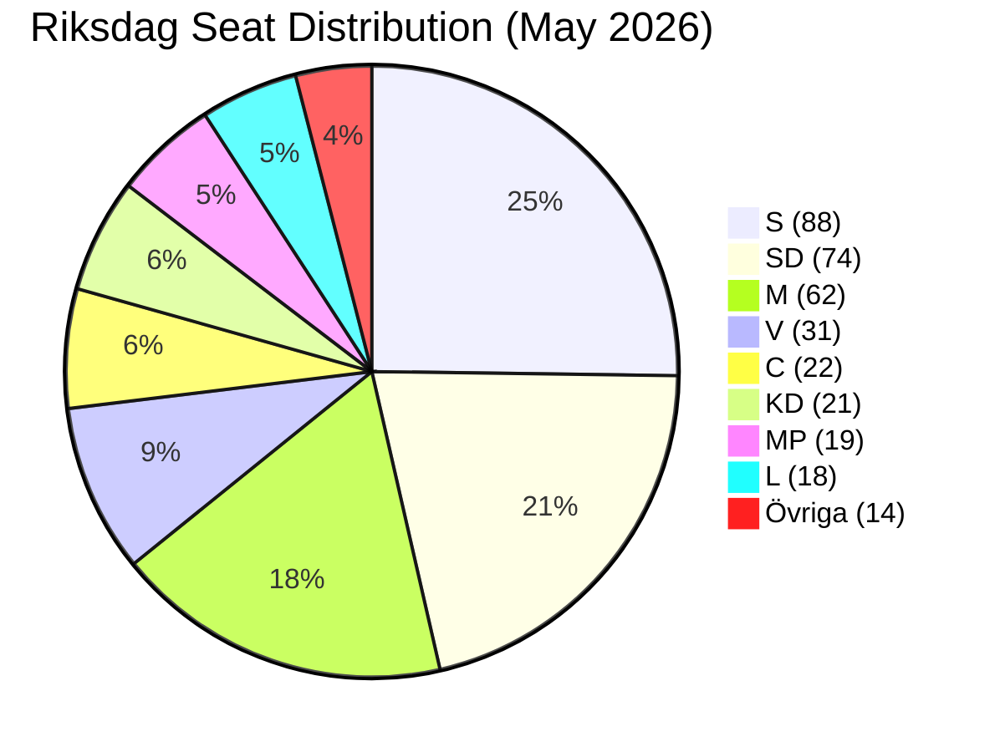

# Coalition Mathematics — 2026-05-22 Propositions

**Date**: 2026-05-22
**Basis**: May 2026 poll averages; 349 Riksdag seats; 175 majority threshold

## Current Seat Distribution (May 2026 Poll Averages)

| Party | Seats (est.) | Poll % | Leader | Bloc Position |
|-------|-------------|--------|--------|--------------|
| S | 88 | 25.2% | Magdalena Andersson | Opposition leader |
| SD | 74 | 21.2% | Jimmie Åkesson | Government supply |
| M | 62 | 17.8% | Ulf Kristersson | Government (FM) |
| V | 31 | 8.9% | Nooshi Dadgostar | Opposition |
| C | 22 | 6.3% | Muharrem Demirok | Swing/Government supply |
| MP | 19 | 5.4% | Märta Stenevi | Opposition |
| KD | 21 | 6.0% | Ebba Busch | Government (PM) |
| L | 18 | 5.2% | Johan Pehrson | Government |
| Övriga | 14 | 4.0% | Various | — |
| **Total** | **349** | **100%** | | |

## Majority Calculation

**175 seats needed for majority on proposition vote (Riksdag rule: simple majority of votes cast)**

### Government Majority Calculation (Typical Vote)

| Support | Ja votes |
|---------|---------|
| M (government) | 62 |
| KD (government) | 21 |
| L (government) | 18 |
| SD (supply-and-confidence) | 74 |
| **Total Ja** | **175** |
| Majority threshold | 175 |
| **Margin** | **0** — zero tolerance for defections |

### Opposition Vote (Typical)

| Opposition | Nej votes |
|-----------|---------|
| S | 88 |
| V | 31 |
| MP | 19 |
| **Total Nej** | **138** |

**C position (22 seats)**: If C votes Ja → 197 Ja vs 138 Nej. If C votes Nej → 175 Ja vs 160 Nej (still passes but depends on Övriga). If 3 C MPs vote Nej → 175 Ja vs 163 Nej — still passes only if SD holds all 74. If 4+ C MPs vote Nej → government loses majority.

### Pivotal Vote Table

| Scenario | Ja | Nej | Outcome |
|----------|----|----|---------|
| All government + SD + all C | 197 | 138 | Ja passes (margin: 59) |
| All government + SD, C abstains | 175 | 138 | Ja passes (margin: 37 — abstentions not counted as Nej) |
| All government + SD, 3 C MPs vote Nej | 175 | 141 | Ja passes (SD holds) |
| All government + SD, 4 C MPs vote Nej | 175 | 142 | Ja passes (SD holds — just) |
| All government + SD, 1 SD MP absent/Nej | 174 | 138 | FAILS — Nej wins |
| All government + SD, 3 C Nej + 1 SD defection | 174 | 142 | FAILS |

**Critical insight**: The government can absorb up to 4 C Nej votes if SD is fully united. SD has 74 seats — historically 1-2 SD MPs absent per vote. The margin is effectively 2-3 seats.

## Committee Vote Analysis (SfU)

SfU (Socialförsäkringsutskottet) has 15 members:
- Government: M(4) + KD(2) + L(2) = 8 members
- SD (supply-and-confidence): Not on SfU as non-government party
- Opposition: S(5) + V(1) + MP(1) = 7 members
- C: 1 member (Kerstin Lundgren or equivalent)

**SfU HD03262 vote**: If C member votes Nej → 8 Ja vs 8 Nej (tie) → proposition sent to chamber for decision with committee split recommendation. Not fatal but creates political signal.

**Note**: This analysis is based on typical committee composition ratios. Exact SfU member list as of May 2026 may differ.

## Seat Mathematics Diagram

## Coalition Arithmetic Under Different Election Scenarios

| Coalition | Seats | Majority? | Would implement batch? |
|-----------|-------|----------|----------------------|
| M+KD+L+SD supply | 175 | Exactly (current) | Yes — full batch |
| M+KD+L+C (coalition) | 123 | No — needs SD | Depends — C may block HD03262 |
| M+KD+L+SD+C | 197 | YES — supermajority | Yes — strongest |
| S+C+MP (red-green centre) | 129 | No — needs V | HD03262 reversed |
| S+V+MP+C | 160 | No — needs more | Migration amendments |
| S+V+MP+C+SD | 234 | Supermajority but impossible | — |

**Minimum viable government** post-September 2026: Needs 175 seats. Only realistic combinations:
1. Incumbent bloc (M+KD+L+SD) — 175 exactly — requires SD
2. Broad right (M+KD+L+C+SD) — 197 — most stable if C returns
3. Broad centre-left (S+C+MP+V) — 160 — insufficient without outside support

**Conclusion**: The coalition arithmetic makes the incumbent bloc the only credible majority government; any alternative requires C to cross to the opposition AND the bloc to remain below 175 even with C. This is the structural reason the government can tolerate C pressure but cannot afford C formally joining the opposition.
