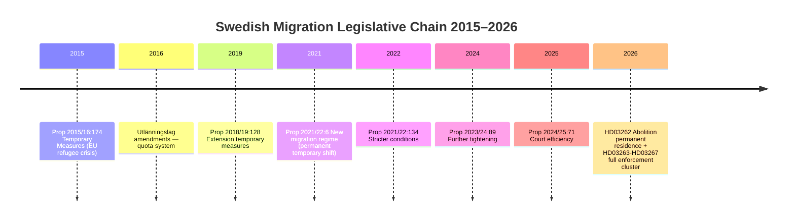

# Cross-Reference Map — 2026-05-22 Propositions

**Date**: 2026-05-22
**Purpose**: Policy cluster identification, legislative chain mapping, cross-referencing dependencies

## Policy Cluster Analysis

### Cluster 1 — Migration Enforcement Architecture (5 propositions)

**Core**: HD03262 + HD03263 + HD03264 + HD03265 + HD03267

**Interdependencies**:
- HD03262 (residence abolition) creates the legal status framework that HD03264 (conduct requirements) operates within
- HD03263 (deportation enforcement) requires HD03265 (detention capacity) to function — enforcement without detention is unworkable
- HD03267 (security threats) bypasses HD03263 procedures for SÄPO-designated individuals — parallel fast-track
- All five depend on Utlänningslagens overall architecture (SFS 2005:716)

**External legislative dependencies**:
- EU Returns Directive (2008/115/EC) — binding on HD03263
- ECHR Arts. 3, 5, 6, 8 — binding constraints on HD03265, HD03267
- EU Long-Term Residents Directive (2003/109/EC) — potentially incompatible with HD03262
- UN Convention Against Torture — non-derogable constraint on HD03267

**Prior legislation in this chain**:
| Prior Proposition | Year | Effect | Relation to 2026 Batch |
|------------------|------|--------|----------------------|
| Prop. 2021/22:134 | 2022 | Temporary protection status | HD03262 builds on but goes further |
| Prop. 2023/24:89 | 2024 | Stricter residence conditions | HD03264 extends |
| Prop. 2024/25:71 | 2025 | Migration courts efficiency | HD03263 complements |

### Cluster 2 — Digital State Capacity (2 propositions)

**Core**: HD03250 + HD03261

**Interdependencies**:
- HD03250 (state e-identity) creates a new identity layer that HD03261 (Skatteverket registry) will cross-reference
- Both depend on Digg as technical implementing agency
- Both connect to the population register (folkbokföring) as the authoritative data source

**External legislative dependencies**:
- eIDAS 2.0 Regulation (EU 2024/1183) — HD03250 must be eIDAS-compatible
- GDPR Art. 6(e) (public task) and Art. 9 (special categories) — HD03261
- Offentlighets- och sekretesslagen (SFS 2009:400) — limits on HD03261 data sharing

### Cluster 3 — Defence and Security (1 proposition + migration overlap)

**Core**: HD03254

**Interdependencies**:
- HD03254 (military cooperation) indirectly connects to HD03267 (security threats) — both involve SÄPO/Försvarsmakten intelligence integration
- HD03254 depends on existing Nordic Defence Cooperation (NORDEFCO) framework
- Regeringsformen (RF) kap. 10 provides constitutional framework — this proposition operates at the edge of RF's parliamentary consent requirements

### Cluster 4 — Governance and Social (2 propositions)

**Core**: HD03258 + HD03251

**Interdependencies**: Minimal between these two; both are committee-driven reforms independent of migration cluster
- HD03258 (political transparency) directly preceded by HD03255 (prior run, 2026-05-20) — HD03255 covered related KU matter

## Legislative Chain — Migration (2015–2026)

## Cross-Reference to Prior Analysis Run (2026-05-20)

| Document | Status in Prior Run | Status Now | Change |
|----------|--------------------|-----------|----|
| HD03267 | Analyzed (L2+) | Analyzed (L2+) | No change |
| HD03250 | Analyzed (L2) | Analyzed (L2) | No change |
| HD03261 | Analyzed (L2) | Analyzed (L2) | No change |
| HD03258 | Analyzed (L2) | Analyzed (L2) | No change |
| HD03263 | Analyzed (L2) | Analyzed (L2) | No change |
| HD03264 | Analyzed (L2) | Analyzed (L2) | No change |
| HD03262 | NEW — not in prior run | Analyzed (L2+) | +1 L2+ |
| HD03265 | NEW — not in prior run | Analyzed (L2) | +1 L2 |
| HD03254 | NEW — not in prior run | Analyzed (L2) | +1 L2 |
| HD03251 | NEW — not in prior run | Analyzed (L1) | +1 L1 |
| HD03255 | Analyzed in prior run | DROPPED from current scope | —1 |

**Net change**: +4 documents in scope, +1 dropped, batch now 10 propositions vs 7 prior.

## Policy Overlap Matrix

| | HD03262 | HD03263 | HD03264 | HD03265 | HD03267 | HD03250 | HD03261 | HD03254 | HD03258 | HD03251 |
|-|---------|---------|---------|---------|---------|---------|---------|---------|---------|---------|
| HD03262 | — | HIGH | HIGH | HIGH | HIGH | LOW | MEDIUM | LOW | LOW | NONE |
| HD03263 | HIGH | — | HIGH | HIGH | HIGH | NONE | LOW | LOW | NONE | NONE |
| HD03264 | HIGH | HIGH | — | MEDIUM | MEDIUM | NONE | MEDIUM | NONE | LOW | NONE |
| HD03265 | HIGH | HIGH | MEDIUM | — | HIGH | NONE | LOW | NONE | NONE | NONE |
| HD03267 | HIGH | HIGH | MEDIUM | HIGH | — | NONE | MEDIUM | MEDIUM | NONE | NONE |
| HD03250 | LOW | NONE | NONE | NONE | NONE | — | HIGH | NONE | NONE | NONE |
| HD03261 | MEDIUM | LOW | MEDIUM | LOW | MEDIUM | HIGH | — | NONE | LOW | NONE |
| HD03254 | LOW | LOW | NONE | NONE | MEDIUM | NONE | NONE | — | NONE | NONE |
| HD03258 | LOW | NONE | LOW | NONE | NONE | NONE | LOW | NONE | — | NONE |
| HD03251 | NONE | NONE | NONE | NONE | NONE | NONE | NONE | NONE | NONE | — |
