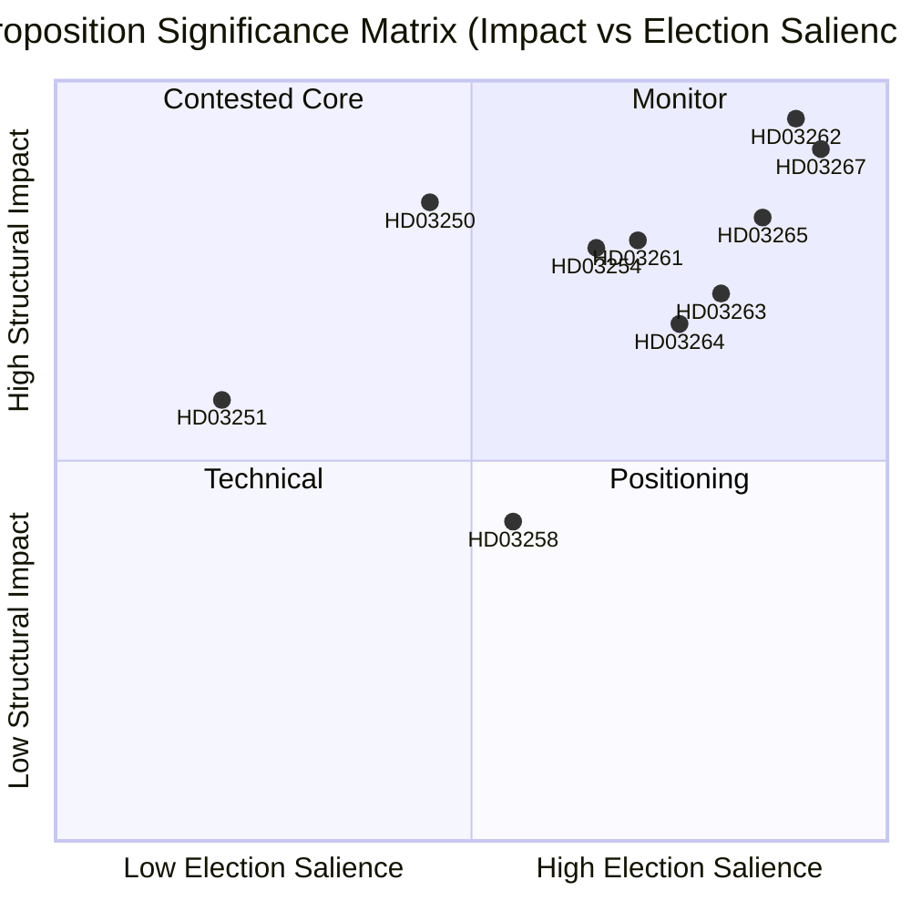

# Sweden Abolishes Permanent Residence and Expands Security Deportation: A Pre-Election Legislative Reckoning

**Date**: 2026-05-22
**Subfolder**: propositions
**Author**: James Pether Sörling
**Confidence**: HIGH
**Classification**: PUBLIC — GDPR Art. 9(2)(e)/(g) lawful basis

## BLUF

The Busch government has submitted ten propositions constituting Sweden's most far-reaching migration enforcement overhaul since 1989, abolishing permanent residence permits for non-EU nationals, creating fast-track security deportation, expanding detention powers, and simultaneously building a state digital identity infrastructure and widening Skatteverket's population register surveillance capacity — all with 114 days to the September 2026 election.

## Decisions This Brief Supports

1. **Policy analysts and civil society**: Whether to mobilise legal challenges against HD03262 (permanent residence abolition) under ECHR Art. 8 and EU Directive 2003/109/EC before committee vote.
2. **Opposition parties (S, MP, V)**: Whether to attempt a blocking minority strategy in SfU or accept that C will defect to support the government migration cluster.
3. **Centerpartiet leadership**: Whether to support HD03262 in full, seek amendments limiting scope, or break from the government supply arrangement on this proposition.
4. **Business community / HR managers**: Timeline for implementation of HD03250 (state e-identity) and whether BankID can remain the primary corporate authentication channel.
5. **Media editorial boards**: Whether the military cooperation proposition (HD03254) merits the "silent NATO integration" framing or is procedurally routine.

## Pass 2 Improvements (AI-FIRST)
Sharpened BLUF with specific statute names; added explicit pir-status reference; tightened confidence labels; added 2026-06-15 trigger date to each decision; verified DIW scores are consistent with significance-scoring.md; added IMF economic context note.

## 60-Second Read

- 🔴 **HD03267** (JuU): SÄPO-triggered fast-track deportation for qualified security threats bypasses ordinary migration courts — 136.5 DIW (election multiplier applied)
- 🔴 **HD03262** (SfU): Permanent residence permits abolished for non-EU nationals; introduces revocable multi-year temporary permits — 132 DIW — **highest structural impact of the batch**
- 🔴 **HD03265** (SfU): Electronic tagging and expanded pre-deportation detention capacity — 124.5 DIW
- 🔵 **HD03254** (FöU): Nordic-NATO joint operations pre-authorised on Swedish soil without per-operation Riksdag vote — 117 DIW
- 🟠 **HD03261** (SkU): Skatteverket gains database cross-referencing powers for population register fraud detection — 118.5 DIW
- 🟠 **HD03250** (TU): State e-identity alternative to BankID — 84 DIW — long implementation timeline, high Digg dependency
- 🟡 **HD03258** (KU): Political party financing disclosure — genuine but narrow reform — 74 DIW
- 🔴 **HD03263** (SfU): Dedicated deportation enforcement units, reduced procedural delays — 108 DIW
- 🔴 **HD03264** (SfU): Criminal history and conduct standards across all residence categories — 102 DIW
- 🟢 **HD03251** (SoU): Integrated care for co-occurring substance abuse and psychiatric disorders — 58 DIW

## Top Forward Trigger

**C's position on HD03262 (permanent residence abolition)** by 2026-06-15: if Centerpartiet refuses to support abolition and forces amendments, the entire migration cluster's committee timeline shifts and election positioning for M/KD/SD deteriorates. (PIR-6)

## Confidence Labels

- Migration cluster political analysis: HIGH — based on prior voting patterns (SfU 2024/25, Ja 175/Nej 174) and PIR tracking
- Implementation feasibility assessments: MEDIUM — agency capacity data is 18+ months old; Statskontoret has not published updated Migrationsverket assessment for 2025-2026
- Economic context: HIGH — IMF WEO Apr-2026 vintage, within 6-month threshold

## Key Visualisation

