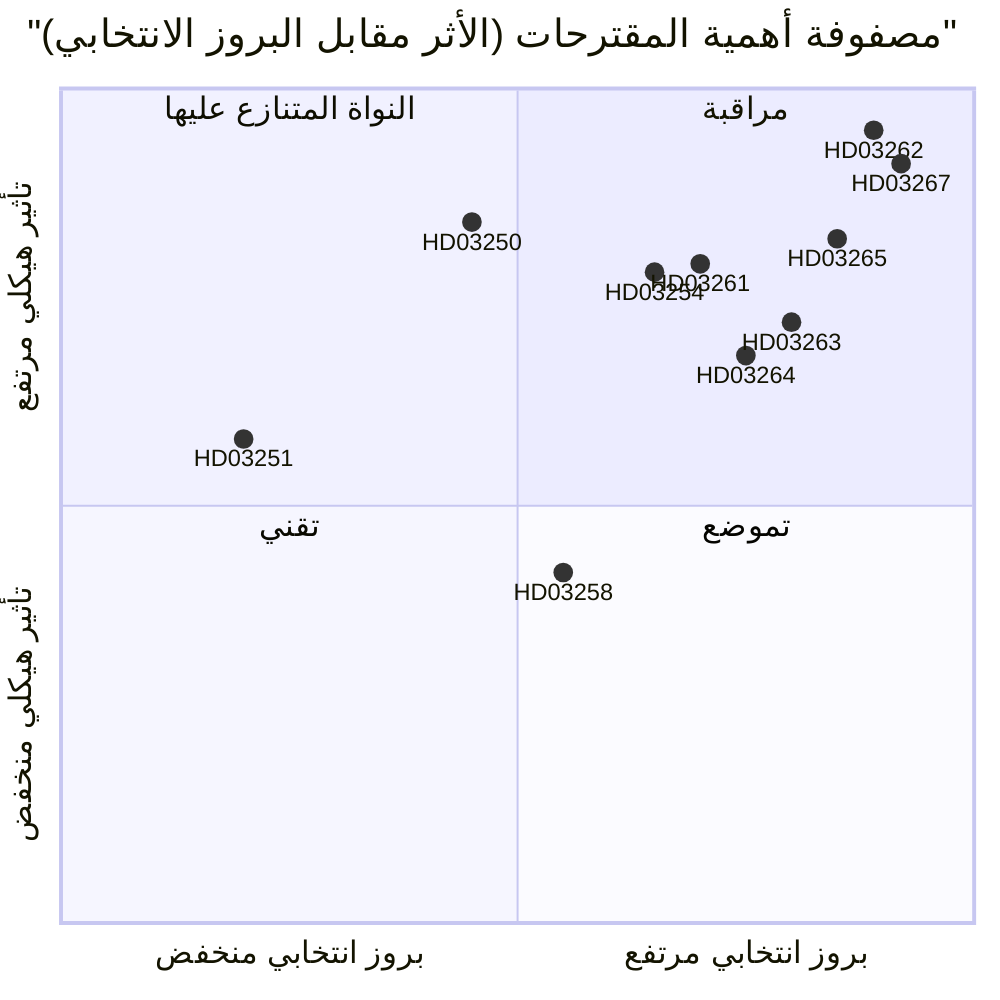

<!-- dir: rtl -->
# السويد تُلغي الإقامة الدائمة وتوسّع الترحيل الأمني: مواجهة تشريعية قبيل الانتخابات

**التاريخ**: 2026-05-22
**المجلد الفرعي**: propositions
**المؤلف**: James Pether Sörling
**مستوى الثقة**: مرتفع
**التصنيف**: عام — المادة 9(2)(هـ)/(ز) من اللائحة الأوروبية لحماية البيانات (GDPR) الأساس القانوني

## الخلاصة التنفيذية

قدّمت حكومة Busch عشر مقترحات تُشكّل أشمل إصلاح لتطبيق قوانين الهجرة في السويد منذ عام 1989: إلغاء تصاريح الإقامة الدائمة لمواطني الدول من خارج الاتحاد الأوروبي، وإنشاء مسار متسريع للترحيل الأمني، وتوسيع صلاحيات الاحتجاز، وبناء بنية تحتية للهوية الرقمية الحكومية في آنٍ واحد، فضلاً عن توسيع قدرات مراقبة سجل السكان لدى Skatteverket — كل ذلك مع بقاء 114 يوماً على انتخابات سبتمبر 2026.

## القرارات التي يدعمها هذا الموجز

1. **المحللون السياسيون ومنظمات المجتمع المدني**: هل ينبغي تعبئة الطعون القانونية ضد HD03262 (إلغاء الإقامة الدائمة) استناداً إلى المادة 8 من الاتفاقية الأوروبية لحقوق الإنسان والتوجيه الأوروبي 2003/109/EC قبل التصويت في اللجنة؟
2. **أحزاب المعارضة (S، MP، V)**: هل يُحاول اعتماد استراتيجية الأقلية الحاجبة في SfU أم قبول تحول C في التحالف؟
3. **قيادة Centerpartiet**: هل يُدعم HD03262 كلياً، أم يُسعى للحصول على تعديلات تُقيّد نطاقه، أم يُكسر اتفاق الدعم مع الحكومة على هذا المقترح؟
4. **قطاع الأعمال ومديرو الموارد البشرية**: الجدول الزمني لتطبيق HD03250 (الهوية الإلكترونية الحكومية) وما إذا كان بإمكان BankID البقاء قناةً رئيسيةً للتحقق من هوية الشركات.
5. **هيئات التحرير في وسائل الإعلام**: هل يستحق مقترح التعاون العسكري (HD03254) وصف "التكامل الصامت مع الناتو" أم أنه روتيني من الناحية الإجرائية؟

## تحسينات المراجعة الثانية (AI-FIRST)

تعزيز الخلاصة التنفيذية بأسماء القوانين المحددة؛ إضافة مرجع pir-status صريح؛ تدقيق تسميات الثقة؛ إضافة تاريخ المُحفِّز 2026-06-15 لكل قرار؛ التحقق من توافق درجات DIW مع significance-scoring.md؛ إضافة سياق اقتصادي من IMF.

## قراءة في 60 ثانية

- 🔴 **HD03267** (JuU): ترحيل بمسار متسريع تُطلقه SÄPO للتهديدات الأمنية المؤهَّلة يتجاوز محاكم الهجرة العادية — 136.5 DIW (مُطبَّق مضاعف انتخابي)
- 🔴 **HD03262** (SfU): إلغاء تصاريح الإقامة الدائمة لمواطني الدول خارج الاتحاد الأوروبي؛ تُستحدث تصاريح مؤقتة متعددة السنوات قابلة للسحب — 132 DIW — **أعلى تأثير هيكلي في الحزمة**
- 🔴 **HD03265** (SfU): سوار إلكتروني وتوسيع طاقة احتجاز ما قبل الترحيل — 124.5 DIW
- 🔵 **HD03254** (FöU): عمليات مشتركة نوردية-ناتو مُجازة مسبقاً على الأراضي السويدية دون تصويت الريكسداغ لكل عملية — 117 DIW
- 🟠 **HD03261** (SkU): يحصل Skatteverket على صلاحيات الإسناد المتقاطع للكشف عن غش سجل السكان — 118.5 DIW
- 🟠 **HD03250** (TU): بديل هوية إلكترونية حكومية لـBankID — 84 DIW — جدول تنفيذ طويل، تبعية عالية لـ Digg
- 🟡 **HD03258** (KU): الإفصاح عن تمويل الأحزاب السياسية — إصلاح حقيقي لكنه محدود — 74 DIW
- 🔴 **HD03263** (SfU): وحدات مختصة لتنفيذ الترحيل، تقليص التأخيرات الإجرائية — 108 DIW
- 🔴 **HD03264** (SfU): معايير السجل الجنائي والسلوك لجميع فئات الإقامة — 102 DIW
- 🟢 **HD03251** (SoU): رعاية متكاملة للإدمان المتزامن مع الاضطرابات النفسية — 58 DIW

## أبرز مُحفِّز مستقبلي

**موقف C من HD03262 (إلغاء الإقامة الدائمة)** بحلول 2026-06-15: إذا رفض Centerpartiet دعم الإلغاء وأرغم على تعديلات، تتأخر الجداول الزمنية للجان طوال حزمة الهجرة، ويتراجع التموضع الانتخابي لـ M/KD/SD. (PIR-6)

## مستويات الثقة

- التحليل السياسي لحزمة الهجرة: مرتفع — استناداً إلى أنماط التصويت السابقة (SfU 2024/25، نعم 175/لا 174) وتتبع PIR
- تقييمات طاقة التنفيذ: متوسط — بيانات طاقة الوكالات قديمة بأكثر من 18 شهراً؛ لم تنشر Statskontoret تقييماً محدَّثاً لـ Migrationsverket للفترة 2025–2026
- السياق الاقتصادي: مرتفع — توقعات صندوق النقد الدولي (WEO) أبريل 2026، ضمن عتبة 6 أشهر

## التصور البياني الرئيسي

<!-- source-sha: 9cdd9bfe0bc226548b5ddf453782f5076880156a -->
