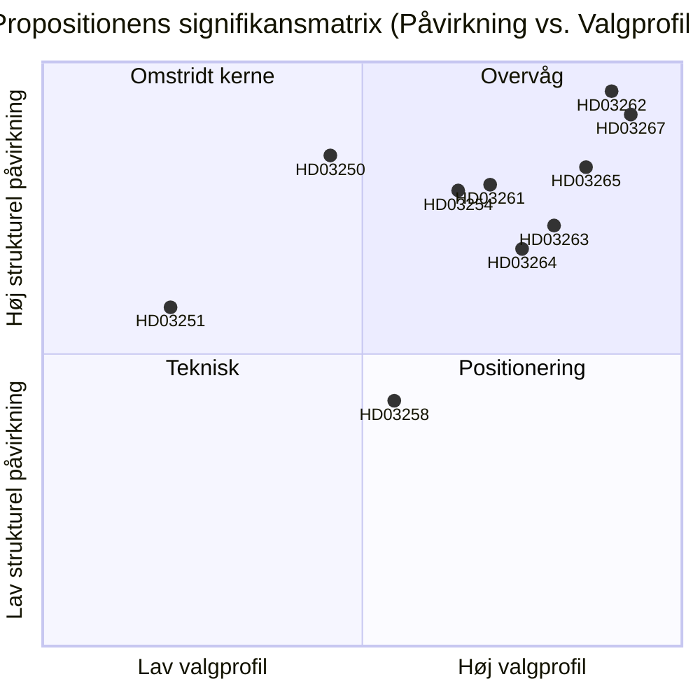

# Sverige afskafter permanent opholdstilladelse og udvider sikkerhedsdeportering: Et prævalgtsmæssigt lovgivningsopgør

**Dato**: 2026-05-22
**Undermappe**: propositioner
**Forfatter**: James Pether Sörling
**Tillid**: HØJ
**Klassifikation**: PUBLIC — GDPR Art. 9(2)(e)/(g) retsgrundlag

## Resumé

Busch-regeringen har indsendt ti propositioner, der udgør Sveriges mest vidtgående migrationshåndhævelsesreform siden 1989 — de afskafter permanente opholdstilladelser for ikke-EU-statsborgere, indfører hurtigsporet sikkerhedsdeportering, udvider frihedsberøvelsesbeføjelser og opbygger en statslig digital identitetsinfrastruktur samt udvider Skatteverkets befolkningsregisterovervågning — alt dette med 114 dage til valget i september 2026.

## Beslutninger dette PM understøtter

1. **Politiske analytikere og civilsamfund**: Om retlige udfordringer mod HD03262 (afskaffelse af permanent opholdstilladelse) under EMRK Art. 8 og EU-direktiv 2003/109/EF bør mobiliseres inden udvalgsafstemningen.
2. **Oppositionspartier (S, MP, V)**: Om en blokerende minoritetsstrategi i SfU skal forsøges, eller om C's koalitionsskifte accepteres.
3. **Centerpartiets ledelse**: Om HD03262 skal støttes fuldt ud, om ændringer der begrænser omfanget søges, eller om man bryder med regeringens støttearrangement på dette forslag.
4. **Erhvervsliv og HR-chefer**: Tidslinje for implementering af HD03250 (statslig e-identitet) og om BankID kan forblive den primære virksomhedsautentificeringskanal.
5. **Medieredaktioner**: Om det militære samarbejdsforslag (HD03254) fortjener rammen "stille NATO-integration" eller er procedurelt rutine.

## Forbedringer i anden omgang (AI-FIRST)

Skærpet resumé med specifikke lovnavne; eksplicit pir-status-reference tilføjet; tillidsnavne justeret; udløsningsdato 2026-06-15 tilføjet for hver beslutning; DIW-scores verificeret mod significance-scoring.md; IMF økonomisk kontekst tilføjet.

## 60-sekunders læsning

- 🔴 **HD03267** (JuU): SÄPO-udløst hurtigsporet deportering for kvalificerede sikkerhedstrusler omgår ordinære migrationsdomstole — 136,5 DIW (valmultiplikator anvendt)
- 🔴 **HD03262** (SfU): Permanente opholdstilladelser afskaffes for ikke-EU-statsborgere; indfører tilbagekaldelige flerårige midlertidige tilladelser — 132 DIW — **højeste strukturelle påvirkning i batchen**
- 🔴 **HD03265** (SfU): Elektronisk fodlænke og udvidet kapacitet til frihedsberøvelse forud for deportering — 124,5 DIW
- 🔵 **HD03254** (FöU): Nordisk-NATO fælles operationer forhåndsgodkendt på svensk jord uden per-operation Riksdag-afstemning — 117 DIW
- 🟠 **HD03261** (SkU): Skatteverket får krydsreferencebeføjelser til bekæmpelse af befolkningsregisterbedrageri — 118,5 DIW
- 🟠 **HD03250** (TU): Statsligt e-identitetsalternativ til BankID — 84 DIW — lang implementeringstid, stor Digg-afhængighed
- 🟡 **HD03258** (KU): Politisk partifinansieringsoplysning — ægte men smal reform — 74 DIW
- 🔴 **HD03263** (SfU): Dedikerede deporteringshåndhævelsesenheder, reducerede procedureforsinkelser — 108 DIW
- 🔴 **HD03264** (SfU): Straffehistorik og adfærdsstandarder for alle opholdskategorier — 102 DIW
- 🟢 **HD03251** (SoU): Integreret behandling af samtidige misbrug og psykiske lidelser — 58 DIW

## Vigtigste fremtidige trigger

**C's position på HD03262 (afskaffelse af permanent opholdstilladelse)** inden 2026-06-15: hvis Centerpartiet afviser at støtte afskaffelsen og tvinger ændringer igennem, forskydes hele migrationsklustrenes udvalgsplan, og valgpositioneringen for M/KD/SD forringes. (PIR-6)

## Tillidsmærkning

- Politisk analyse af migrationsklustrene: HØJ — baseret på tidligere afstemingsmønstre (SfU 2024/25, Ja 175/Nej 174) og PIR-sporing
- Vurderinger af implementeringskapacitet: MIDDEL — myndigheds kapacitetsdata er 18+ måneder gammel; Statskontoret har ikke offentliggjort en opdateret Migrationsverket-vurdering for 2025–2026
- Økonomisk kontekst: HØJ — IMF WEO April 2026, inden for 6-månedersgrænsen

## Nøglevisualisering

<!-- source-sha: 9cdd9bfe0bc226548b5ddf453782f5076880156a -->
