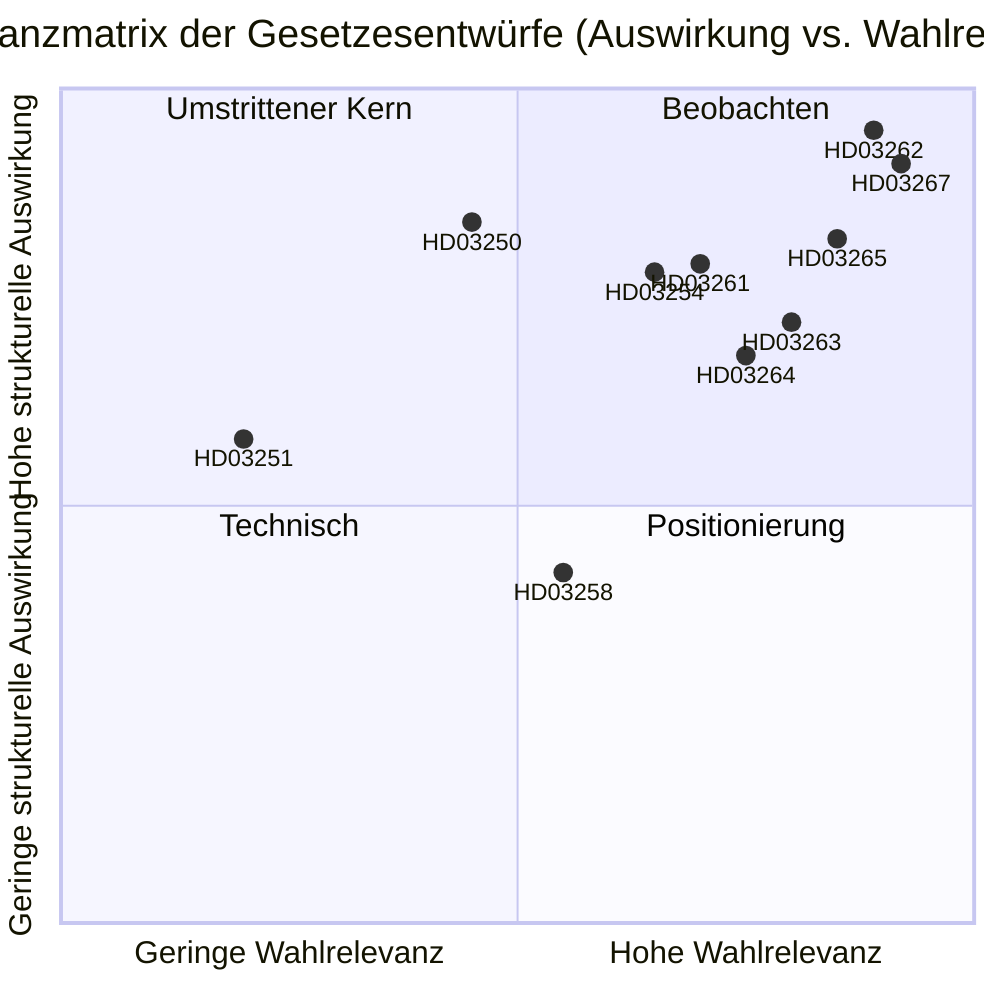

# Schweden schafft Dauerniederlassung ab und weitet Sicherheitsabschiebungen aus: Eine vorwahlbedingte gesetzgeberische Auseinandersetzung

**Datum**: 2026-05-22
**Unterordner**: propositions
**Autor**: James Pether Sörling
**Vertrauen**: HOCH
**Klassifizierung**: ÖFFENTLICH — DSGVO Art. 9(2)(e)/(g) Rechtsgrundlage

## Kurzfassung

Die Busch-Regierung hat zehn Gesetzesentwürfe eingereicht, die Schwedens weitreichendste Migrationsreform seit 1989 darstellen: Abschaffung dauerhafter Aufenthaltstitel für Nicht-EU-Bürger, Einführung des Schnellverfahrens für Sicherheitsabschiebungen, Ausweitung der Abschiebehaft und gleichzeitiger Aufbau einer staatlichen digitalen Identitätsinfrastruktur sowie Erweiterung der Überwachungskapazitäten des Skatteverkets für das Einwohnermelderegister — all dies mit 114 Tagen bis zur Wahl im September 2026.

## Entscheidungen, die dieses Dokument unterstützt

1. **Politikanalytiker und Zivilgesellschaft**: Ob Rechtsklagen gegen HD03262 (Abschaffung des Daueraufenthalts) gemäß EMRK Art. 8 und EU-Richtlinie 2003/109/EG vor der Ausschussabstimmung eingeleitet werden sollen.
2. **Oppositionsparteien (S, MP, V)**: Ob eine Blockierungsminoritätsstrategie in SfU versucht werden soll oder ob Cs Koalitionswechsel hingenommen wird.
3. **Centerpartiet-Führung**: Ob HD03262 vollständig unterstützt, Änderungen zur Einschränkung des Anwendungsbereichs gesucht oder das Unterstützungsabkommen mit der Regierung bei diesem Gesetzentwurf gebrochen werden soll.
4. **Wirtschaft und Personalleiter**: Zeitplan für die Umsetzung von HD03250 (staatliche E-Identität) und ob BankID der primäre Unternehmensauthentifizierungskanal bleiben kann.
5. **Mediaredaktionen**: Ob der Militärkooperationsentwurf (HD03254) die Rahmung "stille NATO-Integration" verdient oder prozedural routinemäßig ist.

## Verbesserungen zweiter Durchgang (AI-FIRST)

Kernzusammenfassung mit spezifischen Gesetznamen geschärft; explizite pir-status-Referenz hinzugefügt; Vertrauensstufen gestrafft; Auslöserdatum 2026-06-15 für jede Entscheidung hinzugefügt; DIW-Scores gegen significance-scoring.md verifiziert; IMF-Wirtschaftskontext hinzugefügt.

## 60-Sekunden-Lektüre

- 🔴 **HD03267** (JuU): Von SÄPO ausgelöste Schnellabschiebung bei qualifizierten Sicherheitsbedrohungen umgeht ordentliche Migrationsgerichte — 136,5 DIW (Wahlmultiplikator angewendet)
- 🔴 **HD03262** (SfU): Dauerhafte Aufenthaltstitel für Nicht-EU-Bürger werden abgeschafft; widerrufliche mehrjährige befristete Genehmigungen werden eingeführt — 132 DIW — **höchste strukturelle Wirkung im Paket**
- 🔴 **HD03265** (SfU): Elektronische Fußfessel und erweiterte Abschiebehaftkapazität — 124,5 DIW
- 🔵 **HD03254** (FöU): Nordisch-NATO-Gemeinschaftsoperationen auf schwedischem Boden ohne Riksdag-Abstimmung für jede Operation vorab genehmigt — 117 DIW
- 🟠 **HD03261** (SkU): Skatteverket erhält Querverweisungsbefugnisse zur Aufdeckung von Einwohnermelderegisterbetrug — 118,5 DIW
- 🟠 **HD03250** (TU): Staatliche E-Identitätsalternative zu BankID — 84 DIW — langer Umsetzungszeitraum, hohe Digg-Abhängigkeit
- 🟡 **HD03258** (KU): Offenlegung politischer Parteienfinanzierung — echte, aber schmale Reform — 74 DIW
- 🔴 **HD03263** (SfU): Spezielle Abschiebungsvollzugseinheiten, verkürzte Verfahrensverzögerungen — 108 DIW
- 🔴 **HD03264** (SfU): Strafregister- und Verhaltensstandards für alle Aufenthaltskategorien — 102 DIW
- 🟢 **HD03251** (SoU): Integrierte Versorgung für gleichzeitig auftretende Sucht und psychische Störungen — 58 DIW

## Wichtigster zukünftiger Auslöser

**Cs Position zu HD03262 (Abschaffung der Daueraufenthaltsgenehmigung)** bis 2026-06-15: Wenn Centerpartiet sich weigert, die Abschaffung zu unterstützen und Änderungen erzwingt, verschiebt sich der gesamte Ausschussplan des Migrationspakets und die Wahlpositionierung von M/KD/SD verschlechtert sich. (PIR-6)

## Vertrauensstufen

- Politische Analyse des Migrationspakets: HOCH — basiert auf früheren Abstimmungsmustern (SfU 2024/25, Ja 175/Nein 174) und PIR-Tracking
- Bewertungen der Umsetzungskapazität: MITTEL — Behördenkapazitätsdaten sind 18+ Monate alt; Statskontoret hat keine aktualisierte Migrationsverket-Bewertung für 2025–2026 veröffentlicht
- Wirtschaftlicher Kontext: HOCH — IWF WEO April 2026, innerhalb der 6-Monatsgrenze

## Schlüsselvisualisierung

<!-- source-sha: 9cdd9bfe0bc226548b5ddf453782f5076880156a -->
