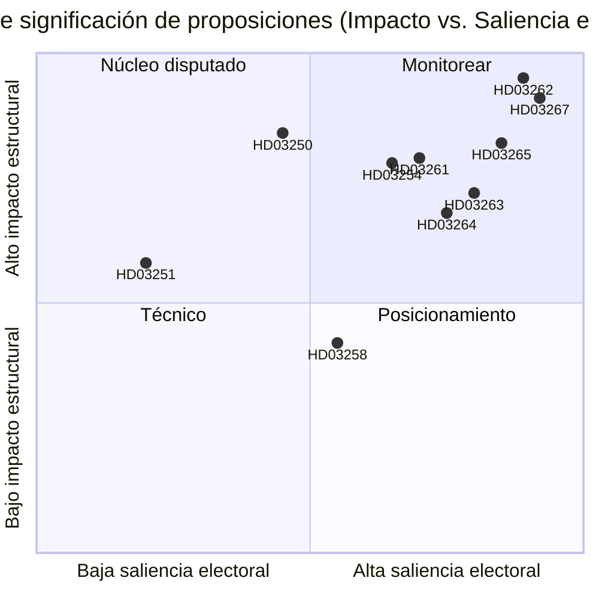

# Suecia suprime la residencia permanente y amplía las expulsiones por seguridad: Un ajuste legislativo preelectoral

**Fecha**: 2026-05-22
**Subcarpeta**: propositions
**Autor**: James Pether Sörling
**Confianza**: ALTA
**Clasificación**: PÚBLICO — RGPD Art. 9(2)(e)/(g) base jurídica

## Resumen

El gobierno Busch ha presentado diez proposiciones que constituyen la reforma de aplicación migratoria más ambiciosa de Suecia desde 1989: abolición de los permisos de residencia permanente para ciudadanos no comunitarios, creación de vía rápida para expulsión por razones de seguridad, ampliación de poderes de detención y simultáneamente construcción de una infraestructura de identidad digital estatal y ampliación de la capacidad de vigilancia del registro de población de Skatteverket — todo ello con 114 días hasta las elecciones de septiembre de 2026.

## Decisiones que este documento apoya

1. **Analistas políticos y sociedad civil**: Si deben movilizarse recursos legales contra HD03262 (abolición de residencia permanente) bajo ECHR Art. 8 y Directiva UE 2003/109/CE antes de la votación en comisión.
2. **Partidos de oposición (S, MP, V)**: Si intentar una estrategia de minoría de bloqueo en SfU o aceptar el cambio de coalición de C.
3. **Dirección de Centerpartiet**: Si apoyar HD03262 íntegramente, buscar enmiendas que limiten el alcance o romper el acuerdo de apoyo con el gobierno en esta proposición.
4. **Empresas y responsables de RRHH**: Cronograma de implementación de HD03250 (identidad electrónica estatal) y si BankID puede seguir siendo el canal principal de autenticación empresarial.
5. **Consejos editoriales de medios**: Si la proposición de cooperación militar (HD03254) merece el encuadre de «integración silenciosa en la OTAN» o es procedimentalmente rutinaria.

## Mejoras de segunda pasada (AI-FIRST)

Refinado el resumen con nombres de estatutos específicos; añadida referencia explícita a pir-status; ajustadas etiquetas de confianza; añadida fecha de activación 2026-06-15 para cada decisión; verificadas puntuaciones DIW consistentes con significance-scoring.md; añadido contexto económico del IMF.

## Lectura de 60 segundos

- 🔴 **HD03267** (JuU): Expulsión acelerada activada por SÄPO para amenazas de seguridad cualificadas que elude los tribunales ordinarios de migración — 136,5 DIW (multiplicador electoral aplicado)
- 🔴 **HD03262** (SfU): Los permisos de residencia permanente se abolirán para ciudadanos no comunitarios; se introducen permisos temporales plurianuales revocables — 132 DIW — **mayor impacto estructural del lote**
- 🔴 **HD03265** (SfU): Pulsera electrónica y ampliación de la capacidad de detención previa a la expulsión — 124,5 DIW
- 🔵 **HD03254** (FöU): Operaciones conjuntas nórdico-OTAN preautorizadas en suelo sueco sin votación del Riksdag por operación — 117 DIW
- 🟠 **HD03261** (SkU): Skatteverket obtiene poderes de referencia cruzada para detectar fraude en el registro de población — 118,5 DIW
- 🟠 **HD03250** (TU): Alternativa de identidad electrónica estatal a BankID — 84 DIW — largo plazo de implementación, alta dependencia de Digg
- 🟡 **HD03258** (KU): Divulgación de financiación de partidos políticos — reforma genuina pero limitada — 74 DIW
- 🔴 **HD03263** (SfU): Unidades dedicadas de ejecución de expulsiones, reducción de retrasos procesales — 108 DIW
- 🔴 **HD03264** (SfU): Antecedentes penales y estándares de conducta para todas las categorías de residencia — 102 DIW
- 🟢 **HD03251** (SoU): Atención integrada para comorbilidad por abuso de sustancias y trastornos psiquiátricos — 58 DIW

## Principal activador futuro

**La posición de C sobre HD03262 (abolición de la residencia permanente)** antes del 2026-06-15: si Centerpartiet se niega a apoyar la abolición y fuerza enmiendas, todo el calendario de comisión del clúster migratorio se desplaza y el posicionamiento electoral de M/KD/SD se deteriora. (PIR-6)

## Niveles de confianza

- Análisis político del clúster migratorio: ALTA — basado en patrones de votación anteriores (SfU 2024/25, Sí 175/No 174) y seguimiento PIR
- Evaluaciones de capacidad de implementación: MEDIA — los datos de capacidad de las agencias tienen más de 18 meses; Statskontoret no ha publicado una evaluación actualizada de Migrationsverket para 2025–2026
- Contexto económico: ALTA — FMI WEO abril 2026, dentro del umbral de 6 meses

## Visualización clave

<!-- source-sha: 9cdd9bfe0bc226548b5ddf453782f5076880156a -->
