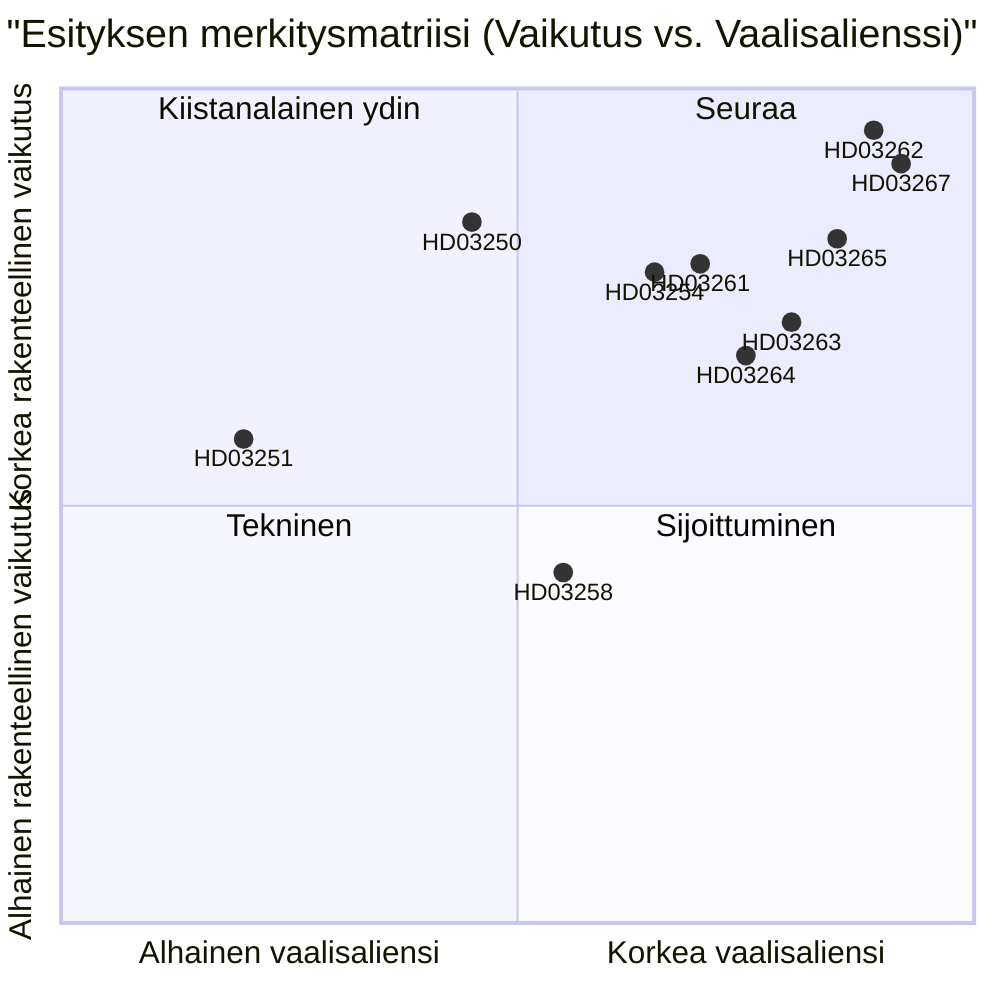

# Ruotsi lakkauttaa pysyvän oleskeluluvan ja laajentaa turvallisuusperusteista karkottamista: Vaalikauden lainsäädäntöhistori

**Päivämäärä**: 2026-05-22
**Alikansio**: propositions
**Tekijä**: James Pether Sörling
**Luottamustaso**: KORKEA
**Luokitus**: PUBLIC — GDPR Art. 9(2)(e)/(g) oikeudellinen perusta

## Lyhyt yhteenveto

Busch-hallitus on toimittanut kymmenen esitystä, jotka muodostavat Ruotsin laajimman maahanmuuton täytäntöönpanon uudistuksen sitten vuoden 1989: pysyvien oleskelulupien poistaminen EU:n ulkopuolisille kansalaisille, turvallisuusperusteisen karkottamisen pika-äänestys, laajennetut säilöönotto-oikeudet, valtion digitaalisen henkilöllisyysinfrastruktuurin rakentaminen ja Skatteverketin väestörekisterin valvonnan laajentaminen — kaikki tämä 114 päivää ennen syyskuun 2026 vaaleja.

## Päätökset, joita tämä muistio tukee

1. **Politiikan analyytikot ja kansalaisyhteiskunta**: Tulisiko oikeudellisia haasteita HD03262:ta (pysyvän oleskeluluvan poistaminen) vastaan ECHR Art. 8:n ja EU-direktiivin 2003/109/EY nojalla mobilisoida ennen valiokunnan äänestystä.
2. **Oppositiopuolueet (S, MP, V)**: Tulisiko SfU:ssa yrittää estävä vähemmistöstrategia vai hyväksyä C:n koalition vaihto.
3. **Centerpartiets johtajuus**: Tulisiko HD03262 tukea kokonaan, etsiä muutoksia laajuuden rajoittamiseksi vai katkaista hallituksen tukisopimus tällä esityksellä.
4. **Yritysmaailma ja HR-johtajat**: HD03250:n (valtion e-identiteetti) toteutuksen aikataulu ja voiko BankID säilyä ensisijaisena yritysautorisointikanavana.
5. **Median toimitusneuvostot**: Ansaitseeko sotilaallisen yhteistyön esitys (HD03254) "hiljaisen NATO-integraation" kehystyksen vai onko se menettelyllisesti rutiininomainen.

## Toisen kierroksen parannukset (AI-FIRST)

Tiivistetty yhteenveto tarkkojen lakien nimillä; lisätty eksplisiittinen pir-status-viittaus; kiristetty luottamusmerkintöjä; lisätty laukaisupäivä 2026-06-15 jokaiseen päätökseen; DIW-pisteet varmennettu significance-scoring.md:tä vasten; lisätty IMF:n taloudellinen konteksti.

## 60 sekunnin lukeminen

- 🔴 **HD03267** (JuU): SÄPO-käynnistämä pikakaistakarkottaminen soveltuvuusturvallisuusuhkiin ohittaa tavalliset maahanmuuttotuomioistuimet — 136,5 DIW (vaalimultiplikattori sovellettu)
- 🔴 **HD03262** (SfU): Pysyvät oleskeluluvat poistetaan EU:n ulkopuolisille kansalaisille; käyttöön otetaan peruutettavat monivuotiset väliaikaiset luvat — 132 DIW — **suurin rakenteellinen vaikutus erässä**
- 🔴 **HD03265** (SfU): Elektroninen jalkapanta ja laajennettu karkottamista edeltävä säilöönotto-kapasiteetti — 124,5 DIW
- 🔵 **HD03254** (FöU): Pohjoismainen-NATO yhteisoperaatiot esiluvallistettu Ruotsin maaperällä ilman per-operaatio Riksdag-äänestystä — 117 DIW
- 🟠 **HD03261** (SkU): Skatteverket saa ristiinviittausvaltuudet väestörekisteripetoksen havaitsemiseen — 118,5 DIW
- 🟠 **HD03250** (TU): Valtion e-identiteettivaihtoehto BankID:lle — 84 DIW — pitkä toteutusaika, suuri Digg-riippuvuus
- 🟡 **HD03258** (KU): Poliittisen puolueen rahoituksen avoimuus — aito mutta kapea uudistus — 74 DIW
- 🔴 **HD03263** (SfU): Erikoistuneet karkottamisen täytäntöönpanoyksiköt, vähennetyt menettelylliset viivästykset — 108 DIW
- 🔴 **HD03264** (SfU): Rikoshistoria ja käytösstandardit kaikissa oleskelulupakategorioissa — 102 DIW
- 🟢 **HD03251** (SoU): Integroitu hoito samanaikaiselle päihderiippuvuudelle ja mielenterveyshäiriöille — 58 DIW

## Tärkein tulevaisuuden laukaisija

**C:n kanta HD03262:een (pysyvän oleskeluluvan poistaminen)** viimeistään 2026-06-15: jos Centerpartiet kieltäytyy tukemasta poistamista ja pakottaa muutoksia, koko maahanmuuttoryhmän valiokunnan aikataulu siirtyy ja M/KD/SD:n vaalisijoittuminen heikkenee. (PIR-6)

## Luottamusmerkinnät

- Maahanmuuttoryhmän poliittinen analyysi: KORKEA — perustuu aiempiin äänestystuloksiin (SfU 2024/25, Kyllä 175/Ei 174) ja PIR-seurantaan
- Toteutuskapasiteetin arvioinnit: KESKITASO — viranomaisen kapasiteettidata on yli 18 kuukautta vanhaa; Statskontoret ei ole julkaissut päivitettyä Migrationsverket-arviointia vuosille 2025–2026
- Taloudellinen konteksti: KORKEA — IMF WEO huhtikuu 2026, 6 kuukauden kynnysarvon sisällä

## Keskeinen visualisointi

<!-- source-sha: 9cdd9bfe0bc226548b5ddf453782f5076880156a -->
