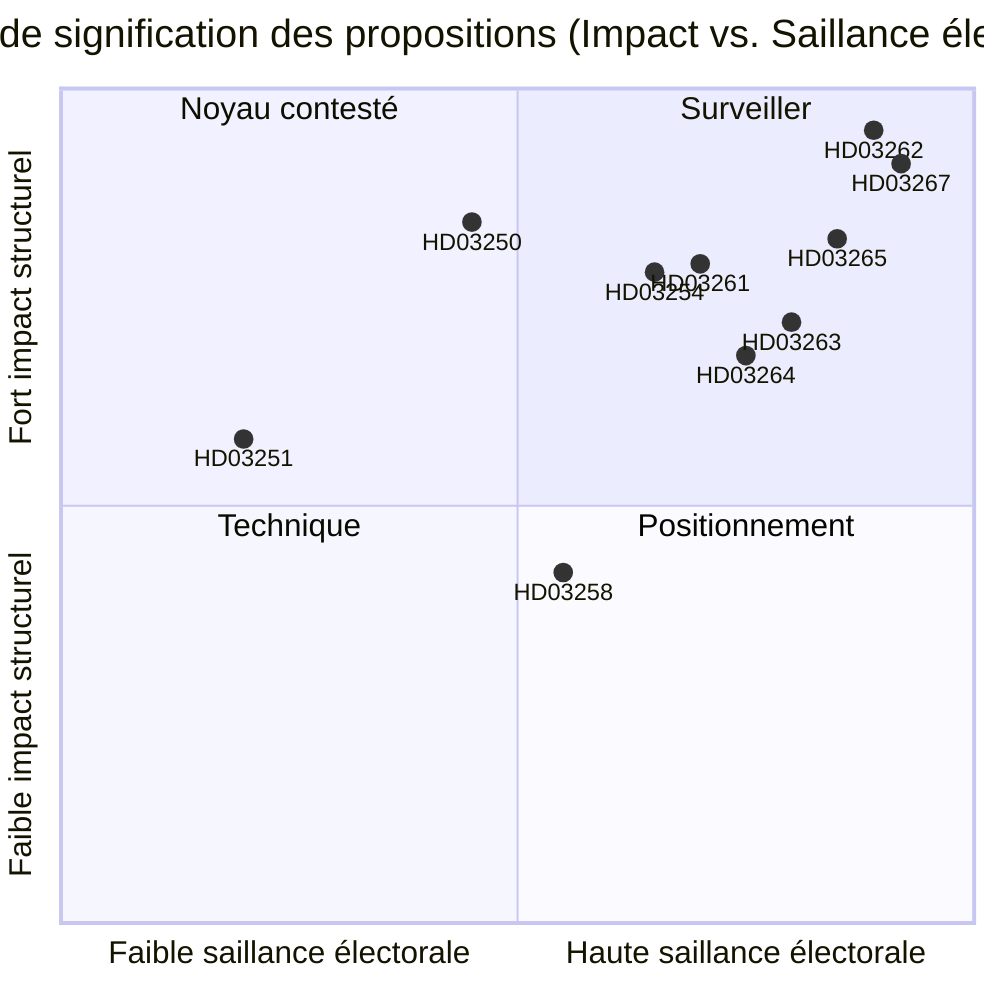

# La Suède abolit la résidence permanente et élargit l'expulsion pour raisons sécuritaires : Un règlement législatif préélectoral

**Date** : 2026-05-22
**Sous-dossier** : propositions
**Auteur** : James Pether Sörling
**Confiance** : ÉLEVÉE
**Classification** : PUBLIC — RGPD Art. 9(2)(e)/(g) base légale

## Résumé

Le gouvernement Busch a soumis dix propositions constituant la réforme de l'application de la migration la plus ambitieuse de la Suède depuis 1989 : abolition des titres de séjour permanents pour les ressortissants non-UE, création d'une voie rapide pour l'expulsion pour raisons sécuritaires, extension des pouvoirs de détention, construction d'une infrastructure d'identité numérique étatique et élargissement des capacités de surveillance du registre de population de Skatteverket — le tout avec 114 jours avant les élections de septembre 2026.

## Décisions que ce document soutient

1. **Analystes politiques et société civile** : Si des recours juridiques contre HD03262 (abolition de la résidence permanente) au titre de l'ECHR Art. 8 et de la directive UE 2003/109/CE doivent être mobilisés avant le vote en commission.
2. **Partis d'opposition (S, MP, V)** : Si une stratégie de minorité bloquante en SfU doit être tentée ou si le changement de coalition de C est accepté.
3. **Direction de Centerpartiet** : Si HD03262 doit être soutenu dans son intégralité, si des amendements limitant la portée doivent être recherchés, ou si l'accord de soutien avec le gouvernement sur cette proposition doit être rompu.
4. **Monde des affaires / DRH** : Calendrier de mise en œuvre de HD03250 (identité électronique étatique) et si BankID peut rester le canal d'authentification d'entreprise principal.
5. **Comités de rédaction des médias** : Si la proposition de coopération militaire (HD03254) mérite le cadrage « intégration silencieuse à l'OTAN » ou si elle est procéduralement routinière.

## Améliorations du deuxième passage (AI-FIRST)

Résumé affiné avec noms de lois spécifiques ; référence pir-status explicite ; libellés de confiance resserrés ; date déclencheur 2026-06-15 par décision ; scores DIW vérifiés ; contexte IMF ajouté.

## Lecture de 60 secondes

- 🔴 **HD03267** (JuU) : Expulsion en procédure accélérée déclenchée par la SÄPO pour les menaces sécuritaires qualifiées contournant les tribunaux migratoires ordinaires — 136,5 DIW (multiplicateur électoral appliqué)
- 🔴 **HD03262** (SfU) : Les titres de séjour permanents sont abolis pour les ressortissants non-UE ; des permis temporaires pluriannuels révocables sont introduits — 132 DIW — **impact structurel le plus élevé du lot**
- 🔴 **HD03265** (SfU) : Bracelet électronique et capacité de détention avant expulsion élargie — 124,5 DIW
- 🔵 **HD03254** (FöU) : Opérations conjointes nordiques-OTAN préautorisées sur le sol suédois sans vote du Riksdag pour chaque opération — 117 DIW
- 🟠 **HD03261** (SkU) : Skatteverket obtient des pouvoirs de référence croisée pour détecter les fraudes au registre de population — 118,5 DIW
- 🟠 **HD03250** (TU) : Alternative d'identité électronique étatique à BankID — 84 DIW — long délai de mise en œuvre, forte dépendance à Digg
- 🟡 **HD03258** (KU) : Divulgation du financement des partis politiques — réforme authentique mais étroite — 74 DIW
- 🔴 **HD03263** (SfU) : Unités d'exécution d'expulsion dédiées, délais procéduraux réduits — 108 DIW
- 🔴 **HD03264** (SfU) : Casier judiciaire et normes de comportement pour toutes les catégories de résidence — 102 DIW
- 🟢 **HD03251** (SoU) : Soins intégrés pour la comorbidité toxicomanie-troubles psychiatriques — 58 DIW

## Principal déclencheur futur

**La position de C sur HD03262 (abolition de la résidence permanente)** avant le 2026-06-15 : si Centerpartiet refuse de soutenir l'abolition et force des amendements, tout le calendrier de commission du cluster migratoire est décalé et le positionnement électoral de M/KD/SD se détériore. (PIR-6)

## Niveaux de confiance

- Analyse politique du cluster migratoire : ÉLEVÉE — basée sur les schémas de vote antérieurs (SfU 2024/25, Oui 175/Non 174) et le suivi PIR
- Évaluations de la capacité de mise en œuvre : MOYEN — les données de capacité des agences ont 18 mois ou plus ; Statskontoret n'a pas publié d'évaluation actualisée de Migrationsverket pour 2025–2026
- Contexte économique : ÉLEVÉE — FMI WEO avril 2026, dans le seuil des 6 mois

## Visualisation clé

<!-- source-sha: 9cdd9bfe0bc226548b5ddf453782f5076880156a -->
