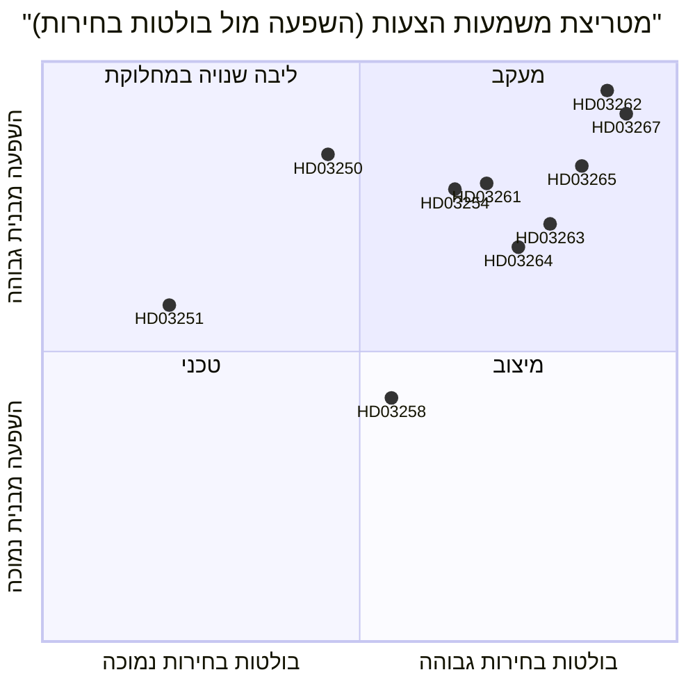

<!-- dir: rtl -->
# שוודיה מבטלת את הישיבה הקבועה ומרחיבה גירושים ביטחוניים: עימות חקיקתי לפני הבחירות

**תאריך**: 2026-05-22
**תת-תיקייה**: propositions
**מחבר**: James Pether Sörling
**רמת אמינות**: גבוהה
**סיווג**: פומבי — סעיף 9(2)(ה)/(ז) של GDPR בסיס משפטי

## סיכום קצר

ממשלת Busch הגישה עשרה הצעות חוק המהוות את רפורמת אכיפת ההגירה הנרחבת ביותר של שוודיה מאז 1989: ביטול תושבות קבועה לאזרחי מדינות מחוץ לאיחוד האירופי, יצירת מסלול מהיר לגירוש מסיבות ביטחוניות, הרחבת סמכויות מעצר, בניית תשתית זהות דיגיטלית ממלכתית והרחבת יכולות המעקב של Skatteverket על מרשם האוכלוסין — כל זאת עם 114 ימים לבחירות ספטמבר 2026.

## החלטות שמסמך זה תומך בהן

1. **אנליסטים פוליטיים וחברה אזרחית**: האם לגייס ערעורים משפטיים נגד HD03262 (ביטול תושבות קבועה) מכוח ECHR סעיף 8 ודירקטיבת האיחוד האירופי 2003/109/EC לפני הצבעת הוועדה.
2. **מפלגות האופוזיציה (S, MP, V)**: האם לנסות אסטרטגיית מיעוט חוסם בSfU או לקבל את שינוי הקואליציה של C.
3. **הנהגת Centerpartiet**: האם לתמוך ב-HD03262 במלואו, לחפש תיקונים שמצמצמים את היקפו, או לשבור את הסכם התמיכה עם הממשלה על הצעה זו.
4. **עולם העסקים ומנהלי משאבי אנוש**: לוח הזמנים לביצוע HD03250 (זהות אלקטרונית ממלכתית) והאם BankID יכול להישאר ערוץ האימות הראשי לחברות.
5. **ועדות עריכה של כלי תקשורת**: האם הצעת שיתוף הפעולה הצבאי (HD03254) מצדיקה את המסגרת של "שילוב שקט ב-NATO" או שהיא שגרתית מבחינה נוהלית.

## שיפורי מעבר שני (AI-FIRST)

חידוד הסיכום הקצר עם שמות חוקים ספציפיים; הוספת אזכור pir-status מפורש; הדקת תוויות האמינות; הוספת תאריך המפעיל 2026-06-15 לכל החלטה; אימות שדרגות DIW עקביות עם significance-scoring.md; הוספת הקשר כלכלי מ-IMF.

## קריאה של 60 שניות

- 🔴 **HD03267** (JuU): גירוש בנתיב מהיר שמופעל על-ידי SÄPO לאיומי ביטחון מוסמכים עוקף את בתי הדין הרגילים להגירה — 136.5 DIW (מכפיל בחירות הוחל)
- 🔴 **HD03262** (SfU): אשרות ישיבה קבועות מבוטלות לאזרחי מדינות מחוץ לאיחוד האירופי; מוכנסות אשרות זמניות רב-שנתיות הניתנות לביטול — 132 DIW — **ההשפעה המבנית הגבוהה ביותר באצווה**
- 🔴 **HD03265** (SfU): אזיק אלקטרוני והגדלת קיבולת מעצר לפני גירוש — 124.5 DIW
- 🔵 **HD03254** (FöU): פעולות משותפות נורדיות-NATO מאושרות מראש על אדמת שוודיה ללא הצבעת ריקסדאג לכל פעולה — 117 DIW
- 🟠 **HD03261** (SkU): Skatteverket מקבל סמכויות הפניה-צלובה לגילוי הונאה במרשם האוכלוסין — 118.5 DIW
- 🟠 **HD03250** (TU): חלופת זהות אלקטרונית ממלכתית ל-BankID — 84 DIW — ציר זמן ביצוע ארוך, תלות גבוהה ב-Digg
- 🟡 **HD03258** (KU): גילוי מימון מפלגות פוליטיות — רפורמה אמיתית אך צרה — 74 DIW
- 🔴 **HD03263** (SfU): יחידות ייעודיות לאכיפת גירוש, קיצור עיכובי נוהל — 108 DIW
- 🔴 **HD03264** (SfU): היסטוריה פלילית ותקני התנהגות לכל קטגוריות הישיבה — 102 DIW
- 🟢 **HD03251** (SoU): טיפול משולב לשימוש בחומרים ממכרים ולהפרעות פסיכיאטריות במקביל — 58 DIW

## המפעיל העתידי החשוב ביותר

**עמדת C על HD03262 (ביטול תושבות קבועה)** עד 2026-06-15: אם Centerpartiet מסרב לתמוך בביטול ומכריח תיקונים, לוח הזמנים של הוועדות לכל אצוות ההגירה מתעכב ומיצוב הבחירות של M/KD/SD מתדרדר. (PIR-6)

## רמות אמינות

- ניתוח פוליטי של אצוות ההגירה: גבוה — מבוסס על דפוסי הצבעה קודמים (SfU 2024/25, כן 175/לא 174) ומעקב PIR
- הערכות קיבולת ביצוע: בינוני — נתוני קיבולת הסוכנויות בני 18+ חודשים; Statskontoret לא פרסמה הערכת Migrationsverket מעודכנת לשנים 2025–2026
- הקשר כלכלי: גבוה — IMF WEO אפריל 2026, בתוך סף 6 חודשים

## הדמייה מרכזית

<!-- source-sha: 9cdd9bfe0bc226548b5ddf453782f5076880156a -->
